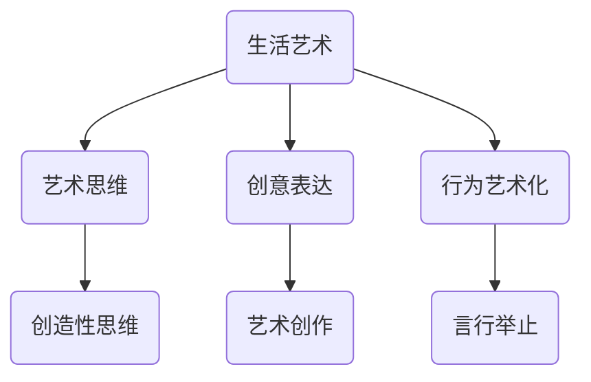

                 

# 成为生活艺术家：将平凡转化为创意表达

## 关键词
- 生活艺术
- 创意表达
- 平凡与非凡
- 艺术思维
- 创意技巧

## 摘要
在快节奏的现代生活中，我们常常感到平凡与单调和压力。然而，通过培养生活艺术，我们可以将平凡转化为创意表达，找到生活的乐趣与价值。本文将探讨生活艺术的理念与实践，分享创意表达的思维与技巧，以及如何在日常生活中实现艺术创作和行为艺术化。通过实际应用和未来展望，我们将激发读者成为生活艺术家的热情，让生活充满创意与色彩。

## 第一部分：生活艺术的理念与实践

### 第1章：生活艺术的概念与价值

#### 1.1 生活艺术的定义与内涵
生活艺术是一种将日常生活中的点滴融入艺术创作和表达的理念，强调用创意和美感去体验和改善生活。它不仅仅是一种艺术形式，更是一种生活方式。

- **定义**：生活艺术是一种通过创意和美感来提升日常生活的艺术形式。
- **内涵**：涵盖艺术思维、创意表达、行为艺术化等方面。

#### 1.2 生活艺术的哲学思考
哲学角度的思考有助于我们理解生活艺术的深层次意义。

- **生活与艺术的统一**：生活中处处有艺术，艺术是生活的一部分。
- **创造性思维**：生活艺术倡导创造性思维，从平凡中发现非凡。

#### 1.3 生活艺术的价值与意义
生活艺术的价值不仅体现在个人层面，也对社会产生影响。

- **个人层面**：提升生活品质，带来快乐和满足感。
- **社会层面**：促进创新与创造力，推动社会进步。

### Mermaid 流程图：生活艺术的架构

### 第2章：创意表达的思维与技巧

#### 2.1 创意表达的思维训练
创意表达需要培养特定的思维方式。

- **发散思维**：从不同角度思考问题。
- **联想思维**：将看似无关的事物联系起来。
- **逆向思维**：从相反的角度看问题。

#### 2.2 平凡生活中的创意发现
平凡生活中也蕴含着创意的火花。

- **日常观察**：观察生活中的小细节，发现创意的来源。
- **生活记录**：通过记录生活，激发创意灵感。

#### 2.3 创意表达的技巧与实践
创意表达需要一定的技巧和方法。

- **色彩运用**：合理运用色彩，提升艺术效果。
- **构图技巧**：掌握构图规则，创造出有吸引力的作品。
- **动手实践**：通过实践，不断提升创意表达能力。

### 第3章：日常生活的艺术创作

#### 3.1 家居布置的艺术
家居布置是生活艺术的重要体现。

- **空间规划**：合理规划空间，提升居住体验。
- **装饰元素**：巧妙运用装饰元素，打造独特的家居风格。

#### 3.2 美食烹饪的创意
美食不仅是生活的必需品，也是艺术的表达。

- **食材选择**：选择新鲜的食材，为烹饪创造更多可能性。
- **烹饪技巧**：掌握烹饪技巧，提升美食的艺术价值。

#### 3.3 旅行记录的创意表达
旅行记录是生活艺术的一部分。

- **摄影技巧**：运用摄影技巧，记录下美好的瞬间。
- **旅行日志**：通过文字和图片，表达旅行的感受和体验。

### 第4章：日常行为的艺术化

#### 4.1 言行的艺术
言行是生活艺术的重要体现。

- **语言表达**：运用富有表现力的语言，提升沟通效果。
- **非语言沟通**：通过身体语言和表情，传达艺术化的信息。

#### 4.2 着装的创意搭配
着装是生活艺术的外在表现。

- **色彩搭配**：运用色彩搭配技巧，提升着装的艺术感。
- **款式选择**：选择适合自己风格的款式，展现独特魅力。

#### 4.3 言语的细腻与创意
言语是生活艺术的重要载体。

- **语言表达**：运用细腻的语言，表达情感和思想。
- **创意表达**：通过创意的语言，传递独特的思想和感受。

## 第二部分：创意生活的实际应用

### 第5章：创意工作坊的实践

#### 5.1 创意工作坊的组织与策划
创意工作坊是培养生活艺术的重要平台。

- **主题策划**：确定工作坊的主题，激发参与者的创意。
- **活动策划**：设计有趣的活动，提升工作坊的互动性。

#### 5.2 创意工作坊的实践案例
通过实践案例，了解创意工作坊的实际效果。

- **创意家居布置**：通过实际操作，学会家居布置的技巧。
- **美食烹饪体验**：通过烹饪实践，提升美食的艺术感。

#### 5.3 创意工作坊的成果展示
展示创意工作坊的成果，激励更多人参与生活艺术。

- **作品展示**：展示参与者的创意作品，分享艺术体验。
- **经验分享**：通过分享经验，提升创意生活技能。

### 第6章：创意生活的应用场景

#### 6.1 创意生活与个人成长
创意生活有助于个人成长。

- **思维拓展**：通过创意活动，拓展思维，提升创造力。
- **技能提升**：通过实际操作，提升各项技能。

#### 6.2 创意生活与团队合作
创意生活可以促进团队合作。

- **团队协作**：通过创意活动，加强团队协作，提升团队凝聚力。
- **创意项目**：通过团队合作，完成创意项目，实现共同目标。

#### 6.3 创意生活与社会影响
创意生活对社会产生积极影响。

- **文化传播**：通过创意生活，传播艺术和文化。
- **社会创新**：通过创意生活，推动社会创新与进步。

### 第7章：成为生活艺术家的未来展望

#### 7.1 创意生活的持续发展
创意生活将继续发展，带来更多可能。

- **技术支持**：随着技术的发展，创意生活将更加便捷和多样化。
- **文化传承**：通过创意生活，传承和发扬传统文化。

#### 7.2 生活艺术家的成长路径
生活艺术家需要不断学习和实践。

- **自我提升**：通过不断学习和实践，提升自己的生活艺术水平。
- **交流分享**：通过交流分享，与其他生活艺术家互相学习，共同成长。

#### 7.3 生活艺术对社会的影响
生活艺术将深刻影响社会。

- **生活方式**：改变人们的生活方式，提升生活品质。
- **社会风气**：激发社会的创新活力，推动社会进步。

## 附录：创意生活资源与推荐

### 附录1：创意生活相关书籍推荐
- 《创意思考的技巧》
- 《创意的艺术》
- 《创意生活手册》

### 附录2：创意生活网站与平台推荐
- ArtStation
- Instructables
- Pinterest

### 附录3：创意生活工具与材料推荐
- 艺术涂料
- DIY工具套装
- 数字摄影设备

## 结语
成为生活艺术家，让我们在平凡中找到非凡，让生活充满创意与色彩。通过培养艺术思维和创意表达，我们可以将日常生活转化为一场艺术的盛宴。让我们一起努力，成为生活中的创意大师，用创意点亮生活，创造属于我们自己的艺术人生。

作者：AI天才研究院/AI Genius Institute & 禅与计算机程序设计艺术 /Zen And The Art of Computer Programming

