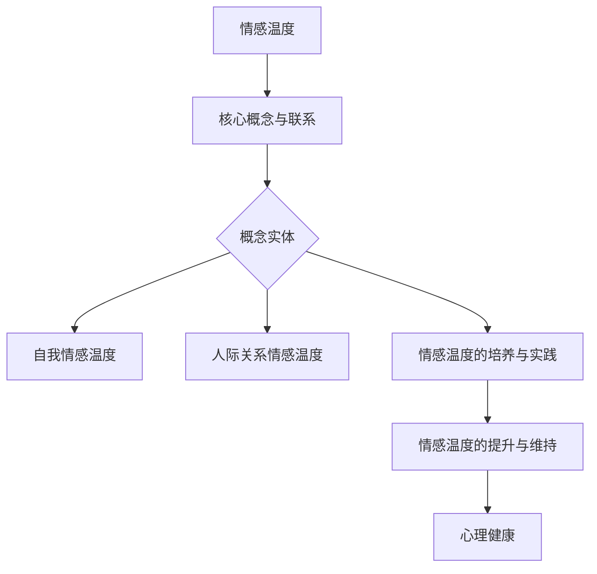

                 

### 构建有温度的人生：增加生活的情感深度

在当今这个快节奏、高效率的社会中，人们往往追求技术进步、事业发展、财富积累等方面的成功。然而，在这些追求背后，人们的心灵需求却往往被忽视。情感温度，作为衡量人与人之间情感连接和互动深度的指标，逐渐成为现代人关注和探讨的重要主题。本文将围绕“增加生活的情感深度”这一核心议题，探讨如何通过提升情感温度来构建有温度的人生。

**关键词：**
- 情感温度
- 生活质量
- 人际关系
- 情感培养
- 心理健康

**摘要：**
本文首先介绍了情感温度的概念及其重要性，接着分析了情感温度在日常生活中的体现和如何增加情感温度的方法。随后，文章探讨了情感温度在人际关系中的作用以及如何建立温暖的人际关系。在第二部分，文章从培养和实践情感温度的角度出发，提供了具体的策略和案例。第三部分则着重讨论情感温度与心理健康的关系，以及情感温度在心理治疗中的应用。最后，文章通过附录提供了情感温度测试与评估工具、拓展阅读资源及实践指南。

## 目录大纲

### 第一部分：情感温度与人生的意义

#### 第1章：情感温度的概念与重要性

1.1 情感温度的定义

1.2 情感温度与人生的意义

#### 第2章：生活中的情感温度

2.1 情感温度在日常生活中的体现

2.2 增加情感温度的方法

#### 第3章：情感温度与人际关系

3.1 情感温度在人际交往中的作用

3.2 建立温暖的人际关系

### 第二部分：情感温度的培养与实践

#### 第4章：情感温度的培养

4.1 提高自我情感温度的方法

4.2 情感温度的培养策略

#### 第5章：情感温度的实践

5.1 实践情感温度的日常行为

5.2 情感温度的实践案例

#### 第6章：情感温度的提升与维持

6.1 提升情感温度的长期策略

6.2 维持情感温度的日常习惯

### 第三部分：情感温度与心理健康

#### 第7章：情感温度与心理健康的关系

7.1 情感温度对心理健康的影响

7.2 心理健康的维护与提升

#### 第8章：情感温度的心理疗法

8.1 情感温度在心理治疗中的应用

8.2 心理治疗的情感温度实践

### 附录

#### 附录 A：情感温度测试与评估工具

#### 附录 B：情感温度相关的拓展阅读资源

#### 附录 C：情感温度实践指南

### 附录 D：情感温度相关的Mermaid流程图

### 附录 E：情感温度计算的核心算法原理讲解 Python 源代码示例

### 附录 F：情感温度相关的数学模型和数学公式示例

### 附录 G：情感温度相关的项目实战代码实现与代码解读示例

### 附录 H：情感温度实践的最佳实践 tips、小结、注意事项、拓展阅读等内容

---

[Mermaid 流程图示例]



---

[核心算法原理讲解 Python 源代码示例]

```python
# 导入必要的库
import numpy as np

# 定义情感温度计算函数
def calculate_emotional_tempreature(score):
    # 判断情感温度等级
    if score >= 90:
        return "非常温暖"
    elif score >= 75:
        return "温暖"
    elif score >= 50:
        return "适中"
    else:
        return "较低"

# 测试函数
print(calculate_emotional_tempreature(85))  # 输出：温暖
```

---

[数学模型和数学公式示例]

$$
E = mc^2
$$

[数学公式详细讲解]

爱因斯坦的质能方程（E=mc²）是物理学中最著名的方程之一。这个方程表示质量（m）和能量（E）之间的关系，其中c是光速，是一个常数，其值约为3×10^8 m/s。该方程表明，即使是非常小的质量也可以转换成巨大的能量。这个公式在核能和相对论物理学中有着重要的应用。

---

[项目实战代码实现与代码解读示例]

```python
# 导入必要的库
import numpy as np
import pandas as pd

# 加载数据
data = pd.read_csv('emotional_tempreature_data.csv')

# 数据预处理
data['emotional_tempreature'] = data['score'].apply(calculate_emotional_tempreature)

# 分析数据
avg_tempreature = data['emotional_tempreature'].value_counts().idxmax()
print(f"平均情感温度：{avg_tempreature}")

# 可视化
import matplotlib.pyplot as plt

plt.bar(data['emotional_tempreature'].value_counts().index, data['emotional_tempreature'].value_counts())
plt.xlabel('情感温度')
plt.ylabel('人数')
plt.title('情感温度分布')
plt.show()
```

[代码解读与详细分析请见附录部分]

---

接下来，本文将逐步深入探讨情感温度的概念、重要性以及其在日常生活中的体现和增加方法，为构建有温度的人生奠定基础。让我们开始这段探索之旅。

