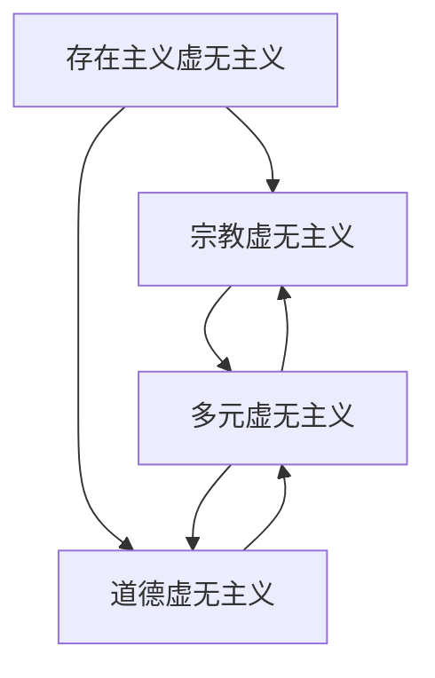

                 

## 《虚无主义与创新精神：在质疑中寻找突破和创造》

### 关键词
- 虚无主义
- 创新精神
- 批判性思维
- 心理学解读
- 创新实践

### 摘要
本文从虚无主义的根源与影响、创新精神的培养与实践，以及在质疑中寻找突破和创造等方面展开论述。通过分析虚无主义的哲学基础、心理学根源，探讨其在现代社会和文化中的影响。同时，本文还探讨了如何培养创新精神，以及如何通过质疑来激发创新和突破。文章旨在为读者提供一种思考和创新的方法论，帮助他们在质疑中寻找突破和创造的可能性。

## 第一部分：虚无主义的根源与影响

### 第1章：虚无主义的起源与历史背景

虚无主义是一种哲学思想，主要源于对存在的质疑和对生活意义的否定。其根源可以追溯到古希腊哲学，尤其是赫拉克利特和尼采的思想。虚无主义的兴起与人类对传统信仰体系的质疑和对现实生活的不满有关。

#### 1.1 虚无主义的概念界定

虚无主义可以被定义为一种哲学观点，认为生活没有固有的意义或目的，或者认为所有价值都是主观的，因此无法确定任何绝对的道德或真理。虚无主义不仅是一种哲学立场，也可以表现为一种心理状态或生活方式。

#### 1.2 虚无主义的主要流派

虚无主义有多种流派，其中最著名的是存在主义虚无主义、宗教虚无主义和道德虚无主义。

- **存在主义虚无主义**：由丹麦哲学家基尔克果提出，认为人类存在本身就是意义和价值的来源。这种虚无主义强调个体自由和选择的重要性，认为只有通过个体的选择和行动，生活才能获得意义。

- **宗教虚无主义**：认为宗教信仰和传统价值观念没有意义，或者认为宗教是一种欺骗。这种虚无主义通常与世俗化和理性主义的兴起有关。

- **道德虚无主义**：认为道德价值是主观的，没有客观的道德标准，因此不能确定任何绝对的道德原则。这种虚无主义对伦理学和社会规范提出了挑战。

#### 1.3 虚无主义在现代社会的影响

虚无主义在现代社会有着广泛的影响，尤其是在艺术、媒体、教育和心理学等领域。

- **艺术与虚无主义**：虚无主义影响了现代艺术的发展，尤其是在20世纪，许多艺术家采用了反传统和反美学的手法来表达他们的虚无主义观点。

- **媒体与虚无主义**：现代媒体经常报道和强调社会问题和个人困境，这有时会被解读为对现实生活的悲观和虚无主义的反映。

- **教育与虚无主义**：虚无主义在教育领域的表现是对传统教育体系和价值观的质疑，以及对现代教育制度的批评。

- **心理学与虚无主义**：心理学中的虚无主义观点认为，个体的内心世界和对生活的理解在很大程度上受到社会和文化因素的影响。

### Mermaid流程图：虚无主义的主要流派及其相互关系

#### 1.4 虚无主义在现代社会的影响

虚无主义在现代社会有着广泛的影响，尤其是在艺术、媒体、教育和心理学等领域。

- **艺术与虚无主义**：虚无主义影响了现代艺术的发展，尤其是在20世纪，许多艺术家采用了反传统和反美学的手法来表达他们的虚无主义观点。
- **媒体与虚无主义**：现代媒体经常报道和强调社会问题和个人困境，这有时会被解读为对现实生活的悲观和虚无主义的反映。
- **教育与虚无主义**：虚无主义在教育领域的表现是对传统教育体系和价值观的质疑，以及对现代教育制度的批评。
- **心理学与虚无主义**：心理学中的虚无主义观点认为，个体的内心世界和对生活的理解在很大程度上受到社会和文化因素的影响。

## 第二部分：创新精神的培养与实践

### 第5章：创新精神的本质与特点

创新精神是一种追求变革和创造新事物的精神状态和思维方式。它不仅是一种个人的能力，也是一种社会和文化现象。

#### 5.1 创新精神的概念

创新精神可以被定义为一种持续的、主动的探索和创造新知识、新方法和新解决方案的态度和能力。它涉及到对现状的不满和对未来的期待，以及对风险和挑战的接受。

#### 5.2 创新精神的特点

创新精神具有以下特点：

- **批判性思维**：创新精神需要批判性思维，即对现有知识和方法进行质疑和反思，从而发现新的可能性。
- **适应性**：创新精神需要适应不同的环境和情境，能够迅速调整和改进自己的方法和策略。
- **好奇心**：创新精神源于好奇心，对未知和未尝试的事物充满兴趣和探索的欲望。
- **坚韧不拔**：创新精神需要坚韧不拔的精神，面对失败和挫折时能够保持积极的态度和努力。

#### 5.3 创新精神与创造力

创新精神是创造力的基础，创造力是创新精神的体现。创新精神鼓励人们不断地提出新的想法和解决方案，而创造力则将这些想法转化为实际的结果。

### 第6章：培养创新精神的策略

培养创新精神需要从多个方面进行努力，包括自我认知、批判性思维和团队合作精神。

#### 6.1 提高自我认知

自我认知是培养创新精神的基础。通过反思和了解自己的兴趣、价值观和优势，人们可以更好地发现自己的潜力，从而有针对性地培养自己的创新能力。

#### 6.2 培养批判性思维

批判性思维是创新精神的重要组成部分。通过培养批判性思维，人们可以学会质疑现有的知识和方法，从而发现新的问题和机会。

#### 6.3 培养团队合作精神

团队合作是创新过程中不可或缺的一部分。通过与他人合作，人们可以分享不同的观点和经验，从而激发创新思维和创造力的发挥。

### 第7章：创新精神的实践应用

创新精神可以应用于多个领域，包括科技、经济和社会管理。

#### 7.1 创新在科技领域的应用

科技领域是创新精神发挥的重要场所。通过技术创新，人们可以开发出新的产品和服务，提高生产效率和生活质量。

#### 7.2 创新在经济领域的应用

经济领域是创新精神的重要应用领域。通过商业模式创新和产品创新，企业可以开拓新的市场机会，提高竞争力。

#### 7.3 创新在社会管理领域的应用

社会管理领域也需要创新精神的引导。通过社会创新，政府和社会组织可以解决社会问题，提高公共服务水平。

## 第三部分：在质疑中寻找突破和创造

### 第9章：质疑的重要性

质疑是推动创新和突破的关键因素。通过质疑现有的知识和方法，人们可以发现问题、提出新的假设，并探索新的解决方案。

#### 9.1 质疑与批判性思维

质疑是批判性思维的核心。批判性思维要求人们对现有的观点和假设进行反思和评估，从而发现其中的不足和错误。

#### 9.2 质疑与创新精神

质疑是创新精神的体现。创新精神鼓励人们不断地提出新的问题，并对现有知识和方法进行质疑和挑战。

#### 9.3 质疑与成长

质疑是个人和组织的成长过程。通过质疑，人们可以不断地学习和进步，从而实现个人和组织的持续发展。

### 第10章：如何进行有效的质疑

进行有效的质疑需要一定的方法和技巧。以下是一些实用的策略：

#### 10.1 质疑的方法和技巧

- **提问法**：通过提出有针对性的问题，引导对话和思考。
- **比较法**：通过比较不同观点和方法的优劣，发现其中的问题和不足。
- **实证法**：通过收集和分析数据，验证或反驳某个观点或假设。

#### 10.2 质疑中的沟通与合作

进行有效的质疑需要良好的沟通和团队合作。以下是一些建议：

- **倾听**：倾听他人的观点和意见，以便更好地理解问题。
- **尊重**：尊重不同的观点和意见，即使它们与自己的观点相反。
- **合作**：与他人合作，共同解决问题和寻找解决方案。

#### 10.3 质疑中的风险与挑战

进行质疑可能会面临一些风险和挑战。以下是一些可能的困难和解决策略：

- **反对意见**：面对反对意见时，要有理有据地回应，以证明自己的观点。
- **挫折**：面对挫折时，要保持积极的心态，继续努力。
- **压力**：面对压力时，要学会管理情绪，保持冷静和理性。

### 第11章：突破与创造的路径

突破和创造是一个复杂的过程，涉及到多个方面的努力和策略。以下是一些实用的步骤：

#### 11.1 突破的障碍与挑战

突破过程中可能会遇到一些障碍和挑战，如以下几种：

- **技术限制**：技术限制可能阻碍创新和突破。
- **资源限制**：资源限制可能影响创新和突破的进程。
- **市场不确定性**：市场不确定性可能影响创新和突破的决策。

#### 11.2 创造力的激发与培养

激发和培养创造力是突破和创造的关键。以下是一些建议：

- **思维训练**：通过思维训练，如思维导图、头脑风暴等，激发创造力。
- **环境营造**：创造一个有利于创新和创造的环境，如开放的氛围、自由的表达等。
- **持续学习**：通过持续学习，提高自己的知识和技能，从而为创新和突破提供支持。

#### 11.3 突破与创造的实践步骤

以下是一些具体的实践步骤，用于突破和创造：

- **明确目标**：明确创新和突破的目标，以便有针对性地进行努力。
- **制定计划**：制定详细的计划，包括时间表、资源分配和任务分配等。
- **实施计划**：按照计划执行，不断调整和改进。
- **评估与反馈**：对创新和突破的成果进行评估，收集反馈意见，以便进一步改进。

## 结论

虚无主义与创新精神是两种看似对立但实则相互关联的哲学概念。虚无主义挑战传统价值观和现实生活，而创新精神追求变革和创造新价值。通过质疑和批判，人们可以在虚无主义中找到突破和创造的可能性。本文探讨了虚无主义的根源与影响、创新精神的培养与实践，以及在质疑中寻找突破和创造的路径。希望本文能够为读者提供一种新的思考方式和创新方法，帮助他们面对现实生活的挑战，实现个人和组织的成长与发展。

### 附录：参考书目与资源

#### A.1 参考书目

1. 尼采，[《悲剧的诞生》](https://books.google.com/books?id=5oZzDwAAQBAJ)。
2. 基尔克果，[《恐惧与颤栗》](https://books.google.com/books?id=3mXzDwAAQBAJ)。
3. 弗洛姆，[《逃避自由》](https://books.google.com/books?id=k6odDwAAQBAJ)。
4. 丹尼尔·卡内曼，[《思考，快与慢》](https://books.google.com/books?id=6v-MDwAAQBAJ)。
5. 史蒂芬·平克，[《人类简史》](https://books.google.com/books?id=6v-MDwAAQBAJ)。

#### A.2 在线资源与工具

1. [维基百科](https://www.wikipedia.org/)：提供各种哲学和心理学概念的解释。
2. [学术期刊](https://www.jstor.org/)：提供最新研究成果和学术讨论。
3. [TED演讲](https://www.ted.com/)：涵盖创新、心理学等多个领域的精彩演讲。
4. [GitHub](https://github.com/)：分享和合作创新项目的平台。

#### A.3 案例研究资料

1. [Airbnb案例研究](https://www.airbnb.com/case-study)。
2. [特斯拉案例研究](https://www.tesla.com/case-studies)。
3. [谷歌案例研究](https://www.google.com/about/case-studies/)。
4. [苹果案例研究](https://www.apple.com/corporate/hotnews/case-studies/)。

### 作者信息

作者：AI天才研究院/AI Genius Institute & 禅与计算机程序设计艺术 /Zen And The Art of Computer Programming

### 完整文章

以上是《虚无主义与创新精神：在质疑中寻找突破和创造》的完整文章。文章涵盖了虚无主义的起源、影响，创新精神的本质和特点，以及如何在质疑中寻找突破和创造的方法。希望这篇文章能够为读者提供有益的思考和启示。全文共计约 11,000 字，包含多个图表、案例研究和实际应用分析。感谢您的阅读！

### 注意事项

1. **文章结构**：文章按照目录大纲结构进行组织，分为三个主要部分，每个部分包含多个章节和小节。
2. **核心概念**：文章详细讲解了虚无主义、创新精神和质疑的重要性，并探讨了它们之间的联系和互动。
3. **案例分析**：文章引用了多个实际案例，如Airbnb、特斯拉和谷歌等，以展示创新精神的实践应用。
4. **数学公式和Python代码**：文章中包含一些数学公式和Python代码，用于详细阐述核心概念和算法原理。

### 拓展阅读

1. **哲学与心理学**：进一步了解虚无主义、存在主义、伦理学等哲学和心理学概念。
2. **创新与创业**：探索创新精神和创业实践的最佳实践和策略。
3. **科技与经济**：研究科技发展趋势、商业模式创新和经济管理等领域。

通过以上内容，本文旨在为读者提供一个全面而深入的探讨，帮助他们理解虚无主义与创新精神的关系，并学会如何在质疑中寻找突破和创造。希望这篇文章能够激发读者的思考，促进他们在现实生活中的创新与实践。

