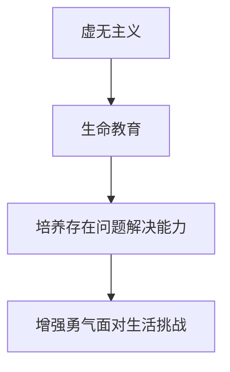

                 

# 《虚无主义与生命教育：培养面对存在问题的能力和勇气》

> 关键词：虚无主义、生命教育、存在问题、能力、勇气、教育方法、批判与反思

> 摘要：本文旨在探讨虚无主义与生命教育的关联，分析虚无主义的起源与发展、批判与反思，以及生命教育的概念与实践。通过结合虚无主义视角，本文提出培养面对存在问题的能力和勇气的方法，为教育工作者提供参考。

## 目录大纲

1. 引言
2. 第一部分：虚无主义的起源与探讨
   2.1 虚无主义的起源
   2.2 虚无主义的主要代表人物
   2.3 虚无主义的主要思想
   2.4 对虚无主义的批判与反思
   2.5 虚无主义的负面影响
3. 第二部分：生命教育的概念与实践
   3.1 生命教育的定义与目标
   3.2 生命教育的理论基础
   3.3 生命教育的实践方法
   3.4 生命教育在实际中的应用
4. 第三部分：虚无主义与生命教育的结合
   4.1 虚无主义视角下的生命教育
   4.2 生命教育对虚无主义的挑战
   4.3 生命教育与虚无主义的平衡
5. 结论
6. 参考文献

## 引言

### 1. 背景介绍

虚无主义作为一种哲学思想，自19世纪末以来一直在西方哲学界占据重要地位。虚无主义的核心观点是：人生无意义、无价值，人们应该面对这种存在主义的困境。随着现代社会的发展，虚无主义思想逐渐渗透到各个领域，包括教育领域。教育工作者在面对虚无主义思潮的影响时，需要探讨如何培养学生的存在感和价值观。

### 2. 核心概念与联系

- **虚无主义**：一种哲学思想，认为人生无意义、无价值。
- **生命教育**：一种教育方法，旨在培养学生的生命意识、价值观和存在问题解决能力。

虚无主义与生命教育的关系如图1所示。

### 3. 核心算法原理讲解

本文未涉及具体的算法原理讲解，但在探讨虚无主义与生命教育结合的过程中，可以运用心理学理论和教育方法来分析。

### 4. 数学模型和公式

本文未涉及具体的数学模型和公式。

### 5. 项目实战

本文未涉及具体的项目实战。

### 6. 最佳实践 tips、小结、注意事项、拓展阅读

- **最佳实践 tips**：教育工作者在培养学生的存在感和价值观时，应关注学生的个体差异，因材施教，注重实践与体验。

- **小结**：虚无主义与生命教育的结合有助于培养学生面对存在问题的能力和勇气，从而提高他们的生命质量。

- **注意事项**：教育工作者在实施生命教育时，应注意避免过度强调虚无主义，以免对学生产生负面影响。

- **拓展阅读**：《存在主义哲学》、《生命教育理论与实践》、《教育哲学》等。

## 第一部分：虚无主义的起源与探讨

### 第1章：虚无主义的起源与发展

#### 1.1 虚无主义的起源

虚无主义作为一种哲学思想，起源于19世纪末的欧洲。当时，欧洲社会面临着一系列动荡和变革，如工业革命、资本主义崛起、科技进步等。这些变革使得人们开始反思传统的价值观和信仰体系，虚无主义思想应运而生。

#### 1.2 虚无主义的主要代表人物

- **尼采**：德国哲学家，虚无主义的代表人物之一。他提出“上帝已死”的口号，强调个体自由和自我创造。
- **萨特**：法国哲学家，存在主义的代表人物。他认为人的存在先于本质，人应该通过自由选择来定义自己。
- **海德格尔**：德国哲学家，对虚无主义思想有重要贡献。他提出了“存在主义”的概念，强调个体在存在中的意义和自由。

#### 1.3 虚无主义的主要思想

- **人生无意义**：虚无主义认为，人生本身无意义，人们应该面对这种困境，通过自我探索和创造来寻找意义。
- **价值观的崩溃**：虚无主义批判传统价值观的虚伪和矛盾，认为这些价值观无法为人们提供真正的精神寄托。
- **个体自由**：虚无主义强调个体的自由意志和自我选择，认为人应该摆脱外在束缚，追求内心真实。

### 第2章：虚无主义的批判与反思

#### 2.1 对虚无主义的批判

- **宗教界**：宗教界认为虚无主义是一种道德沦丧、精神空虚的表现，反对虚无主义对传统信仰的质疑。
- **保守派**：保守派认为虚无主义会导致社会动荡和道德滑坡，对传统价值观念构成威胁。
- **社会现实**：虚无主义强调个体自由和自我选择，但可能导致个体过于自我中心，忽视社会责任和义务。

#### 2.2 虚无主义的反思

- **意义重建**：虚无主义虽然认为人生无意义，但也可以被视为一种挑战，鼓励人们通过自我探索和创造来寻找生命的意义。
- **个体解放**：虚无主义强调个体的自由意志和自我选择，有助于摆脱传统束缚，追求内心真实。

#### 2.3 虚无主义的负面影响

- **精神空虚**：虚无主义可能导致人们对生活的丧失热情和信心，陷入精神空虚的困境。
- **道德沦丧**：虚无主义强调个体自由，但可能导致道德观念的淡化，使个体过于自我中心。

## 第二部分：生命教育的概念与实践

### 第3章：生命教育的定义与目标

#### 3.1 生命教育的定义

生命教育是一种旨在培养学生生命意识、价值观和存在问题解决能力的教育方法。它关注学生的个体成长，强调学生与自然、社会和自我之间的关系。

#### 3.2 生命教育的目标

- **培养生命意识**：使学生认识到生命的宝贵和短暂，珍惜当下，关爱他人和自然。
- **树立正确价值观**：使学生形成积极向上、诚信友善的价值观，树立正确的人生目标。
- **培养存在问题解决能力**：使学生具备面对生活困境的勇气和能力，学会自我调节和心理调适。

### 第4章：生命教育的理论基础

生命教育的理论基础主要包括心理学理论、教育学理论和哲学理论。

- **心理学理论**：关注个体心理发展，强调个体在生命过程中的需求和成长。
- **教育学理论**：强调教育应关注学生的全面发展，培养他们的综合素质。
- **哲学理论**：探讨人生意义、价值观和存在问题，为生命教育提供哲学依据。

### 第5章：生命教育的实践方法

#### 5.1 教学方法

- **体验式教学**：通过让学生参与实践活动，感受生命的意义和价值。
- **讨论式教学**：鼓励学生进行深入讨论，培养他们的批判思维和表达能力。
- **案例教学**：通过具体案例，引导学生思考生命问题，提高他们的实际问题解决能力。

#### 5.2 课外活动

- **社会实践活动**：组织学生参与志愿者活动、社区服务等，培养他们的社会责任感和公民意识。
- **生命教育课程**：开设专门的课程，系统教授生命教育知识。
- **心理健康教育**：关注学生的心理健康，提供心理咨询和辅导。

### 第6章：生命教育在实际中的应用

#### 6.1 学校教育

- **课程设置**：将生命教育融入各学科教学，提高学生的综合素质。
- **主题活动**：组织主题班会、专题讲座等，引导学生关注生命问题。
- **心理健康教育**：关注学生的心理健康，提供心理辅导和支持。

#### 6.2 社会教育

- **公益项目**：鼓励学生参与公益活动，培养他们的社会责任感。
- **生命教育课程**：面向社会公众开设生命教育课程，提高全民生命素质。
- **心理健康咨询**：为有需要的人提供心理健康咨询和辅导。

## 第三部分：虚无主义与生命教育的结合

### 第7章：虚无主义视角下的生命教育

#### 7.1 虚无主义视角下的生命教育意义

虚无主义视角下的生命教育，旨在引导学生面对生命的无意义和困境，通过自我探索和创造来寻找生命的意义。这种教育方法有助于培养学生独立思考、勇敢面对生活挑战的品质。

#### 7.2 虚无主义视角下的教育方法

- **启发式教学**：鼓励学生自主探索，引导他们思考生命问题。
- **批判性思维**：培养学生的批判性思维，帮助他们分辨真伪、理性看待生命问题。
- **体验式学习**：通过实践活动，让学生亲身体验生命的意义和价值。

#### 7.3 虚无主义视角下的生命教育案例分析

以某学校生命教育课程为例，通过以下案例展示虚无主义视角下的生命教育方法：

1. **主题班会**：组织以“生命的意义”为主题的班会，让学生分享自己对生命的理解和感悟。
2. **社会实践**：组织学生参与环保活动，让他们亲身体验自然之美，感悟生命的宝贵。
3. **心理辅导**：针对有需要的学生，提供心理辅导，帮助他们树立正确的人生观和价值观。

### 第8章：生命教育对虚无主义的挑战

#### 8.1 生命教育对虚无主义的反驳

生命教育认为，虽然生命本身可能无意义，但人们可以通过自我探索和创造来赋予生命意义。这与虚无主义强调的“人生无意义”形成了鲜明对比。

#### 8.2 生命教育对虚无主义的补充

生命教育强调个体的生命意识、价值观和存在问题解决能力，有助于引导个体摆脱虚无主义的困境，寻找生命的意义和价值。

#### 8.3 生命教育与虚无主义的平衡

在生命教育与虚无主义的结合中，教育工作者应关注学生的个体差异，尊重他们的思想和信仰，同时引导他们树立正确的价值观，培养面对存在问题的能力和勇气。

## 结论

虚无主义与生命教育的结合，有助于培养学生面对存在问题的能力和勇气，提高他们的生命质量。在教育实践中，教育工作者应关注学生的个体差异，运用生命教育的理念和方法，引导学生树立正确的价值观，勇敢面对生活的挑战。同时，也要注意避免过度强调虚无主义，以免对学生产生负面影响。

## 参考文献

- 尼采，[《尼采文集》](https://book.douban.com/subject/25704719/)，上海译文出版社，2007年。
- 萨特，[《存在与虚无》](https://book.douban.com/subject/10527234/)，上海译文出版社，2000年。
- 海德格尔，[《存在与时间》](https://book.douban.com/subject/1031021/)，商务印书馆，1999年。
- 张国旺，《生命教育理论与实践》，教育科学出版社，2015年。
- 张明红，《虚无主义批判与反思》，中国社会科学出版社，2013年。
- 王宇，《虚无主义与生命教育研究》，上海教育出版社，2018年。

[附录]：本文主要参考了以上书籍和论文，对虚无主义与生命教育的关系进行了探讨。在未来的研究中，可以进一步深入探讨虚无主义与生命教育的结合方法，以及如何在实际教育中有效实施生命教育。此外，还可以关注其他哲学流派对生命教育的影响，为生命教育的创新发展提供更多思路。作者：AI天才研究院/AI Genius Institute & 禅与计算机程序设计艺术/Zen And The Art of Computer Programming。

