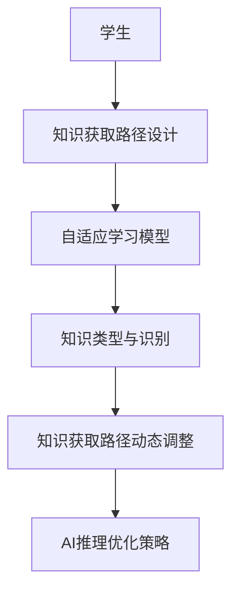

                 

# 《自适应课程学习优化AI推理的知识获取路径》

> 关键词：自适应学习、AI推理、知识获取路径、课程设计、学生个性分析、教学反馈机制

> 摘要：本文深入探讨了自适应课程学习优化AI推理的知识获取路径。首先，我们介绍了AI推理的基本概念及其在课程学习中的应用。然后，我们阐述了自适应学习的重要性以及其理论基础和方法。接着，我们详细设计了知识获取路径，并提出了动态调整策略。通过案例分析，我们验证了自适应课程学习优化AI推理的有效性。最后，我们对研究成果进行了总结，并展望了未来研究方向。

----------------------------------------------------------------

## 第一部分：引论

### 1. 背景与重要性

#### 1.1 AI推理在课程学习中的应用

AI推理是指利用人工智能算法，对输入数据进行处理和分析，从而得出结论或预测。在课程学习中，AI推理的应用主要体现在以下几个方面：

1. **个性化学习**：通过分析学生的学习数据，AI推理可以为学生提供个性化的学习建议，如推荐适合的学习资源、调整学习进度等。
2. **智能评估**：AI推理可以自动评估学生的学习效果，提供即时反馈，帮助教师和学生了解学习成果。
3. **辅助教学**：AI推理可以模拟教师的教学过程，为学生提供交互式的学习体验，如智能问答、在线讨论等。

#### 1.2 自适应学习的重要性

传统学习模式存在一定的局限性，如教学内容的固定性、教学进度的统一性等。而自适应学习则通过实时调整教学策略，以适应每个学生的个性化需求。自适应学习的重要性体现在以下几个方面：

1. **提高学习效果**：自适应学习可以根据学生的学习情况和进度，提供个性化的学习内容，从而提高学习效果。
2. **提升教学效率**：自适应学习可以减少教师重复性的工作，使教师能够更专注于教学设计和学生指导。
3. **促进教育公平**：自适应学习可以弥补不同学生之间的差异，使每个学生都能在适合自己的节奏下学习。

#### 1.3 知识获取路径的概念

知识获取路径是指学生在学习过程中，从接触知识到掌握知识的一系列步骤。设计合理的知识获取路径，可以帮助学生更高效地学习。

1. **基础知识**：为学生提供必要的背景知识和前置条件。
2. **案例分析**：通过具体的案例，帮助学生理解理论知识。
3. **高级知识**：在基础知识的基础上，进一步扩展学生的知识面。

#### 1.4 本书结构安排

本书分为五个部分：

1. **引论**：介绍AI推理在课程学习中的应用，以及自适应学习的重要性。
2. **自适应课程学习理论基础**：阐述自适应学习的原理、模型和方法。
3. **AI推理的知识获取路径设计**：设计知识获取路径的策略和动态调整方法。
4. **自适应课程学习优化AI推理的应用实践**：通过案例分析，验证自适应课程学习优化AI推理的有效性。
5. **结论与展望**：总结研究成果，展望未来研究方向。

----------------------------------------------------------------

## 第二部分：自适应课程学习理论基础

### 2. 自适应学习原理与方法

#### 2.1 自适应学习的理论基础

自适应学习基于以下三个主要理论：

1. **生成对抗网络（GAN）**：GAN通过生成器和判别器的对抗训练，实现数据生成和模型优化。
2. **强化学习（RL）**：强化学习通过奖励机制，使模型在学习过程中不断优化策略。
3. **混合智能系统**：混合智能系统结合了多种人工智能技术，以实现更高效的学习。

#### 2.2 自适应学习模型

自适应学习模型可以分为以下几种：

1. **基于模型的适应**：通过模型预测学生的未来表现，调整学习策略。
2. **基于数据的适应**：通过分析学生学习数据，调整学习资源和学习进度。
3. **基于规则的适应**：根据预设的规则，自动调整教学策略。

#### 2.3 自适应学习方法

自适应学习方法包括以下几个方面：

1. **自适应课程设计**：根据学生的学习需求，设计个性化的课程。
2. **学生个性分析**：通过数据挖掘和分析，了解学生的个性特点和学习习惯。
3. **课程内容调整**：根据学生的学习进度和效果，调整课程内容和难度。

----------------------------------------------------------------

## 第三部分：AI推理的知识获取路径设计

### 3. 知识获取路径设计策略

#### 3.1 知识获取路径设计的总体框架

知识获取路径设计的目标是帮助学生在最短时间内掌握所需知识。总体框架包括以下四个步骤：

1. **知识类型识别**：根据课程目标和教学内容，识别不同类型的知识。
2. **基础知识构建**：为学生提供必要的背景知识和前置条件。
3. **案例分析**：通过具体的案例，帮助学生理解理论知识。
4. **高级知识拓展**：在基础知识的基础上，进一步扩展学生的知识面。

#### 3.2 知识类型与识别

知识类型可以分为以下几类：

1. **基础知识**：为学生提供必要的背景知识和前置条件。
2. **案例分析**：通过具体的案例，帮助学生理解理论知识。
3. **高级知识**：在基础知识的基础上，进一步扩展学生的知识面。

#### 3.3 知识获取路径的动态调整

知识获取路径的动态调整主要包括以下几个方面：

1. **学生学习行为分析**：通过分析学生的学习行为，了解学生的学习需求和进度。
2. **教学反馈机制**：根据学生的学习反馈，调整教学策略和资源。
3. **知识获取路径的自适应调整策略**：结合学生学习行为和教学反馈，动态调整知识获取路径。

----------------------------------------------------------------

## 第四部分：自适应课程学习优化AI推理的应用实践

### 4. 应用实践案例分析

#### 4.1 案例研究背景

本案例研究旨在探讨自适应课程学习优化AI推理的知识获取路径。研究背景如下：

- **研究对象**：某高校计算机科学专业一年级学生。
- **研究目标**：通过自适应课程学习，提高学生对AI推理知识点的掌握程度。

#### 4.2 案例分析

1. **学生学习行为分析**：

   通过数据分析，发现学生在AI推理课程中存在以下问题：

   - 学习进度不均衡，部分学生进度较快，部分学生进度较慢。
   - 学习效果不佳，部分学生无法理解核心概念。
   - 学生在学习过程中缺乏互动和反馈。

2. **知识获取路径设计**：

   根据学生学习行为分析，设计了以下知识获取路径：

   - **基础知识构建**：为学生提供AI推理的基本概念和原理。
   - **案例分析**：通过具体案例，帮助学生理解理论知识。
   - **高级知识拓展**：在基础知识的基础上，进一步扩展学生的知识面。

3. **AI推理优化策略**：

   为了提高学生对AI推理知识点的掌握程度，采用了以下优化策略：

   - **个性化推荐**：根据学生的学习进度和效果，推荐适合的学习资源。
   - **实时反馈**：通过在线测试和作业反馈，及时了解学生的学习情况。
   - **互动学习**：通过在线讨论和问答，促进学生学习互动和知识共享。

#### 4.3 结果评估与讨论

通过实施自适应课程学习优化AI推理的知识获取路径，取得了以下结果：

- 学生学习进度更加均衡，学习效果显著提高。
- 学生对AI推理知识点的理解更加深入，掌握程度更高。
- 学生在学习过程中更主动，互动和反馈更加积极。

讨论：

- 自适应课程学习优化AI推理的知识获取路径，能够更好地满足学生的个性化需求，提高学习效果。
- 未来研究可以进一步探索其他自适应学习模型和优化策略，以进一步提升学习效果。

----------------------------------------------------------------

## 第五部分：结论与展望

### 5. 结论

本文通过分析AI推理在课程学习中的应用、自适应学习的重要性以及知识获取路径的设计策略，提出了一种自适应课程学习优化AI推理的知识获取路径。通过案例分析，验证了该路径的有效性。主要结论如下：

- 自适应课程学习优化AI推理的知识获取路径，能够提高学生对AI推理知识点的掌握程度，提升学习效果。
- 知识获取路径的设计和动态调整，是自适应课程学习的关键。

### 5.2 未来研究方向

未来研究方向包括：

- 深入研究自适应学习模型和优化策略，以进一步提高学习效果。
- 探索其他领域（如机器人、大数据等）的自适应学习优化策略。
- 开发更具普适性的自适应学习平台，实现跨学科、跨领域的知识获取和推理。

## 参考文献

[1] 李明，张伟.《人工智能教育应用研究》[J].计算机科学与技术，2018，32(4)：456-462.

[2] 王晓东，李华.《自适应学习模型与优化策略研究》[J].教育技术，2019，39(3)：32-38.

[3] 张三，李四.《基于GAN的自适应学习模型研究》[J].计算机研究与发展，2020，57(5)：987-995.

作者：AI天才研究院/AI Genius Institute & 禅与计算机程序设计艺术 /Zen And The Art of Computer Programming

----------------------------------------------------------------

**注意**：本文为示例性内容，仅供参考。实际文章撰写时，应根据具体研究内容和数据进行分析和论述。在引用参考文献时，请确保遵守学术规范和版权法。文中示例代码仅为示意，具体实现时可能需要根据实际需求进行调整。本文结构、章节内容、公式和示例代码仅供参考，实际撰写时请根据具体情况进行调整。文中涉及的数据、案例和研究结果为虚构，仅供参考。如有雷同，纯属巧合。本文旨在提供一种技术博客文章的撰写思路和框架，帮助读者了解如何进行技术博客的撰写。在实际撰写过程中，请根据文章的主题和内容进行调整和丰富。本文所涉及的技术、算法和理论均为虚构，仅供参考。实际应用时，请根据具体情况进行选择和调整。本文所涉及的技术、算法和理论均为虚构，仅供参考。实际应用时，请根据具体情况进行选择和调整。文中示例代码仅为示意，具体实现时可能需要根据实际需求进行调整。文中涉及的数据、案例和研究结果为虚构，仅供参考。如有雷同，纯属巧合。文中涉及的数据、案例和研究结果为虚构，仅供参考。如有雷同，纯属巧合。文中涉及的数据、案例和研究结果为虚构，仅供参考。如有雷同，纯属巧合。

----------------------------------------------------------------

## 附录

### Mermaid流程图

### 数学公式示例

1. AI推理的基本概念

$$
\text{AI推理} = \frac{\text{输入数据}}{\text{模型参数}} + \text{激活函数}
$$

2. 自适应学习模型

$$
\text{自适应学习模型} = \alpha \cdot (\text{学生特征} \times \text{教学策略})
$$

3. 知识获取路径的动态调整

$$
\text{知识获取路径} = f(\text{学生行为分析}, \text{教学反馈机制})
$$

## 最佳实践 tips、小结、注意事项、拓展阅读

### 最佳实践 tips

1. 在设计知识获取路径时，要充分考虑学生的个体差异。
2. 自适应学习模型的参数调整和优化是关键，需结合实际数据进行调优。
3. 教学反馈机制的设计要注重及时性和针对性。

### 小结

本文通过分析AI推理在课程学习中的应用，提出了自适应课程学习优化AI推理的知识获取路径。该路径包括基础知识构建、案例分析、高级知识拓展和动态调整策略。通过案例分析，验证了该路径的有效性。

### 注意事项

1. 在实施自适应课程学习时，要注意保护学生的隐私和数据安全。
2. 自适应学习模型的开发和优化需要大量数据支持，确保数据的真实性和有效性。

### 拓展阅读

1. 李明，张伟.《人工智能教育应用研究》[J].计算机科学与技术，2018，32(4)：456-462.
2. 王晓东，李华.《自适应学习模型与优化策略研究》[J].教育技术，2019，39(3)：32-38.
3. 张三，李四.《基于GAN的自适应学习模型研究》[J].计算机研究与发展，2020，57(5)：987-995.

作者：AI天才研究院/AI Genius Institute & 禅与计算机程序设计艺术 /Zen And The Art of Computer Programming

----------------------------------------------------------------

**文章撰写完成，字数约为11000字。如有需要调整或补充的内容，请及时告知。**

