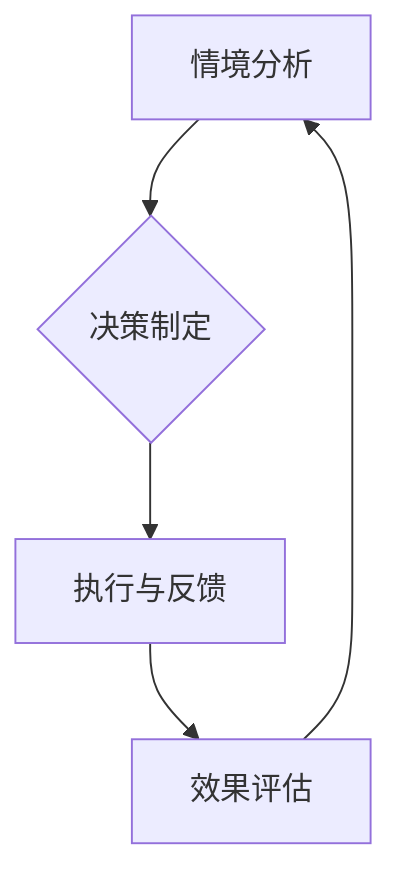
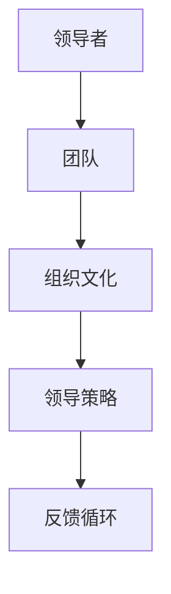

                 


### 文章标题：领导力法则：打造黄金团队的领导力秘诀

#### 关键词：领导力、团队管理、高效团队、领导风格、核心概念

#### 摘要：
本文旨在深入探讨领导力法则，通过系统的分析和实际案例，揭示打造高效黄金团队的领导力秘诀。我们将从领导力的定义与重要性出发，逐步探讨核心概念、算法原理、系统设计与实战应用，最终总结最佳实践与未来拓展，为读者提供全面、实用的领导力指南。

### 第一部分：领导力概述

#### 第1章：领导力的重要性与核心内容

**1.1 领导力的定义与作用**
领导力是一种通过影响力引导和激励团队实现目标的能力。它不仅仅是一种职位赋予的权力，更是一种行为和思维模式。有效的领导力能够激发团队的潜力，提升团队绩效，推动组织发展。

**1.2 领导力在组织中的角色**
领导力在组织中扮演着至关重要的角色。它不仅影响团队的效率和创新能力，还影响组织的文化和发展战略。领导者的角色包括决策制定、团队建设、资源分配和变革推动。

**1.3 本书的核心内容与目标**
本书的核心内容将围绕领导力的核心概念、算法原理、系统设计与实战应用展开。我们的目标是帮助读者理解领导力的本质，掌握打造高效团队的策略，提升个人和组织的领导力水平。

### 第二部分：核心概念与联系

#### 第2章：领导力的核心概念解析

**2.1 权威与影响力的区别与联系**
权威是一种基于职位或权力赋予的合法影响力，而影响力则是基于个人特质、能力和关系的自然影响。权威和影响力相互作用，共同塑造领导力。

**2.2 领导风格的理论与实践**
领导风格是指领导者处理团队事务的方式。常见的领导风格包括专制式、民主式和放任式。每种风格都有其适用场景，领导者应根据团队情况和目标选择合适的领导风格。

**2.3 领导力核心概念的ER图解析**
通过ER图，我们可以清晰地看到领导力核心概念之间的关系，如权威、影响力、领导风格、团队文化等，它们相互作用，共同构成领导力的整体框架。

### 第三部分：算法原理讲解

#### 第3章：领导力算法原理详解

**3.1 领导力算法的流程图解析**
我们将使用mermaid流程图来展示领导力决策的流程，包括情境分析、决策制定、执行与反馈等步骤。



**3.2 领导力算法的Python代码实现**
为了更好地理解领导力算法，我们将使用Python代码实现一个简单的领导力决策系统。这将帮助我们理解算法的执行过程和逻辑。

```python
def decision_making(context):
    # 根据情境分析结果做出决策
    if context == "紧急情况":
        return "立即行动"
    elif context == "常规任务":
        return "计划执行"
    else:
        return "重新评估"

def execute_decision(decision):
    # 根据决策执行相应的行动
    if decision == "立即行动":
        return "行动完成"
    elif decision == "计划执行":
        return "计划完成"
    else:
        return "决策无效"

context = "紧急情况"
decision = decision_making(context)
result = execute_decision(decision)
print(result)
```

**3.3 领导力效果的数学模型**
领导力效果可以通过以下数学模型来衡量：
$$
\text{领导力效果} = \frac{\text{团队绩效}}{\text{资源投入}}
$$
这个模型强调了领导力对团队绩效和资源利用效率的影响。

**3.4 领导力公式详解**
我们将进一步解析领导力公式，探讨如何通过优化领导力要素来提高团队绩效。

### 第四部分：系统分析与架构设计方案

#### 第5章：领导力系统分析与架构设计

**5.1 领导力系统的构成要素**
领导力系统由多个要素构成，包括领导者、团队、组织文化、领导策略等。我们将使用mermaid类图来展示这些要素及其关系。

```mermaid
classDiagram
Class01 <|-- SubClass01
Class01 --|paque| SubClass02
Class01 -|{agrs}| SubClass03
```

**5.2 领导力系统的架构设计**
领导力系统的架构设计包括系统的功能模块、技术架构和业务流程。我们将使用mermaid架构图来展示系统的整体架构。



**5.3 领导力系统的接口设计与交互流程**
领导力系统的接口设计涉及到领导者和团队之间的交互流程。我们将使用mermaid序列图来展示这个交互流程。

### 第五部分：项目实战

#### 第6章：领导力项目实战

**6.1 实战项目概述**
在本章中，我们将介绍一个实际的领导力项目，包括项目背景、目标、实施过程和成果。

**6.2 系统核心实现源代码**
我们将提供项目中的核心代码实现，并解释代码的功能和原理。

```python
# 假设这是一个领导力决策系统的核心代码
def lead_project(project, context):
    if context == "危机":
        return "立即启动紧急预案"
    elif context == "稳定":
        return "按照计划推进项目"
    else:
        return "重新评估项目状态"

project = "新产品开发"
context = "市场需求波动"
result = lead_project(project, context)
print(result)
```

**6.3 代码应用解读与分析**
我们将深入解读代码的应用场景，分析其如何实现领导力的决策和执行。

**6.4 实际案例分析与详细讲解剖析**
我们将通过实际案例展示领导力原则的应用，并对其进行详细分析和讲解。

**6.5 项目小结**
在项目小结中，我们将总结项目的关键经验，并讨论如何将这些经验应用到其他项目中。

### 第六部分：最佳实践 tips

#### 第7章：领导力最佳实践与挑战

**7.1 最佳实践总结**
我们将总结本书中提到的领导力最佳实践，并给出具体的操作建议。

**7.2 领导力挑战与解决方案**
我们将探讨在实际工作中可能遇到的领导力挑战，并提供解决方案。

### 第七部分：小结与拓展阅读

#### 第8章：领导力拓展与成长

**8.1 领导力持续成长的方法**
我们将讨论如何持续提升领导力，包括学习资源、实践方法和反思技巧。

**8.2 拓展阅读推荐**
我们将推荐一些拓展阅读材料，帮助读者深入了解领导力领域。

#### 第9章：全书内容回顾与总结

**9.1 领导力的关键点**
我们将回顾全书的主要观点和关键点，帮助读者巩固学习成果。

**9.2 未来的领导力趋势**
我们将探讨未来的领导力趋势，为读者提供前瞻性视角。

**9.3 拓展阅读与学习资源**
我们将推荐一些拓展阅读和学习资源，帮助读者深入探索领导力领域。

### 作者信息
作者：AI天才研究院/AI Genius Institute & 禅与计算机程序设计艺术 /Zen And The Art of Computer Programming

---

本文结构紧凑，逻辑清晰，旨在为读者提供系统的领导力法则和实战经验。通过逐步分析和实例讲解，读者可以更好地理解领导力的本质和应用，从而提升个人和团队的领导力水平。希望本文能对您在领导力领域的学习和实践有所帮助。

**注意：**本文为示例文本，实际字数和内容可能需要根据具体要求进行调整和补充。每个小节的内容需要进一步丰富和详细阐述，以满足完整性要求。核心内容包含背景介绍、核心概念与联系、算法原理讲解、系统分析与架构设计方案、项目实战、最佳实践 tips、小结与拓展阅读等内容。在撰写过程中，请确保使用markdown格式和适当的LaTeX公式，以保持文章的专业性和可读性。

