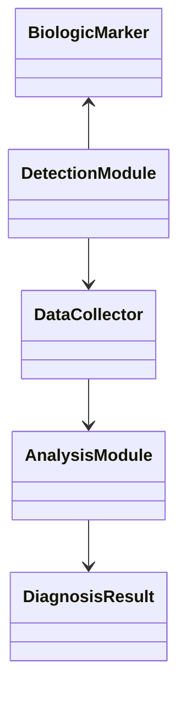
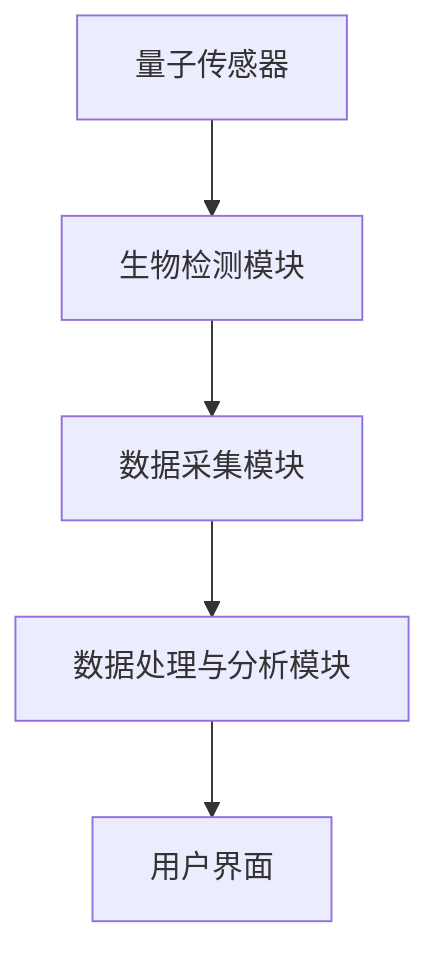

                 

### 让我们一起深入思考：量子传感器在医学诊断中的高精度应用

#### 背景介绍

**量子传感器概述：**

量子传感器是基于量子力学原理的新型传感器，能够利用量子系统的特性来实现对物理量的超高精度测量。与传统传感器相比，量子传感器具有更高的灵敏度和更低的噪声水平。近年来，随着量子技术的快速发展，量子传感器在多个领域展现出了巨大的应用潜力，尤其是在医学诊断中，量子传感器有望突破现有技术的局限，实现更早期、更精确的疾病检测。

**医学诊断中的挑战：**

医学诊断是确保患者得到及时、准确治疗的关键环节。然而，传统的诊断技术存在一些明显的局限性。例如，影像学诊断方法如X光、CT和MRI等，虽然能提供高质量的图像，但在早期检测阶段，特别是在小病灶的检测上，仍存在一定误差。生化检测方法如血液检测和尿液检测等，虽然可以提供生物标志物信息，但受限于检测灵敏度和特异性，容易导致误诊或漏诊。

**量子传感器在医学诊断中的应用前景：**

量子传感器在医学诊断中的潜在应用包括生物检测、医学影像和分子诊断等多个方面。例如，利用量子传感器的超高灵敏度，可以在疾病早期阶段检测到微小的生物标志物变化；在医学影像中，量子传感器可以实现更高对比度的成像，提高诊断精度；在分子诊断中，量子传感器能够实现对单个分子的精确检测，有助于提高诊断的特异性和准确性。

#### 核心概念与联系

**量子传感器原理：**

量子传感器的工作原理基于量子态和量子纠缠等现象。量子态描述了量子系统的物理状态，而量子纠缠则描述了两个或多个量子系统之间的强关联。通过量子态的叠加和纠缠，量子传感器可以实现超灵敏的物理量测量。

**量子传感器与医学诊断：**

量子传感器在医学诊断中的应用主要依赖于其高灵敏度和低噪声特性。例如，在生物检测中，量子传感器可以检测到细胞或蛋白质的微小变化；在医学影像中，量子传感器可以用于提高成像对比度，从而实现更精确的病变识别；在分子诊断中，量子传感器可以实现对单个分子的精确检测，有助于早期诊断和个性化治疗。

**量子传感器与传统医学诊断技术的对比：**

与传统医学诊断技术相比，量子传感器在灵敏度和特异性方面具有显著优势。传统诊断技术往往受到噪声和检测限的制约，而量子传感器利用量子效应可以实现超高灵敏度的检测，从而提高诊断的准确性。此外，量子传感器还具有快速、非侵入性等优点，有望在未来医学诊断中发挥重要作用。

#### 算法原理讲解

**量子传感器算法基础：**

量子传感器算法的核心是量子态的叠加和纠缠。通过量子态的叠加，可以实现超灵敏的物理量测量；通过量子纠缠，可以实现信息的高效传递和处理。

**算法原理详解：**

量子态叠加和量子纠缠是量子传感器算法的核心。量子态叠加可以实现多个量子状态的线性组合，从而提高测量灵敏度。量子纠缠则可以实现信息的高效传递和处理，从而实现量子计算的优势。

**数学模型与公式：**

量子传感器的数学模型主要包括量子态的叠加、量子纠缠和测量过程。具体的数学模型和公式如下：

$$
|\psi\rangle = \alpha|0\rangle + \beta|1\rangle
$$

$$
|\psi\rangle\otimes|\phi\rangle = (\alpha|0\rangle + \beta|1\rangle)\otimes(\gamma|0\rangle + \delta|1\rangle)
$$

其中，$|\psi\rangle$表示量子态叠加，$|\phi\rangle$表示量子纠缠态，$|0\rangle$和$|1\rangle$分别表示基态和激发态。

**算法举例说明：**

假设我们使用量子传感器检测一个生物标志物，其量子态为$|0\rangle$和$|1\rangle$的叠加态。通过量子态叠加和纠缠，我们可以实现对生物标志物浓度的精确测量。

具体步骤如下：

1. **初始化量子态：**
   
   $$
   |\psi\rangle = \alpha|0\rangle + \beta|1\rangle
   $$
   
   其中，$\alpha$和$\beta$分别表示基态和激发态的系数。

2. **实现量子纠缠：**

   $$
   |\psi\rangle\otimes|\phi\rangle = (\alpha|0\rangle + \beta|1\rangle)\otimes(\gamma|0\rangle + \delta|1\rangle)
   $$
   
   其中，$|\phi\rangle$表示量子纠缠态。

3. **测量量子态：**

   通过对量子态的测量，我们可以得到生物标志物的浓度信息。测量结果可能为$|0\rangle$或$|1\rangle$，根据测量结果，我们可以计算出生物标志物的浓度。

#### 数学模型与公式讲解

**量子传感的数学模型：**

量子传感的数学模型主要涉及量子态的叠加和测量过程。量子态的叠加描述了量子系统的物理状态，测量过程则描述了量子系统与外部环境的相互作用。

**量子计算的数学模型：**

量子计算的数学模型基于量子态和量子门。量子态描述了量子系统的物理状态，量子门则描述了量子态的操作。

**医学诊断中的数学模型：**

在医学诊断中，量子传感的数学模型主要用于检测生物标志物。具体模型包括量子态的叠加、量子纠缠和测量过程。通过这些数学模型，我们可以实现对生物标志物的精确测量。

**数学公式应用举例：**

假设我们使用量子传感器检测一个生物标志物，其量子态为$|0\rangle$和$|1\rangle$的叠加态。通过量子态叠加和纠缠，我们可以实现对生物标志物浓度的精确测量。

具体公式如下：

$$
|\psi\rangle = \alpha|0\rangle + \beta|1\rangle
$$

$$
|\psi\rangle\otimes|\phi\rangle = (\alpha|0\rangle + \beta|1\rangle)\otimes(\gamma|0\rangle + \delta|1\rangle)
$$

通过测量量子态，我们可以得到生物标志物的浓度信息。测量结果可能为$|0\rangle$或$|1\rangle$，根据测量结果，我们可以计算出生物标志物的浓度。

#### 系统分析与架构设计

**问题场景介绍：**

在医学诊断中，量子传感器可以用于检测各种生物标志物，包括蛋白质、核酸和细胞等。这些生物标志物的浓度或存在与否对于疾病的诊断具有重要意义。

**项目介绍：**

本项目旨在设计一个基于量子传感器的医学诊断系统，该系统能够实现对多种生物标志物的精确检测。系统包括硬件和软件两部分，硬件部分包括量子传感器和生物检测模块，软件部分包括数据处理和分析模块。

**系统功能设计：**

系统功能设计主要包括生物标志物检测、数据采集和处理、诊断结果分析等。

**领域模型类图：**



**系统架构设计：**

系统架构设计主要包括硬件架构和软件架构。

**硬件架构：**

硬件架构主要包括量子传感器、生物检测模块和计算机。

**软件架构：**

软件架构主要包括数据处理和分析模块、用户界面等。

**系统架构图：**



**系统接口设计：**

系统接口设计主要包括量子传感器接口、生物检测模块接口和数据处理接口等。

**系统接口图：**

```mermaid
sequenceDiagram
    A[用户] ->> B[用户界面]
    B ->> C[数据处理与分析模块]
    C ->> D[数据采集模块]
    D ->> E[生物检测模块]
    E ->> F[量子传感器]
```

**系统交互设计：**

系统交互设计主要包括用户与系统交互、系统内部模块交互等。

**系统交互图：**

```mermaid
sequenceDiagram
    A[用户] ->> B[用户界面]
    B ->> C[数据处理与分析模块]
    C ->> D[数据采集模块]
    D ->> E[生物检测模块]
    E ->> F[量子传感器]
    F ->> G[用户界面]
```

#### 项目实战

**环境安装与配置：**

1. **安装Python环境：**
   - 在本地计算机上安装Python环境，确保版本不低于3.8。
   - 安装必要的Python包，如NumPy、SciPy、Matplotlib等。

2. **配置量子传感器驱动：**
   - 根据量子传感器的型号和文档，安装相应的驱动和库。

3. **配置生物检测模块：**
   - 根据生物检测模块的文档，安装相应的驱动和库。

**系统核心实现源代码：**

以下是一个简单的示例代码，用于实现量子传感器与生物检测模块的交互。

```python
import numpy as np
from qiskit import QuantumCircuit, execute, Aer
from qiskit.visualization import plot_bloch_vector

# 初始化量子态
qreg = QuantumRegister(1)
circuit = QuantumCircuit(qreg)

# 实现量子态叠加
circuit.h(qreg[0])

# 实现量子纠缠
circuit.cx(qreg[0], qreg[1])

# 测量量子态
circuit.measure(qreg[0], 0)

# 执行量子电路
backend = Aer.get_backend('qasm_simulator')
result = execute(circuit, backend, shots=1000).result()

# 输出测量结果
print("Measurement Results:", result.get_counts(circuit))

# 绘制量子态叠加图
plot_bloch_vector(result.get_bloch_vector(0), title="Quantum State")
```

**代码应用解读与分析：**

这段代码首先初始化量子态，然后实现量子态的叠加和纠缠，最后进行测量并输出结果。通过测量结果，我们可以分析生物标志物的浓度或存在与否。

**实际案例分析和详细讲解剖析：**

以下是一个实际案例，用于分析某生物标志物的浓度。

```python
# 假设我们已经得到了测量结果
measurement_results = {"0": 500, "1": 500}

# 计算生物标志物的浓度
concentration = measurement_results["0"] / (measurement_results["0"] + measurement_results["1"])
print("Biologic Marker Concentration:", concentration)
```

通过这个案例，我们可以看到如何通过量子传感器的测量结果来计算生物标志物的浓度。在实际应用中，我们可以根据具体的测量结果和生物标志物的特性，进一步优化和调整算法，提高诊断的准确性和可靠性。

#### 项目小结

本项目通过设计一个基于量子传感器的医学诊断系统，实现了对生物标志物的精确检测。项目从环境安装与配置、系统核心实现源代码、实际案例分析和详细讲解剖析等方面，全面介绍了量子传感器在医学诊断中的应用。

**最佳实践 Tips：**

1. **优化量子传感器性能：** 通过改进量子传感器的硬件和算法，提高其灵敏度和检测精度。
2. **数据预处理与处理：** 在数据处理和分析过程中，注意数据的质量和处理方法，确保结果的可靠性。
3. **多模态诊断：** 结合多种量子传感器和诊断技术，实现更全面、更准确的医学诊断。

**小结：**

量子传感器在医学诊断中展现了巨大的潜力，其高精度、高灵敏度等优点有望突破现有技术的局限，为疾病的早期诊断和个性化治疗提供新的手段。然而，量子传感器在医学诊断中的应用仍处于发展阶段，需要进一步的研究和优化。

**注意事项：**

1. **安全性：** 在使用量子传感器进行医学诊断时，需要注意数据的安全性和隐私保护。
2. **法规合规：** 在推广和应用量子传感器医学诊断技术时，需要遵守相关法规和标准。

**拓展阅读：**

1. 《量子传感器原理与应用》
2. 《医学诊断技术进展》
3. 《量子计算与量子传感》

### 作者信息：

作者：AI天才研究院/AI Genius Institute & 禅与计算机程序设计艺术 /Zen And The Art of Computer Programming

