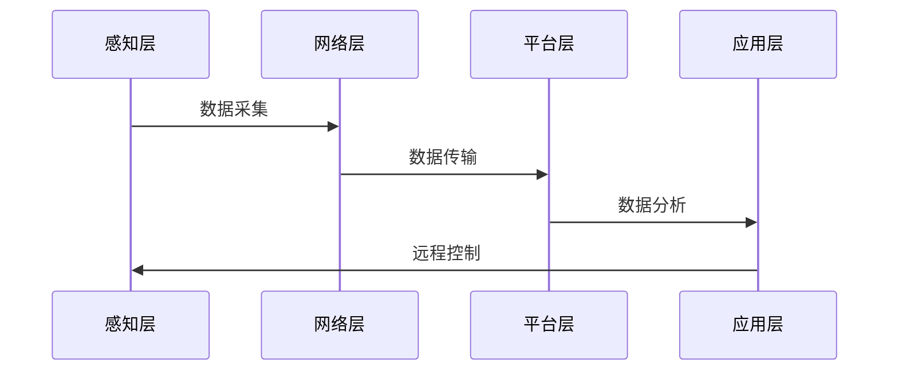

                 

# 5G在工业互联网中的应用：实现工厂全面数字化

关键词：5G，工业互联网，工厂数字化，应用场景，技术分析

摘要：本文将探讨5G技术在工业互联网中的应用，如何通过5G网络的特性实现工厂的全面数字化。首先介绍5G技术和工业互联网的基本概念，然后详细分析5G在工业自动化、智能制造、远程运维和网络安全等方面的应用，最后总结5G在工业互联网中的优势和未来的发展方向。

## 1. 背景介绍

### 1.1 5G技术概述

5G（第五代移动通信技术）是继4G之后的下一代移动通信技术标准。与4G相比，5G在传输速度、延迟、连接密度和可靠性等方面都有显著提升。5G的核心技术包括网络架构、高频段无线接入技术、多连接大规模MIMO（多输入多输出）和网络切片等。

### 1.2 工业互联网概述

工业互联网是指将物理世界、数字世界和智能世界相结合，通过先进的信息通信技术，实现工业生产过程的智能化和自动化。工业互联网的核心是物联网、大数据、云计算和边缘计算等技术的综合应用。

### 1.3 5G与工业互联网的关系

5G技术为工业互联网提供了强大的网络支持，使得工业生产过程中的数据采集、传输和处理更加高效和实时。5G的快速低延迟网络特性，能够满足工业自动化、智能制造等场景下的高带宽和低延迟需求，从而实现工厂的全面数字化。

### 1.4 本书的目标与结构

本书旨在探讨5G在工业互联网中的应用，通过具体的应用场景分析，阐述5G如何实现工厂的全面数字化。本书结构如下：

- 第1章：背景介绍
- 第2章：5G技术原理
- 第3章：工业互联网基础
- 第4章：5G在工业互联网中的应用
- 第5章：系统分析与架构设计
- 第6章：项目实战
- 第7章：最佳实践与展望

## 2. 5G技术原理

### 2.1 5G网络架构

5G网络架构分为三层：接入层、传输层和核心层。接入层负责无线接入，传输层负责数据传输，核心层负责网络管理和业务提供。5G网络采用了NSA（非独立组网）和SA（独立组网）两种组网方式。

### 2.2 5G关键技术

5G的关键技术包括：

- **高频段无线接入技术**：使用毫米波频段，提供更高的传输速度和更大的网络容量。
- **多连接大规模MIMO**：通过多天线技术，提高数据传输速率和网络容量。
- **网络切片**：将网络资源按需分配给不同的业务，实现高效的网络资源管理。

### 2.3 5G频谱管理

5G采用了新频段和重用现有频段的方式，充分利用频谱资源。5G频谱主要分为低频段、中频段和高频段，不同频段具有不同的特点和应用场景。

### 2.4 5G无线接入技术

5G无线接入技术包括：

- **NNC-ODU**（非接入层ODU）：实现高速数据传输。
- **NR**（新无线接入技术）：采用高频段，提供更高的传输速度和更大的网络容量。

## 3. 工业互联网基础

### 3.1 物联网技术

物联网技术通过传感器和通信技术，实现设备间的互联互通，为工业互联网提供数据基础。

### 3.2 大数据技术

大数据技术通过对海量数据的存储、处理和分析，为工业互联网提供智能决策支持。

### 3.3 云计算技术

云计算技术通过提供计算和存储资源，支持工业互联网的高效运行。

### 3.4 边缘计算技术

边缘计算技术将计算能力下沉到网络边缘，降低延迟，提高实时性，满足工业互联网的应用需求。

## 4. 5G在工业互联网中的应用

### 4.1 5G在工业自动化中的应用

5G的低延迟和高带宽特性，使得工业自动化系统的实时响应和高效控制成为可能。例如，在数控机床、机器人控制等应用中，5G网络可以实现高速数据传输和精确控制。

### 4.2 5G在智能制造中的应用

5G技术在智能制造中的应用主要包括：

- **智能工厂规划**：通过5G网络实现工厂内部各系统的互联互通，优化生产流程。
- **设备预测性维护**：利用5G网络实现设备数据的实时采集和分析，提前预测设备故障，减少停机时间。

### 4.3 5G在远程运维中的应用

5G网络的高带宽和低延迟，使得远程运维成为可能。通过5G网络，技术人员可以远程监控和控制工厂设备，进行故障排查和维修，提高运维效率。

### 4.4 5G在网络安全中的应用

5G网络的安全特性，如网络切片和加密技术，可以增强工业互联网的安全防护能力。通过5G网络，可以实现安全的数据传输和设备控制，保障工业生产的安全稳定。

## 5. 系统分析与架构设计

### 5.1 问题场景介绍

假设某工厂希望实现自动化生产，提高生产效率，降低成本。工厂内部有许多数控机床和机器人，需要实现实时数据采集、分析和控制。

### 5.2 系统功能设计

系统功能设计主要包括：

- **数据采集**：通过传感器实时采集数控机床和机器人的状态数据。
- **数据分析**：利用大数据技术对采集到的数据进行分析，预测设备故障和优化生产流程。
- **远程控制**：通过5G网络实现设备的远程控制和故障诊断。

### 5.3 系统架构设计

系统架构设计包括：

- **感知层**：由传感器和数据采集设备组成，负责实时数据采集。
- **网络层**：由5G网络组成，负责数据传输和连接。
- **平台层**：由云计算平台和大数据分析系统组成，负责数据存储、处理和分析。
- **应用层**：由远程控制系统和设备管理系统组成，负责设备控制和生产管理。

### 5.4 系统接口设计

系统接口设计包括：

- **感知层与网络层**：通过API接口实现数据传输。
- **网络层与平台层**：通过RESTful API接口实现数据存储和访问。
- **平台层与应用层**：通过Web API接口实现设备控制和生产管理。

### 5.5 系统交互序列图

使用Mermaid绘制系统交互序列图：



## 6. 项目实战

### 6.1 环境安装

在工厂内部署5G网络，安装传感器和数据采集设备，搭建云计算平台和大数据分析系统。

### 6.2 系统核心实现

实现数据采集、传输、分析和远程控制的核心功能。

```python
# 数据采集
def data_collection():
    # 采集传感器数据
    pass

# 数据传输
def data_transfer(data):
    # 将数据传输到平台层
    pass

# 数据分析
def data_analysis(data):
    # 对数据进行处理和分析
    pass

# 远程控制
def remote_control(device):
    # 远程控制设备
    pass
```

### 6.3 代码应用解读与分析

详细解读数据采集、传输、分析和远程控制的代码，分析其原理和实现方法。

### 6.4 实际案例分析

通过实际案例展示5G在工业互联网中的应用效果，分析案例的实施过程和效果。

### 6.5 项目小结

总结项目实施过程中的经验教训，为后续项目提供指导。

## 7. 最佳实践与展望

### 7.1 最佳实践 tips

- 合理规划5G网络覆盖范围，确保网络质量。
- 充分利用云计算和大数据技术，实现数据的高效处理和分析。
- 加强网络安全防护，确保生产系统的安全稳定。

### 7.2 小结

5G技术在工业互联网中的应用，为工厂的全面数字化提供了强有力的技术支持。通过5G网络的高带宽和低延迟特性，可以实现工业自动化、智能制造、远程运维和网络安全等应用，推动工业生产的智能化和高效化。

### 7.3 未来发展趋势展望

随着5G技术的不断发展和完善，工业互联网的应用场景将进一步扩大。未来，5G技术将与其他新兴技术如人工智能、物联网等深度融合，推动工业生产的全面数字化和智能化。

## 作者

作者：AI天才研究院/AI Genius Institute & 禅与计算机程序设计艺术 /Zen And The Art of Computer Programming

END

