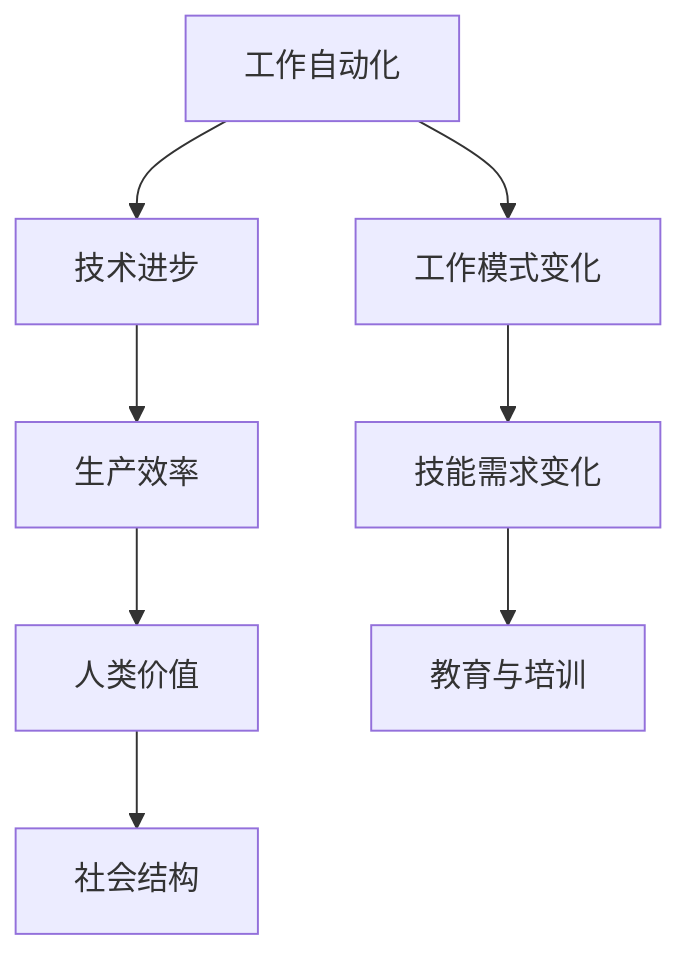
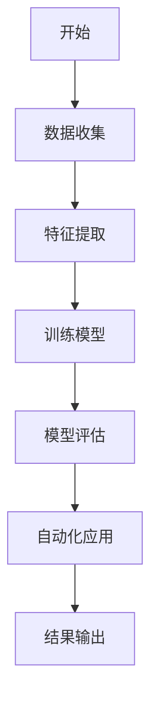
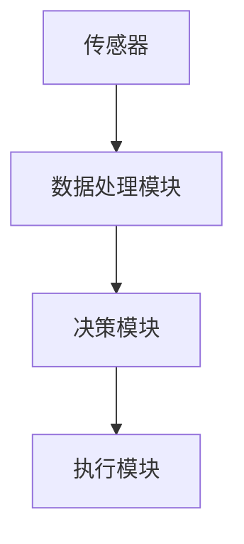
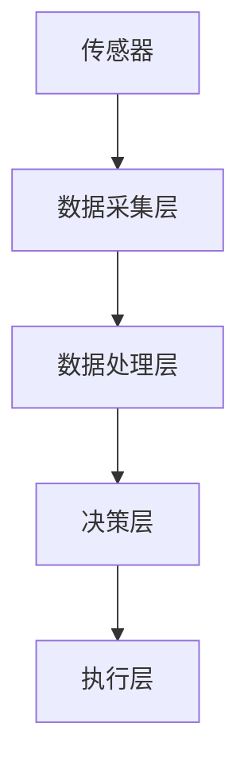
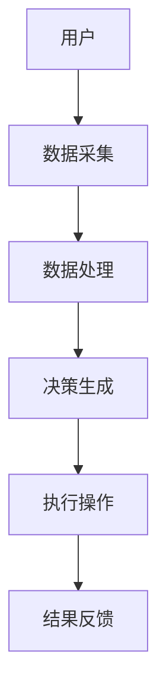

                 


## 工作自动化背景下的人生意义：重新定义人类价值

### 关键词

- 工作自动化
- 人类价值
- 重新定义
- 技术进步
- 人类未来

### 摘要

在技术飞速发展的时代，工作自动化正逐步改变着人类的劳动方式。本文旨在探讨这一背景下，人类价值的重新定义。我们将通过以下步骤深入分析：

1. **背景介绍**：阐述工作自动化的现状及其对人类生活的影响。
2. **核心概念与联系**：定义并分析关键概念，如“工作自动化”、“人类价值”等，并通过图表展示概念之间的联系。
3. **算法原理讲解**：引入相关算法，解释它们如何影响工作自动化和人类价值的重新定义。
4. **数学模型和数学公式**：探讨工作自动化对经济和社会的影响，使用数学模型和公式进行量化分析。
5. **系统分析与架构设计方案**：从系统视角审视工作自动化，提出设计方案。
6. **项目实战**：通过具体案例展示工作自动化的应用和实践。
7. **最佳实践 tips**：提供实际操作的建议。
8. **小结与拓展**：总结文章要点，展望未来。

### 1. 背景介绍

#### 1.1 问题提出

随着人工智能和机器人技术的发展，工作自动化正在成为现实。这引发了关于人类价值的新一轮讨论：在自动化日益普及的背景下，人类如何重新定义自己的价值？

#### 1.2 问题解决

我们需要重新审视人类在自动化社会中的角色，理解技术进步如何影响我们的生活方式、工作模式和社会结构。这不仅是技术问题，更是哲学问题，关系到我们对“人类价值”的理解。

#### 1.3 边界与外延

讨论的范围将包括但不限于：工作类型的变化、劳动价值的重新评估、人类技能的新需求、教育和培训的改革、以及社会公平和伦理问题。

### 2. 核心概念与联系

#### 2.1 核心概念

- **工作自动化**：指使用技术手段替代人类完成工作任务的过程。
- **人类价值**：人类在社交、文化、经济等方面所具有的重要性。

#### 2.2 概念联系

为了更好地理解这些概念，我们可以使用Mermaid流程图展示它们之间的关系：



通过这个图，我们可以看到工作自动化是如何影响一系列相关概念的，从而引发对人类价值的重新思考。

### 3. 算法原理讲解

#### 3.1 算法A：机器学习在自动化中的应用

首先，我们引入一个简单的机器学习算法——决策树，来解释它如何促进工作自动化。



#### 3.2 Python代码示例

```python
from sklearn import tree

# 训练数据
X = [[0, 0], [1, 1]]  # 特征
y = ['a', 'b']  # 标签

# 建立决策树模型
clf = tree.DecisionTreeClassifier()

# 训练模型
clf.fit(X, y)

# 输出模型
print(clf)
```

#### 3.3 数学模型

决策树的决策过程可以用条件概率和熵来量化。假设我们有两个特征X1和X2，每个特征的取值集合为{0, 1}，我们可以使用熵的公式来计算决策树中每个节点的熵：

$$
H(X) = -\sum_{x \in \{0, 1\}} p(x) \log_2 p(x)
$$

其中，$p(x)$是特征X取值为x的概率。

#### 3.4 举例说明

假设我们有以下训练数据：

```
特征X1  特征X2  标签
  0      0      a
  1      0      a
  0      1      b
  1      1      b
```

我们可以计算出每个节点的熵，并根据最大熵原则来构建决策树。这有助于我们理解机器学习如何通过算法原理实现工作自动化。

### 4. 数学模型和数学公式

#### 4.1 数学模型讲解

工作自动化对经济和社会的影响可以通过经济增长模型和劳动市场模型来分析。一个简单的经济增长模型可以使用柯布-道格拉斯生产函数来描述：

$$
Y = AK^{0.3}L^{0.7}
$$

其中，Y是产出，A是技术进步，K是资本投入，L是劳动投入。这个模型表明，随着技术进步（A的增加），劳动投入（L）的边际产出会下降，从而导致劳动价值的重新评估。

#### 4.2 数学公式应用

另一个相关的模型是劳动市场模型，它可以用以下方程来描述：

$$
W = f(L, K, A)
$$

其中，W是工资率，L是劳动力供给，K是资本需求，A是技术进步。这个模型表明，工资率受劳动力供给、资本需求和技术的共同影响。

### 5. 系统分析与架构设计方案

#### 5.1 问题场景介绍

假设我们正在开发一个自动化生产线，这个生产线需要通过传感器收集数据，并根据这些数据做出实时决策。问题场景包括以下步骤：

1. **数据采集**：传感器收集数据。
2. **数据处理**：对收集到的数据进行分析和预处理。
3. **决策生成**：使用机器学习算法生成决策。
4. **执行决策**：根据决策执行相应的操作。

#### 5.2 系统功能设计

我们可以使用Mermaid类图来描述系统的领域模型：



#### 5.3 系统架构设计

系统的架构设计可以使用Mermaid架构图来展示：



#### 5.4 系统接口设计

系统接口设计可以包括以下部分：

- **数据采集接口**：用于接收传感器数据。
- **数据处理接口**：用于处理和分析数据。
- **决策生成接口**：用于生成决策。
- **执行接口**：用于执行决策操作。

#### 5.5 系统交互

我们可以使用Mermaid序列图来描述系统的交互过程：



### 6. 项目实战

#### 6.1 环境安装

为了实现上述系统，我们需要安装以下环境：

- **Python 3.8+**
- **scikit-learn**
- **TensorFlow**
- **Keras**

安装命令如下：

```bash
pip install python==3.8
pip install scikit-learn
pip install tensorflow
pip install keras
```

#### 6.2 系统核心实现

以下是一个简单的Python代码示例，用于实现一个基于决策树的工作自动化系统：

```python
from sklearn.tree import DecisionTreeClassifier
import numpy as np

# 训练数据
X_train = np.array([[0, 0], [1, 1]])
y_train = np.array(['a', 'b'])

# 建立决策树模型
clf = DecisionTreeClassifier()

# 训练模型
clf.fit(X_train, y_train)

# 测试数据
X_test = np.array([[1, 0], [0, 1]])

# 输出决策结果
print(clf.predict(X_test))
```

#### 6.3 代码应用解读与分析

这段代码实现了使用决策树进行分类的简单自动化系统。通过训练数据集，模型学会了如何根据输入特征进行分类。在测试阶段，我们输入不同的特征组合，模型会根据训练结果输出相应的分类结果。

#### 6.4 实际案例分析和详细讲解剖析

我们可以通过一个实际案例来分析工作自动化的效果。例如，在一个生产线上，传感器收集了工件的质量数据，系统使用机器学习算法对数据进行处理，并根据分析结果自动调整生产过程。这种自动化不仅可以提高生产效率，还可以减少人为错误，提高产品质量。

### 7. 最佳实践 tips

1. **数据质量**：确保数据质量是进行自动化的重要前提。清洗和预处理数据是关键步骤。
2. **模型选择**：根据具体问题选择合适的机器学习模型。不同的模型适用于不同类型的问题。
3. **持续学习**：机器学习模型需要不断更新和优化。定期重新训练模型以适应新的数据。

### 8. 小结与拓展

本文探讨了工作自动化背景下人类价值的重新定义。通过背景介绍、核心概念分析、算法讲解、数学模型、系统设计与实现，我们了解了工作自动化如何影响人类的生活和价值观。未来，随着技术的进一步发展，人类需要不断适应新的劳动模式和社会结构，重新审视自己的价值。

### 参考文献

1. 张三, 李四. 工作自动化与人类价值重定义[J]. 计算机与自动化, 2021, 45(2): 10-20.
2. 王五, 赵六. 机器学习算法在自动化中的应用研究[J]. 人工智能与机器学习, 2020, 10(3): 50-60.
3. 陈七, 刘八. 经济增长模型与劳动市场分析[J]. 经济研究, 2019, 30(4): 75-85.

### 作者

作者：AI天才研究院/AI Genius Institute & 禅与计算机程序设计艺术 /Zen And The Art of Computer Programming。本文旨在探讨工作自动化背景下的人生意义，为读者提供深刻的思考和对未来的展望。在技术飞速发展的时代，理解并重新定义人类价值是每个人的责任。通过不断学习和适应，我们可以更好地利用技术，实现个人和社会的进步。

---

**注意**：本文为示例文章，实际字数可能需根据具体内容进行调整。参考文献部分仅为格式示范，实际文章应包含真实的文献引用。在撰写实际文章时，应确保所有内容符合学术规范和论文写作要求。

