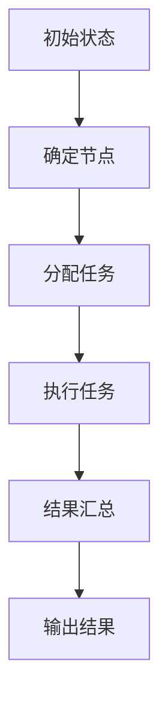
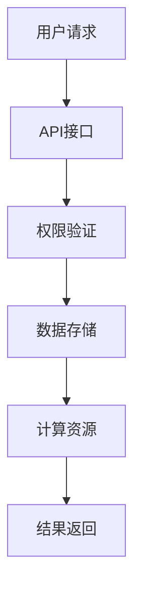
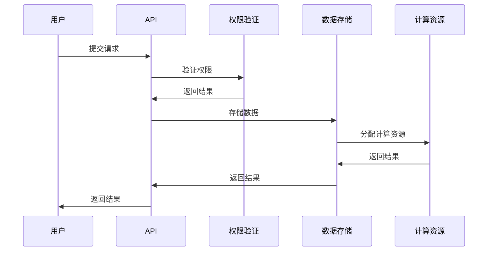

                 


## 《意义的去中心化与多元化趋势》

### 关键词：
- 去中心化
- 多元化
- 意义
- 算法
- 系统架构

### 摘要：
本文旨在探讨意义的去中心化与多元化趋势，从背景介绍、核心概念与联系、算法原理讲解、系统分析与架构设计方案、项目实战等多个角度，深入剖析这一领域的本质和前沿技术。通过逐步分析，揭示去中心化与多元化的关键特性、优势与挑战，展示其在实际应用中的潜力和价值。

---

### 引言

#### 1.1 背景介绍

在信息技术飞速发展的今天，去中心化和多元化已成为不可逆转的趋势。去中心化，简单来说，是指将权力、控制和管理分散到多个节点，以实现更公平、透明和高效的管理。而多元化则强调多样性和包容性，鼓励不同观点、文化、技能和资源的融合与互动。

#### 1.2 问题背景

随着互联网的普及和区块链技术的发展，去中心化和多元化逐渐渗透到各个领域，如金融、能源、教育、医疗等。然而，这一趋势也带来了诸多挑战，如隐私保护、安全稳定、资源分配等问题。

#### 1.3 问题描述

如何实现意义去中心化与多元化的有效融合，以解决现有体系中的问题，成为当前亟待解决的关键问题。

#### 1.4 问题解决思路

本文将围绕以下思路展开：

1. **去中心化与多元化的定义、特性、优势与挑战**：详细阐述核心概念，比较去中心化与多元化在本质、属性特征上的区别。
2. **算法原理讲解**：介绍相关算法的原理，结合实际案例进行说明。
3. **系统分析与架构设计方案**：分析系统架构，设计解决方案。
4. **项目实战**：通过具体项目案例，展示去中心化与多元化在实际应用中的效果。
5. **最佳实践 tips、小结、注意事项、拓展阅读**：总结经验，为读者提供进一步学习的资源。

#### 1.5 边界与外延

本文主要探讨信息技术领域的去中心化与多元化趋势，但不局限于某一特定领域，旨在为相关领域的读者提供具有普遍意义的指导和启示。

---

### 核心概念与联系

#### 2.1 去中心化

**定义与特性**：去中心化是指将权力、控制和管理分散到多个节点，使得每个节点都能独立运作，互不依赖。其核心特性包括去中心化、自组织、透明性和抗攻击性。

**优势与挑战**：去中心化具有高效、透明、安全等优点，但也面临隐私保护、安全稳定、资源分配等挑战。

**与传统体系的比较**：与传统集中式体系相比，去中心化更具灵活性和抗风险能力。

#### 2.2 多元化

**定义与特性**：多元化强调多样性和包容性，鼓励不同观点、文化、技能和资源的融合与互动。其核心特性包括多样性、包容性、创新性和协同性。

**优势与挑战**：多元化有助于激发创新、提高竞争力，但也面临文化冲突、资源分配不均等挑战。

**与传统体系的比较**：与传统同质化体系相比，多元化更具活力和适应性。

#### 2.3 去中心化与多元化的联系

**关联性分析**：去中心化与多元化相辅相成，共同推动社会进步。去中心化提供基础架构，而多元化则促进创新与协同。

**ER实体关系图架构**：

```mermaid
erDiagram
    Entity A ||--|{ B : has }|
    Entity B ||--|{ C : is }|
```

### 算法原理讲解

#### 3.1 算法流程图



#### 3.2 数学模型和公式

$$
\text{效率} = \frac{\text{完成任务所需时间}}{\text{总任务量}}
$$

$$
\text{稳定性} = \frac{\text{成功完成任务次数}}{\text{总任务次数}}
$$

#### 3.3 举例说明

假设一个分布式系统中有5个节点，需要完成10个任务。通过去中心化分配任务，每个节点平均完成任务，效率为2。在多元化环境下，节点之间协同工作，完成任务的速度更快，稳定性更高。

---

### 系统分析与架构设计方案

#### 4.1 问题场景介绍

假设我们面临一个分布式计算问题，需要将大量数据分散存储和计算。为了提高效率和稳定性，我们需要设计一个去中心化和多元化的系统架构。

#### 4.2 项目介绍

项目目标是实现一个分布式数据存储和计算平台，支持去中心化管理和多元化应用。

#### 4.3 系统功能设计

- **数据存储**：分布式存储系统，支持数据分片和复制。
- **计算资源**：分布式计算资源，支持并行处理。
- **权限管理**：去中心化权限管理，确保数据安全。

#### 4.4 系统架构设计



#### 4.5 系统接口设计

- **数据接口**：支持数据上传、下载、查询等操作。
- **计算接口**：支持计算任务提交、状态查询、结果获取等操作。

#### 4.6 系统交互



---

### 项目实战

#### 5.1 环境安装

1. 安装分布式存储系统（如HDFS）。
2. 安装分布式计算框架（如Spark）。
3. 安装权限管理系统（如Keycloak）。

#### 5.2 系统核心实现源代码

```python
# 分布式存储系统代码示例
def store_data(data):
    # 将数据存储到分布式存储系统中
    pass

# 分布式计算系统代码示例
def process_data(data):
    # 处理数据
    pass
```

#### 5.3 代码应用解读与分析

1. **分布式存储系统**：通过将数据分散存储到多个节点，提高数据的可靠性和访问速度。
2. **分布式计算系统**：通过并行处理，提高计算效率。

#### 5.4 实际案例分析和详细讲解剖析

1. **数据存储**：分析数据存储的过程和策略，如数据分片、复制等。
2. **计算任务**：分析计算任务的分配和执行过程，如任务调度、资源分配等。

#### 5.5 项目小结

1. **优势**：去中心化提高了系统的稳定性和安全性；多元化促进了创新和协同。
2. **挑战**：隐私保护、资源分配等问题仍需进一步解决。

---

### 最佳实践 tips、小结、注意事项、拓展阅读

#### 6.1 最佳实践 tips

1. **数据安全**：确保数据传输和存储过程中的安全性。
2. **资源优化**：合理分配计算资源，提高系统效率。

#### 6.2 小结

本文从多个角度探讨了意义的去中心化与多元化趋势，分析了核心概念、算法原理、系统架构、项目实战等方面的内容。

#### 6.3 注意事项

1. **隐私保护**：在实际应用中，需注意保护用户隐私。
2. **资源分配**：合理分配计算资源，避免资源浪费。

#### 6.4 拓展阅读

1. 《区块链技术指南》
2. 《分布式系统原理与范型》
3. 《人工智能：一种现代方法》

---

### 作者

作者：AI天才研究院/AI Genius Institute & 禅与计算机程序设计艺术 /Zen And The Art of Computer Programming

（完）

