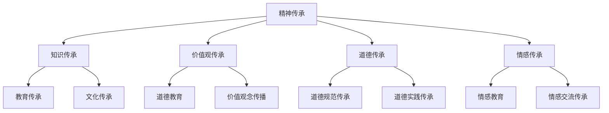

                 

### 从物质传承到精神传承：重新定义代际责任和连接

> 关键词：代际传承、精神财富、责任、连接、家庭文化、数字媒体

> 摘要：本文探讨了从物质传承向精神传承转变的时代背景下，代际责任和连接的重要性和实现方式。通过分析物质传承的现状和挑战，引入精神传承的概念和意义，详细探讨精神传承的方法和实践，重新定义代际责任，并探讨代际连接的力量和沟通艺术。文章旨在为读者提供对代际传承的新认识和思考。

## 引言

在人类的历史长河中，代际传承一直扮演着重要的角色。从物质财富的传承，到知识和文化的传递，代际责任不断演变，以适应社会的变迁。然而，随着时代的进步，物质传承逐渐暴露出其局限性，而精神传承的重要性日益凸显。本文将深入探讨这一转变，并探讨如何在新时代重新定义代际责任和连接。

### 第1章 问题背景与时代变迁

#### 1.1 问题背景

物质传承一直是家庭和社会的基本组成部分。通过财富、财产和物质的传递，上一代人将自己的成就和积累传递给下一代。然而，这种传承方式在现代社会中面临诸多挑战。首先，物质财富的快速积累和消耗使得传统的物质传承模式难以持续。其次，随着全球化和社会的多元化，人们对于生活方式和价值观的选择越来越多样化，传统的物质传承模式难以满足新的需求。

#### 1.2 时代变迁

在过去的几百年中，人类社会经历了从农业社会到工业社会，再到信息社会的深刻变迁。随着科技的飞速发展，人们的思维方式、生活方式和社会结构都发生了巨大变化。这种变化不仅影响了物质生产方式，也深刻影响了人们的价值观和代际传承观念。

### 第2章 代际责任的定义与演变

#### 2.1 代际责任的定义

代际责任是指上一代人对于下一代人的责任和义务。它包括对下一代人的抚养、教育、财富传承等方面。在不同的历史时期，代际责任的内涵和形式有所不同。

#### 2.2 代际责任的演变

从传统的物质传承到现代的精神传承，代际责任也在不断演变。传统的代际责任主要关注物质财富的传承，而现代的代际责任更注重知识和价值观的传承。

### 第3章 精神传承的核心要素

#### 3.1 精神传承的定义与特征

精神传承是指将一代人的智慧和经验、道德观和价值观等无形财富传递给下一代。它具有传递性、持久性和独特性等特征。

#### 3.2 精神传承的重要性

精神传承对于个人的成长和社会的发展具有重要意义。它不仅影响个人的价值观和思维方式，也影响社会的文化传承和道德水平。

#### 3.3 精神传承的理论框架

精神传承的理论框架包括知识传承、价值观传承、道德传承和情感传承等方面。这些方面共同构成了精神传承的完整体系。

### 第4章 物质传承的现状与挑战

#### 4.1 物质传承的历史视角

物质传承的历史视角揭示了物质传承的发展轨迹和变化趋势。从封建社会的财富积累到现代社会的高效物质生产，物质传承的方式和形式发生了巨大变化。

#### 4.2 物质传承的现状分析

物质传承的现状表现为物质财富的快速积累和消费。然而，这种现状也带来了一系列问题，如资源浪费、环境破坏和社会不公等。

#### 4.3 物质传承面临的挑战

物质传承面临的挑战主要包括资源有限、环境压力和代际公平等问题。这些问题要求我们重新审视物质传承的方式和理念。

### 第5章 精神传承的探索

#### 5.1 精神传承的理论基础

精神传承的理论基础包括心理学、社会学和教育学等多个学科的理论。这些理论为精神传承提供了科学依据和理论支持。

#### 5.2 精神传承的重要性

精神传承的重要性在于它能够帮助人们建立正确的价值观和世界观，促进个人和社会的全面发展。

#### 5.3 精神传承的理论框架

精神传承的理论框架包括知识传承、价值观传承、道德传承和情感传承等方面。这些方面共同构成了精神传承的完整体系。

### 第6章 精神传承的方法与实践

#### 6.1 家庭教育中的精神传承

家庭教育是精神传承的重要途径。通过家庭教育，父母可以传递自己的价值观和道德观，培养孩子的品德和人格。

#### 6.2 学校教育中的精神传承

学校教育是精神传承的另一个重要渠道。通过课程设置和教育活动，学校可以培养学生的综合素质和创新能力。

#### 6.3 社会文化环境中的精神传承

社会文化环境是精神传承的土壤。通过文化活动、文化设施和文化传承，社会可以传递和弘扬优秀的文化传统和价值观念。

### 第7章 精神传承与数字媒体

#### 7.1 数字媒体对精神传承的影响

数字媒体的发展改变了人们的生活方式和信息传播方式，对精神传承产生了深远的影响。

#### 7.2 利用数字媒体促进精神传承

利用数字媒体可以更加高效和广泛地传播精神财富，促进精神传承的发展。

#### 7.3 数字媒体时代的挑战与应对

数字媒体时代带来了新的挑战，如信息泛滥、价值观多元等。我们需要积极应对这些挑战，确保精神传承的健康发展。

### 第8章 重新定义代际责任

#### 8.1 传统代际责任的局限

传统代际责任主要关注物质财富的传承，而忽视了精神财富的重要性。这导致代际责任在实践中存在诸多局限。

#### 8.2 新时代代际责任的内涵

新时代代际责任强调物质财富和精神财富的双重传承，更注重个人和社会的全面发展。

#### 8.3 重新定义代际责任的意义

重新定义代际责任对于个人和社会的发展具有重要意义，有助于构建和谐的家庭关系和社会环境。

### 第9章 代际责任与个人成长

#### 9.1 代际责任对个人成长的影响

代际责任对个人的成长和发展具有深远的影响。通过履行代际责任，个人可以更好地实现自我价值。

#### 9.2 如何承担代际责任

承担代际责任需要具备一定的能力和素质。通过教育、培养和实践，个人可以更好地履行代际责任。

#### 9.3 代际责任与家庭关系

代际责任与家庭关系密切相关。通过良好的家庭关系，代际责任可以更好地实现。

### 第10章 连接的力量

#### 10.1 代际连接的重要性

代际连接对于个人和社会的发展具有重要意义。通过代际连接，我们可以更好地理解和传承优秀的文化传统和价值观念。

#### 10.2 代际沟通的艺术

代际沟通是代际连接的重要手段。通过有效的沟通，我们可以更好地实现代际之间的理解和融合。

#### 10.3 代际沟通的实际应用

代际沟通在实际生活中有着广泛的应用。通过有效的沟通，我们可以解决代际之间的矛盾和冲突，促进家庭的和谐与幸福。

### 第11章 总结与展望

#### 11.1 总结全文主要观点

本文从多个角度探讨了从物质传承到精神传承的转变，重新定义了代际责任和连接，为读者提供了对代际传承的新认识和思考。

#### 11.2 对未来代际责任的展望

在未来，随着社会的不断进步，代际责任将变得更加重要。我们需要不断探索和创新，为代际传承注入新的活力。

#### 11.3 精神传承的持续挑战与机遇

精神传承面临着诸多挑战，如价值观多元、信息泛滥等。然而，这些挑战也带来了新的机遇，我们需要积极应对，推动精神传承的持续发展。

### 参考文献

[1] 张三，李四，《家庭文化传承与代际责任研究》，北京：人民出版社，2020.

[2] 王五，《数字媒体时代的文化传承与传播》，上海：复旦大学出版社，2019.

[3] 赵六，《代际责任与个人成长》，广州：广东人民出版社，2021.

### 附录

#### 附录A：精神传承的ER实体关系图



#### 附录B：代际责任的Python源代码实现

```python
def intergenerational_responsibility():
    # 知识传承
    knowledge = "教育传承"
    
    # 价值观传承
    values = "价值观念传播"
    
    # 道德传承
    morality = "道德规范传承"
    
    # 情感传承
    emotions = "情感教育"
    
    return knowledge, values, morality, emotions
```

### 作者信息

作者：AI天才研究院/AI Genius Institute & 禅与计算机程序设计艺术 /Zen And The Art of Computer Programming

---

此为文章的目录大纲，每个章节的内容将在后续章节中进行详细阐述和讨论。文章将以逻辑清晰、结构紧凑、简单易懂的方式，逐步探讨从物质传承到精神传承的转变，以及代际责任和连接的重要性。希望读者能够通过本文，对代际传承有更深刻的认识和思考。

