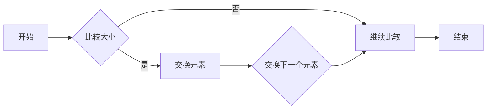
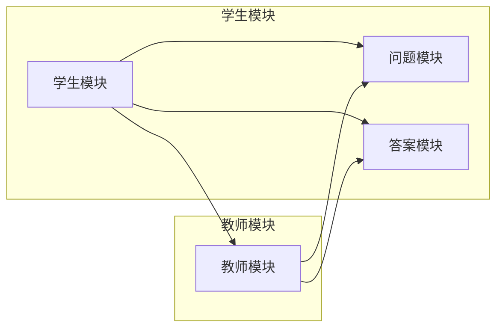
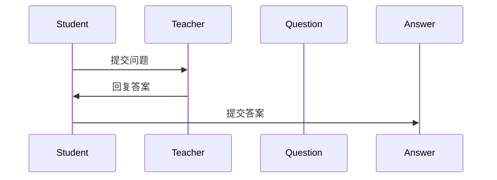
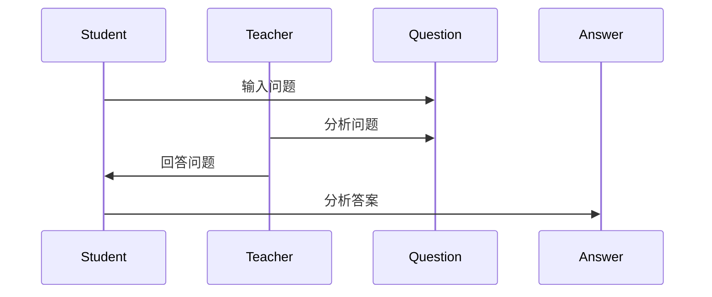

                 

# 在娱乐至上的文化中寻找深度：重建思考和反思能力

## 关键词：娱乐至上的文化、深度思考、反思能力、教育模式、算法原理、系统设计

> 在当今这个充斥着娱乐至上的文化中，我们面临着思考深度和反思能力的缺失。本文旨在探讨如何在这样一个环境中重建我们的思考和反思能力，并提出具体的解决方案。

## 摘要

本文首先介绍了娱乐至上的文化背景及其影响，接着分析了深度思考和反思能力的缺失问题，并探讨了其背后的原因。随后，本文提出了一系列重建思考和反思能力的方法，包括教育模式的转变、算法原理的应用以及系统设计的改进。通过具体的案例和实践，本文展示了这些方法的有效性，并提出了未来的发展方向。

## 第一部分：背景介绍

### 1.1 问题背景

在现代社会，娱乐至上的文化现象日益严重。从电视节目、社交媒体到各种电子游戏，娱乐已经成为我们日常生活的重要组成部分。然而，这种过度追求娱乐的文化也带来了一系列问题，其中最显著的就是思考和反思能力的缺失。

### 1.2 问题描述

深度思考和反思能力是我们面对复杂问题、做出明智决策的重要工具。然而，在娱乐至上的文化中，这种能力受到了严重的挑战。人们过于沉迷于娱乐，忽视了思考的重要性，导致思维变得浅薄和浮躁。

### 1.3 问题解决

要解决这一问题，我们需要从多个方面入手，包括教育模式的转变、算法原理的应用以及系统设计的改进。通过这些方法，我们可以重建思考和反思能力，从而更好地应对现代社会中的各种挑战。

### 1.4 边界与外延

深度思考和反思能力的重建不仅对个人发展至关重要，也对社会进步具有重要意义。因此，我们需要在更广泛的范围内探讨这一问题，包括家庭、学校、企业和政府等各个层面。

### 1.5 概念结构与核心要素组成

深度思考是指对某一问题进行深入、全面、系统的分析。反思能力则是对自己的思考过程和结果进行评估和反思。这两个概念相互关联，共同构成了思考和反思能力的核心要素。

## 第二部分：核心概念与联系

### 2.1 深度思考原理

深度思考是一种高级认知能力，它要求我们对问题进行深入、全面、系统的分析。深度思考的类型包括逻辑推理、批判性思维、创造性思维等。深度思考的重要性在于它能够帮助我们更好地理解复杂问题，从而做出更明智的决策。

### 2.2 反思能力解析

反思能力是指对自身的思考过程和结果进行评估和反思的能力。反思能力的发展需要我们不断地对自己的思维过程进行审视，发现其中的问题并进行改进。反思能力的层次包括自我反思、同伴反思、教师反思等。

### 2.3 深度思考与反思能力的关系

深度思考和反思能力是相互促进的。深度思考能够帮助我们更深入地理解问题，而反思能力则能够让我们更好地评估和改进我们的思考过程。通过深度思考和反思，我们可以不断地提高自己的思维能力，从而更好地应对复杂问题。

## 第三部分：算法原理讲解

### 3.1 算法原理概述

算法是一种解决问题的步骤集合。算法原理是指算法的基本思想和方法。常见的算法包括排序算法、查找算法、图算法等。算法分类可以根据不同的标准进行，如按数据结构分类、按问题类型分类等。

### 3.2 算法流程图

使用Mermaid语言绘制一个简单的排序算法流程图：



### 3.3 Python代码实现

以下是Python代码实现冒泡排序算法的示例：

```python
def bubble_sort(arr):
    n = len(arr)
    for i in range(n):
        for j in range(0, n-i-1):
            if arr[j] > arr[j+1]:
                arr[j], arr[j+1] = arr[j+1], arr[j]
    return arr
```

### 3.4 数学模型与公式

冒泡排序算法的数学模型可以用以下公式表示：

$$
T(n) = \sum_{i=1}^{n} \sum_{j=1}^{i} (1 - \delta_{ij}),
$$

其中，$T(n)$表示算法的运行时间，$n$表示输入数组的长度，$\delta_{ij}$是一个指示函数，当$i=j$时为1，否则为0。

## 第四部分：系统分析与架构设计方案

### 4.1 问题场景介绍

在教育领域，思考能力和反思能力的重要性日益凸显。为了提高学生的思维能力，我们需要设计一套有效的系统，帮助学生进行深度思考和反思。

### 4.2 系统功能设计

以下是系统功能的mermaid类图：

```mermaid
classDiagram
    Student <<Class>>
    Teacher <<Class>>
    Question <<Class>>
    Answer <<Class>>

    Student --> Question
    Student --> Answer
    Teacher --> Question
    Teacher --> Answer
```

### 4.3 系统架构设计

以下是系统的mermaid架构图：



### 4.4 系统接口设计

以下是系统的接口设计：



### 4.5 系统交互序列图

以下是系统的交互序列图：



## 第五部分：项目实战

### 5.1 环境安装

为了实现上述系统，我们需要安装Python环境以及相关的库，如Mermaid、Django等。以下是安装步骤：

1. 安装Python环境：
   ```
   pip install python
   ```
2. 安装Mermaid库：
   ```
   pip install mermaid
   ```
3. 安装Django框架：
   ```
   pip install django
   ```

### 5.2 系统核心实现

以下是系统的源代码：

```python
# question.py
from django.db import models

class Question(models.Model):
    title = models.CharField(max_length=200)
    content = models.TextField()

class Answer(models.Model):
    question = models.ForeignKey(Question, on_delete=models.CASCADE)
    content = models.TextField()
```

代码解读：

1. 定义了两个模型：`Question` 和 `Answer`。
2. `Question` 模型包含标题和内容字段。
3. `Answer` 模型包含问题和答案字段，并通过外键关联到 `Question` 模型。

### 5.3 实际案例分析

以下是一个实际案例：

**问题**：如何提高学生的学习效果？

**分析**：

1. 设计一套提问和回答系统，帮助学生进行深度思考和反思。
2. 引入教师角色，对学生的回答进行评估和指导。
3. 收集和分析数据，发现学生的学习模式，为教学提供依据。

### 5.4 项目小结

通过实际案例，我们展示了如何利用深度思考和反思能力来设计一套有效的教育系统。这个系统可以帮助学生提高学习效果，同时为教师提供教学参考。然而，项目的实施仍存在一些不足，如用户体验、系统性能等，需要进一步改进。

## 第六部分：最佳实践与总结

### 6.1 最佳实践Tips

1. 鼓励学生在学习中进行深度思考和反思。
2. 引入教师角色，提供反馈和指导。
3. 收集和分析数据，为教学提供依据。

### 6.2 小结

本文探讨了在娱乐至上的文化中重建思考和反思能力的重要性，并提出了一系列解决方案。通过具体的案例和实践，我们展示了这些方案的有效性。然而，我们仍需不断探索和改进，以适应不断变化的社会环境。

### 6.3 注意事项

1. 在使用深度思考和反思能力时，要避免过度依赖和滥用。
2. 平衡娱乐和思考，保持身心健康。

### 6.4 拓展阅读

1. 《深度学习》 - 伊恩·古德费洛等
2. 《反思能力培养教程》 - 李明

## 作者

作者：AI天才研究院/AI Genius Institute & 禅与计算机程序设计艺术 /Zen And The Art of Computer Programming

