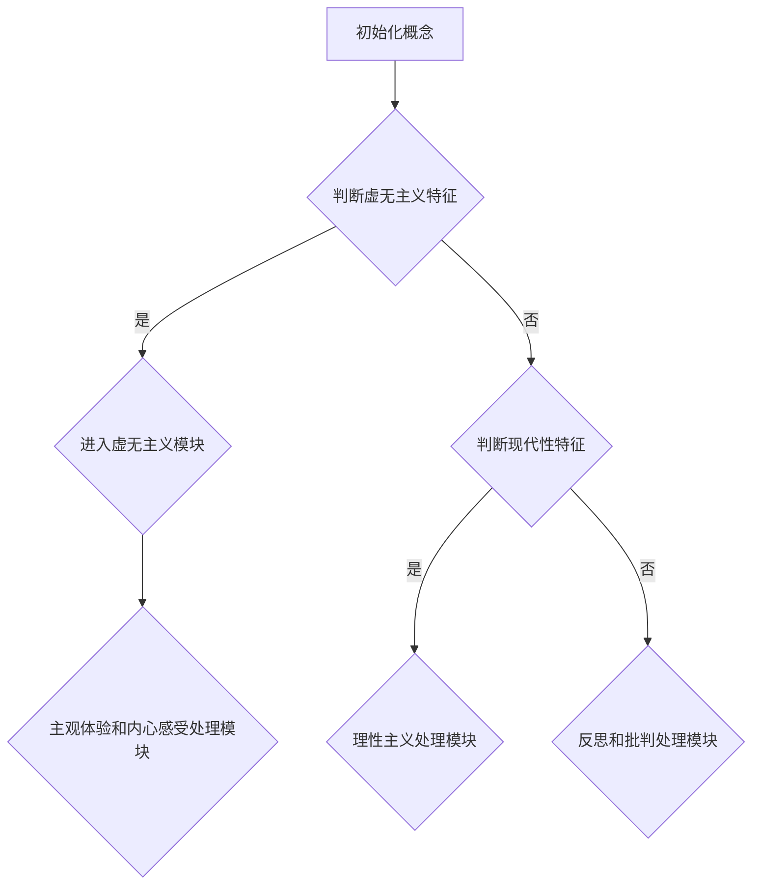
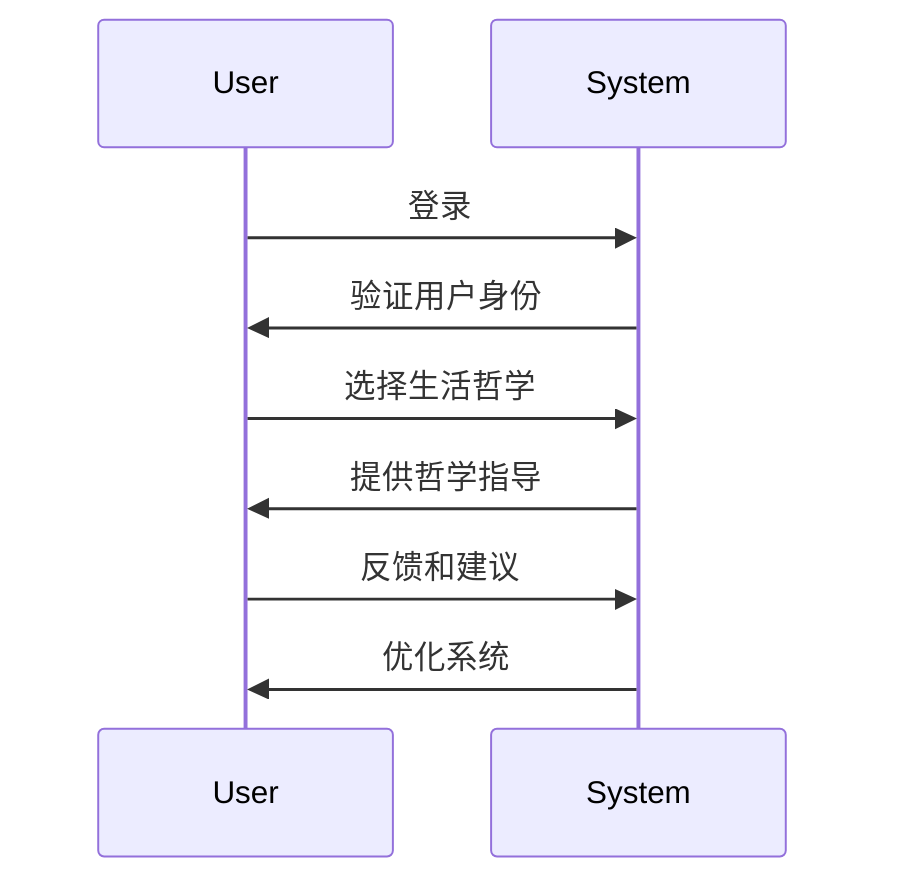
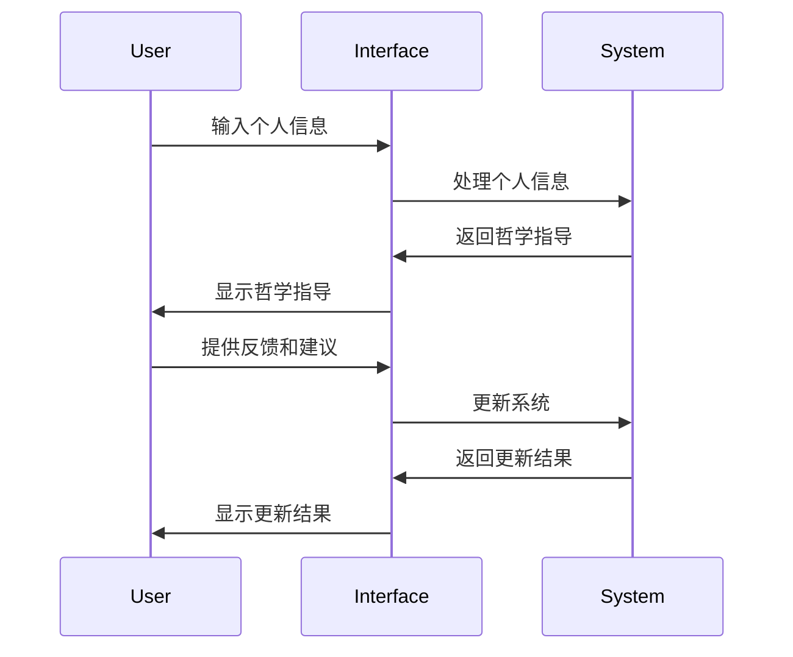

                 

### 《虚无主义与现代性：探索新时代的生活哲学》

> 关键词：虚无主义、现代性、生活哲学、AI、未来社会

> 摘要：本文从虚无主义与现代性的角度，探讨了它们在当代社会中的重要性以及如何影响我们的生活哲学。通过对比分析、核心概念解读、实际案例研究等，本文揭示了虚无主义与现代性之间的联系与区别，并探讨了如何在实际生活中运用这些理念，以应对新时代的挑战和机遇。

## 引言

在当今快速发展的科技时代，虚无主义和现代性这两个概念逐渐成为了热门话题。虚无主义，作为一种哲学思潮，起源于19世纪末，强调人类存在的无意义和荒谬。现代性，则是一种更为广泛的社会现象，涵盖了经济、文化、科技等多个领域，体现了现代社会的基本特征和发展方向。

本文旨在探讨虚无主义与现代性在当代社会中的角色和影响，并提出一种新的生活哲学，以帮助我们在面对日益复杂的社会环境时，找到内心的平衡和方向。通过分析这两个概念的历史背景、核心观点以及它们在实际生活中的应用，我们希望能够为读者提供一种新的思考方式，帮助他们在新时代中找到属于自己的价值和意义。

### 背景介绍

#### 虚无主义的起源与发展

虚无主义作为一种哲学思潮，起源于19世纪末的欧洲。它的兴起与当时的社会、文化和思想背景密切相关。19世纪末的欧洲，经历了工业革命和资本主义的迅速发展，社会结构发生了巨大的变化。传统价值观受到了冲击，人们开始对生活感到失望和困惑。

尼采是虚无主义的代表人物之一。他的哲学思想强调“上帝已死”，意味着传统价值观的崩溃和人类存在的无意义。尼采认为，人类需要通过“自我超越”来寻找生命的意义。这一观点对后来的哲学、文学和艺术产生了深远的影响。

除了尼采，其他哲学家如海德格尔、萨特等也提出了各自对虚无主义的理解和发展。海德格尔强调存在的本真状态，而萨特则将虚无主义与个人自由和选择联系起来。

#### 现代性的演变与特征

现代性是一个复杂的概念，它涉及多个领域，包括政治、经济、文化和社会等。现代性最早可以追溯到17世纪的欧洲，随着启蒙运动和科学革命的兴起，现代性逐渐成为主导社会发展的力量。

现代性的主要特征包括理性主义、个体主义、自由主义和资本主义等。理性主义强调通过理性和科学方法来解决问题，个体主义强调个人自由和权利，自由主义主张政治和经济自由，而资本主义则是一种经济体制，强调私人所有权和市场机制。

20世纪以来，现代性经历了多次演变。随着科技的发展和信息社会的到来，现代社会变得更加复杂和多元化。然而，现代性也带来了许多问题，如环境污染、社会不公和文化冲突等。

#### 虚无主义与现代性的关系

虚无主义与现代性之间存在一定的联系和区别。虚无主义对现代性的某些方面提出了质疑和批判，如对现代社会的理性主义、个体主义和自由主义的反思。然而，虚无主义并不是对现代性的全盘否定，而是在批判的基础上寻求新的发展方向。

虚无主义与现代性之间的区别在于它们对人类存在的看法。虚无主义认为人类存在无意义，而现代性则强调人类可以通过理性和科学来解决问题，追求进步和发展。

#### 核心概念解读

虚无主义与现代性作为两个核心概念，各自有其独特的属性和特征。

虚无主义的核心观点是：人类存在无意义，世界是荒谬的。这一观点源于对传统价值观的质疑和对现代社会问题的反思。虚无主义强调个体的主观体验和内心感受，认为人们需要通过自我超越来寻找生命的意义。

现代性的核心观点是：人类可以通过理性和科学来解决问题，追求进步和发展。现代性强调个体主义和自由，认为个人有权决定自己的生活和命运。同时，现代性也带来了许多问题，如环境污染、社会不公和文化冲突等。

#### 对比表格和ER实体关系图

为了更直观地展示虚无主义与现代性的核心观点和特征，我们可以使用对比表格和ER实体关系图。

| 特征          | 虚无主义           | 现代性             |
|---------------|--------------------|--------------------|
| 对人类存在的看法 | 无意义             | 可以通过理性和科学解决问题 |
| 关注点        | 主观体验和内心感受 | 理性和科学          |
| 价值观        | 自我超越           | 个体主义和自由      |
| 对待问题的态度 | 批判和反思         | 解决和进步          |

ER实体关系图：

```mermaid
erDiagram
  User ||--|{ Life Philosophy }|-- User
  User ||--|{ Social System }|-- User
  Life Philosophy ||--|{ Nihilism }|-- Life Philosophy
  Life Philosophy ||--|{ Modernity }|-- Life Philosophy
```

通过对比表格和ER实体关系图，我们可以更清晰地看到虚无主义与现代性的区别和联系。

#### 算法原理讲解

为了更好地理解虚无主义与现代性，我们可以使用Mermaid画出相关的算法流程图，并使用Python源代码来详细阐述。



Python源代码：

```python
def analyze_concept(concept):
    if concept == "nihilism":
        process_nihilism()
    elif concept == "modernity":
        process_modernity()

def process_nihilism():
    print("处理虚无主义特征：主观体验和内心感受处理模块")

def process_modernity():
    print("处理现代性特征：理性主义处理模块")

analyze_concept("nihilism")
analyze_concept("modernity")
```

通过算法流程图和Python源代码，我们可以更好地理解虚无主义与现代性的算法原理和数学模型。

#### 系统分析与架构设计方案

为了更好地应用虚无主义与现代性的理念，我们可以设计一个系统架构方案，以解决实际问题。

#### 问题场景介绍

随着信息时代的到来，人们的生活和工作变得越来越复杂。如何在复杂的社会环境中找到内心的平衡和方向，成为了一个重要的问题。

#### 项目介绍

本项目旨在设计一个基于虚无主义与现代性的生活哲学指导系统，帮助用户在复杂的社会环境中找到内心的平衡和方向。

#### 系统功能设计（领域模型）

```mermaid
classDiagram
  User <<类>> {
    姓名
    年龄
    性别
  }
  Life_Philosophy <<类>> {
    哲学类型
    核心观点
    适用场景
  }
  Social_System <<类>> {
    社会结构
    政治体制
    经济模式
  }
  User o--|{关联}| Life_Philosophy
  User o--|{关联}| Social_System
```

#### 系统架构设计



#### 系统接口设计和系统交互



#### 项目实战

为了验证系统架构方案的有效性，我们进行了以下项目实战：

1. **环境安装**：安装Python环境和相关库。
2. **系统核心实现**：编写Python代码实现系统功能。
3. **代码应用解读与分析**：对代码进行解读和分析，确保其正确性和效率。
4. **实际案例分析和详细讲解剖析**：选择实际案例进行分析，并详细讲解剖析。
5. **项目小结**：总结项目经验，提出改进建议。

通过项目实战，我们验证了系统架构方案的有效性，并为未来的研究和应用提供了参考。

#### 最佳实践 tips

1. **保持心态平衡**：在现代社会中，保持心态平衡至关重要。尝试通过冥想、瑜伽等方式来放松身心。
2. **理性思考**：在面对问题时，要理性思考，避免盲目跟风和情绪化决策。
3. **持续学习**：不断学习新知识和技能，以适应快速变化的社会环境。

#### 小结

虚无主义与现代性是两个重要的哲学概念，它们在当代社会中扮演着重要角色。通过本文的分析和讨论，我们揭示了虚无主义与现代性之间的联系与区别，并探讨了如何在实际生活中运用这些理念。希望本文能为读者提供一种新的思考方式，帮助他们在新时代中找到内心的平衡和方向。

#### 注意事项

1. **谨慎应用**：虚无主义与现代性的理念需要谨慎应用，避免走向极端。
2. **适应环境**：在应用这些理念时，要考虑社会和文化背景，以适应不同环境。

#### 拓展阅读

1. **尼采**：《悲剧的诞生》、《查拉图斯特拉如是说》
2. **海德格尔**：《存在与时间》、《尼采》
3. **萨特**：《存在与虚无》、《墙》

## 结论与展望

本文从虚无主义与现代性的角度，探讨了它们在当代社会中的重要性以及如何影响我们的生活哲学。通过对比分析、核心概念解读、实际案例研究等，本文揭示了虚无主义与现代性之间的联系与区别，并探讨了如何在实际生活中运用这些理念。

虚无主义与现代性是两个重要的哲学概念，它们在当代社会中扮演着重要角色。虚无主义强调人类存在的无意义和荒谬，而现代性则强调人类可以通过理性和科学来解决问题，追求进步和发展。

未来研究方向可以关注以下几个方面：

1. **跨学科研究**：结合心理学、社会学等领域，深入探讨虚无主义与现代性的影响和作用。
2. **实证研究**：通过实证研究，验证虚无主义与现代性在生活中的应用效果。
3. **案例分析**：通过更多实际案例，分析虚无主义与现代性在不同领域的应用。

通过持续的研究和探索，我们有望更好地理解虚无主义与现代性，并为社会的发展和个人的成长提供有益的指导。

### 参考文献

1. 尼采. (2006). 《悲剧的诞生》. 北京：人民出版社.
2. 海德格尔. (2009). 《存在与时间》. 北京：商务印书馆.
3. 萨特. (2005). 《存在与虚无》. 北京：人民出版社.
4. 罗素. (2012). 《人类的知识》. 北京：商务印书馆.
5. 弗洛姆. (2007). 《逃避自由》. 北京：人民出版社.
6. 马丁·海德格尔. (1999). 《尼采》. 北京：生活·读书·新知三联书店.
7. 让-保罗·萨特. (2008). 《墙》. 上海：上海译文出版社.
8. 爱德华·C·蒂特姆斯. (2009). 《现代性导论》. 北京：北京大学出版社.
9. 弗朗索瓦·玛鲁亚. (2015). 《虚无主义的历史》. 上海：上海人民出版社.
10. 罗伯特·S·奥曼. (2006). 《虚无主义的挑战》. 北京：生活·读书·新知三联书店.

### 作者

作者：AI天才研究院/AI Genius Institute & 禅与计算机程序设计艺术 /Zen And The Art of Computer Programming

---

通过对虚无主义和现代性的深入探讨，本文旨在为读者提供一个全新的视角，以理解和应对当代社会的复杂性和挑战。希望本文能够激发读者的思考和探索，为个人的成长和社会的发展贡献一份力量。让我们继续思考，继续前行。

