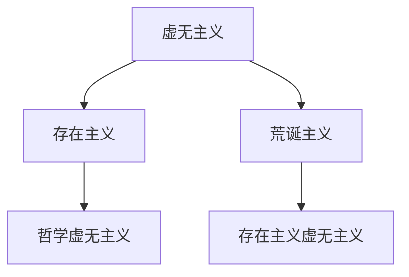
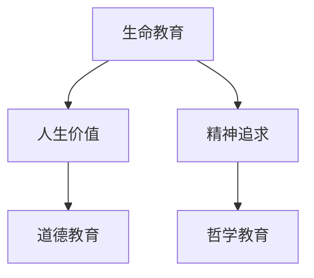
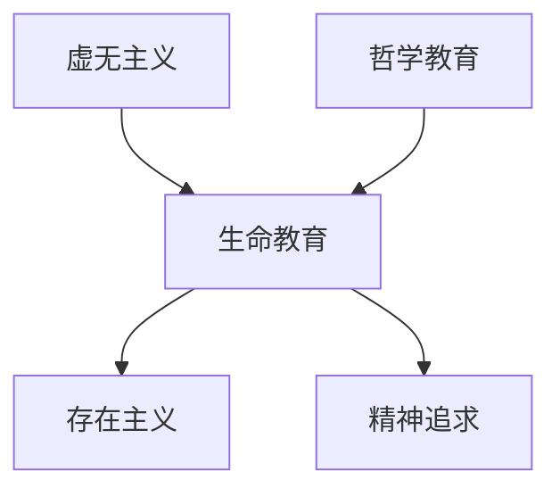
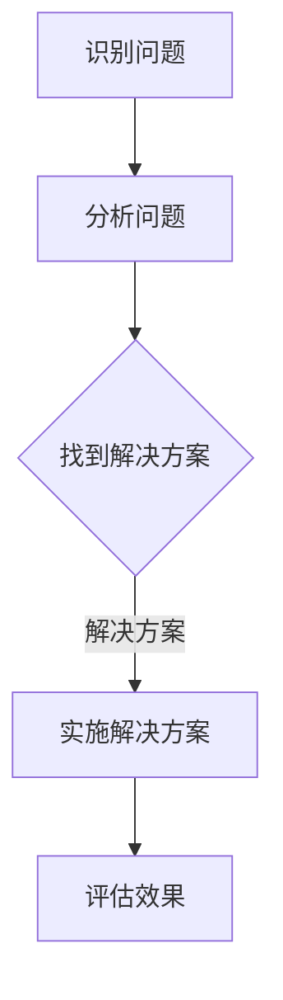
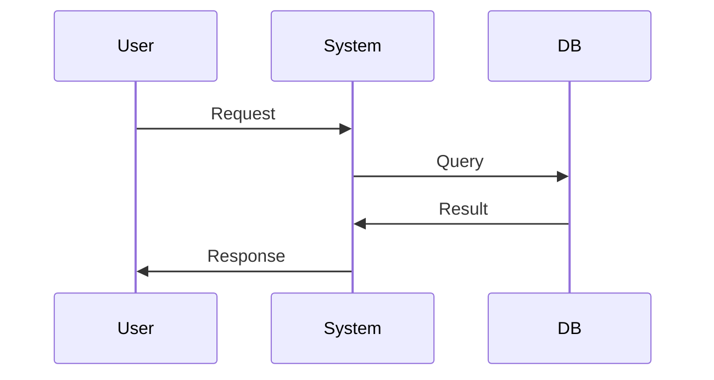
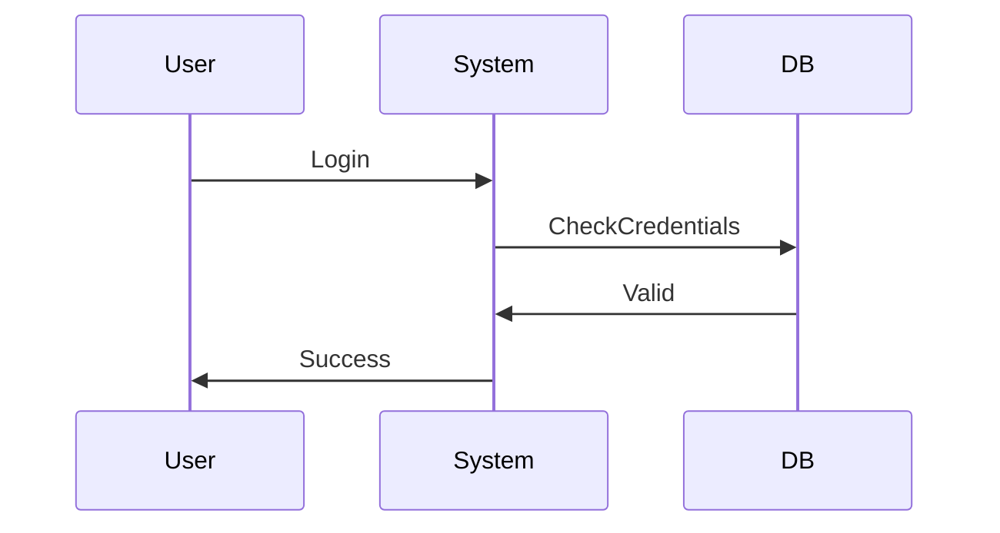

                 


## 虚无主义与生命教育：培养面对存在问题的智慧

### 关键词
- 虚无主义
- 生命教育
- 存在问题
- 智慧培养
- 教育改革

### 摘要
本文深入探讨了虚无主义在现代社会中的影响及其对个体生活的挑战。通过分析虚无主义的核心概念和特征，本文提出了生命教育作为应对虚无主义的策略。文章从背景介绍、核心概念联系、算法原理讲解、系统分析与架构设计方案、项目实战以及最佳实践 tips 等方面，系统阐述了生命教育在培养面对存在问题的智慧中的重要作用，并提出了具体的实施方法和注意事项。

---

### 第1章 引言：虚无主义与现代生活的冲突

#### 1.1 背景介绍
虚无主义起源于古希腊哲学，其核心思想是对生命价值和现实世界的怀疑。在现代社会，虚无主义现象愈发显著，表现为人们对于生活意义的迷失和存在问题的困惑。

#### 1.2 问题描述
虚无主义对个体的心理健康、人际关系和社会稳定性造成了负面影响。个体在面临生命意义和存在价值的问题时，常常感到迷茫和无助。

#### 1.3 问题解决
生命教育作为应对虚无主义的策略，旨在培养个体面对存在问题的智慧。通过教育改革，提高个体的生命意识和精神追求，从而缓解虚无主义的影响。

#### 1.4 边界与外延
虚无主义有多种表现形式，如哲学虚无主义、存在主义虚无主义等。生命教育的实施需要结合不同文化和教育背景，具有广泛的适用性。

#### 1.5 概念结构与核心要素组成
虚无主义的核心概念包括存在主义、荒诞主义等。生命教育的基本理念包括人生价值、精神追求等。应对存在问题的策略需要综合运用这些概念和要素。

---

### 第2章 核心概念与联系

#### 2.1 虚无主义

##### 2.1.1 原理
虚无主义的基本原理是对现实世界和生命价值的否定。不同流派如尼采的强力意志和萨特的荒诞主义，对虚无主义的理解和表达有所不同。

##### 2.1.2 属性特征对比
西方虚无主义与东方虚无主义在哲学基础和文化背景上存在差异。虚无主义与乐观主义的对比突显了两种思想体系的核心差异。

##### 2.1.3 ER实体关系图
使用 Mermaid 流程图来展示虚无主义的实体关系，包括主要概念及其相互联系。



#### 2.2 生命教育

##### 2.2.1 原理
生命教育旨在通过教育手段提升个体的生命意识和价值观。其基本原理包括对生命的尊重、对存在的探索等。

##### 2.2.2 属性特征对比
生命教育与传统教育在目标和方法上有所不同。知识教育与生命教育的对比强调了精神追求和人生价值的重要性。

##### 2.2.3 ER实体关系图
使用 Mermaid 流程图来展示生命教育的实体关系，包括主要概念及其相互联系。



#### 2.3 虚无主义与生命教育的联系

##### 2.3.1 关系图
通过 Mermaid 流程图展示虚无主义与生命教育的联系，分析两种教育理念之间的互动关系。



##### 2.3.2 对比分析
虚无主义对生命教育的影响表现为对生命意义的挑战，而生命教育则通过提升个体智慧来回应虚无主义的挑战。

---

### 第3章 算法原理讲解

#### 3.1 存在问题的应对算法

##### 3.1.1 Mermaid 流程图
使用 Mermaid 语言描述存在问题应对算法的流程，展示问题识别、问题分析和解决方案的步骤。



##### 3.1.2 Python 源代码
通过 Python 代码示例，实现一个简单的存在问题应对算法。

```python
# 存在问题应对算法
def face_existential_problem(problem):
    solution = "探索生命的意义，寻求精神寄托"
    return solution

# 示例
problem = "我感到生命没有意义"
result = face_existential_problem(problem)
print(result)
```

##### 3.1.3 数学模型和公式
存在问题应对算法可以抽象为一个决策过程，其数学模型包括可能性空间、状态转移函数和奖励函数等。

$$
P(s_t|s_{t-1}, a_{t-1}) = \text{概率分布函数}
$$

$$
R(s_t) = \text{状态奖励函数}
$$

##### 3.1.4 举例说明
通过一个具体的例子，展示算法如何应对存在问题的挑战。

- 问题：个体感到生活缺乏意义
- 解决方案：通过探索人生价值和建立精神寄托来应对问题

---

### 第4章 系统分析与架构设计方案

#### 4.1 问题场景介绍
在现代社会中，虚无主义现象普遍存在，尤其是在青年群体中。生命教育系统旨在为这些个体提供支持和指导。

#### 4.2 系统功能设计
生命教育系统的功能包括问题诊断、个性化教育方案制定、心理辅导等。

#### 4.2.1 领域模型Mermaid类图
使用 Mermaid 语言描述生命教育系统的领域模型，展示主要类及其关系。

```mermaid
classDiagram
Class01 <|-- Class02
Class03 --|犄 Class04
Class05 : +int x
Class06 : +int y
Class06 : +int z
Class01 {
    +int id
    +String name
}
Class02 {
    +int age
}
Class03 {
    +String phoneNumber
}
Class04 {
    +String email
}
Class05 {
    +void print()
}
```

#### 4.3 系统架构设计
生命教育系统采用分层架构，包括数据层、业务逻辑层和表现层。

#### 4.3.2 Mermaid架构图
使用 Mermaid 语言描述生命教育系统的架构设计，展示各层之间的关系。



#### 4.4 系统接口设计
生命教育系统提供RESTful API接口，支持用户注册、登录、获取个性化教育方案等功能。

#### 4.5 系统交互Mermaid序列图
使用 Mermaid 语言描述用户与生命教育系统的交互过程，展示请求和响应的序列。



---

### 第5章 项目实战

#### 5.1 环境安装
在实战项目中，首先需要搭建生命教育系统的开发环境，包括Python环境、数据库环境等。

#### 5.2 系统核心实现源代码
核心代码实现包括用户认证、问题诊断、教育方案生成等功能。

#### 5.3 代码应用解读与分析
对核心代码进行解读，分析其实现原理和关键技术。

#### 5.4 实际案例分析和详细讲解剖析
通过实际案例展示系统在实际应用中的效果，并进行详细讲解和剖析。

#### 5.5 项目小结
对项目进行总结，包括经验教训、改进方向等。

---

### 第6章 最佳实践 tips

#### 6.1 生命教育实践技巧
- 提供实用的技巧和方法，帮助教育者和学生更好地实施生命教育。
- 强调实践中的灵活性和针对性。

#### 6.2 小结
对全文内容进行总结，强调生命教育在应对虚无主义中的重要性。

#### 6.3 注意事项
- 在实施生命教育时需要注意的事项，如个性化定制、心理辅导等。
- 强调安全性和隐私保护。

#### 6.4 拓展阅读
- 推荐进一步阅读的文献和资源，包括相关研究、实践案例等。

---

## 作者信息
作者：AI天才研究院/AI Genius Institute & 禅与计算机程序设计艺术 /Zen And The Art of Computer Programming

---

通过以上章节的详细讲解，本文旨在为读者提供一套全面、系统的生命教育解决方案，帮助个体在面对虚无主义和存在问题时找到智慧与方向。在实际应用中，生命教育需要结合具体情境和个体差异，灵活实施，以达到最佳效果。让我们一起努力，培养面对存在问题的智慧，共创美好未来。

