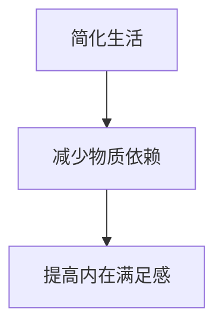
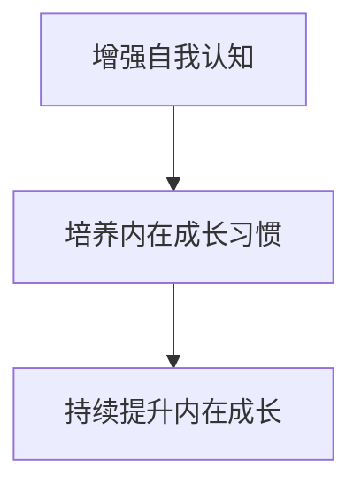
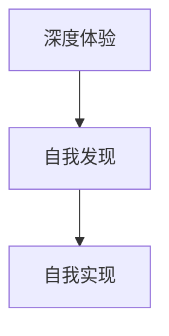
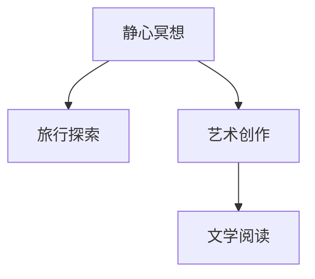
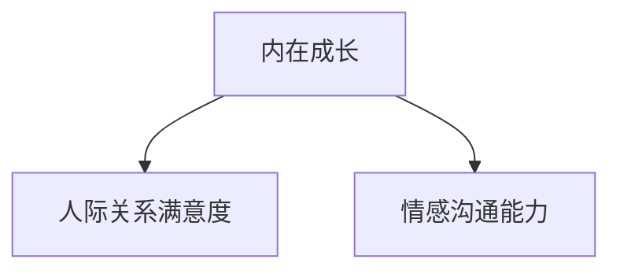
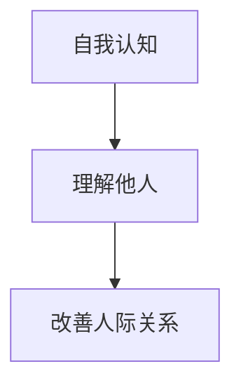
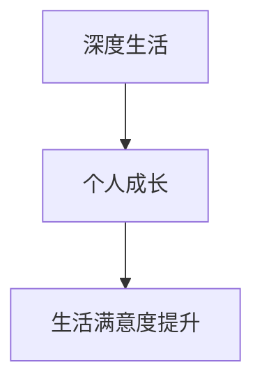
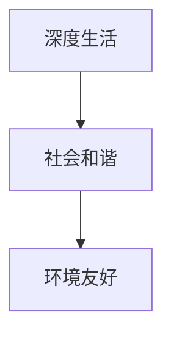

                 

# 追求内在成长：超越表面的深度生活

> 关键词：内在成长、深度生活、心理健康、人际关系、个人实践

> 摘要：本文探讨了追求内在成长的重要性以及如何通过深度生活来实现这一目标。通过深入分析内在成长与外在表现的关系，内在成长与心理健康的关系，以及深度生活的实践方法，本文旨在帮助读者找到实现内在成长的有效途径，从而提升个人生活质量。

## 第1章：引言

### 1.1 问题背景

在现代社会的快速发展中，人们越来越重视外在的成功和表现，而往往忽视了内在的成长和满足感。追求物质财富和社会地位的同时，很多人感到内心的空虚和迷茫。如何实现内在的成长，过上深度生活，成为了一个值得探讨的问题。

### 1.2 问题描述

内在成长是指个体在心理、情感和认知层面上的不断提升和深化。而深度生活则是一种追求内心丰富和深度体验的生活方式。本文将探讨内在成长的重要性，以及如何通过深度生活来实现这一目标。

### 1.3 边界与外延

内在成长和深度生活是相互关联但又有区别的概念。内在成长强调个体的自我认知和内在满足感的提升，而深度生活则强调通过深度体验和反思来实现个人成长。二者共同构成了追求深度生活的理论基础。

## 第2章：内在成长的重要性

### 2.1 内在成长与外在表现的关系

内在成长与外在表现之间存在一定的差异。外在表现往往注重物质和社会地位的获取，而内在成长则更关注个体的心理和情感层面的提升。

| 特征 | 内在成长 | 外在表现 |
| ---- | -------- | -------- |
| 自我认知 | 更深刻 | 更肤浅 |
| 情感满足 | 更持久 | 更短暂 |
| 生活满意度 | 更高 | 更低 |

通过表格可以看出，内在成长相对于外在表现具有更深刻、更持久和更高的生活满意度。

### 2.2 内在成长与心理健康的关系

内在成长与心理健康密切相关。一个心理健康的人往往具备较高的自我认知和情感调节能力，这有助于他们在面对压力和挑战时保持良好的心理状态。

```mermaid
erDiagram
  Person ||--|{ Mind }|| Person :心理状态影响行为
  Mind ||--|{ Emotions }|| Mind :情绪与内在成长密切相关
```

在这个ER实体关系图中，Person表示个体，Mind表示心理状态，Emotions表示情绪。个体通过心理状态和行为相互影响，而情绪则与内在成长密切相关。

## 第3章：深度生活的实践方法

### 3.1 简化生活，减少物质依赖

简化生活是深度生活的一个重要实践方法。通过减少物质依赖，个体可以将更多的精力投入到内在成长和深度体验中。



在这个流程图中，简化生活是第一步，减少物质依赖是关键，而提高内在满足感则是最终目标。

### 3.2 增强自我认知，培养内在成长习惯

增强自我认知是内在成长的基础。通过不断反思和探索，个体可以更好地了解自己，从而培养内在成长的习惯。



在这个流程图中，增强自我认知是第一步，培养内在成长习惯是关键，而持续提升内在成长则是最终目标。

## 第4章：深度体验与自我实现

### 4.1 深度体验的重要性

深度体验是实现自我发现和自我实现的关键。通过深度体验，个体可以更好地理解自己和世界，从而实现个人的成长和提升。



在这个流程图中，深度体验是第一步，自我发现是关键，而自我实现则是最终目标。

### 4.2 深度体验的方法

深度体验可以通过多种方式实现，如静心冥想、旅行探索、艺术创作和文学阅读等。每种方式都有其独特的价值和意义。



在这个流程图中，静心冥想、旅行探索、艺术创作和文学阅读都是实现深度体验的方法。

## 第5章：内在成长与人际关系

### 5.1 内在成长对人际关系的影响

内在成长对人际关系具有积极的影响。一个具备内在成长的人往往更懂得如何与他人沟通和相处，从而提升人际关系的满意度。



在这个流程图中，内在成长是第一步，人际关系满意度是关键，而情感沟通能力则是最终目标。

### 5.2 内在成长与人际关系的互动

内在成长与人际关系之间存在相互影响的关系。一个具备内在成长的人可以更好地理解和接纳他人，从而改善人际关系。



在这个流程图中，自我认知是第一步，理解他人是关键，而改善人际关系则是最终目标。

## 第6章：深度生活的长期影响

### 6.1 深度生活对个人成长的影响

深度生活对个人成长具有深远的影响。通过深度体验和反思，个体可以在心理、情感和认知层面上实现全面的成长。



在这个流程图中，深度生活是第一步，个人成长是关键，而生活满意度提升则是最终目标。

### 6.2 深度生活对社会的意义

深度生活不仅对个人成长有重要影响，还对社会的和谐和环境的友好具有积极意义。通过追求内在成长，个体可以更好地为社会和环境做出贡献。



在这个流程图中，深度生活是第一步，社会和谐是关键，而环境友好则是最终目标。

## 第7章：追求内在成长的实践与反思

### 7.1 个人实践案例分享

通过分享个人实践案例，读者可以更好地了解如何追求内在成长。每个案例都包含了具体的实践方法和收获，为读者提供了宝贵的经验。

### 7.2 追求内在成长的反思

在追求内在成长的过程中，反思是至关重要的。通过反思，个体可以更好地认识自己，调整心态和行为，从而实现更深层次的成长。

### 7.3 小结

在追求内在成长的过程中，我们需要注意以下几点：

1. 关注内在成长，而非外在表现。
2. 培养自我认知和情感调节能力。
3. 深度体验和反思是实现内在成长的关键。
4. 积极改善人际关系，提升生活质量。

### 7.4 拓展阅读

对于希望进一步了解内在成长和深度生活的读者，以下是一些推荐书籍：

1. 《深度工作：如何有效利用每一点脑力》（Cal Newport）
2. 《静心：一种生活方式》（B. Alan Wallace）
3. 《非暴力沟通：用非暴力方式解决问题》（马歇尔·卢森堡）

## 结语

追求内在成长是一场长期的旅程，需要我们在日常生活中不断反思和实践。通过深度生活，我们可以更好地理解自己，实现个人的成长和提升。让我们勇敢地追求内在成长，过上更加丰富和有意义的生活。

**作者：AI天才研究院/AI Genius Institute & 禅与计算机程序设计艺术 /Zen And The Art of Computer Programming**

