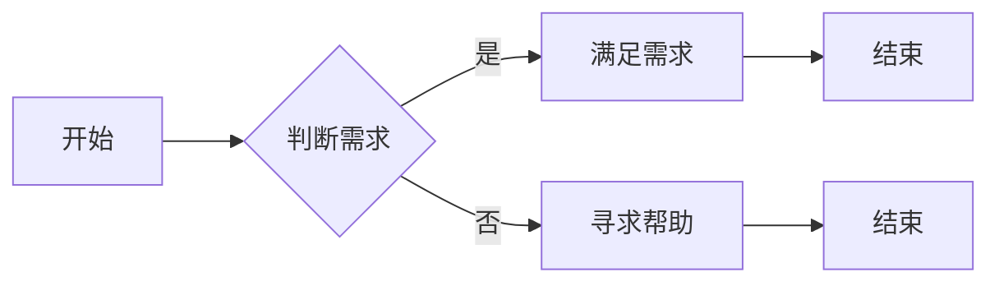

                 


# 重新定义幸福概念：从物质满足到心灵富足的转变

## 关键词
- 幸福定义
- 物质满足
- 心灵富足
- 心理学
- 社会学
- 教育改革

## 摘要
本文旨在重新定义幸福概念，探讨从物质满足到心灵富足的转变。通过深入分析物质满足的局限性，揭示心灵富足的重要性，并提出具体的转变策略。文章将从心理学、社会学和教育改革等多个角度，提供实践案例分析，以及政策建议，旨在促进个体和社会的整体幸福感提升。

## 引言

### 幸福的定义与现状

幸福是一个复杂且多维度的概念，不同文化和时代对其有不同的解读。传统的幸福观念通常侧重于物质满足，如财富、健康和地位。然而，随着社会的发展，人们逐渐意识到物质满足并非幸福的全部。现代社会中，人们面临着前所未有的压力和焦虑，这些问题揭示了传统幸福观念的局限性。

### 物质满足的局限性

物质满足虽然能带来短期的快乐和满足感，但长期来看，其局限性逐渐显现。首先，物质财富的增长并不一定带来幸福感的提升。许多研究表明，超过一定水平的财富增长对幸福感的提升作用有限。其次，物质满足往往伴随着消费主义和过度工作，这可能导致心理健康问题，如焦虑和抑郁。

### 心灵富足的内涵

心灵富足是一种超越物质满足的幸福状态，它关注个体的内在成长、心理健康和社会关系。心灵富足强调个人价值观的实现、自我认知的提升和对生活的积极态度。它不仅仅是一种情感状态，更是一种生活方式和价值观。

### 关系比较与影响

物质满足和心灵富足并非截然对立，而是相辅相成的。物质满足可以为心灵富足提供基础，但心灵富足才是长期幸福感的源泉。从物质满足转向心灵富足，需要个体和社会的共同努力。

## 核心概念

### 物质满足的局限性

#### 物质财富与幸福感的关系

研究表明，物质财富的增长对幸福感的提升作用是有限的。当收入超过一定水平后，增加的财富对幸福感的边际效用逐渐减弱。这种现象被称为“边际效用递减”。此外，物质财富的增长往往伴随着消费主义和过度工作，这可能导致心理健康问题。

#### 消费主义与心理压力

消费主义文化鼓励人们不断购买新产品和服务，以追求满足感。然而，这种追求往往导致心理压力和焦虑。研究表明，过度消费与抑郁、焦虑和压力之间存在正相关关系。

### 心灵富足的内涵

#### 内在成长与自我实现

心灵富足强调内在成长和自我实现。通过发展个人技能、兴趣和价值观，个体能够实现更深层次的满足和幸福感。

#### 心理健康与社会关系

心灵富足还涉及心理健康和社会关系。积极的心理状态和良好的人际关系是幸福的重要因素。通过培养积极的情感、应对策略和人际沟通技巧，个体能够提高幸福感。

#### 意义与价值

心灵富足不仅仅是一种情感状态，更是一种生活方式和价值观。它强调个体对生活的积极态度和感恩心态，有助于提高生活质量和社会整体幸福感。

### 关系比较与影响

物质满足和心灵富足并非截然对立，而是相辅相成的。物质满足可以为心灵富足提供基础，但心灵富足才是长期幸福感的源泉。从物质满足转向心灵富足，需要个体和社会的共同努力。

## 转变策略

### 转变的必要性

在现代社会中，越来越多的人开始意识到心灵富足的重要性。为了实现长期的幸福感，个体需要从物质满足转向心灵富足。以下是实现这一转变的必要性：

#### 物质满足的局限性

如前所述，物质满足的边际效用递减，且过度消费可能导致心理压力。因此，单纯追求物质财富并不能带来长期的幸福感。

#### 心灵富足的价值

心灵富足关注个体的内在成长和心理健康，有助于提高生活质量和幸福感。通过培养积极的情感和人际关系，个体能够更好地应对生活中的挑战。

### 转变的方法

#### 个人层面

1. **自我反思**：通过反思个人的价值观、目标和生活方式，明确自己的需求和愿望。

2. **内在成长**：通过学习新技能、培养兴趣爱好和提升自我认知，实现个人成长。

3. **心理健康**：通过锻炼、冥想和寻求专业帮助，维护良好的心理健康。

4. **人际关系**：通过建立积极的人际关系，提高社交能力和情感支持。

#### 社会层面

1. **教育改革**：通过教育培养个体的内在成长和心理健康，促进心灵富足。

2. **公共政策**：制定和实施支持心灵富足的政策，如心理健康服务、工作与生活的平衡等。

3. **企业文化**：鼓励企业关注员工的心理健康和工作与生活的平衡，推动社会整体幸福感提升。

### 转变的实践案例

#### 个人转变经历

以某人为例，他意识到自己的幸福主要来源于物质满足，但长期下来感到空虚和焦虑。通过自我反思和内在成长，他逐渐转向心灵富足。他开始练习冥想、培养兴趣爱好，并建立积极的人际关系。如今，他感到更加满足和幸福。

#### 企业社会责任

某大型企业意识到员工的心理健康对其工作效率和创造力的重要性。该公司推出了一系列支持心灵富足的政策，如心理健康咨询、灵活工作时间和员工互助小组。这些举措不仅提高了员工的幸福感，还提升了公司的整体业绩。

## 实践案例分析

### 案例一：个人转变经历

#### 背景介绍

小王，一名年轻的程序员，一直在追求物质财富。他通过加班和努力工作，积累了相当财富，但感到越来越不快乐。一天，他偶然参加了一场关于心灵富足的讲座，开始思考自己的生活方式。

#### 转变过程

1. **自我反思**：小王开始反思自己的价值观和生活目标，意识到物质财富并非他真正的追求。

2. **内在成长**：他决定学习新技能，如绘画和音乐，以丰富自己的生活。

3. **心理健康**：他开始练习冥想，以减轻工作压力，提高心理健康。

4. **人际关系**：他积极参加社交活动，建立积极的人际关系，提高社交能力。

#### 结果

经过一段时间的努力，小王感到自己的生活焕然一新。他不再仅仅关注物质财富，而是享受内在成长和心理健康带来的幸福感。

### 案例二：企业社会责任

#### 背景介绍

某大型科技公司意识到员工心理健康对其工作效率和创造力的重要性。该公司开始实施一系列支持心灵富足的政策，如心理健康咨询、灵活工作时间和员工互助小组。

#### 转变过程

1. **心理健康咨询**：公司提供免费的心理健康咨询服务，帮助员工应对压力和焦虑。

2. **灵活工作时间**：公司实行灵活的工作制度，允许员工根据自己的需求安排工作时间和地点。

3. **员工互助小组**：公司成立员工互助小组，鼓励员工分享经验，互相支持和帮助。

#### 结果

这些举措不仅提高了员工的心理健康水平，还提升了公司的整体业绩。员工感到更加满意和幸福，公司的创新能力和竞争力也得到提升。

### 案例三：社区建设

#### 背景介绍

某社区意识到社会关系对幸福感的重要性，开始推动社区建设，以支持心灵富足。

#### 转变过程

1. **社区活动**：社区定期组织各种活动，如运动会、文化展览和社区讲座，增强居民之间的互动和联系。

2. **志愿者服务**：社区鼓励居民参与志愿者服务，培养他们的社会责任感和归属感。

3. **互助小组**：社区建立互助小组，帮助居民解决生活中的问题和困难。

#### 结果

社区建设促进了居民之间的积极互动和紧密联系，提高了居民的整体幸福感。居民感到更加幸福和满足，社区的凝聚力也得到提升。

## 个人成长与心灵富足

### 个人成长的概念

个人成长是指个体在认知、情感和技能等方面的持续发展和提升。它不仅包括知识和技能的积累，还涉及自我认知和心理健康的提升。

### 心灵富足的路径

1. **自我认知**：通过自我反思和探索，了解自己的价值观、兴趣和需求，找到自己的人生目标和意义。

2. **技能提升**：通过学习新技能和知识，提升自己的能力和竞争力，实现个人价值的最大化。

3. **心理健康**：通过锻炼、冥想和寻求专业帮助，维护良好的心理健康，提高生活质量。

4. **社会关系**：通过建立积极的人际关系，提高社交能力和情感支持，增强幸福感。

### 成长与富足的互动

个人成长和心灵富足是相互促进的关系。个人成长为心灵富足提供基础，而心灵富足则推动个人成长。通过不断成长，个体能够实现更高的心灵富足水平，从而获得更深刻的幸福感。

## 文化与环境

### 社会文化环境与幸福感

社会文化环境对个体的幸福感具有重要影响。一个积极、包容和健康的社会文化环境有助于提高个体的幸福感。反之，消极、排斥和紧张的社会文化环境可能导致个体的心理压力和焦虑。

### 文化对幸福感的影响

1. **价值观**：不同的文化对幸福有不同的理解和价值观。例如，一些文化强调物质财富和成功，而另一些文化则强调内在成长和人际关系。

2. **社会支持**：一个支持性的社会文化环境能够提供情感和实际支持，帮助个体应对生活中的挑战。

3. **社会规范**：社会规范对个体的行为和生活方式产生影响。一些社会规范可能鼓励物质追求，而另一些规范可能鼓励心灵富足。

### 构建幸福社会的策略

1. **教育改革**：通过教育培养个体的内在成长和心理健康，促进心灵富足。

2. **公共政策**：制定和实施支持心灵富足的政策，如心理健康服务、工作与生活的平衡等。

3. **企业文化**：鼓励企业关注员工的心理健康和工作与生活的平衡，推动社会整体幸福感提升。

4. **社会宣传**：通过媒体和宣传，提高公众对心灵富足的认识和重视。

## 政策建议

### 促进社会整体幸福感提升的政策建议

1. **心理健康服务**：提供免费或低成本的心理健康服务，帮助个体应对心理压力和焦虑。

2. **工作与生活的平衡**：鼓励企业提供灵活的工作时间和制度，帮助员工实现工作与生活的平衡。

3. **教育改革**：将心理健康和心灵富足纳入教育体系，培养学生的内在成长和心理健康。

4. **社会支持**：建立社会支持体系，为个体提供情感和实际支持，帮助其实现心灵富足。

5. **公共政策**：制定支持心灵富足的公共政策，如税收优惠、社会福利等，鼓励个体和社会关注心灵富足。

## 结论

### 重新定义幸福概念的意义与展望

重新定义幸福概念，从物质满足转向心灵富足，不仅有助于个体实现长期的幸福感，还有助于提升社会的整体幸福感。通过心理学、社会学和教育改革等多个角度，我们认识到心灵富足的重要性，并提出了一系列实践案例和政策建议。在未来，我们需要进一步探索和推广心灵富足的理念，促进个体和社会的全面幸福。

## 附录

### 实践案例表格

| 案例名称 | 背景 | 转变过程 | 结果 |
| --- | --- | --- | --- |
| 小王案例 | 物质追求 | 自我反思、内在成长、心理健康、人际关系 | 幸福感提升 |
| 企业社会责任案例 | 员工心理健康问题 | 心理健康咨询、灵活工作时间、员工互助小组 | 企业业绩提升 |
| 社区建设案例 | 社会关系薄弱 | 社区活动、志愿者服务、互助小组 | 社区凝聚力提升 |

### Mermaid ER实体关系图

```mermaid
erDiagram
  Customer ||--|{ Order } : places
  Product ||--|{ Order } : contains
```

### 算法流程图



### 算法原理讲解

```python
# Python代码示例
def calculate_happiness(satisfaction, spiritual_richness):
    """
    计算幸福感
    :param satisfaction: 物质满足程度
    :param spiritual_richness: 心灵富足程度
    :return: 幸福感得分
    """
    # 算法原理：幸福感得分是物质满足程度和心灵富足程度的加权平均
    happiness = (satisfaction + spiritual_richness) / 2
    return happiness
```

### 数学公式

$$
H = \frac{S + R}{2}
$$

其中，$H$ 表示幸福感得分，$S$ 表示物质满足程度，$R$ 表示心灵富足程度。

### 最佳实践 Tips

- **培养内在成长**：通过阅读、学习新技能和参加兴趣小组，提升个人内在成长。
- **维护心理健康**：定期锻炼、保持良好的睡眠习惯和寻求专业帮助，维护心理健康。
- **建立积极人际关系**：积极参与社交活动，建立积极的人际关系。

### 小结

本文重新定义了幸福概念，探讨了从物质满足到心灵富足的转变。通过实践案例和政策建议，我们认识到心灵富足的重要性，并提出了一系列促进个体和社会幸福感提升的策略。在未来的发展中，我们需要进一步关注心灵富足，为个体和社会创造更美好的未来。

### 注意事项

- **个体差异**：在追求心灵富足的过程中，要尊重个体差异，根据个人情况和需求进行选择。
- **长期实践**：心灵富足不是一蹴而就的过程，需要个体和社会长期的努力和坚持。

### 拓展阅读

- 《心灵富足：从内心获得真正的幸福》
- 《心理学与生活》
- 《社会心理学》
- 《教育改革：为了幸福的教育》

### 作者信息

作者：AI天才研究院/AI Genius Institute & 禅与计算机程序设计艺术 /Zen And The Art of Computer Programming

---

（本文内容仅供参考，如有需要，请进一步研究和探索。）


