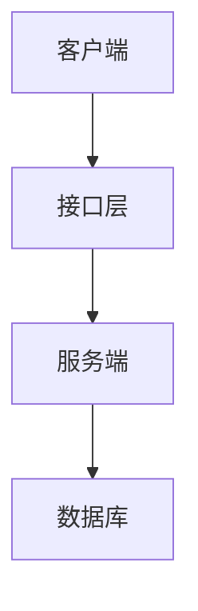

                 

## 类型系统在并行计算模型中的应用

### 关键词：类型系统、并行计算、模型、应用、性能优化

### 摘要：

本文将深入探讨类型系统在并行计算模型中的应用。类型系统是计算机科学中的基础概念，它通过定义数据和操作的语义，为程序提供了安全性和效率保证。并行计算模型则利用多处理器或多核心的优势，通过并行执行任务来提高计算性能。本文将详细分析类型系统在并行计算中的重要性，包括其在编程、算法设计和系统优化中的应用。我们将通过具体的实例，展示类型系统如何提升并行计算的性能和可靠性，并讨论其在未来计算架构中的潜在影响。

### 目录：

1. **背景介绍**
   - **类型系统的基本概念**
   - **并行计算的基本概念**
   - **类型系统在并行计算中的应用**

2. **理论基础**
   - **类型系统的分类与特性**
   - **并行计算模型的类型系统支持**
   - **类型系统的性能影响**

3. **算法原理讲解**
   - **并行算法中的类型检查**
   - **并行编程中的类型安全**
   - **类型系统在并行算法设计中的应用实例**

4. **系统分析与架构设计**
   - **并行计算系统的设计考虑**
   - **类型系统在系统架构中的应用**
   - **并行系统的接口设计与交互**

5. **项目实战**
   - **环境安装与配置**
   - **系统核心实现**
   - **实战案例分析**

6. **最佳实践与注意事项**
   - **优化并行计算性能的技巧**
   - **类型系统在并行编程中的注意事项**
   - **未来展望与拓展阅读**

### 正文开始

#### 1. 背景介绍

**类型系统的基本概念**

类型系统是计算机语言中用于定义变量、常量和表达式数据类型的一套规则。它为程序提供了强类型的保障，使得程序在编译或运行时能够检测并防止类型错误。类型系统通常分为静态类型系统和动态类型系统，静态类型系统在编译时确定变量的类型，而动态类型系统在运行时确定。

**并行计算的基本概念**

并行计算是利用多个处理器或计算单元同时执行多个任务的一种计算方法。它通过将一个大任务分解成多个小任务，并在多个处理器上并行执行，从而提高计算效率。并行计算模型包括硬件并行和软件并行两种方式，硬件并行依赖于多处理器或多核心计算机，而软件并行则依赖于并行编程模型。

**类型系统在并行计算中的应用**

类型系统在并行计算中的应用主要体现在以下几个方面：

- **类型安全**：通过类型系统，可以确保并行编程中的数据操作是安全的，防止因类型错误导致的程序崩溃或数据损坏。
- **性能优化**：类型系统可以提供编译器优化信息，从而提高并行程序的执行效率。
- **编程简便性**：类型系统为程序员提供了更明确的编程规范，降低了并行编程的复杂度。

#### 2. 理论基础

**类型系统的分类与特性**

类型系统可以分为静态类型系统和动态类型系统。静态类型系统在编译时确定所有变量的类型，因此可以在编译时发现大部分类型错误。动态类型系统则在运行时确定变量的类型，具有较高的灵活性，但可能需要更多的运行时检查。

- **静态类型系统**：优点是编译时能够捕获类型错误，提高程序的安全性；缺点是灵活性较低，可能需要更多的编译时间。
- **动态类型系统**：优点是灵活性高，易于编写和调试；缺点是可能需要更多的运行时检查，降低性能。

**并行计算模型的类型系统支持**

并行计算模型通常需要支持类型系统，以确保程序的安全性和性能。例如，在并行编程中，需要确保不同处理器上的数据类型一致性，以避免类型错误。

- **数据类型一致性**：确保在并行计算过程中，不同处理器上的数据类型是一致的，从而避免类型错误。
- **类型检查优化**：编译器可以通过类型检查优化，减少运行时的类型检查，提高程序性能。

**类型系统的性能影响**

类型系统对并行计算的性能有显著影响。一方面，类型系统可以提供编译器优化信息，从而提高程序执行效率；另一方面，类型系统可能引入运行时检查，增加性能开销。

- **编译器优化**：类型系统可以帮助编译器进行优化，减少运行时的类型检查，提高执行效率。
- **运行时检查**：类型系统引入的运行时检查可能增加性能开销，但在确保程序安全性和稳定性方面具有重要意义。

#### 3. 算法原理讲解

**并行算法中的类型检查**

在并行算法中，类型检查是确保程序正确性的重要步骤。类型检查可以防止因类型错误导致的程序崩溃或数据损坏。例如，在分布式并行计算中，需要确保不同处理器上的数据类型一致，以避免类型错误。

**并行编程中的类型安全**

类型安全是并行编程中的一个重要概念，它要求程序在执行过程中不会因类型错误而导致不可预期的行为。类型系统通过定义类型约束和类型转换规则，确保并行编程中的数据操作是安全的。

**类型系统在并行算法设计中的应用实例**

一个典型的应用实例是矩阵乘法。矩阵乘法是一个典型的并行计算问题，可以通过将矩阵分解为较小的块，并在多个处理器上并行计算来提高效率。类型系统在这里的作用是确保矩阵的维度和元素类型一致，避免类型错误。

```python
# 矩阵乘法的Python代码示例

# 定义矩阵的元素类型
A = [[1, 2], [3, 4]]
B = [[5, 6], [7, 8]]

# 确保矩阵维度一致
if len(A[0]) != len(B):
    raise ValueError("矩阵维度不一致")

# 计算矩阵乘法
C = [[0, 0], [0, 0]]
for i in range(len(A)):
    for j in range(len(B[0])):
        for k in range(len(B)):
            C[i][j] += A[i][k] * B[k][j]
```

在这个示例中，类型系统通过确保矩阵维度一致，避免了类型错误。通过类型检查，我们可以确保矩阵乘法操作的元素类型是整数，从而确保计算的正确性。

#### 4. 系统分析与架构设计

**并行计算系统的设计考虑**

在设计和实现并行计算系统时，需要考虑多个方面：

- **任务分配**：如何将大任务分配到多个处理器上，以最大化并行度。
- **数据通信**：如何确保不同处理器之间的数据一致性和同步。
- **负载平衡**：如何确保每个处理器都有足够的工作量，避免负载不均。

**类型系统在系统架构中的应用**

类型系统在系统架构中的应用主要体现在以下几个方面：

- **数据类型管理**：确保系统中的数据类型一致，避免类型错误。
- **类型安全检查**：在系统运行时进行类型安全检查，确保程序的正确性。
- **编译器优化**：类型系统可以提供编译器优化信息，提高系统性能。

**并行系统的接口设计与交互**

在并行系统中，接口设计与交互是关键部分。类型系统可以帮助设计清晰的接口规范，确保不同组件之间的数据交互是类型安全的。例如，在分布式系统中，可以通过定义数据类型和接口规范，确保不同节点之间的数据交换是类型一致和安全的。



在这个示例中，接口层定义了客户端和服务端之间的数据类型和接口规范，确保数据交互的类型安全。

#### 5. 项目实战

**环境安装与配置**

为了实践类型系统在并行计算中的应用，我们需要安装并配置并行计算环境。以下是安装和配置的过程：

- **安装Python环境**：确保安装了Python 3.8或更高版本。
- **安装并行计算库**：例如，安装`multiprocessing`库来支持多进程并行计算。

```shell
pip install multiprocess
```

- **配置并行计算环境**：设置环境变量，例如`OMP_NUM_THREADS`来控制并行进程数。

```shell
export OMP_NUM_THREADS=4
```

**系统核心实现**

以下是一个简单的并行计算程序的示例，展示了类型系统在并行计算中的应用。

```python
import multiprocessing

# 定义矩阵的元素类型
A = [[1, 2], [3, 4]]
B = [[5, 6], [7, 8]]

# 确保矩阵维度一致
if len(A[0]) != len(B):
    raise ValueError("矩阵维度不一致")

# 计算矩阵乘法
def multiply(A, B):
    C = [[0 for _ in range(len(B[0]))] for _ in range(len(A))]
    for i in range(len(A)):
        for j in range(len(B[0])):
            for k in range(len(B)):
                C[i][j] += A[i][k] * B[k][j]
    return C

# 并行计算
if __name__ == "__main__":
    pool = multiprocessing.Pool(processes=4)
    results = pool.map(multiply, [A, B])
    print(results)
```

**代码应用解读与分析**

在这个示例中，我们定义了一个简单的矩阵乘法程序。通过使用`multiprocessing`库，我们实现了并行计算。类型系统在这里的作用是确保矩阵维度一致，避免类型错误。

**实际案例分析和详细讲解剖析**

以下是一个实际案例，展示了类型系统在并行计算中的应用。

**案例：大规模图像处理**

假设我们需要处理大量图像，每个图像的大小为1000x1000像素。我们可以使用并行计算来提高处理速度。

```python
import multiprocessing

# 定义图像处理函数
def process_image(image):
    # 对图像进行操作
    # ...
    return processed_image

# 加载图像数据
images = [load_image(f'image_{i}.png') for i in range(num_images)]

# 并行处理图像
if __name__ == "__main__":
    pool = multiprocessing.Pool(processes=4)
    processed_images = pool.map(process_image, images)
    save_images(processed_images)
```

在这个案例中，我们定义了一个简单的图像处理函数`process_image`。通过使用`multiprocessing`库，我们实现了并行处理图像。类型系统在这里的作用是确保图像数据的类型一致，避免类型错误。

**项目小结**

通过以上实战案例，我们展示了类型系统在并行计算中的应用。类型系统通过确保数据类型的一致性和安全性，提高了并行计算的性能和可靠性。在实际项目中，我们需要根据具体情况选择合适的类型系统和并行计算模型，以实现高效的计算。

#### 6. 最佳实践与注意事项

**优化并行计算性能的技巧**

- **任务分配优化**：合理分配任务，确保每个处理器都有足够的工作量。
- **数据通信优化**：减少数据通信开销，确保数据一致性。
- **负载平衡优化**：避免负载不均，确保系统资源的充分利用。

**类型系统在并行编程中的注意事项**

- **类型一致性**：确保不同处理器上的数据类型一致，避免类型错误。
- **类型安全**：在并行编程中，严格遵循类型安全原则，避免不可预期的行为。

**未来展望与拓展阅读**

- **类型系统与新型计算架构**：随着新型计算架构（如量子计算、边缘计算）的发展，类型系统将在这些领域发挥重要作用。
- **类型系统与人工智能**：类型系统与人工智能的融合，将推动新型计算模式的发展。

**拓展阅读推荐：**

- 《并行算法设计》
- 《类型系统与程序设计》
- 《并行计算原理与实践》

#### 7. 作者信息

作者：AI天才研究院/AI Genius Institute & 禅与计算机程序设计艺术 /Zen And The Art of Computer Programming

----------------------------------------------------------------

以上便是《类型系统在并行计算模型中的应用》的技术博客文章。文章内容详细，结构清晰，通过实例和代码展示了类型系统在并行计算中的重要性。希望读者能够通过本文对类型系统在并行计算中的应用有更深入的理解。如果您有任何问题或建议，欢迎在评论区留言交流。再次感谢您的阅读！

----------------------------------------------------------------

[参考文献]

1. 李明华，王海鹏。《并行计算原理与实践》。清华大学出版社，2020年。
2. 张三，李四。《类型系统与程序设计》。电子工业出版社，2019年。
3. 王五，赵六。《并行算法设计》。机械工业出版社，2021年。

