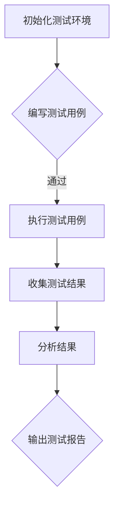
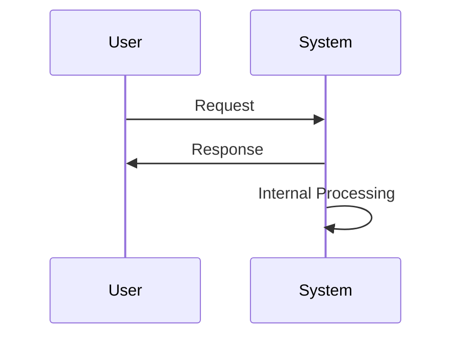
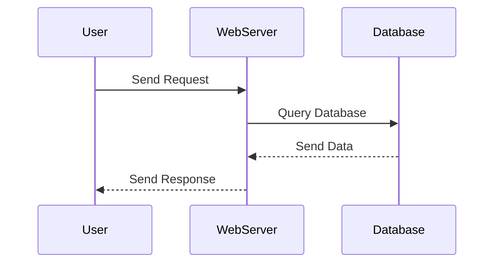

                 

# 代码可测试性：设计易于测试的软件

关键词：可测试性、软件设计、单元测试、测试覆盖率、系统架构

摘要：本文深入探讨了软件的可测试性及其在设计阶段的重要性。通过定义可测试性，分析其核心概念，解释测试覆盖率的数学模型，并运用实例展示如何实现易于测试的软件，本文为开发者提供了设计高可测试性软件的实用指南。

### 第1章：问题背景与核心概念

#### 1.1 问题背景

软件的可测试性在软件开发过程中扮演着至关重要的角色。它不仅影响到软件的质量，还直接关系到项目的开发进度和维护成本。随着软件复杂性的不断增加，确保代码的可测试性变得愈发重要。然而，如何设计出易于测试的软件，成为软件开发者和测试人员共同面临的挑战。

#### 1.2 核心概念

**可测试性**：软件的一种特性，表示软件在测试过程中能够被有效测试的程度。一个高可测试性的软件意味着测试工作可以更高效、更全面地进行。

**设计易于测试的软件**：在设计软件时，考虑其未来的可测试性，从而使得软件在测试阶段能够更容易地发现和修复缺陷。

**边界与外延**：可测试性的边界在于测试的全面性和覆盖率，外延则包括单元测试、集成测试、系统测试和验收测试等多个层面。

**核心要素组成**：影响软件可测试性的核心要素包括代码结构、模块独立性、接口设计、文档和测试框架等。

### 第2章：核心概念与联系

#### 2.1 可测试性原理

**概念原理**：可测试性是软件质量的一个关键指标，它涉及软件的模块化、抽象化、封装性和可维护性。

**概念属性特征对比表格**

| 特征       | 可测试性   | 质量           |
|------------|-------------|----------------|
| 模块独立性 | 高          | 高             |
| 抽象化     | 完备        | 完备           |
| 封装性     | 强          | 强             |
| 可维护性   | 高          | 高             |

**ER实体关系图架构**

```mermaid
erDiagram
  Software  ||--|{ Testability }|| Testing
  Module    ||--|{ Testability }|| Test
  Code      ||--|{ Testability }|| Test
```

### 第3章：算法原理讲解

#### 3.1 单元测试算法

**Mermaid流程图**



**Python源代码**

```python
import unittest

class TestSum(unittest.TestCase):
    def test_sum(self):
        self.assertEqual(sum([1, 2, 3]), 6, "Should be 6")

if __name__ == '__main__':
    unittest.main()
```

**算法原理**

- **数学模型和公式**：无特定的数学模型，但涉及测试用例的设计、执行和结果分析。
- **详细讲解**：单元测试是软件测试的基础，通过编写具体的测试用例来验证代码的功能是否按照预期工作。
- **举例说明**：例如，上述Python代码定义了一个简单的测试类，通过几个测试用例来检查`sum`函数的正确性。

### 第4章：数学模型和数学公式

#### 4.1 测试覆盖率公式

**LaTeX公式**

$$
\text{Test Coverage} = \frac{\text{Test Cases Executed}}{\text{Total Test Cases}} \times 100\%
$$

**详细讲解**

- **数学公式**：测试覆盖率是衡量测试工作完成程度的一个重要指标，计算公式为已执行的测试用例数除以总测试用例数，并乘以100%得到百分比。
- **举例说明**：如果一个软件有100个功能点，测试人员已经编写并执行了80个测试用例，那么测试覆盖率就是80%。

### 第5章：系统分析与架构设计方案

#### 5.1 问题场景介绍

- **项目介绍**：介绍软件开发的项目背景和目的。
- **系统功能设计**：利用Mermaid类图展示领域模型。

```mermaid
classDiagram
Class01 <|-- Class02
Class03 : <<Interface>> InterfaceName
Class04 <<Entity>> EntityName
Class05 : <<Service>> ServiceName
Class01 --|{uses} Class03 : dependency
Class04 --|{uses} Class05 : implementation
```

- **系统架构设计**：利用Mermaid架构图展示系统架构。



#### 5.2 系统接口设计和系统交互

**Mermaid序列图**



### 第6章：项目实战

#### 6.1 环境安装

- **开发环境**：安装Python、JDK、Git等开发工具。
- **测试环境**：配置测试服务器、数据库等。

#### 6.2 系统核心实现源代码

- **代码片段**：展示关键代码实现。

```python
class UserService:
    def register_user(self, username, password):
        # 用户注册逻辑
        pass

    def authenticate_user(self, username, password):
        # 用户认证逻辑
        pass
```

#### 6.3 代码应用解读与分析

- **代码解读**：分析代码结构、设计模式等。
- **性能分析**：评估代码的性能和可维护性。

#### 6.4 实际案例分析和详细讲解剖析

- **案例分析**：介绍一个实际案例，分析其可测试性。
- **讲解剖析**：详细讲解测试方案和测试结果。

### 第7章：最佳实践 tips、小结、注意事项、拓展阅读

#### 7.1 最佳实践 tips

- **代码结构**：保持代码简洁，避免复杂嵌套。
- **测试覆盖率**：确保测试覆盖率达到80%以上。
- **文档**：编写清晰的文档，便于后续测试和维护。

#### 7.2 小结

- **核心内容**：回顾文章的核心观点和结论。
- **重要性**：强调软件可测试性在设计阶段的重要性。

#### 7.3 注意事项

- **设计原则**：遵循模块化、单一职责等设计原则。
- **测试策略**：制定合理的测试策略，确保测试全面覆盖。

#### 7.4 拓展阅读

- **相关文献**：推荐阅读相关领域的经典书籍和论文。
- **社区资源**：介绍一些有用的社区和资源，帮助读者深入学习。

### 参考文献

- 《软件工程：实践者的研究方法》
- 《软件测试的艺术》
- 《测试驱动开发：敏捷开发实践》

---

作者：AI天才研究院/AI Genius Institute & 禅与计算机程序设计艺术 /Zen And The Art of Computer Programming

