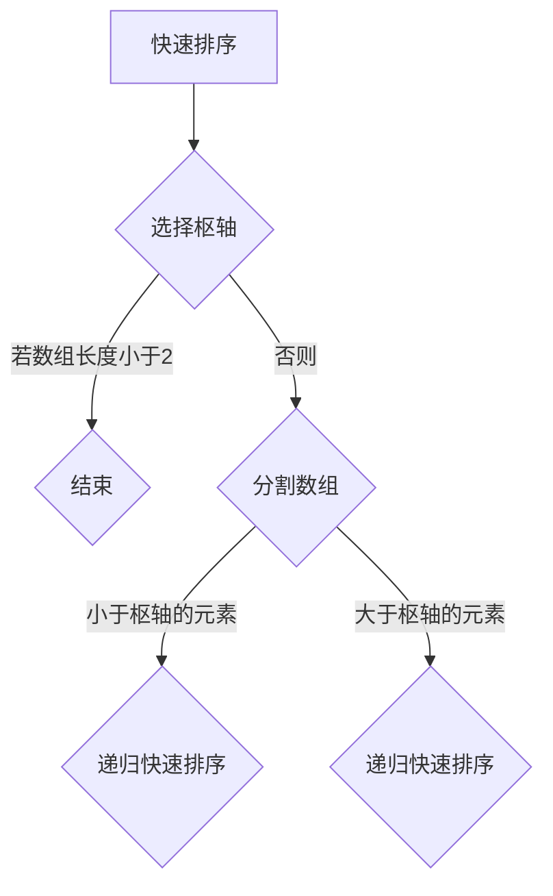

                 

# 系统分析：好系分让研发事半功倍

## 关键词

- 系统分析
- 效率提升
- 设计原则
- 实践技巧
- 案例研究

## 摘要

本文旨在探讨系统分析在软件开发中的重要性，并详细介绍如何通过有效的系统设计来提高研发效率。我们将首先介绍系统分析的核心概念，然后深入探讨设计原则、分析技术、算法优化以及实际案例研究。通过本文的学习，读者将能够掌握系统分析的精髓，从而在软件开发项目中事半功倍。

## 引言

在当今快速发展的信息技术时代，软件系统的规模和复杂性不断增长。这种增长不仅给软件开发带来了巨大的挑战，也对项目的成功交付提出了更高的要求。系统分析作为软件开发的关键环节，它在项目初期的作用尤为关键。通过系统分析，我们可以更好地理解用户需求，设计出符合实际需求的系统，并确保项目能够在规定的时间和预算内完成。

本文将围绕系统分析展开讨论，首先介绍系统分析的基本概念和核心原则，然后深入探讨实际操作中的分析方法和技术。我们还将通过案例研究，展示系统分析在现实项目中的应用，最后总结最佳实践，为读者提供实用的指导。

## 核心概念

### 系统要求

系统要求是系统分析的基础，它明确了系统需要完成哪些功能，以及这些功能应该如何实现。系统要求通常包括功能需求、性能需求、安全性需求等。在进行系统要求分析时，我们需要充分了解用户的需求，并将这些需求转化为具体的技术要求。

### 系统架构

系统架构是系统的骨架，它决定了系统的结构、组件以及它们之间的交互方式。一个好的系统架构应该具备高内聚、低耦合的特点，以确保系统易于维护和扩展。常见的系统架构包括分层架构、微服务架构等。

### 系统组件

系统组件是构成系统的基本单元，它们可以是硬件设备、软件模块、数据库等。在系统分析中，我们需要明确各个组件的功能、接口以及它们之间的关系。

### 系统类型

系统可以分为多种类型，如客户服务器系统、分布式系统、实时系统等。每种系统都有其特定的需求和设计原则。例如，实时系统需要保证响应时间，而分布式系统需要考虑数据的同步和一致性。

## 设计原则

### 模块化

模块化是将系统划分为若干独立的功能模块，每个模块具有明确的输入、输出和功能。模块化的好处包括降低复杂性、提高可维护性以及便于团队协作。

### 扩展性

扩展性是指系统能够轻松适应未来需求变化的能力。一个具有良好扩展性的系统可以通过增加新模块或修改现有模块来实现功能扩展。

### 可维护性

可维护性是指系统在出现问题时能够快速定位和修复的能力。一个易于维护的系统通常具有清晰的代码结构、完善的文档和良好的测试覆盖。

### 可靠性

可靠性是指系统能够稳定运行并满足用户需求的能力。高可靠性的系统通常具有冗余设计、容错机制和高效的错误处理流程。

### 安全性

安全性是指系统能够保护用户数据和隐私的能力。一个安全的系统应该具备身份验证、数据加密和访问控制等安全机制。

## 实践技巧

### 需求收集

需求收集是系统分析的重要步骤，它涉及到与用户的沟通和交流。为了确保需求收集的全面性和准确性，我们可以采用以下技巧：

- **用户访谈**：通过与用户面对面交流，了解他们的需求和期望。
- **问卷调查**：发放问卷收集用户反馈，特别是对于大量用户的情况。
- **观察用户操作**：观察用户在实际操作中的行为，发现潜在的需求。

### 可行性研究

在系统设计之前，进行可行性研究是非常必要的。可行性研究可以帮助我们评估项目的可行性，包括技术可行性、经济可行性和操作可行性。以下是可行性研究的几个关键点：

- **技术评估**：评估现有技术是否能够支持项目需求。
- **成本评估**：评估项目的总成本，包括开发、运维和维护成本。
- **时间评估**：评估项目所需的时间，确保项目能够按时交付。

### 原型设计

原型设计是一种快速验证系统概念的方法。通过构建原型，我们可以更好地理解用户需求，并发现潜在的问题。以下是原型设计的一些步骤：

- **需求分析**：明确原型所需实现的功能和用户界面。
- **原型构建**：使用工具（如Axure、Sketch等）快速构建原型。
- **用户测试**：邀请用户进行测试，收集反馈，并迭代优化原型。

### ER模型

ER（实体关系）模型是系统设计中常用的数据建模工具。它可以帮助我们描述系统中的实体、属性和关系。以下是ER模型的几个关键点：

- **实体**：系统中的基本数据单元，如用户、订单等。
- **属性**：实体的特征，如用户的姓名、地址等。
- **关系**：实体之间的联系，如用户与订单之间的关系。

以下是ER模型的Mermaid表示：

```mermaid
erDiagram
  User ||--|{ Order }|
  User ||--|{ Product }|
```

## 算法分析

### 算法原理

算法分析是系统设计中的核心环节，它涉及到算法的时间复杂度和空间复杂度。以下是几种常见的算法：

- **排序算法**：如快速排序、归并排序等。
- **查找算法**：如二分查找、哈希查找等。
- **图算法**：如最短路径算法、最小生成树算法等。

以下是快速排序的Mermaid流程图：



### Python代码实现

以下是快速排序的Python代码实现：

```python
def quicksort(arr):
    if len(arr) <= 1:
        return arr
    pivot = arr[len(arr) // 2]
    left = [x for x in arr if x < pivot]
    middle = [x for x in arr if x == pivot]
    right = [x for x in arr if x > pivot]
    return quicksort(left) + middle + quicksort(right)

arr = [3, 6, 8, 10, 1, 2, 1]
print(quicksort(arr))
```

### 数学模型和公式

算法的时间复杂度通常用大O符号表示。例如，快速排序的时间复杂度为O(n log n)。以下是数学模型的表示：

```latex
T(n) = O(n \log n)
```

## 案例研究

### 案例一：电商平台

**项目介绍**：一个大型电商平台，需要处理海量商品和用户订单。

**系统功能设计**：系统功能包括商品展示、用户注册、购物车管理、订单处理、支付等。

**系统架构设计**：采用微服务架构，将系统划分为商品服务、用户服务、订单服务、支付服务等。

**系统接口设计**：各个微服务之间通过RESTful API进行通信。

**系统交互**：用户在商品详情页点击购买，触发订单创建接口，订单服务处理订单，并调用支付服务进行支付。

### 案例二：社交网络

**项目介绍**：一个社交媒体平台，需要支持用户注册、发帖、评论、私信等功能。

**系统功能设计**：系统功能包括用户注册、发帖、评论、私信、好友关系等。

**系统架构设计**：采用分布式架构，使用Redis进行缓存，MongoDB进行数据存储。

**系统接口设计**：采用WebSocket实现实时消息推送。

**系统交互**：用户登录后，可以发帖、评论、私信。系统通过WebSocket推送消息，实现实时更新。

## 最佳实践

### 需求分析

- **明确需求**：确保需求明确、具体、可量化。
- **需求文档**：编写清晰的需求文档，包括功能需求、性能需求等。

### 设计原则

- **模块化**：将系统划分为独立的模块，提高可维护性。
- **扩展性**：设计可扩展的架构，以便未来需求变化。

### 算法选择

- **时间复杂度**：优先选择时间复杂度较低的算法。
- **适用场景**：根据具体场景选择合适的算法。

### 测试

- **单元测试**：对每个模块进行单元测试。
- **集成测试**：对系统进行集成测试，确保各个模块之间能够正常工作。

### 持续交付

- **自动化部署**：使用自动化工具进行部署，提高效率。
- **持续集成**：将代码集成到主干分支，确保代码质量。

## 小结

本文详细介绍了系统分析的核心概念、设计原则、实践技巧以及案例研究。通过本文的学习，读者将能够掌握系统分析的方法论，并能够在实际项目中应用这些知识。系统分析是软件开发的关键环节，它决定了项目的成功与否。希望本文能为读者提供有价值的参考。

## 注意事项

- **需求分析要全面**：确保所有需求都被充分考虑。
- **设计要可扩展**：设计时考虑未来需求的变化。
- **测试要充分**：确保系统的稳定性和可靠性。

## 拓展阅读

- 《设计模式：可复用的面向对象软件构架》
- 《算法导论》
- 《软件工程：实践者的研究方法》

## 作者信息

- 作者：AI天才研究院/AI Genius Institute & 禅与计算机程序设计艺术 /Zen And The Art of Computer Programming

