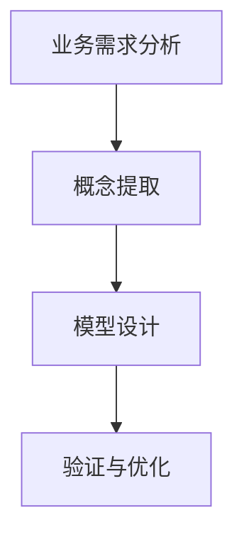
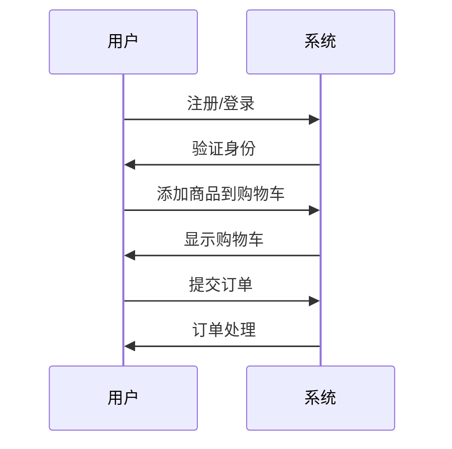

                 


# 练成领域建模这一神功

> 关键词：领域建模、领域模型、软件架构、系统设计、设计模式

> 摘要：本文将深入探讨领域建模这一核心技能，介绍其背景、核心概念、算法原理、系统分析与架构设计，并通过实际项目实战，讲解如何有效运用领域建模来提升软件开发效率和质量。

## 引言

领域建模是软件工程中不可或缺的一部分，它能够帮助我们更好地理解复杂的业务场景，并以此为基础构建出高效、可维护的软件系统。然而，许多开发者对此感到困惑，不知如何着手。本文将系统地介绍领域建模的相关知识，帮助您掌握这一神功。

## 一、背景与核心概念

### 1.1 什么是领域建模？

领域建模是指对特定领域内的实体、关系和规则进行抽象和表示，以便更好地理解和解决领域问题。它涉及到多个层面的工作，包括业务理解、需求分析、系统设计等。

### 1.2 领域模型的核心概念

- **实体（Entity）**：领域模型中的基本构成单位，表示业务中的具体对象，如用户、订单等。
- **属性（Attribute）**：实体的特征描述，如用户的姓名、年龄等。
- **关系（Relationship）**：实体之间的交互和作用，如用户下单、订单包含商品等。
- **规则（Rule）**：领域内的业务规则，用于指导系统的运作，如库存量不能低于警戒线等。

### 1.3 概念结构与核心要素组成

领域模型由多个核心要素组成，包括实体、属性、关系和规则。它们相互关联，形成一个完整的业务模型。以下是一个简单的ER实体关系图架构：

```mermaid
ERDiagram
  User ||--|{ Order }||>
      &&--|{ Product }||>
  Product ||--|{ OrderDetail }||>
  OrderDetail ||--|{ Product }||>
```

## 二、算法原理讲解

### 2.1 领域模型的构建方法

领域模型的构建通常遵循以下步骤：

1. **业务需求分析**：理解业务需求，收集业务场景信息。
2. **概念提取**：从业务需求中提取实体、属性、关系和规则。
3. **模型设计**：使用合适的工具和技术设计领域模型。
4. **验证与优化**：验证模型的有效性，并进行优化。

### 2.2 领域模型的算法原理

领域建模的算法原理主要包括：

- **实体识别**：通过业务需求分析识别出实体。
- **关系构建**：通过分析实体间的交互和作用构建关系。
- **属性定义**：为实体定义属性，描述其实体特征。
- **规则应用**：根据业务规则对模型进行调整和优化。

### 2.3 算法流程图

以下是一个简单的领域模型构建算法流程图：



### 2.4 Python源代码示例

下面是一个简单的Python源代码示例，用于创建一个领域模型：

```python
class User:
    def __init__(self, name, age):
        self.name = name
        self.age = age

class Product:
    def __init__(self, name, price):
        self.name = name
        self.price = price

class Order:
    def __init__(self, user, products):
        self.user = user
        self.products = products

class OrderDetail:
    def __init__(self, order, product, quantity):
        self.order = order
        self.product = product
        self.quantity = quantity
```

### 2.5 算法原理详细讲解

领域建模的算法原理主要涉及以下几个方面：

1. **实体识别**：通过业务需求分析，识别出业务中的主要实体。例如，在电子商务系统中，用户、订单和商品是主要的实体。

2. **关系构建**：根据业务需求，构建实体之间的关系。例如，用户可以创建订单，订单可以包含多个商品。

3. **属性定义**：为每个实体定义属性，描述其实体特征。例如，用户有姓名和年龄属性，商品有名称和价格属性。

4. **规则应用**：根据业务规则，对模型进行调整和优化。例如，可以设置库存量不能低于警戒线的规则。

### 2.6 举例说明

假设我们要设计一个简单的电商系统，包含用户、商品、订单等实体。以下是具体的领域模型设计：

```mermaid
classDiagram
    User[姓名, 年龄]
    Product[名称, 价格]
    Order[订单号, 用户:User, 商品:Product]
    OrderDetail[订单号:Order, 商品号:Product, 数量]
    User --> Order
    Order --> OrderDetail
    Product --> OrderDetail
```

在这个领域模型中，用户可以创建订单，订单可以包含多个商品，每个商品都有自己的数量。这个模型描述了电商系统的基本业务流程。

## 三、系统分析与架构设计

### 3.1 问题场景介绍

假设我们需要设计一个在线书店系统，用户可以浏览书籍、添加购物车、下订单等。

### 3.2 项目介绍

在线书店系统是一个典型的电子商务项目，涉及用户管理、商品管理、订单处理等模块。

### 3.3 系统功能设计

系统功能设计主要包括以下几个方面：

- 用户管理：用户注册、登录、个人信息修改等。
- 商品管理：商品分类、商品信息管理、商品搜索等。
- 订单处理：订单创建、订单状态更新、订单支付等。

### 3.4 系统架构设计

系统架构设计主要包括以下几个方面：

- **技术栈**：前端使用Vue.js，后端使用Spring Boot，数据库使用MySQL。
- **架构模式**：采用分层架构，包括表示层、业务逻辑层、数据访问层等。
- **部署方式**：采用Docker容器化部署，提高系统的可移植性和可扩展性。

### 3.5 系统接口设计和系统交互

系统接口设计和系统交互主要涉及以下几个方面：

- 用户接口：用户注册、登录、浏览书籍、添加购物车、下订单等。
- 后台接口：用户管理、商品管理、订单管理等。

以下是系统架构图：



## 四、项目实战

### 4.1 环境安装

在开始项目实战之前，需要安装以下环境：

- Python 3.8+
- MySQL 5.7+
- Docker 19.03+

### 4.2 系统核心实现源代码

以下是系统核心实现的Python源代码：

```python
# 用户管理模块
class UserManager:
    def register(self, user):
        # 注册逻辑
        pass
    
    def login(self, user):
        # 登录逻辑
        pass
    
    def update_profile(self, user):
        # 更新用户信息
        pass

# 商品管理模块
class ProductManager:
    def add_product(self, product):
        # 添加商品
        pass
    
    def search_products(self, keyword):
        # 搜索商品
        pass
    
    def update_product(self, product):
        # 更新商品信息
        pass

# 订单管理模块
class OrderManager:
    def create_order(self, order):
        # 创建订单
        pass
    
    def update_order_status(self, order):
        # 更新订单状态
        pass

# 主程序
if __name__ == "__main__":
    user_manager = UserManager()
    product_manager = ProductManager()
    order_manager = OrderManager()
    
    # 测试代码
    user_manager.register(User("张三", 25))
    user_manager.login(User("张三", 25))
    user_manager.update_profile(User("张三", 26))
    
    product_manager.add_product(Product("Python编程从入门到实践", 69))
    product_manager.search_products("Python")
    product_manager.update_product(Product("Python编程从入门到实践", 79))
    
    order_manager.create_order(Order(User("张三", 26), [Product("Python编程从入门到实践", 79)]))
    order_manager.update_order_status(Order(User("张三", 26), [Product("Python编程从入门到实践", 79)]))
```

### 4.3 代码应用解读与分析

以下是代码应用解读与分析：

- **用户管理模块**：负责用户的注册、登录和用户信息更新。
- **商品管理模块**：负责商品的增加、搜索和商品信息更新。
- **订单管理模块**：负责订单的创建和订单状态的更新。

### 4.4 实际案例分析和详细讲解剖析

我们以一个实际案例——用户注册功能为例，进行分析和讲解：

- **功能描述**：用户可以通过注册接口进行用户注册。
- **实现流程**：
  - 用户提交注册请求，包含用户名、密码等。
  - 系统对用户信息进行验证，如用户名是否存在、密码长度等。
  - 如果验证通过，将用户信息存储到数据库中。
  - 返回注册成功或失败的结果。

### 4.5 项目小结

通过本次项目实战，我们了解了领域建模在软件开发中的应用，以及如何通过实际代码实现一个简单的在线书店系统。领域建模不仅能够帮助我们更好地理解业务需求，还能提高软件开发效率和质量。

## 五、最佳实践 Tips

1. **理解业务需求**：在进行领域建模之前，务必深入了解业务需求，确保模型能够准确反映业务逻辑。
2. **不断迭代优化**：领域模型不是一成不变的，应根据业务发展进行不断的迭代和优化。
3. **保持模型简洁**：尽量保持领域模型的简洁性，避免过于复杂的结构。

## 六、小结

领域建模是软件开发中不可或缺的一部分，它能够帮助我们更好地理解业务需求，构建出高效、可维护的软件系统。通过本文的讲解，希望您能够掌握领域建模的核心技能，并在实际项目中灵活运用。

## 七、注意事项

1. **数据一致性问题**：在进行领域建模时，需要注意数据一致性问题，特别是在分布式系统中。
2. **性能优化**：领域模型的设计和实现需要考虑性能优化，以确保系统能够高效运行。

## 八、拓展阅读

- 《领域驱动设计》
- 《软件架构：实践者的研究方法》
- 《领域驱动设计指南》

## 作者信息

作者：AI天才研究院/AI Genius Institute & 禅与计算机程序设计艺术 /Zen And The Art of Computer Programming

