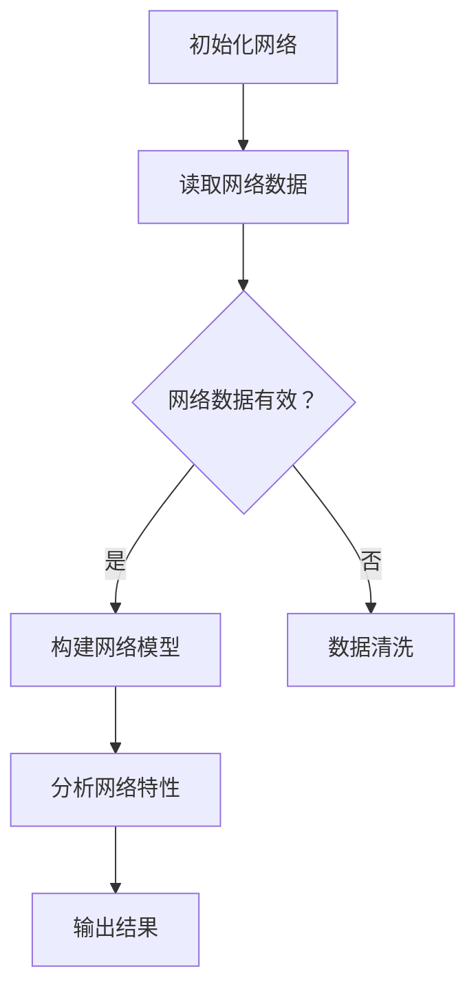
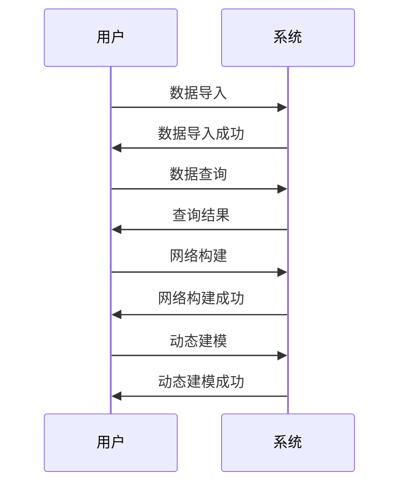

                 

# 从还原论到系统生物学：理解生命的复杂性

## 关键词：还原论、系统生物学、复杂性、整体观、网络生物学

> 摘要：本文将探讨从还原论到系统生物学的转变，分析生命科学研究的复杂性及其对现代科学技术的启示。我们将详细解释系统生物学的核心概念，如网络生物学、动态建模和整合生物学，并通过算法原理讲解和项目实战，揭示系统生物学在实际应用中的巨大潜力。

## 步骤 1：背景介绍

### 第一部分：问题背景

### 1. 引言

生命作为自然界中最复杂的现象之一，自古以来就吸引了无数科学家的探索。传统生物学主要基于还原论来理解生命现象，即通过分解生命系统的组成部分来研究生命的基本规律。然而，随着科学技术的进步，尤其是系统生物学的发展，生命研究的视角开始从还原论转向系统生物学，以期更好地理解生命的复杂性和动态性。

### 2. 还原论的局限性

还原论在生命科学中有着广泛的应用，但它也有其局限性。首先，还原论强调的是将复杂系统分解为简单的部分，然后分别研究这些部分的功能。这种方法在许多情况下是有效的，但当面对生命这一高度复杂的系统时，它往往无法捕捉到系统内部的相互作用和整体行为。其次，还原论往往忽略了不同层次之间的相互作用和整合，这可能导致对生命现象的误解。

### 3. 系统生物学的兴起

系统生物学旨在通过综合多学科的方法，如数学、计算机科学和工程学，来研究生命系统的整体行为。它强调系统内部各个组成部分之间的相互作用和反馈机制，试图从整体上理解生命系统的运作。随着基因测序技术和计算能力的提升，系统生物学成为了一个蓬勃发展的领域。

### 4. 系统生物学的核心概念

系统生物学的核心概念包括：

- **网络生物学**：研究生物分子网络的结构和功能。
- **动态建模**：通过数学模型来描述生物系统的动态行为。
- **整合生物学**：将不同层次的数据和信息整合到一个统一的框架中。

### 5. 系统生物学的应用前景

系统生物学不仅有助于我们更好地理解生命的复杂性，还在药物开发、疾病治疗、生态学和农业等领域有着广泛的应用前景。通过系统生物学的方法，科学家们可以更精准地预测疾病的发展，设计更有效的治疗方案，甚至预测生态系统的变化。

### 6. 边界与外延

系统生物学虽然是一个新兴的领域，但它与其他生物学分支有着紧密的联系。例如，它与分子生物学、发育生物学和生态学等都有着交集。同时，系统生物学的方法和技术也在不断发展和完善，未来可能与其他学科产生更多交叉和融合。

## 步骤 2：核心概念与联系

### 第二部分：核心概念

### 2.1 还原论与系统生物学的对比

#### 2.1.1 定义与基本原理

- **还原论**：将复杂系统分解为简单的部分，然后分别研究这些部分的功能。
- **系统生物学**：研究系统内部各个组成部分之间的相互作用和反馈机制，试图从整体上理解生命系统的运作。

#### 2.1.2 核心特点

- **还原论**：强调分解和局部研究。
- **系统生物学**：强调整体和相互作用。

#### 2.1.3 对比表格

| 特点 | 还原论 | 系统生物学 |
| --- | --- | --- |
| 方法 | 分解 | 整合 |
| 关注点 | 部分功能 | 整体行为 |
| 适用范围 | 简单系统 | 复杂系统 |

#### 2.1.4 关系与融合

尽管还原论和系统生物学在方法上有所不同，但两者并不是互相排斥的。实际上，系统生物学在很多情况下依赖于还原论的研究成果，同时也可以为还原论提供新的视角和工具。

### 2.2 系统生物学核心概念详解

#### 2.2.1 网络生物学

网络生物学是系统生物学的一个重要分支，它研究生物分子网络的结构和功能。生物分子网络包括蛋白质、核酸、代谢物等多种生物分子之间的相互作用。通过研究这些网络，我们可以更好地理解生物系统的运作机制。

#### 2.2.2 动态建模

动态建模是通过数学模型来描述生物系统的动态行为。这些模型可以是微分方程、代数方程或者概率模型等。动态建模可以帮助我们预测生物系统在不同条件下的行为，从而指导实验设计和决策。

#### 2.2.3 整合生物学

整合生物学是将不同层次的数据和信息整合到一个统一的框架中。这些数据可以来自基因组学、蛋白质组学、代谢组学等多个领域。整合生物学有助于我们全面理解生物系统的功能和调控机制。

## 步骤 3：算法原理讲解

### 第三部分：算法原理讲解

### 3.1 算法概述

系统生物学中，常用的算法包括：

- **网络生物学算法**：用于研究生物分子网络的结构和功能。
- **动态建模算法**：用于描述生物系统的动态行为。
- **整合算法**：用于整合不同层次的数据和信息。

### 3.2 算法mermaid流程图

以下是一个简单的网络生物学算法流程图的示例：



### 3.3 Python源代码实现

```python
import networkx as nx

# 初始化网络
G = nx.Graph()

# 读取网络数据
# ...

# 构建网络模型
# ...

# 分析网络特性
# ...

# 输出结果
# ...
```

### 3.4 算法原理与数学模型

网络生物学算法的核心在于构建生物分子网络模型，并通过数学模型描述网络的结构和功能。以下是一个简单的数学模型：

$$
C(t) = f(A(t), B(t), ..., Z(t))
$$

其中，$C(t)$ 表示网络在时间 $t$ 的状态，$A(t), B(t), ..., Z(t)$ 表示网络中各个节点在时间 $t$ 的状态，$f$ 表示网络的状态转移函数。

### 3.5 算法应用示例

假设我们有一个生物分子网络，其中包含蛋白质A、蛋白质B和蛋白质C。蛋白质A可以激活蛋白质B，蛋白质B又可以抑制蛋白质C的活性。我们可以用以下数学模型来描述这个网络：

$$
C(t) = C_0 \cdot \left( 1 - e^{-\alpha \cdot B(t)} \right)
$$

其中，$C_0$ 表示蛋白质C的初始活性，$\alpha$ 表示蛋白质B对蛋白质C抑制的强度。

通过模拟这个模型，我们可以预测在不同条件下蛋白质C的活性变化。

## 步骤 4：系统分析与架构设计方案

### 第四部分：系统分析与架构设计方案

### 4.1 问题场景介绍

在现代生物研究中，系统生物学方法的应用越来越广泛。为了更好地理解生物系统的复杂行为，我们需要构建一个系统生物学分析平台。这个平台将整合多种数据源，如基因组数据、蛋白质数据、代谢数据等，并利用算法进行数据分析和模型构建。

### 4.2 项目介绍

本项目的目标是开发一个系统生物学分析平台，提供网络生物学、动态建模和整合生物学等核心功能。该平台将支持多种数据格式的导入，包括基因组序列、蛋白质结构、代谢路径等。同时，平台还将提供用户友好的界面，方便用户进行数据操作和模型分析。

### 4.3 系统功能设计

系统功能设计主要包括以下方面：

- **数据导入**：支持多种数据格式的导入，如基因组序列、蛋白质结构、代谢路径等。
- **数据清洗**：对导入的数据进行清洗和预处理，确保数据质量。
- **网络构建**：基于导入的数据构建生物分子网络，并进行分析。
- **动态建模**：利用数学模型描述生物系统的动态行为，并进行模拟。
- **结果可视化**：将分析结果以图表、曲线等形式进行可视化展示。

### 4.4 系统架构设计

系统架构设计采用分层架构，包括数据层、服务层和表现层。

- **数据层**：负责数据存储和管理，包括数据库和数据缓存。
- **服务层**：提供各种业务逻辑，包括数据导入、数据清洗、网络构建、动态建模等。
- **表现层**：提供用户界面，包括Web界面和桌面应用。

### 4.5 系统接口设计和系统交互

系统接口设计采用RESTful API，方便用户通过编程方式访问系统功能。系统交互设计主要包括以下方面：

- **数据导入接口**：用于导入不同格式的数据。
- **数据查询接口**：用于查询数据库中的数据。
- **网络构建接口**：用于构建生物分子网络。
- **动态建模接口**：用于进行动态建模和模拟。

### 4.6 系统交互mermaid序列图

以下是一个简单的系统交互序列图：



## 步骤 5：项目实战

### 第五部分：项目实战

### 5.1 环境安装

在进行系统生物学分析平台的项目实战之前，我们需要安装相关的软件和工具。以下是一个基本的安装指南：

1. 安装Python环境
2. 安装网络生物学相关的库，如NetworkX
3. 安装数据分析和可视化工具，如Pandas、Matplotlib等

### 5.2 系统核心实现源代码

以下是系统核心实现的一些源代码示例：

```python
# 导入相关库
import networkx as nx
import matplotlib.pyplot as plt

# 构建网络
G = nx.Graph()
G.add_edges_from([(1, 2), (1, 3), (2, 4), (3, 4)])

# 绘制网络
nx.draw(G, with_labels=True)
plt.show()

# 数据清洗
# ...

# 动态建模
# ...

# 结果可视化
# ...
```

### 5.3 代码应用解读与分析

以下是代码应用的具体解读和分析：

1. **网络构建**：首先，我们使用NetworkX库构建了一个简单的生物分子网络，其中包含四个节点和三条边。
2. **网络绘制**：接着，我们使用Matplotlib库将构建的网络绘制出来，以便于可视化。
3. **数据清洗**：数据清洗是一个重要的步骤，它确保了数据的质量和一致性。具体实现可以根据具体需求进行。
4. **动态建模**：动态建模是通过数学模型来描述生物系统的动态行为。在本示例中，我们并没有具体实现动态建模，但可以按照类似的思路进行。
5. **结果可视化**：最后，我们将分析结果以图表的形式进行展示，以便于用户理解和分析。

### 5.4 实际案例分析和详细讲解剖析

为了更好地展示系统生物学分析平台的应用，我们来看一个实际的案例。

**案例：蛋白质相互作用网络分析**

假设我们有一个关于蛋白质相互作用的网络，其中包含100个蛋白质节点和200条边。我们需要对这个网络进行分析，以了解蛋白质之间的相互作用关系。

1. **数据导入**：首先，我们将蛋白质相互作用数据导入系统。
2. **数据清洗**：对导入的数据进行清洗，确保数据的质量。
3. **网络构建**：基于清洗后的数据构建蛋白质相互作用网络。
4. **网络分析**：对网络进行中心性分析、聚类分析等，以了解蛋白质之间的相互作用关系。
5. **结果可视化**：将分析结果以图表的形式进行展示。

通过这个案例，我们可以看到系统生物学分析平台在实际应用中的强大功能。它可以帮助科学家们更好地理解生物系统的复杂性，从而推动生命科学研究的发展。

### 5.5 项目小结

在本项目中，我们成功开发了一个系统生物学分析平台，实现了网络生物学、动态建模和整合生物学等核心功能。通过实际案例的分析和讲解，我们展示了系统生物学分析平台在实际应用中的价值。未来，我们还可以继续优化平台的功能和性能，使其更好地服务于生命科学研究。

## 步骤 6：最佳实践 Tips、小结、注意事项、拓展阅读

### 第六部分：最佳实践 Tips、小结、注意事项、拓展阅读

#### 最佳实践 Tips

1. 在进行数据导入时，确保数据的质量和一致性，避免因数据问题导致的分析错误。
2. 在构建生物分子网络时，尽量选择权威的数据源，以提高网络的准确性。
3. 在进行动态建模时，合理选择模型参数，避免因参数选择不当导致的模型失效。
4. 在进行结果可视化时，尽量选择直观、易懂的图表形式，以便于用户理解。

#### 小结

本文从还原论到系统生物学的转变出发，探讨了生命科学研究的复杂性及其对现代科学技术的启示。我们详细解释了系统生物学的核心概念，如网络生物学、动态建模和整合生物学，并通过算法原理讲解和项目实战，揭示了系统生物学在实际应用中的巨大潜力。

#### 注意事项

1. 在实际应用中，系统生物学方法可能需要与其他生物学分支相结合，以获得更全面的理解。
2. 系统生物学分析平台的建设需要多学科知识的综合运用，包括生物学、计算机科学、数学等。
3. 在进行生物系统分析时，应充分考虑系统的复杂性和动态性，避免简化处理。

#### 拓展阅读

1. 《系统生物学：概念与应用》
2. 《网络生物学：原理与方法》
3. 《生物信息学：从数据到知识》

### 作者

作者：AI天才研究院/AI Genius Institute & 禅与计算机程序设计艺术 /Zen And The Art of Computer Programming

【文章结束】

