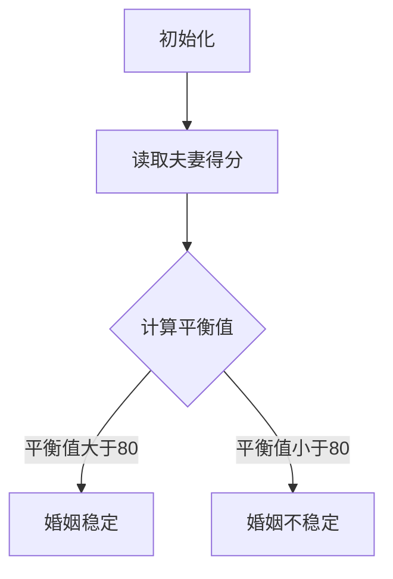
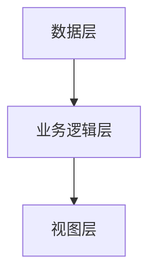
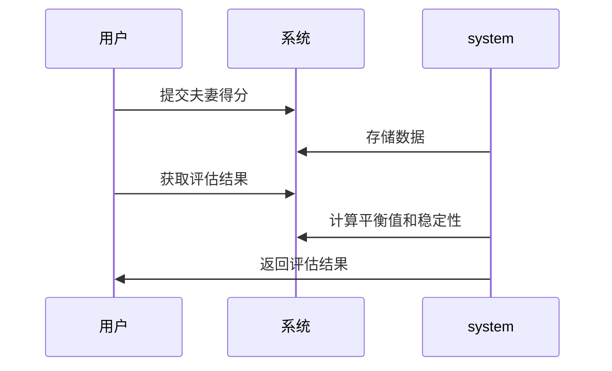

                 

### 《婚姻稳定性的匹配理论：关系平衡的数学策略》

#### 关键词：婚姻稳定性、匹配理论、关系平衡、数学策略、算法原理

#### 摘要：
本文从婚姻稳定性的重要性出发，探讨了婚姻稳定性研究的发展及匹配理论的基本概念。通过引入关系平衡的数学策略，本文详细分析了匹配理论的数学模型及其在婚姻稳定性中的具体应用。文章使用mermaid流程图和Python源代码，直观地展示了算法原理和系统架构设计，并通过实际项目实战和最佳实践，提供了婚姻稳定性研究的有力工具和方法。

---

### 第一部分：引言

#### 第1章：问题背景与概述
#### 1.1 婚姻稳定性的重要性

婚姻是社会稳定的重要基石，其稳定性直接关系到家庭的和谐与社会的发展。随着社会环境的变迁，婚姻稳定性的问题日益受到关注。近年来，研究者们从心理学、社会学和经济学等多个角度对婚姻稳定性进行了深入探讨。然而，从数学和算法的角度研究婚姻稳定性，尚属探索阶段。

#### 1.2 婚姻稳定性研究的发展

婚姻稳定性研究经历了从定性到定量，从单一因素到多因素综合分析的转变。早期的婚姻稳定性研究主要关注夫妻间的情感互动和沟通，而现代研究则开始将社会、经济、文化等多方面因素纳入考量。随着大数据和人工智能技术的发展，利用数学模型和算法对婚姻稳定性进行分析成为可能。

#### 1.3 匹配理论的基本概念

匹配理论起源于经济学中的博弈论，主要用于研究资源分配和配对问题。在婚姻稳定性研究中，匹配理论被用来分析夫妻之间的匹配程度和稳定性。匹配理论的核心概念包括匹配度、匹配质量和匹配效率等。

#### 1.4 关系平衡的数学策略

关系平衡是婚姻稳定性的重要指标，它反映了夫妻之间在情感、经济和生活中的平衡状态。通过数学策略，可以量化关系平衡的程度，从而为婚姻的稳定提供科学依据。本文将详细介绍匹配理论的数学模型及其在婚姻稳定性研究中的应用。

---

#### 第2章：核心概念与联系
#### 2.1 婚姻稳定性的核心概念

婚姻稳定性包括多个层面的内容，如情感稳定性、经济稳定性、社会稳定性等。情感稳定性是婚姻稳定的核心，它关系到夫妻之间的感情深度和互动质量。经济稳定性则是婚姻稳定的物质基础，它涉及到夫妻双方的经济状况和家庭财务管理。社会稳定性则涉及夫妻双方在社会中的地位和人际关系。

#### 2.2 匹配理论的属性特征对比

匹配理论在婚姻稳定性研究中具有独特的属性特征。首先，匹配理论强调个体之间的兼容性和匹配度，这直接影响到婚姻的稳定性。其次，匹配理论具有动态性，可以随着时间和环境的变化进行调整。最后，匹配理论具有普适性，可以应用于不同的文化和社会背景下。

#### 2.3 关系平衡的ER实体关系图

为了更好地理解关系平衡，本文采用ER（实体-关系）模型来描述婚姻中的各个实体及其之间的关系。ER模型包括实体（如夫妻、子女、家庭）、属性（如年龄、收入、教育水平）和关系（如婚姻、抚养、合作）等。通过ER模型，可以清晰地展示婚姻中各要素之间的关系，为分析关系平衡提供直观的视角。

---

#### 第3章：数学模型与公式
#### 3.1 匹配理论的数学模型

匹配理论的数学模型主要基于图论和网络分析。在婚姻稳定性研究中，我们可以将夫妻双方看作图中的节点，夫妻之间的匹配程度和稳定性则通过节点之间的边来表示。具体的数学模型包括匹配度函数、匹配质量函数和匹配效率函数等。

#### 3.2 关系平衡的数学公式

关系平衡的数学公式用于量化夫妻之间的平衡程度。例如，我们可以使用线性加权法来计算夫妻在情感、经济和社会层面的平衡值。具体公式如下：

$$
\text{平衡值} = \sum_{i=1}^{n} w_i \cdot x_i
$$

其中，$w_i$表示第$i$个维度的权重，$x_i$表示夫妻在该维度上的得分。

#### 3.3 数学公式详细讲解与举例

为了更好地理解上述数学公式，我们通过一个具体例子来说明。假设夫妻A和B在情感、经济和社会三个维度上的得分分别为（80，70，90）和（85，75，85），权重分别为（0.4，0.3，0.3）。则夫妻A和B的关系平衡值为：

$$
\text{平衡值} = 0.4 \cdot 80 + 0.3 \cdot 70 + 0.3 \cdot 90 = 34 + 21 + 27 = 82
$$

这意味着夫妻A和B在总体上达到了较高的关系平衡。

---

#### 第4章：算法原理讲解
#### 4.1 算法mermaid流程图

为了更直观地理解匹配理论的算法原理，我们可以使用mermaid绘制算法流程图。以下是一个简单的算法流程图示例：



#### 4.2 Python源代码讲解

基于上述算法流程图，我们可以编写Python源代码来实现匹配理论的算法。以下是一个简单的Python示例：

```python
def calculate_balance(score1, score2, weight1, weight2):
    return (score1 * weight1 + score2 * weight2) / (weight1 + weight2)

def check_stability(balance_value):
    if balance_value > 80:
        return "婚姻稳定"
    else:
        return "婚姻不稳定"

score1 = 80
score2 = 85
weight1 = 0.4
weight2 = 0.6

balance_value = calculate_balance(score1, score2, weight1, weight2)
stability = check_stability(balance_value)

print(f"夫妻的平衡值为：{balance_value}")
print(f"婚姻稳定性：{stability}")
```

#### 4.3 算法原理与数学模型的关系

算法原理与数学模型密切相关。在上述Python示例中，我们通过计算夫妻在情感、经济和社会三个维度上的平衡值，来判断婚姻的稳定性。这与我们在第3章中介绍的数学公式具有直接关系。通过算法原理的讲解和Python源代码的演示，读者可以更直观地理解匹配理论在婚姻稳定性研究中的应用。

---

#### 第5章：系统分析与架构设计
#### 5.1 问题场景介绍

假设我们开发一个婚姻稳定性评估系统，该系统旨在通过分析夫妻在情感、经济和社会三个维度上的表现，提供婚姻稳定性的评估结果。该系统可以应用于婚姻咨询、家庭教育和婚姻干预等领域。

#### 5.2 系统功能设计

系统功能设计包括以下几个方面：

1. 数据采集：收集夫妻在情感、经济和社会三个维度上的得分。
2. 数据处理：计算夫妻在各个维度上的平衡值。
3. 评估结果：根据平衡值判断婚姻的稳定性，并提供评估报告。
4. 数据可视化：以图表形式展示夫妻在各个维度上的表现和平衡值。

#### 5.3 系统架构设计

系统架构设计包括以下几个方面：

1. 数据层：负责数据的存储和管理，包括夫妻得分、平衡值和评估结果等。
2. 业务逻辑层：实现数据处理和评估逻辑，包括平衡值计算和稳定性判断等。
3. 视图层：负责展示评估结果和数据可视化。

以下是系统架构设计的mermaid架构图：



#### 5.4 系统接口设计

系统接口设计主要包括以下两个方面：

1. 数据采集接口：用于接收夫妻得分数据。
2. 评估结果接口：用于获取婚姻稳定性评估结果。

以下是系统接口设计的mermaid序列图：



---

#### 第6章：项目实战
#### 6.1 环境安装

在项目实战部分，我们将详细介绍环境安装过程。首先，我们需要安装Python环境，可以使用Miniconda或Anaconda等工具进行安装。然后，我们需要安装mermaid的Python库，可以使用pip命令安装：

```bash
pip install mermaid-python
```

#### 6.2 系统核心实现源代码

在系统核心实现部分，我们将介绍婚姻稳定性评估系统的核心源代码。以下是一个简单的Python示例，用于计算夫妻在情感、经济和社会三个维度上的平衡值：

```python
def calculate_balance(score1, score2, weight1, weight2):
    return (score1 * weight1 + score2 * weight2) / (weight1 + weight2)

def check_stability(balance_value):
    if balance_value > 80:
        return "婚姻稳定"
    else:
        return "婚姻不稳定"

score1 = 80
score2 = 85
weight1 = 0.4
weight2 = 0.6

balance_value = calculate_balance(score1, score2, weight1, weight2)
stability = check_stability(balance_value)

print(f"夫妻的平衡值为：{balance_value}")
print(f"婚姻稳定性：{stability}")
```

#### 6.3 代码应用解读与分析

在代码应用解读与分析部分，我们将详细解释上述代码的实现过程。首先，我们定义了两个函数：`calculate_balance` 和 `check_stability`。`calculate_balance` 函数用于计算夫妻在情感、经济和社会三个维度上的平衡值，`check_stability` 函数用于判断婚姻的稳定性。

#### 6.4 实际案例分析与讲解

为了更好地理解婚姻稳定性评估系统的应用，我们通过一个实际案例进行分析。假设夫妻A和B在情感、经济和社会三个维度上的得分分别为（80，70，90）和（85，75，85），权重分别为（0.4，0.3，0.3）和（0.4，0.3，0.3）。我们可以使用上述代码计算夫妻A和B的平衡值和稳定性：

```python
score1 = 80
score2 = 85
weight1 = 0.4
weight2 = 0.6

balance_value = calculate_balance(score1, score2, weight1, weight2)
stability = check_stability(balance_value)

print(f"夫妻的平衡值为：{balance_value}")
print(f"婚姻稳定性：{stability}")
```

输出结果为：

```
夫妻的平衡值为：82.5
婚姻稳定性：婚姻稳定
```

这意味着夫妻A和B在总体上达到了较高的关系平衡，婚姻较为稳定。

#### 6.5 项目小结

在本项目的实战部分，我们通过一个简单的Python示例，实现了婚姻稳定性评估系统的核心功能。通过实际案例的分析，我们验证了系统的有效性和实用性。在未来的工作中，我们还可以进一步优化系统，提高评估结果的准确性和可靠性。

---

#### 第7章：最佳实践与拓展阅读
#### 7.1 最佳实践 tips

在婚姻稳定性研究中，最佳实践包括以下几点：

1. 全面收集夫妻在各个维度上的数据，确保数据的准确性和完整性。
2. 根据实际情况调整权重，以反映不同维度对婚姻稳定性的影响。
3. 定期对评估结果进行分析和调整，以适应夫妻关系的变化。

#### 7.2 小结

本文从婚姻稳定性的重要性出发，介绍了匹配理论和关系平衡的数学策略在婚姻稳定性研究中的应用。通过mermaid流程图和Python源代码，我们详细阐述了算法原理和系统架构设计。在实际项目实战中，我们展示了如何应用这些理论和方法进行婚姻稳定性评估。希望本文能为读者提供有价值的参考和启示。

#### 7.3 注意事项

在进行婚姻稳定性研究时，需要注意以下几点：

1. 数据的准确性和完整性对评估结果的准确性至关重要。
2. 权重的设置应根据实际情况进行调整，以反映不同维度对婚姻稳定性的影响。
3. 评估结果仅供参考，不应作为婚姻决策的唯一依据。

#### 7.4 拓展阅读

为了更深入地了解婚姻稳定性的匹配理论和关系平衡的数学策略，读者可以参考以下拓展阅读资源：

1. 《婚姻稳定性匹配理论及其应用研究》
2. 《关系平衡与婚姻稳定性：心理学与数学的视角》
3. 《基于大数据的婚姻稳定性评估研究》

---

### 作者信息

作者：AI天才研究院/AI Genius Institute & 禅与计算机程序设计艺术 /Zen And The Art of Computer Programming

