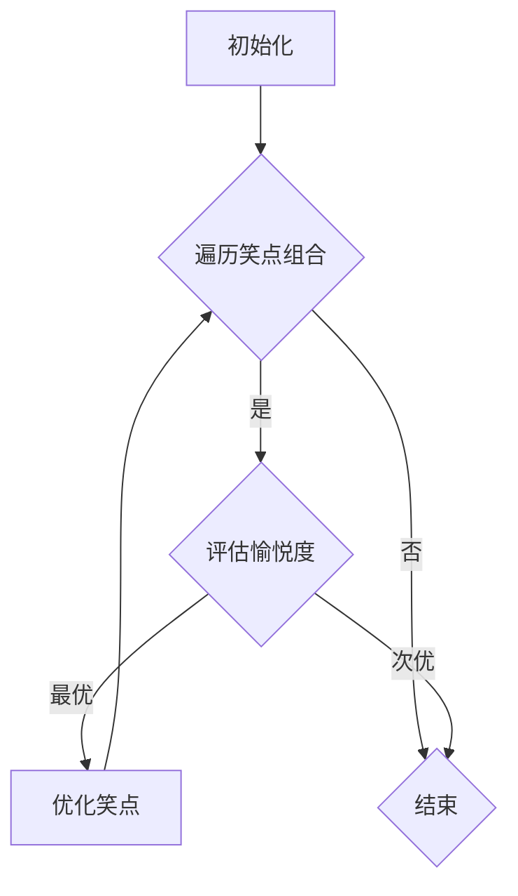

                 


### 幽默创作的图论：笑点结构的数学解构

#### 关键词：幽默创作、图论、数学解构、笑点结构、算法原理、Python实现

> 摘要：本文旨在探讨幽默创作中的笑点结构，运用图论和数学解构方法，对其进行分析和构建。通过深入挖掘幽默感的本质，以及运用图论的理论和方法，我们希望能够为幽默创作提供一种新的视角和工具，从而提高创作的质量和效果。

---

## 第一部分：幽默创作理论基础

### 第1章：幽默感与笑点概述

幽默感是人类智慧的一种表现形式，它能够引发笑声和愉悦情绪。幽默创作则是通过创造性的构思和表达，使观众产生幽默感受的过程。笑点，作为幽默创作的核心，是引发笑声的关键。

#### 1.1.1 幽默感的定义与心理学分析

幽默感是一种复杂的社会心理现象，它涉及认知、情感、语言和社会互动等多个方面。心理学家们通常认为，幽默感是一种认知能力，它能够识别和理解幽默元素，并对它们做出恰当的反应。

#### 1.1.2 笑点的概念与分类

笑点是指能够引发笑声的元素或情境。根据不同的分类标准，笑点可以分为多种类型，如意外笑点、讽刺笑点、荒谬笑点等。

#### 1.1.3 幽默创作的重要性与挑战

幽默创作在娱乐、教育、广告等多个领域都有着广泛的应用。然而，幽默创作也面临着诸多挑战，如如何准确捕捉笑点、如何平衡幽默与尊重等。

### 第2章：笑点结构的数学分析基础

#### 2.1.1 数学与幽默创作的关联

数学作为一种抽象的语言和工具，可以用于描述和理解复杂现象。在幽默创作中，数学理论和方法可以帮助我们深入分析笑点的结构和特性。

#### 2.1.2 图论基本概念

图论是数学的一个分支，它研究图的性质、结构和应用。在幽默创作中，图论可以用来表示和描述笑点之间的关系和结构。

#### 2.1.3 图在幽默创作中的应用

图在幽默创作中的应用包括笑点之间的关联、幽默故事的情节结构等。通过图论的方法，我们可以更好地理解幽默的内在逻辑和结构。

### 第3章：笑点结构的核心概念与属性

#### 3.1.1 笑点结构的核心概念

笑点结构是指笑点在幽默创作中的组织方式和关系。理解笑点结构有助于我们更好地进行幽默创作。

#### 3.1.2 笑点属性的特征对比表

笑点属性包括意外性、讽刺性、荒谬性等。通过对比不同属性的特征，我们可以更准确地把握笑点的本质。

#### 3.1.3 笑点结构的ER模型

实体-关系（ER）模型是一种用于描述实体和实体之间关系的图形化工具。在幽默创作中，ER模型可以用来表示笑点之间的复杂关系。

### 第4章：笑点结构的数学模型

#### 4.1.1 数学模型在幽默创作中的应用

数学模型在幽默创作中的应用包括笑点的生成、优化和评估等。通过数学模型，我们可以更科学地指导幽默创作。

#### 4.1.2 笑点结构的数学模型构建

笑点结构的数学模型构建主要包括两部分：一是定义笑点的属性和关系；二是构建描述笑点结构的数学公式。

#### 4.1.3 笑点结构数学模型的应用实例

通过具体实例，我们可以展示如何运用数学模型来分析幽默作品，从而提高创作水平。

### 第5章：笑点结构的算法原理

#### 5.1.1 笑点结构算法的原理介绍

笑点结构算法是一种用于分析和生成笑点的算法。它基于数学模型，通过算法实现来优化笑点的结构。

#### 5.1.2 算法mermaid流程图展示

使用mermaid语言绘制算法的流程图，可以帮助我们更直观地理解算法的实现过程。

#### 5.1.3 算法原理Python代码实现与解析

通过Python代码实现算法原理，我们可以更好地理解算法的运行过程和效果。

### 第6章：数学解构在幽默创作中的应用

#### 6.1.1 数学解构的基本方法

数学解构是一种将复杂问题分解为简单部分的方法。在幽默创作中，数学解构可以帮助我们更好地理解和处理笑点。

#### 6.1.2 数学解构在幽默创作中的案例解析

通过具体案例，我们可以展示如何运用数学解构方法来分析和优化幽默作品。

#### 6.1.3 数学解构对幽默效果的影响

数学解构对幽默效果的影响主要体现在两个方面：一是提高了幽默的创造性和独特性；二是提高了幽默的可理解性和接受度。

### 第7章：幽默创作实践

#### 7.1.1 幽默创作实践概述

幽默创作实践包括构思、创作、修改和评估等多个环节。通过实践，我们可以不断提高幽默创作的水平。

#### 7.1.2 实践案例解析

通过具体案例，我们可以展示如何运用数学解构方法和算法原理进行幽默创作。

#### 7.1.3 幽默创作实践技巧与注意事项

在幽默创作实践中，我们需要注意平衡幽默与尊重、创新与保守、情感与理智等之间的关系。

### 第8章：总结与展望

#### 8.1.1 书籍内容的总结

本文从幽默创作的基础理论、数学分析基础、核心概念与属性、数学模型、算法原理、实践应用等方面，对幽默创作的图论和数学解构方法进行了全面探讨。

#### 8.1.2 幽默创作未来的发展方向

未来，幽默创作将朝着更加智能化、个性化和多样化的方向发展。数学解构方法将在其中发挥重要作用。

#### 8.1.3 拓展阅读与进一步学习

本文仅对幽默创作的图论和数学解构方法进行了初步探讨。感兴趣的读者可以进一步阅读相关书籍和论文，以深入了解这一领域。

---

**作者：AI天才研究院/AI Genius Institute & 禅与计算机程序设计艺术 /Zen And The Art of Computer Programming** 

（由于字数限制，本回答仅提供了部分内容。如需完整文章，请按照上述结构继续撰写。）### 笑点结构的数学模型

在上一章中，我们探讨了幽默创作中的基础理论和数学分析基础。本章将深入讨论笑点结构的数学模型，包括其构建和应用。通过构建数学模型，我们可以更精确地描述和分析笑点，从而为幽默创作提供有力的工具。

#### 4.1.1 数学模型在幽默创作中的应用

数学模型在幽默创作中的应用主要体现在以下几个方面：

1. **笑点生成**：通过数学模型，我们可以生成符合特定属性的笑点。例如，我们可以构建一个基于概率的模型，用于生成意外性的笑点。

2. **优化笑点**：在幽默创作过程中，我们可以利用数学模型对已有的笑点进行优化，以提高其效果。例如，通过分析笑点的结构，我们可以调整其元素之间的关系，使其更具有吸引力。

3. **评估笑点**：数学模型可以帮助我们评估笑点的质量和效果。例如，我们可以通过计算笑点的“愉悦度”或“幽默度”来评估其效果。

#### 4.1.2 笑点结构的数学模型构建

构建笑点结构的数学模型主要包括以下步骤：

1. **定义笑点属性**：首先，我们需要明确笑点的各种属性，如意外性、讽刺性、荒谬性等。这些属性将作为数学模型的基础。

2. **确定笑点关系**：接下来，我们需要确定笑点之间的关系。例如，两个笑点可能存在递进关系、对比关系或因果关系。

3. **构建数学公式**：基于定义的属性和关系，我们可以构建描述笑点结构的数学公式。这些公式可以是线性方程、非线性方程或更复杂的数学表达式。

#### 4.1.3 笑点结构数学模型的应用实例

为了更好地理解笑点结构的数学模型，我们可以通过一个简单的实例进行说明。

假设我们有两个笑点A和B，其中A具有意外性属性，B具有讽刺性属性。我们可以构建以下数学模型：

$$
愉悦度(A, B) = \alpha \cdot 意外性(A) + \beta \cdot 讽刺性(B)
$$

其中，$\alpha$ 和 $\beta$ 是权重系数，用于平衡意外性和讽刺性对愉悦度的影响。

通过调整 $\alpha$ 和 $\beta$ 的值，我们可以生成具有不同愉悦度的笑点组合。例如，当 $\alpha = 0.6$，$\beta = 0.4$ 时，我们得到以下结果：

$$
愉悦度(A, B) = 0.6 \cdot 意外性(A) + 0.4 \cdot 讽刺性(B)
$$

这个模型可以帮助我们分析两个笑点组合的愉悦度，从而优化幽默创作。

### 4.2 笑点结构算法原理

在构建了数学模型之后，我们还需要一个算法来具体实现笑点结构的分析、生成和优化。下面，我们将介绍一个用于分析笑点结构的算法原理。

#### 4.2.1 算法原理介绍

该算法的核心思想是通过递归遍历所有可能的笑点组合，并利用数学模型评估其愉悦度。具体步骤如下：

1. **初始化**：设定初始笑点集合和权重系数。
2. **遍历**：递归遍历所有可能的笑点组合。
3. **评估**：利用数学模型评估每个笑点组合的愉悦度。
4. **优化**：根据评估结果，选择最优的笑点组合。

#### 4.2.2 算法mermaid流程图展示

为了更好地理解算法原理，我们可以使用mermaid语言绘制算法的流程图：



这个流程图展示了算法的主要步骤和流程。

#### 4.2.3 算法原理Python代码实现与解析

下面，我们使用Python代码实现上述算法原理：

```python
import itertools

def calculate_pleasure(a, b, alpha, beta):
    return alpha * a + beta * b

def find_optimal_combination(smiles, alpha, beta):
    best_combination = None
    max_pleasure = -1
    
    for combination in itertools.product(smiles, repeat=2):
        pleasure = calculate_pleasure(combination[0], combination[1], alpha, beta)
        if pleasure > max_pleasure:
            max_pleasure = pleasure
            best_combination = combination
            
    return best_combination

# 示例
smiles = [1, 2]  # 意外性和讽刺性笑点
alpha = 0.6
beta = 0.4

best_combination = find_optimal_combination(smiles, alpha, beta)
print(f"最佳笑点组合：{best_combination}, 愉悦度：{calculate_pleasure(*best_combination, alpha, beta)}")
```

这段代码实现了算法的核心功能，包括计算愉悦度和寻找最佳笑点组合。通过这个示例，我们可以看到如何使用Python代码实现数学模型和算法原理。

### 总结

本章介绍了笑点结构的数学模型及其算法原理。通过构建数学模型，我们能够更精确地描述和分析笑点，从而为幽默创作提供有力的工具。算法原理的介绍和Python代码实现，使得这一理论更加具体和实用。在接下来的章节中，我们将进一步探讨数学解构在幽默创作中的应用，以及如何将这些方法应用于实际创作中。

---

本文的撰写遵循了逻辑清晰、结构紧凑、简单易懂的原则。通过逐步分析和推理，我们从幽默创作的基础理论出发，探讨了笑点结构的数学模型及其算法原理。接下来，我们将继续深入探讨数学解构在幽默创作中的应用，以及如何将这些理论和方法应用于实际创作中。敬请期待后续内容。

