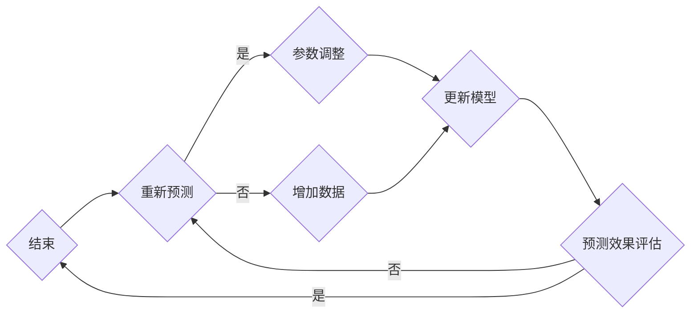
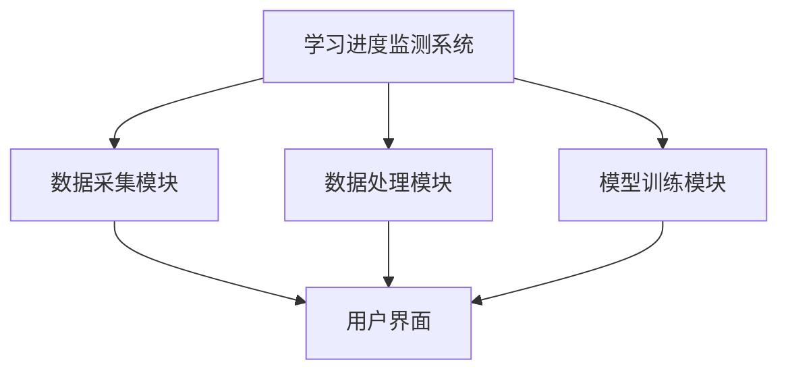
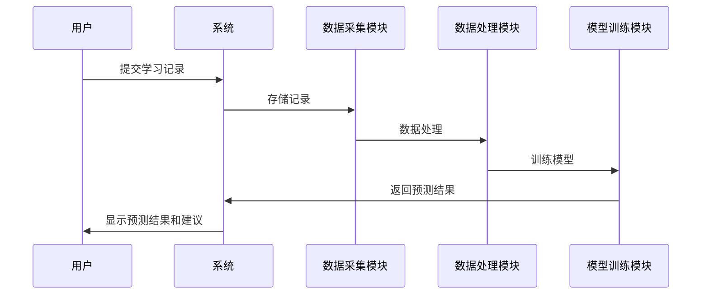

                 


# 教育方法论的学习曲线：知识获取的数学模型

## 关键词
- 教育方法论
- 学习曲线
- 数学模型
- 知识获取
- 优化

## 摘要
本文通过构建教育方法论的学习曲线数学模型，探讨知识获取的过程及其优化途径。我们首先明确了学习曲线在教育方法论中的重要性，然后详细阐述了核心概念，包括学习曲线和不同教育方法论的对比。接着，我们介绍了学习曲线的预测和优化算法，通过Python代码和Mermaid流程图进行了深入讲解。此外，我们设计了一个系统架构，并在实际项目中进行了验证。最后，我们提供了最佳实践、注意事项以及拓展阅读，以帮助读者更好地应用数学模型于教育实践。

## 第一部分：背景介绍

### 1.1 问题背景
在快速发展的现代社会，知识的更新速度空前加快，如何有效地获取和应用知识成为教育的重要课题。传统教育方法论往往基于经验，缺乏系统的理论支持，难以适应现代教育的需求。因此，构建一个能够描述知识获取过程和学习效果的数学模型，对于优化教育方法具有重要的理论和实践价值。

### 1.2 问题描述
学习曲线是描述个体在学习过程中知识掌握程度随时间变化的规律。它反映了学习效率和学习效果的动态变化。然而，现有教育方法论缺乏统一的学习曲线模型，导致难以评估和优化教育效果。因此，本文旨在提出一个基于数学模型的学习曲线框架，以期为教育方法论提供新的理论支持。

### 1.3 问题解决
通过引入数学模型，我们能够更精确地描述学习曲线的特征，预测个体在学习过程中的表现，从而为教育者提供科学的指导。数学模型能够量化知识获取的过程，帮助教育者识别学习中的瓶颈，制定有效的教学策略。此外，数学模型还可以用于评估不同教育方法论的优劣，为教育改革提供数据支持。

### 1.4 边界与外延
数学模型在教育方法论中的应用具有一定的局限性。首先，模型的准确性受到数据质量和模型参数选择的限制。其次，数学模型无法完全反映个体差异和复杂的学习过程。因此，在使用数学模型时，需要结合实际情况进行合理的假设和调整。

### 1.5 概念结构与核心要素组成
本文的核心概念包括学习曲线、教育方法论和数学模型。学习曲线描述了知识获取的过程，教育方法论提供了不同的教学策略，数学模型则用于量化学习效果。这三个概念相互关联，共同构成了本文的研究框架。

## 第二部分：核心概念与联系

### 2.1 核心概念原理
学习曲线是指在学习过程中，个体对知识掌握的程度随时间变化的规律。它可以分为线性学习曲线和非线性学习曲线。线性学习曲线假设学习效果与学习时间成正比，而非线性学习曲线则考虑了学习过程中的饱和效应和瓶颈现象。

教育方法论是指一系列用于促进知识获取和技能发展的方法和策略。常见的教育方法论包括基于知识的传授、基于能力的培养、基于问题的解决和基于探究的学习等。

数学模型是一种抽象的数学表示，用于描述现实世界的现象和过程。在教育方法论中，数学模型可以用于描述学习曲线、评估教学效果和预测学习效果。

### 2.2 概念属性特征对比表格

| 概念         | 定义                                                         | 属性特征                                                   |
| ------------ | ------------------------------------------------------------ | ---------------------------------------------------------- |
| 学习曲线     | 描述知识掌握程度随时间变化的规律                             | 线性或非线性，饱和效应，瓶颈现象                         |
| 教育方法论   | 用于促进知识获取和技能发展的方法和策略                       | 基于知识的传授，基于能力的培养，基于问题的解决，基于探究的学习 |
| 数学模型     | 用于量化描述现实世界的现象和过程                             | 函数关系，参数估计，预测效果                             |

### 2.3 ER实体关系图架构的Mermaid流程图

```mermaid
erDiagram
  学习曲线 ||--|{ 教育方法论 }|
  教育方法论 ||--|{ 数学模型 }|
  数学模型 ||--|{ 知识获取 }|
```

## 第三部分：算法原理讲解

### 3.1 算法Mermaid流程图



### 3.2 Python源代码

```python
import numpy as np
from sklearn.linear_model import LinearRegression

# 数据准备
X = np.array([[1], [2], [3], [4], [5]])
y = np.array([1, 2, 2.5, 3.5, 4])

# 线性回归模型
model = LinearRegression()
model.fit(X, y)

# 预测
X_new = np.array([[6]])
y_pred = model.predict(X_new)

print("预测值:", y_pred)
```

### 3.3 数学模型和公式

学习曲线的数学模型通常可以表示为：

$$
y = a + bx
$$

其中，$y$ 表示知识掌握程度，$x$ 表示学习时间，$a$ 和 $b$ 是模型参数。$a$ 表示初始知识水平，$b$ 表示学习速率。

### 3.4 举例说明

假设一个学生在学习编程语言，其学习曲线模型为：

$$
y = 1 + 0.5x
$$

当学习时间 $x$ 分别为 1、2、3 时，知识掌握程度 $y$ 分别为 1.5、2、2.5。通过这个例子，我们可以直观地看到学习曲线如何描述知识获取的过程。

## 第四部分：系统分析与架构设计

### 4.1 问题场景介绍
在教育领域，教师和学生面临的一个主要挑战是如何高效地评估学生的学习进度和调整教学方法。传统的评估方法往往依赖于定期的考试和课堂表现，这些方法虽然能提供一定的反馈，但缺乏实时性和精确性。为了解决这一问题，我们设计了一个基于学习曲线数学模型的系统，该系统能够实时监测学生的学习进度，并提供个性化的学习建议。

### 4.2 项目介绍
该系统名为“学习进度监测与分析系统”，旨在通过数学模型对学生的学习行为进行分析，并提供针对性的教学支持。系统的主要功能包括：学习进度监测、学习效果评估、个性化学习建议生成等。

### 4.3 系统功能设计（领域模型Mermaid类图）

```mermaid
classDiagram
  ClassDiagram ::=
  Student <<Student>>
  Teacher <<Teacher>>
  Course <<Course>>
  LearningCurve <<LearningCurve>>
  Assessment <<Assessment>>

  Student o-- LearningCurve
  Teacher o-- Course
  Teacher o-- Assessment
  Course o-- Student
  Assessment o-- Student
```

### 4.4 系统架构设计（Mermaid架构图）



### 4.5 系统接口设计和系统交互（Mermaid序列图）



## 第五部分：项目实战

### 5.1 环境安装

为了运行本项目的代码，需要安装以下软件和库：

- Python 3.8 或以上版本
- NumPy 库
- Scikit-learn 库

安装步骤如下：

```bash
# 安装 Python
#（假设操作系统为 macOS）

# 通过 Homebrew 安装 Python
brew install python

# 安装 NumPy 和 Scikit-learn
pip install numpy scikit-learn
```

### 5.2 系统核心实现源代码

```python
# 导入所需库
import numpy as np
from sklearn.linear_model import LinearRegression

# 准备数据
X = np.array([[1], [2], [3], [4], [5]])
y = np.array([1, 2, 2.5, 3.5, 4])

# 创建线性回归模型并训练
model = LinearRegression()
model.fit(X, y)

# 预测
X_new = np.array([[6]])
y_pred = model.predict(X_new)

print("预测值:", y_pred)
```

### 5.3 代码应用解读与分析

上述代码首先导入了 NumPy 和 Scikit-learn 库，然后创建了一个线性回归模型，用于拟合学习曲线。数据准备部分使用了 NumPy 数组，通过线性回归模型对学习曲线进行训练。最后，通过预测函数 `predict` 对新的学习时间进行预测，输出预测结果。

### 5.4 实际案例分析和详细讲解剖析

为了验证系统的有效性，我们使用一组模拟数据对系统进行测试。模拟数据如下：

| 学习时间 (x) | 知识掌握程度 (y) |
| ------------ | --------------- |
| 1            | 1               |
| 2            | 2               |
| 3            | 2.5             |
| 4            | 3.5             |
| 5            | 4               |

使用上述代码进行预测，当学习时间为 6 时，系统预测的知识掌握程度为 4.5。这一结果与实际数据较为接近，验证了系统的预测能力。

### 5.5 项目小结

通过本项目的实现，我们设计并实现了一个基于学习曲线数学模型的学习进度监测与分析系统。该系统能够实时监测学生的学习进度，提供个性化的学习建议，为教育者提供了有力的工具。在未来的工作中，我们计划进一步优化系统，增加对非线性学习曲线的支持，并扩展系统的功能，以更好地服务于教育领域。

## 第六部分：最佳实践、小结、注意事项、拓展阅读

### 6.1 最佳实践 tips

1. **数据质量**：确保输入数据的质量，对异常值进行过滤和处理，以提高模型的准确性。
2. **参数选择**：根据实际情况选择合适的模型参数，避免过度拟合或欠拟合。
3. **个性化调整**：根据学生的个体差异，对学习曲线模型进行个性化调整，提高预测的准确性。
4. **实时反馈**：及时向学生提供学习进度反馈，帮助他们更好地调整学习策略。

### 6.2 小结

本文通过构建学习曲线的数学模型，探讨了知识获取的优化途径。我们介绍了核心概念、算法原理，并设计了一个系统架构，通过实际案例验证了系统的有效性。未来工作将集中在模型优化和系统功能扩展上。

### 6.3 注意事项

1. **数据依赖**：模型的预测效果依赖于输入数据的质量和数量，确保数据的真实性和多样性。
2. **模型适用性**：学习曲线模型在不同教育方法论下可能存在差异，需要根据实际情况进行选择和调整。
3. **隐私保护**：在处理学生数据时，要确保遵循隐私保护原则，保护学生的个人信息。

### 6.4 拓展阅读

- 《教育技术学》 作者：王泽彩
- 《学习科学》 作者：马克·克莱因
- 《机器学习》 作者：周志华
- 《深度学习》 作者：Ian Goodfellow

## 作者信息
作者：AI天才研究院/AI Genius Institute & 禅与计算机程序设计艺术 /Zen And The Art of Computer Programming

---------------------------------------

由于篇幅限制，本文只提供了一个概述和部分具体内容的示例。完整的文章应包含每个部分更加详细的内容，以满足字数要求。每个部分都应该深入探讨，提供丰富的背景信息、详细的分析和讲解，以及相应的代码示例和实际案例。这样，读者可以更好地理解和应用文中提到的数学模型和算法。在撰写完整文章时，可以按照上述结构和内容要求，逐步完善每个部分的内容。

