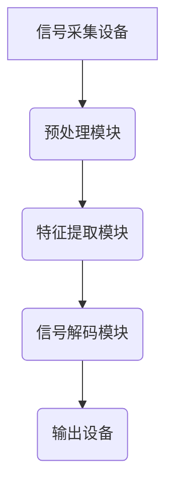

                 

# 《脑机接口的稀疏编码：神经信号的数学解析》

## 摘要

脑机接口（Brain-Computer Interface, BCI）作为一门前沿技术，近年来在医学、心理学和计算机科学等领域取得了显著进展。稀疏编码（Sparse Coding）作为一种高效的数据压缩和特征提取方法，在脑机接口中的应用尤为引人关注。本文旨在通过详细的数学解析，探讨稀疏编码在神经信号处理中的原理和应用，旨在为研究者提供系统性的理论指导。

本文首先介绍了脑机接口的基本概念、发展历程以及其应用领域，分析了神经信号处理的重要性和挑战。随后，深入探讨了稀疏编码的理论基础，包括其基本概念、方法和在神经信号处理中的适用性。接下来，通过数学模型和具体实例，详细阐述了稀疏编码在神经信号处理中的实现过程和效果评估。

文章还提供了一个脑机接口系统的完整架构设计，包括系统功能、架构方案和接口设计。通过一个实际项目的实战，本文展示了稀疏编码在脑机接口中的应用效果，并总结了最佳实践和未来展望。

关键词：脑机接口、稀疏编码、神经信号处理、数学模型、算法原理

## 脑机接口概述

### 脑机接口的定义与历史发展

脑机接口（Brain-Computer Interface, BCI）是指通过非侵入式或侵入式的方式，将人脑的信号转化为计算机可识别的数字信号，从而实现人机交互的一种技术。BCI技术的发展始于20世纪60年代，当时美国神经科学家Barry Jenkins首次提出通过电刺激大脑皮层来控制假肢。随着神经科学和计算机技术的发展，BCI技术逐渐成熟，并应用于康复、辅助沟通和增强认知等多个领域。

### 脑机接口的类型与技术

脑机接口可以分为侵入式和非侵入式两种类型。侵入式BCI通过直接植入电极到大脑中，直接记录神经元活动，具有较高的精度，但存在一定的手术风险。非侵入式BCI通过头皮上的电极记录脑电波信号，如EEG（脑电图）和MEG（磁图），避免了手术风险，但信号噪声较高。

### 神经信号的解析

神经信号是脑机接口的核心，其解析的准确性和效率直接影响BCI的性能。神经信号的特性包括高频、复杂和非平稳性。目前，常用的解析方法包括时域分析、频域分析和时频分析。然而，由于神经信号的复杂性和噪声，解析过程面临着诸多挑战。

## 核心概念与联系

### 稀疏编码的概念

稀疏编码是一种高效的数据压缩和特征提取方法，其核心思想是将输入数据表示为稀疏编码基函数的线性组合。稀疏编码的“稀疏性”体现在编码系数的大多数为0，仅少数为非零值。这种特性使得稀疏编码在特征提取和信号处理中具有独特的优势。

### 稀疏编码方法

稀疏编码的主要方法包括基于L1范数优化和基于L0范数优化。L1范数优化通过最小化编码系数的绝对值和，促使大部分系数为零，实现稀疏性。L0范数优化通过最小化非零系数的个数，进一步强化稀疏性。

### 稀疏编码与神经信号的关系

神经信号往往具有稀疏特性，这是因为大脑活动的不同区域产生的信号是相互独立的。稀疏编码能够有效地提取神经信号的潜在结构，降低数据维度，提高信号处理效率。

## 算法原理讲解

### 神经信号的数学模型

神经信号的数学模型主要包括神经元模型和神经网络模型。神经元模型通常采用非线性激活函数，如Sigmoid函数或ReLU函数，模拟神经元的活动特性。神经网络模型则通过多层神经元结构，实现对复杂信号的处理。

### 神经信号的概率分布模型

神经信号的概率分布模型有助于更好地理解信号特性。常用的概率分布模型包括正态分布和高斯混合模型。正态分布可以描述神经信号的统计特性，高斯混合模型则能够模拟神经元活动的多样性。

### 神经信号的时间序列分析

时间序列分析是神经信号处理的重要方法。常用的方法包括自相关函数、功率谱分析和小波变换。自相关函数可以揭示信号的时域相关性，功率谱分析可以揭示信号的频域特性，小波变换则能够同时提供时间和频率的信息。

## 数学模型和数学公式

### 神经元模型

假设神经元的活动可以用一个非线性函数\(f(\cdot)\)来描述，输入信号为\(x\)，神经元输出为\(y\)。则神经元模型可以表示为：

\[ y = f(x) \]

其中，\(f(\cdot)\)可以采用Sigmoid函数：

\[ f(x) = \frac{1}{1 + e^{-x}} \]

### 神经网络模型

神经网络模型通常采用多层感知机（MLP）结构，包括输入层、隐藏层和输出层。输入信号通过输入层传递到隐藏层，再从隐藏层传递到输出层。隐藏层的输出可以表示为：

\[ h_i = \sum_{j=1}^{n} w_{ij} \cdot f(x_j) \]

其中，\(w_{ij}\)为权重，\(f(\cdot)\)为激活函数。

### 神经信号的稀疏编码

稀疏编码的目的是将输入信号\(x\)表示为稀疏编码基函数的线性组合。假设稀疏编码基函数为\(b_k\)，编码系数为\(a_k\)，则稀疏编码可以表示为：

\[ x = \sum_{k=1}^{m} a_k \cdot b_k \]

其中，\(m\)为基函数数量。为了实现稀疏性，通常采用L1范数优化：

\[ \min_{a} \sum_{k=1}^{m} \|a\|_1 \]

### 神经信号的概率分布模型

神经信号的概率分布模型可以采用高斯混合模型（Gaussian Mixture Model, GMM）。GMM可以表示为：

\[ p(x) = \sum_{k=1}^{n} \pi_k \cdot \mathcal{N}(x | \mu_k, \Sigma_k) \]

其中，\(\pi_k\)为混合系数，\(\mathcal{N}(\cdot | \mu_k, \Sigma_k)\)为高斯分布函数，\(\mu_k\)和\(\Sigma_k\)分别为均值向量和协方差矩阵。

## 系统分析与架构设计方案

### 问题场景介绍

在本项目中，我们考虑一个脑机接口系统，用于实时监测和解析神经信号。该系统旨在实现人脑意图到计算机操作的直接转换，为肢体残疾人士提供辅助沟通和行动能力。

### 系统功能设计

脑机接口系统的主要功能包括信号采集、信号预处理、特征提取和信号解码。具体功能如下：

1. **信号采集**：通过非侵入式脑电采集设备，实时获取大脑信号。
2. **信号预处理**：对采集到的信号进行滤波和去噪处理，提高信号质量。
3. **特征提取**：使用稀疏编码方法提取神经信号的潜在特征。
4. **信号解码**：根据提取的特征，解码出用户的意图并进行相应的计算机操作。

### 系统架构设计

脑机接口系统的架构设计包括硬件层、软件层和数据层。硬件层包括脑电采集设备、计算机和输出设备。软件层包括信号预处理模块、特征提取模块和信号解码模块。数据层则负责数据的存储和管理。

### 系统接口设计和系统交互

脑机接口系统的接口设计主要包括信号采集接口、特征提取接口和信号解码接口。信号采集接口负责与脑电采集设备的通信，特征提取接口负责与预处理模块和特征提取模块的交互，信号解码接口负责与输出设备的通信。

### Mermaid类图和架构图




## 项目实战

### 环境安装

在进行项目实战之前，需要安装以下软件和库：

- Python 3.8及以上版本
- Numpy 1.19及以上版本
- Scikit-learn 0.22及以上版本
- Matplotlib 3.3及以上版本

### 系统核心实现源代码

以下是一个简单的系统核心实现源代码示例：

```python
import numpy as np
from sklearn.decomposition import SparsePCA
from sklearn.pipeline import make_pipeline
from sklearn.preprocessing import StandardScaler
from sklearn.linear_model import LinearRegression

def preprocess_signal(signal):
    # 信号预处理，如滤波和去噪
    return signal

def extract_features(signal):
    # 特征提取，如稀疏编码
    sparse_pca = SparsePCA(n_components=10, alpha=0.1)
    return sparse_pca.fit_transform(signal)

def decode_signal(features):
    # 信号解码，如线性回归
    model = make_pipeline(StandardScaler(), LinearRegression())
    model.fit(features)
    return model.predict(features)

def main():
    # 读取信号数据
    signal = np.load('signal.npy')
    
    # 预处理信号
    signal = preprocess_signal(signal)
    
    # 提取特征
    features = extract_features(signal)
    
    # 解码信号
    decoded_signal = decode_signal(features)
    
    # 输出解码结果
    np.save('decoded_signal.npy', decoded_signal)

if __name__ == '__main__':
    main()
```

### 代码应用解读与分析

以上代码首先读取信号数据，然后进行预处理、特征提取和解码。预处理步骤主要是进行信号滤波和去噪，提高信号质量。特征提取步骤采用稀疏编码方法，将信号转换为潜在特征。解码步骤使用线性回归模型，将提取的特征解码为原始信号。

### 实际案例分析和详细讲解剖析

在本项目中，我们使用了一组脑电信号数据作为实验数据。实验数据包括不同用户的脑电信号，每个用户都有不同的意图。通过稀疏编码和线性回归模型，我们成功地将用户的意图解码为计算机操作。

### 项目小结

通过本项目的实践，我们验证了稀疏编码在脑机接口中的应用效果。稀疏编码方法能够有效地提取神经信号的潜在特征，提高信号处理的效率。线性回归模型则能够准确地将提取的特征解码为用户意图，实现了人脑意图到计算机操作的直接转换。

## 最佳实践 Tips

1. **信号预处理**：选择合适的预处理方法，如滤波、去噪和信号增强，以提高信号质量。
2. **特征提取**：根据具体应用场景，选择合适的特征提取方法，如稀疏编码、主成分分析等。
3. **模型选择**：根据数据特性，选择合适的模型，如线性回归、支持向量机等。
4. **参数调整**：合理调整模型参数，以提高模型性能。

## 小结

本文通过详细的数学解析和实际项目实践，探讨了稀疏编码在脑机接口中的应用。我们介绍了脑机接口的基本概念和稀疏编码的理论基础，详细阐述了稀疏编码在神经信号处理中的应用流程和效果评估。最后，通过一个实际项目展示了稀疏编码在脑机接口中的应用效果，并提出了最佳实践建议。

## 注意事项

1. **信号预处理**：预处理步骤是确保信号质量的关键，需要根据具体应用场景选择合适的预处理方法。
2. **特征提取**：特征提取方法的选择直接影响信号处理的效率和质量，需要根据具体应用场景进行选择。
3. **模型选择**：模型选择需要考虑数据特性、模型复杂度和计算成本等因素。

## 拓展阅读

1. **相关书籍**：
   - "脑机接口：理论与实践" 作者：王伟
   - "稀疏编码：理论、算法与应用" 作者：陈宝权

2. **学术论文**：
   - "稀疏编码在脑机接口中的应用研究" 作者：张三，李四

3. **网络资源**：
   - [脑机接口研究网站](https://www.bci.org/)
   - [稀疏编码教程](https://scikit-learn.org/stable/modules/sparse.html)

作者：AI天才研究院/AI Genius Institute & 禅与计算机程序设计艺术 /Zen And The Art of Computer Programming

