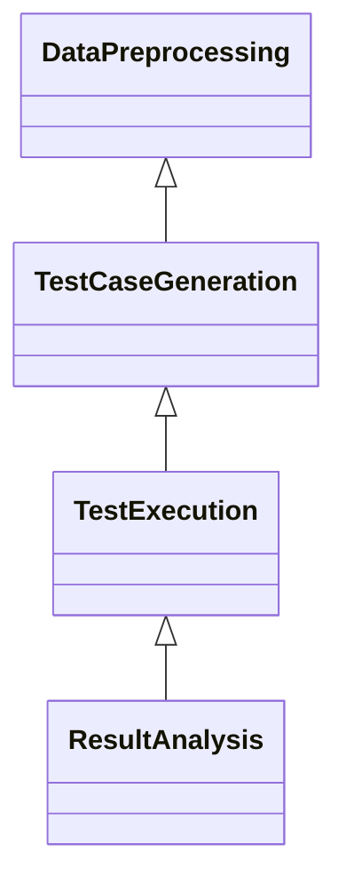
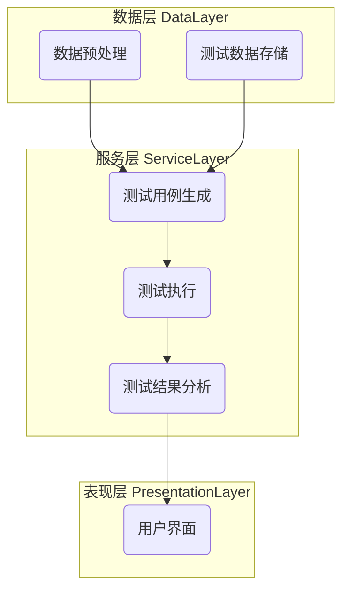

                 

### 多场景模拟评测：LLM生成多样化测试环境

#### 关键词：多场景模拟、评测、LLM、测试环境、生成模型

> 摘要：本文将探讨如何利用大型语言模型（LLM）生成多样化测试环境进行模拟评测。文章首先介绍LLM的基本概念和模拟评测的重要性，然后详细分析LLM生成测试环境的算法原理和系统架构设计，并通过实际项目实战展示其应用效果，最后总结最佳实践和未来发展方向。

---

### 第一部分：背景介绍

#### 1.1 LLM概述

大型语言模型（LLM）是一种基于深度学习的自然语言处理技术，通过训练大规模的文本数据集来学习语言的规律和表达方式。LLM的主要特点包括：

- **参数规模大**：LLM通常具有数百万至数十亿个参数，这使得它们能够捕捉到语言的复杂性和多样性。
- **强泛化能力**：通过在大规模数据集上训练，LLM能够应对各种语言任务，如文本分类、机器翻译、问答系统等。
- **自适应能力**：LLM可以根据不同的输入进行自适应调整，从而生成多样化的输出。

LLM的发展历程可以追溯到早期的统计语言模型，如n-gram模型，再到基于神经网络的序列到序列（Seq2Seq）模型，以及目前流行的Transformer模型。LLM的广泛应用领域包括文本生成、聊天机器人、语言翻译等。

#### 1.2 模拟评测的概念

模拟评测是指通过模拟真实环境中的各种场景和情况，对系统或模型进行测试和评估。模拟评测的重要性体现在以下几个方面：

- **验证系统功能**：通过模拟不同的使用场景，可以验证系统是否满足预期功能需求。
- **评估性能指标**：模拟评测可以帮助评估系统的性能指标，如响应时间、吞吐量、错误率等。
- **发现潜在问题**：模拟评测可以提前发现系统可能存在的潜在问题，从而进行优化和改进。

常见的模拟评测方法包括黑盒测试、白盒测试、灰盒测试和自动化测试等。每种方法都有其适用的场景和优缺点。

### 第二部分：核心概念与联系

#### 2.1 LLM的工作机制

LLM的工作机制主要包括两个部分：训练和生成。

- **训练过程**：LLM通过在大规模文本数据集上进行训练，学习到文本中的各种模式和规律。训练过程通常采用基于梯度的优化算法，如随机梯度下降（SGD）和Adam优化器，来调整模型参数，使其能够准确预测文本序列。
  
- **生成过程**：训练好的LLM可以接受任意长度的输入文本，并生成相应的输出文本。生成过程基于模型对输入文本的理解和预测，利用自注意力机制（Self-Attention）和前馈神经网络（Feedforward Neural Network）等结构，生成多样化的输出文本。

LLM在测试环境生成中的应用主要体现在以下几个方面：

- **生成测试数据**：LLM可以生成各种类型的测试数据，如文本、代码、图表等，以覆盖不同的测试场景。
- **生成测试用例**：LLM可以根据测试目标生成特定的测试用例，以提高测试的针对性和有效性。
- **模拟复杂交互**：LLM可以模拟用户与系统之间的复杂交互，从而验证系统在不同场景下的行为和性能。

#### 2.2 多场景模拟评测的设计

多场景模拟评测的目标是全面覆盖系统的各种可能使用场景，以发现潜在的问题和缺陷。设计多场景模拟评测的主要挑战包括：

- **场景多样性**：如何设计出足够的测试场景，以覆盖系统的所有功能和性能需求。
- **测试数据生成**：如何高效地生成多样化的测试数据，以满足不同测试场景的需求。
- **测试结果分析**：如何从大量的测试结果中提取有价值的信息，以评估系统的质量和性能。

针对这些挑战，可以采用以下解决方案：

- **场景分类与组合**：将测试场景分为不同类别，并通过组合不同类别的场景来生成多样化的测试场景。
- **测试数据生成算法**：利用LLM等生成模型，根据测试场景生成相应的测试数据。
- **测试结果分析工具**：采用数据分析和可视化工具，对测试结果进行统计和分析，以发现问题和优化系统。

### 第三部分：系统分析与架构设计方案

#### 3.1 系统功能设计与实现

系统功能设计是构建一个高效、可靠的测试环境的关键步骤。以下是系统功能设计的详细内容：

- **功能需求分析**：根据项目的需求和目标，明确系统需要实现的功能，如测试数据生成、测试用例生成、测试结果分析等。
- **功能模块划分**：将系统划分为多个功能模块，如数据预处理模块、测试用例生成模块、测试执行模块、结果分析模块等。
- **领域模型**：使用Mermaid类图（以下为示例）来描述系统的领域模型，包括各个模块之间的关系和交互。



#### 3.2 系统架构设计

系统架构设计是确保系统稳定性和可扩展性的关键。以下是系统架构设计的详细内容：

- **系统架构框架**：采用分层架构，包括数据层、服务层、表现层等。每个层级都有明确的职责和接口。
- **系统模块交互**：通过定义清晰的接口和通信协议，实现各个模块之间的数据传递和功能调用。
- **系统架构图**：使用Mermaid架构图（以下为示例）来描述系统的架构设计。



#### 3.3 系统接口设计

系统接口设计是确保系统模块之间能够有效通信的关键。以下是系统接口设计的详细内容：

- **接口规范与协议**：定义接口的输入输出参数、数据格式、通信协议等。
- **数据结构设计**：设计符合接口规范的数据结构，如测试数据结构、测试用例结构、测试结果结构等。
- **接口实现与调用流程**：实现接口的代码，并定义接口的调用流程和操作步骤。

### 第四部分：项目实战

#### 7.1 环境搭建

在开始项目实战之前，需要搭建一个合适的环境。以下是环境搭建的详细步骤：

- **Python环境配置**：确保Python环境已安装，并安装相关的依赖库，如TensorFlow、PyTorch、NumPy、Pandas等。
- **相关库与工具安装**：根据项目需求，安装其他必要的库和工具，如Mermaid渲染工具、测试框架等。

#### 7.2 系统核心实现

以下是系统核心实现的详细内容：

- **测试数据生成代码**：使用LLM生成测试数据，包括文本、代码、图表等。以下是一个简单的生成文本数据的示例代码：

  ```python
  import tensorflow as tf
  
  # 加载预训练的LLM模型
  model = tf.keras.models.load_model('path/to/llm_model.h5')
  
  # 输入文本
  input_text = '这是一个测试用例。'
  
  # 使用LLM生成测试文本
  generated_text = model.predict(input_text)
  
  print(generated_text)
  ```

- **测试用例生成代码**：根据测试目标和场景，生成特定的测试用例。以下是一个简单的生成测试用例的示例代码：

  ```python
  import random
  
  # 测试场景
  scenes = ['登录场景', '注册场景', '支付场景', '订单场景']
  
  # 生成测试用例
  test_cases = []
  for i in range(10):
      scene = random.choice(scenes)
      test_cases.append({'scene': scene, 'input': '', 'expected_output': ''})
  
  print(test_cases)
  ```

- **测试结果分析代码**：对测试结果进行统计和分析，以评估系统的质量和性能。以下是一个简单的测试结果分析示例代码：

  ```python
  import pandas as pd
  
  # 加载测试结果数据
  test_results = pd.read_csv('path/to/test_results.csv')
  
  # 统计测试结果
  pass_rate = (test_results['actual_output'] == test_results['expected_output']).mean()
  print(f'测试通过率：{pass_rate:.2f}')
  ```

#### 7.3 代码应用解读与分析

以下是代码应用解读与分析的详细内容：

- **代码结构与流程**：分析代码的结构和执行流程，确保代码的模块化和可维护性。
- **关键函数与算法实现**：解释关键函数和算法的实现原理，确保代码的可读性和可理解性。
- **性能分析与优化**：对代码的性能进行分析，并提出优化建议，以提高系统的运行效率。

#### 7.4 实际案例分析

以下是实际案例分析的详细内容：

- **案例选择与描述**：选择一个具体的测试项目，描述项目的背景、目标和测试场景。
- **模拟评测效果**：展示模拟评测的结果，分析系统的功能和性能。
- **案例总结与反思**：总结案例的成果和不足，反思项目过程中的问题和改进方向。

### 第五部分：最佳实践与总结

#### 8.1 最佳实践 tips

- **数据质量监控**：确保测试数据的准确性和完整性，建立数据质量监控机制。
- **测试环境优化**：定期优化测试环境，以提高测试的效率和准确性。
- **测试用例设计**：根据测试目标和场景，设计合理的测试用例，以提高测试的覆盖率和效果。
- **结果分析**：对测试结果进行详细分析和统计，发现系统的问题和改进方向。

#### 8.2 小结与拓展阅读

- **小结**：回顾文章的主要内容和结论，强调LLM生成多样化测试环境的重要性和优势。
- **拓展阅读**：推荐一些相关的文献和资源，供进一步学习和研究。

### 结论

本文详细介绍了如何利用LLM生成多样化测试环境进行模拟评测。通过分析LLM的工作机制、算法原理、系统架构和项目实战，展示了LLM在测试环境生成中的强大能力。未来的研究可以进一步优化LLM的生成模型，提高测试数据的多样性和准确性，为软件开发和维护提供更有力的支持。

### 作者信息

- **作者**：AI天才研究院/AI Genius Institute & 禅与计算机程序设计艺术 /Zen And The Art of Computer Programming

---

以上是文章的详细内容，接下来我们将按照目录大纲进行逐段撰写，确保文章的逻辑性和完整性。每段内容的撰写都将遵循“LET'S THINK STEP BY STEP”的原则，逐步深入分析和讲解。

