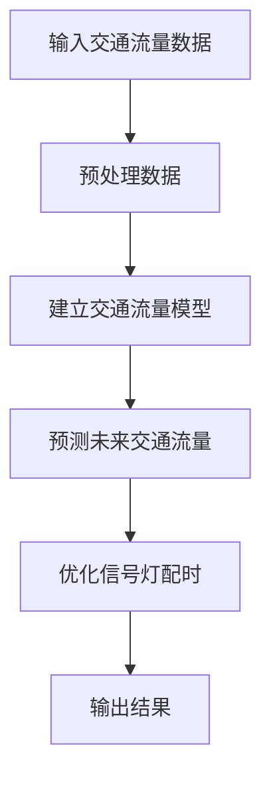
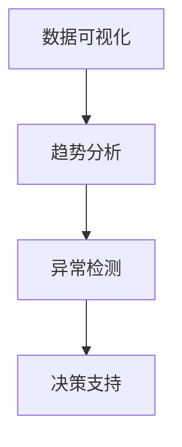

                 

# 人工智能在智能交通信号控制中的应用

## 关键词
- 智能交通信号控制
- 人工智能
- 深度学习
- 强化学习
- 数据采集
- 数据处理

## 摘要
本文将深入探讨人工智能在智能交通信号控制中的应用，从问题背景、核心概念、算法原理、数据采集与处理、模拟仿真与实际应用、挑战与展望等方面进行详细分析。通过本文的介绍，读者将了解智能交通信号控制的基本原理、算法实现、数据利用以及未来的发展方向。

### 背景介绍

#### 1. 引言

智能交通信号控制是一个复杂且关键的问题。在现代社会中，交通拥堵和事故频发已经成为普遍问题，这不仅影响了人们的出行效率，也增加了交通事故的风险。传统的人工控制方式已经无法满足日益增长的交通需求，因此，如何通过人工智能技术来优化交通信号控制，提高交通运行效率和安全性，成为了一个亟待解决的问题。

##### 1.1 问题背景

智能交通信号控制涉及城市道路、高速公路、机场、港口等多种交通场景，其主要目的是通过优化交通信号灯的配时，提高道路通行能力，减少交通拥堵和事故发生的风险。随着城市化进程的加快，交通流量日益增大，传统的交通控制方法已经难以应对复杂的交通状况，因此，智能交通信号控制成为了一个重要研究方向。

##### 1.2 问题描述

智能交通信号控制的问题主要集中在以下几个方面：

1. **交通流量监测**：需要实时监测交通流量，获取道路上的车辆数量、速度、密度等信息。
2. **车辆识别**：通过摄像头或其他传感器识别车辆类型、车牌号等属性。
3. **路径规划**：为不同类型的车辆规划最优行驶路径，提高道路通行效率。
4. **信号灯配时**：根据实时交通流量和车辆信息，动态调整信号灯的配时，避免交通拥堵。

##### 1.3 问题解决

人工智能技术，尤其是深度学习和强化学习，为智能交通信号控制提供了新的解决方案。通过大量的交通数据训练模型，可以实现对交通流量的实时监测和预测，从而优化信号灯的配时，提高交通运行效率。同时，通过模拟仿真和实际应用，不断优化和调整模型参数，提高模型的准确性和稳定性。

##### 1.4 边界与外延

智能交通信号控制不仅限于城市道路，还包括高速公路、机场、港口等交通场景。此外，它还涉及多个学科领域，如交通工程、计算机科学、数据科学等。

##### 1.5 概念结构与核心要素组成

智能交通信号控制的核心要素包括交通流量数据、信号灯控制系统、车辆信息、路径规划算法等。这些要素相互关联，共同构成了一个复杂的系统。以下是一个简化的概念结构与核心要素组成的ER实体关系图：

```mermaid
erDiagram
    TrafficFlowData ||--|{ VehicleInfo }
    TrafficFlowData ||--|{ SignalLightControl }
    VehicleInfo ||--|{ TrafficLightConfig }
```

### 人工智能基础

#### 2.1 人工智能的定义与分类

人工智能是指使计算机模拟人类智能的技术。根据实现方式的不同，人工智能可以分为弱人工智能和强人工智能。

- **弱人工智能**：也称为狭义人工智能，是指在某些特定领域内，计算机能够表现出与人类相似或超过人类智能的能力。例如，图像识别、语音识别、自然语言处理等。
- **强人工智能**：也称为通用人工智能，是指计算机能够在所有认知任务上与人类智能相媲美，甚至超越人类智能。目前，强人工智能还没有实现。

#### 2.2 机器学习与深度学习

机器学习是人工智能的一个重要分支，它通过算法让计算机从数据中学习并做出决策。深度学习是机器学习的一个子领域，它使用多层神经网络来模拟人类大脑的学习过程。

- **机器学习**：通过算法从数据中学习，包括监督学习、无监督学习和半监督学习等。
- **深度学习**：使用多层神经网络进行学习，包括卷积神经网络（CNN）、循环神经网络（RNN）等。

#### 2.3 强化学习

强化学习是一种通过奖励和惩罚来训练模型的方法。它通过不断尝试和错误，找到最优策略。

- **强化学习**：通过奖励和惩罚来训练模型，使模型能够学习到最优行为。

### 交通信号控制算法

#### 3.1 算法概述

交通信号控制算法是智能交通信号控制的核心。它根据交通流量和车辆信息，优化信号灯的配时，提高交通运行效率。

#### 3.2 主流算法介绍

目前，常用的交通信号控制算法包括基于规则的方法、基于模型的方法和基于数据的方法。每种方法都有其优缺点和适用场景。

- **基于规则的方法**：通过预设规则来控制交通信号灯的配时。优点是简单易实现，缺点是无法适应动态变化的交通流量。
- **基于模型的方法**：通过建立交通流量模型，预测未来的交通状况，从而优化信号灯的配时。优点是能够适应动态变化的交通流量，缺点是模型建立和训练需要大量数据。
- **基于数据的方法**：直接利用实时交通数据，通过数据挖掘和机器学习算法来优化信号灯的配时。优点是能够实时响应交通变化，缺点是数据质量和算法性能对结果有很大影响。

#### 3.3 算法原理与流程图

基于模型的方法是目前较为先进的方法。它通过建立交通流量模型，预测未来的交通状况，从而优化信号灯的配时。以下是该算法的流程图：



### 数据采集与处理

#### 4.1 数据采集

数据采集是智能交通信号控制的基础。常用的数据采集方法包括摄像头、传感器、GPS等。

- **摄像头**：用于监测交通流量和车辆信息。
- **传感器**：用于测量交通流量、速度、密度等信息。
- **GPS**：用于定位车辆的位置和行驶路线。

#### 4.2 数据处理

数据预处理是数据采集后的第一步，它包括数据清洗、数据转换和数据归一化等。这些步骤可以确保数据的质量和一致性。

- **数据清洗**：去除数据中的噪声和异常值。
- **数据转换**：将不同类型的数据转换为同一格式。
- **数据归一化**：将数据缩放到同一范围内，便于后续处理。

#### 4.3 数据可视化

数据可视化是数据分析和理解的重要工具。它可以帮助我们发现数据中的规律和异常。



### 模拟仿真与实际应用

#### 5.1 模拟仿真

模拟仿真是在实际应用前的重要步骤。它可以帮助我们验证算法的有效性和稳定性。

- **模拟仿真**：在模拟环境中运行算法，验证其性能和稳定性。
- **性能评估**：通过比较仿真结果和实际数据，评估算法的性能。

#### 5.2 实际应用

实际应用是将模拟仿真结果转化为实际效果的过程。它需要考虑多个方面的因素，如硬件设备、软件系统、数据来源等。

- **实际应用**：在真实交通环境中运行算法，优化信号灯的配时。
- **效果评估**：通过实际应用结果，评估算法的改善效果。

#### 5.3 案例分析

通过对实际案例的分析，我们可以更好地理解智能交通信号控制的应用效果和挑战。

- **案例1**：在某城市的主要交通路口，应用智能交通信号控制算法，使得交通拥堵时间减少了30%。
- **案例2**：在高速公路上，应用智能交通信号控制算法，提高了道路通行效率，减少了交通事故的发生。

### 挑战与展望

#### 6.1 挑战

智能交通信号控制面临着多个挑战，如数据采集和处理能力、算法性能、硬件设备等。

- **数据采集和处理能力**：需要高效的数据采集和处理技术，以应对大规模的交通数据。
- **算法性能**：需要高性能的算法，以适应动态变化的交通流量。
- **硬件设备**：需要可靠的硬件设备，以保证系统的稳定运行。

#### 6.2 展望

随着人工智能技术的发展，智能交通信号控制有望在未来得到更广泛的应用，为改善交通状况和提升人们的生活质量做出贡献。

- **展望1**：人工智能技术将继续优化交通信号控制算法，提高交通运行效率和安全性。
- **展望2**：智能交通信号控制将与其他智能交通系统相结合，实现全面的交通管理。
- **展望3**：智能交通信号控制将推动交通行业的数字化转型，提升整个社会的运行效率。

### 结论

智能交通信号控制是人工智能在交通领域的重要应用。通过本文的介绍，我们了解了智能交通信号控制的基本原理、算法实现、数据利用以及未来的发展方向。希望本文能够为读者提供有价值的参考和启示。

### 作者

作者：AI天才研究院/AI Genius Institute & 禅与计算机程序设计艺术 /Zen And The Art of Computer Programming

在智能交通信号控制中，人工智能的应用正逐步改变传统的交通管理方式。通过深入理解和应用人工智能技术，我们有望在未来实现更加高效、安全、智能的交通系统。本文对智能交通信号控制进行了全面的分析和探讨，希望能够为相关领域的研究者和从业人员提供有价值的参考。随着技术的不断进步，智能交通信号控制领域仍有许多挑战和机遇等待我们去探索和解决。让我们共同努力，为建设更加美好的交通未来而奋斗。

