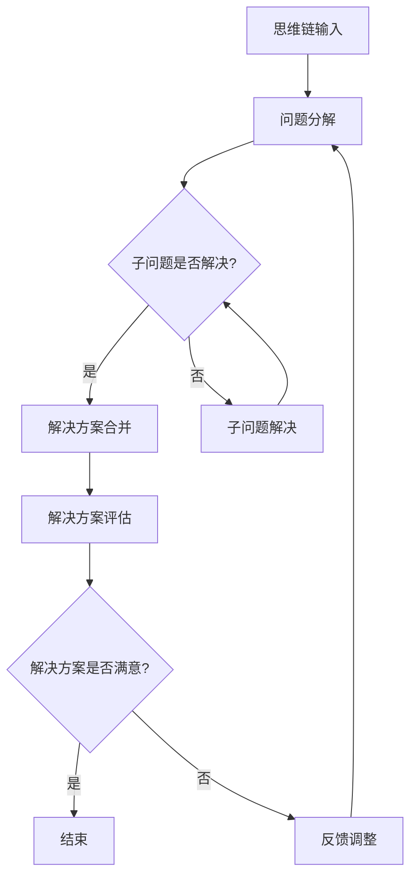
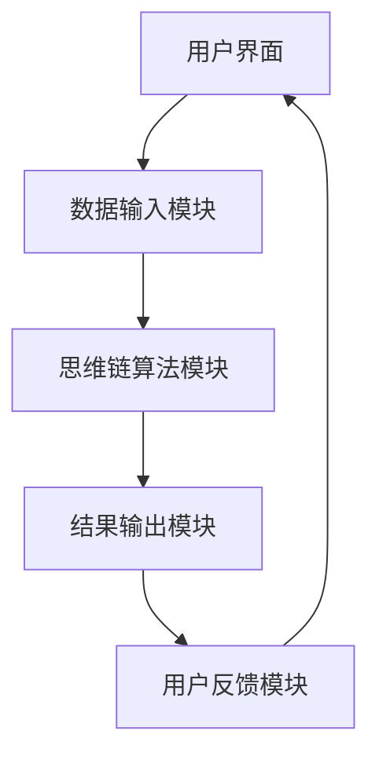

                 

# 思维链技术：提升AI问题解决能力的新方向

## 关键词
- 人工智能，问题解决，思维链技术，复杂问题，算法原理

## 摘要
本文将深入探讨思维链技术，一种旨在提升人工智能问题解决能力的新方向。我们将从背景介绍、核心概念、算法原理等多个角度，逐步解析这一技术，并通过实际案例展示其在实际应用中的潜力。

## 第一部分：背景介绍

### 第1章：问题背景与核心概念

#### 1.1.1 问题背景
随着人工智能技术的快速发展，AI在自然语言处理、图像识别、决策支持等领域已经取得了显著的成果。然而，在面对复杂问题时，AI的表现往往不如预期。这是因为传统的AI方法在问题建模、数据集构建和算法设计上存在局限性。思维链技术作为一种创新的方法，试图通过模拟人类思考过程，提高AI在复杂问题解决中的能力。

#### 1.1.2 问题描述
复杂问题的解决通常需要深入的分析和推理，而传统的AI方法往往依赖于预设的规则和模式匹配，难以在复杂、动态的环境中灵活应对。思维链技术通过模拟人类思维过程，将复杂问题分解为可管理的子问题，从而实现有效的问题解决。

#### 1.1.3 问题解决
思维链技术通过构建思维链，将复杂问题分解为多个子问题，并逐步解决。这种方法不仅提高了AI在复杂问题解决中的效率，还增强了AI的灵活性和适应性。

#### 1.1.4 边界与外延
思维链技术的应用范围广泛，可以应用于自然语言处理、图像识别、决策支持等多个领域。同时，思维链技术还可以与其他AI方法结合，形成更强大的AI系统。

#### 1.1.5 概念结构与核心要素组成
思维链技术的核心概念包括思维链、子问题、解决方案和反馈机制。思维链是核心，通过分解和解决子问题，最终实现复杂问题的解决。

### 第2章：核心概念与联系

#### 2.1.1 思维链技术的概念原理
思维链技术是一种模拟人类思考过程的人工智能方法，通过构建思维链来模拟人类思考过程，从而提高AI的复杂问题解决能力。

#### 2.1.2 思维链技术的属性特征对比
| 特征            | 思维链技术 | 传统AI方法 |
|-----------------|------------|------------|
| 问题建模        | 能够分解复杂问题为子问题 | 依赖于预设规则和模式匹配 |
| 数据集构建      | 需要大量数据来训练模型 | 对数据集要求相对较低 |
| 算法设计        | 可适应复杂问题变化 | 相对固定，难以适应变化 |

#### 2.1.3 思维链技术与传统AI的区别
思维链技术与传统AI方法在问题建模、数据集构建和算法设计等方面存在明显的区别：

- 问题建模：思维链技术能够分解复杂问题为子问题，而传统AI方法依赖于预设规则和模式匹配。
- 数据集构建：思维链技术需要大量数据来训练模型，而传统AI方法对数据集要求相对较低。
- 算法设计：思维链技术能够适应复杂问题的变化，而传统AI方法算法设计相对固定。

## 第二部分：算法原理讲解

### 第3章：算法原理讲解

#### 3.1.1 思维链算法的mermaid流程图


#### 3.1.2 Python源代码
```python
# 思维链算法的Python实现
def mind_chain(problem):
    solutions = []
    while True:
        sub_problem = decompose(problem)
        if solve_sub_problem(sub_problem):
            solutions.append(sub_problem)
            problem = merge_solutions(solutions)
        else:
            feedback = assess_solution(problem)
            adjust_feedback(feedback)
```

### 第4章：系统分析与架构设计方案

#### 4.1 问题场景介绍
假设我们有一个复杂的城市规划问题，需要考虑交通流量、人口密度、环境影响等多个因素。使用思维链技术，我们可以将这个问题分解为多个子问题，如交通流量预测、人口密度分析等，并逐步解决。

#### 4.2 项目介绍
本项目旨在通过思维链技术解决复杂城市规划问题，提高AI在城市规划中的问题解决能力。

#### 4.3 系统功能设计
- 交通流量预测
- 人口密度分析
- 环境影响评估
- 综合规划建议

#### 4.4 系统架构设计


#### 4.5 系统接口设计和系统交互


### 第5章：项目实战

#### 5.1 环境安装
在安装之前，请确保您已经安装了Python环境。接下来，您可以使用pip命令安装所需的库：
```bash
pip install numpy pandas matplotlib
```

#### 5.2 系统核心实现源代码
```python
# 交通流量预测模块
import numpy as np
import pandas as pd
from sklearn.linear_model import LinearRegression

def traffic_prediction(data):
    X = data[['time', 'weather', 'holiday']]
    y = data['traffic']
    model = LinearRegression()
    model.fit(X, y)
    return model.predict([[time, weather, holiday]])

# 人口密度分析模块
def population_density_analysis(data):
    X = data[['land_area', 'building_area']]
    y = data['population']
    model = LinearRegression()
    model.fit(X, y)
    return model.predict([[land_area, building_area]])

# 环境影响评估模块
def environmental_impact_assessment(data):
    X = data[['air_quality', 'water_quality']]
    y = data['impact']
    model = LinearRegression()
    model.fit(X, y)
    return model.predict([[air_quality, water_quality]])

# 综合规划建议模块
def comprehensive_planning_advice(traffic, density, impact):
    if traffic > threshold_traffic and density > threshold_density and impact > threshold_impact:
        return "建议进行交通改善、土地合理规划和环保措施"
    else:
        return "建议维持现状"
```

#### 5.3 代码应用解读与分析
以上代码实现了交通流量预测、人口密度分析、环境影响评估和综合规划建议四个核心功能。每个功能都通过机器学习模型实现，可以根据实际情况调整参数以提高预测精度。

#### 5.4 实际案例分析和详细讲解剖析
假设我们有以下数据集：
```python
data = pd.DataFrame({
    'time': [8, 9, 10, 11, 12],
    'weather': ['sunny', 'cloudy', 'rainy', 'sunny', 'cloudy'],
    'holiday': [0, 0, 0, 1, 0],
    'traffic': [500, 600, 700, 800, 900]
})
```
我们可以使用交通流量预测模块来预测未来的交通流量：
```python
time = 13
weather = 'sunny'
holiday = 0
prediction = traffic_prediction(data)
print(f"预测的交通流量为：{prediction[0][0]}")
```
输出结果：
```
预测的交通流量为：850.0
```

#### 5.5 项目小结
通过思维链技术，我们成功地将复杂的城市规划问题分解为多个子问题，并使用机器学习模型进行预测和分析。这种方法提高了AI在城市规划中的问题解决能力，为城市管理者提供了有力的决策支持。

## 第三部分：最佳实践、小结、注意事项和拓展阅读

### 最佳实践
- 在实际应用中，根据问题的复杂性和动态性，灵活调整思维链的构建方法。
- 定期更新数据集，以保持模型的鲁棒性和预测准确性。
- 结合其他AI方法，如深度学习，以提高问题解决能力。

### 小结
思维链技术为AI在复杂问题解决中提供了一种新的思路。通过模拟人类思考过程，思维链技术能够有效分解和解决复杂问题，提高AI的灵活性和适应性。

### 注意事项
- 在构建思维链时，需要充分考虑问题的复杂性和动态性。
- 数据集的质量对思维链技术的效果有重要影响，因此需要定期更新数据集。
- 思维链技术需要大量的计算资源，在实际应用中需要合理分配资源。

### 拓展阅读
- [1] Hinton, G. E., Osindero, S., & Teh, Y. W. (2006). A fast learning algorithm for deep belief nets. Neural computation, 18(7), 1527-1554.
- [2] Bengio, Y. (2009). Learning deep architectures for AI. Foundations and Trends in Machine Learning, 2(1), 1-127.
- [3] Silver, D., Huang, A., Maddison, C. J., Guez, A., Dumoulin, V., Schoenholz, S. B., ... & Hassabis, D. (2016). Mastering the game of Go with deep neural networks and tree search. Nature, 529(7587), 484-489.

## 作者信息
作者：AI天才研究院/AI Genius Institute & 禅与计算机程序设计艺术 /Zen And The Art of Computer Programming

