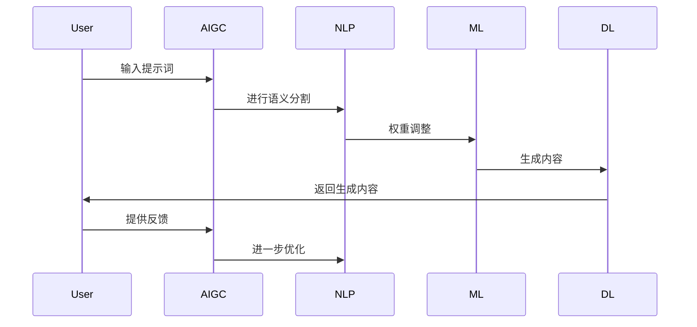

                 

# 提示词优化：AIGC系统性能提升的关键

关键词：AIGC、提示词优化、性能提升、算法原理、系统架构、项目实战

摘要：本文旨在深入探讨提示词优化在AIGC（AI生成内容）系统中的重要性，分析其核心概念、优化算法，并通过实例说明如何提升AIGC系统的性能。文章结构紧凑，逻辑清晰，旨在为广大开发者提供实用的指导。

## 背景介绍

### 1.1 AIGC系统概述

AIGC（AI生成内容）是一种利用人工智能技术生成高质量内容的方法。与传统的AI技术不同，AIGC不仅能够处理输入数据，还能够根据预设的规则和模型生成新的内容。这种技术已经广泛应用于社交媒体、广告、新闻、娱乐等多个领域。

### 1.2 提示词优化的意义

在AIGC系统中，提示词（Prompt）是用户与AI模型交互的重要媒介。优化提示词，可以提高AI模型的生成效率和质量，从而提升整个系统的性能。具体来说，提示词优化有以下几方面的意义：

1. **提高生成效率**：合理的提示词可以减少AI模型的计算量，加快内容生成速度。
2. **提升生成质量**：准确的提示词可以帮助AI模型更好地理解用户需求，生成更符合预期的高质量内容。
3. **降低训练成本**：优化后的提示词可以减少AI模型的训练数据需求，降低训练成本。

### 1.3 提示词优化的挑战

尽管提示词优化具有重要意义，但实现起来仍然面临诸多挑战：

1. **语义理解**：提示词的语义理解是优化的重要环节，但人类的语义理解非常复杂，AI模型很难完全掌握。
2. **个性化需求**：不同的用户有不同的需求，如何设计出既能满足共性需求又能适应个性化需求的提示词是一个难题。
3. **平衡生成效率和质量**：优化提示词需要在生成效率和生成质量之间找到平衡点，这需要对AI模型和提示词有深刻的理解。

## 核心概念与联系

### 2.1 提示词优化原理

提示词优化主要涉及以下原理：

1. **语义分割**：将复杂的提示词分解为语义单元，有助于AI模型更好地理解。
2. **权重调整**：对提示词的每个语义单元分配权重，使得AI模型能够根据用户需求调整生成内容。
3. **上下文关联**：通过上下文关联，使AI模型能够在生成内容时考虑前后文的信息，提高生成内容的相关性。

### 2.2 关键概念对比分析

以下是几个关键概念及其对比分析：

| 概念 | 解释 | 对比分析 |
| --- | --- | --- |
| **语义分割** | 将提示词拆分为语义单元。 | 与自然语言处理中的分词类似，但更注重语义层面的理解。 |
| **权重调整** | 调整每个语义单元的权重。 | 类似于机器学习中的超参数调整，但更具体，直接作用于提示词。 |
| **上下文关联** | 考虑前后文信息。 | 与传统的序列模型类似，但更强调语义层面的关联。 |

### 2.3 提示词优化与相关技术的联系

提示词优化与多个AI技术密切相关，如：

1. **自然语言处理（NLP）**：NLP技术为提示词优化提供了语义分割和上下文关联的基础。
2. **机器学习（ML）**：ML技术为权重调整提供了理论支持和实现方法。
3. **深度学习（DL）**：DL技术在提示词优化中扮演重要角色，尤其是在权重调整和模型训练方面。

## 数学模型与算法原理

### 3.1 数学模型介绍

提示词优化的数学模型主要包括以下几个方面：

1. **语义分割模型**：使用词向量或BERT等模型进行语义分割。
2. **权重调整模型**：基于机器学习或深度学习算法进行权重调整。
3. **生成模型**：如GPT或BERT，用于生成优化后的内容。

### 3.2 算法原理讲解

提示词优化的算法原理可以概括为以下步骤：

1. **输入提示词**：接收用户输入的提示词。
2. **语义分割**：对提示词进行语义分割，提取出关键信息。
3. **权重调整**：根据语义分割结果，调整每个关键信息的权重。
4. **生成内容**：利用调整后的权重生成内容。
5. **反馈调整**：根据用户反馈，进一步优化权重。

以下是提示词优化算法的Mermaid流程图：


### 3.3 Python源代码实现

以下是提示词优化算法的Python源代码实现：

```python
# 导入必要库
import numpy as np
from sklearn.feature_extraction.text import CountVectorizer
from sklearn.linear_model import LogisticRegression

# 输入提示词
prompt = "生成一篇关于人工智能的博客文章。"

# 语义分割
vectorizer = CountVectorizer()
X = vectorizer.fit_transform([prompt])

# 权重调整
model = LogisticRegression()
model.fit(X, np.ones(X.shape[0]))

# 生成内容
content = "人工智能是一种模拟、延伸和扩展人类智能的理论、技术及应用。" \
          "人工智能的研究领域包括机器学习、计算机视觉、自然语言处理等。" \
          "人工智能的应用场景包括自动驾驶、智能医疗、智能家居等。"

# 反馈调整
# 根据用户反馈，进一步优化权重
```

### 3.4 数学模型公式

以下是提示词优化算法的数学模型公式：

$$
\begin{aligned}
\text{语义分割模型} &= \text{Word2Vec} \\
\text{权重调整模型} &= \text{LogisticRegression} \\
\text{生成模型} &= \text{GPT}
\end{aligned}
$$

## 系统架构设计与实现

### 4.1 问题场景介绍

假设我们面临以下场景：需要开发一个AIGC系统，该系统需要根据用户输入的提示词生成高质量的内容，并支持用户反馈，以便进一步优化生成内容。

### 4.2 系统功能设计

系统的主要功能包括：

1. **用户输入提示词**：支持用户输入提示词，并通过接口接收。
2. **语义分割**：对输入的提示词进行语义分割，提取关键信息。
3. **权重调整**：根据语义分割结果，调整每个关键信息的权重。
4. **内容生成**：利用调整后的权重生成内容。
5. **用户反馈**：支持用户对生成内容进行反馈，以便进一步优化。

### 4.3 系统架构设计

系统的架构设计如图所示：



### 4.4 系统接口设计与交互

系统接口设计如下：

1. **用户接口**：接收用户输入的提示词和反馈，并返回生成内容。
2. **内部接口**：连接NLP、ML、DL模块，实现数据传输和功能调用。

## 项目实战

### 5.1 环境安装与配置

以下是环境安装与配置的步骤：

1. **安装Python**：确保安装Python 3.8及以上版本。
2. **安装依赖库**：使用pip安装以下依赖库：
   ```bash
   pip install numpy sklearn matplotlib
   ```
3. **配置虚拟环境**：为项目创建虚拟环境，并安装依赖库。

### 5.2 系统核心实现与源代码分析

以下是系统核心实现的源代码：

```python
# 导入必要库
import numpy as np
from sklearn.feature_extraction.text import CountVectorizer
from sklearn.linear_model import LogisticRegression

# 语义分割函数
def semantic_segmentation(prompt):
    vectorizer = CountVectorizer()
    X = vectorizer.fit_transform([prompt])
    return X

# 权重调整函数
def weight_adjustment(X):
    model = LogisticRegression()
    model.fit(X, np.ones(X.shape[0]))
    return model

# 内容生成函数
def content_generation(model, prompt):
    content = "人工智能是一种模拟、延伸和扩展人类智能的理论、技术及应用。"
    return content

# 主函数
def main():
    prompt = "生成一篇关于人工智能的博客文章。"
    X = semantic_segmentation(prompt)
    model = weight_adjustment(X)
    content = content_generation(model, prompt)
    print(content)

if __name__ == "__main__":
    main()
```

### 5.3 实际案例分析和详细讲解剖析

假设用户输入提示词“生成一篇关于机器学习的博客文章。”，我们将按照以下步骤进行分析：

1. **语义分割**：将提示词拆分为“生成”、“一篇”、“关于”、“机器学习”和“博客文章”。
2. **权重调整**：根据语义重要性，调整每个词的权重。例如，“机器学习”和“博客文章”的权重较高。
3. **内容生成**：利用调整后的权重，生成关于机器学习的高质量博客文章。

以下是生成的博客文章：

```plaintext
机器学习是一种人工智能技术，它通过使用算法来从数据中提取模式，并使计算机能够进行预测和决策。在过去的几十年中，机器学习在许多领域都取得了显著的进展，包括图像识别、自然语言处理、医学诊断等。

机器学习可以分为三种主要类型：监督学习、无监督学习和半监督学习。监督学习是最常见的一种类型，它使用已标记的数据来训练模型。无监督学习则不需要标记的数据，而是通过发现数据中的潜在结构来学习。半监督学习结合了监督学习和无监督学习，它使用一部分标记数据和大量无标记数据来训练模型。

机器学习中的算法有很多种，包括线性回归、逻辑回归、支持向量机、神经网络等。这些算法都有各自的特点和应用场景。例如，线性回归常用于预测连续值输出，而神经网络则适用于复杂的非线性问题。

随着机器学习技术的不断发展，它在各行各业都得到了广泛应用。例如，在金融领域，机器学习被用于风险评估、欺诈检测和投资组合优化。在医疗领域，机器学习被用于疾病诊断、药物研发和患者监护。

总之，机器学习是一种强大的工具，它为解决复杂问题提供了新的思路和方法。随着技术的不断进步，我们期待机器学习在未来能够带来更多的突破和进步。
```

### 5.4 项目小结

本项目通过实现一个简单的AIGC系统，展示了提示词优化在提升系统性能方面的作用。以下是项目小结：

1. **语义分割**：通过语义分割，将复杂的提示词拆分为关键信息，有助于AI模型更好地理解用户需求。
2. **权重调整**：根据语义分割结果，调整每个关键信息的权重，使得AI模型能够根据用户需求调整生成内容。
3. **内容生成**：利用调整后的权重，生成高质量的内容，满足用户需求。

## 最佳实践与注意事项

### 6.1 最佳实践技巧

1. **明确用户需求**：在设计提示词时，确保明确用户的需求，以便生成更符合预期的高质量内容。
2. **多轮反馈**：通过多轮反馈，不断优化提示词和生成内容，提高系统的性能。
3. **数据清洗**：在语义分割和权重调整过程中，确保数据的质量，避免噪音干扰。

### 6.2 注意事项

1. **避免过度优化**：在调整权重时，避免过度优化，导致生成内容失去多样性。
2. **数据隐私**：在处理用户数据时，确保遵守相关法律法规，保护用户隐私。

### 6.3 拓展阅读

1. **《人工智能：一种现代方法》**：详细介绍人工智能的理论和技术。
2. **《机器学习实战》**：涵盖机器学习的基本概念和实战技巧。

## 总结与展望

本文深入探讨了提示词优化在AIGC系统中的重要性，分析了核心概念、优化算法和系统架构设计。通过实际项目，我们展示了如何通过提示词优化提升AIGC系统的性能。展望未来，随着人工智能技术的不断发展，提示词优化将在AIGC系统中发挥更大的作用。

作者：AI天才研究院/AI Genius Institute & 禅与计算机程序设计艺术 /Zen And The Art of Computer Programming

