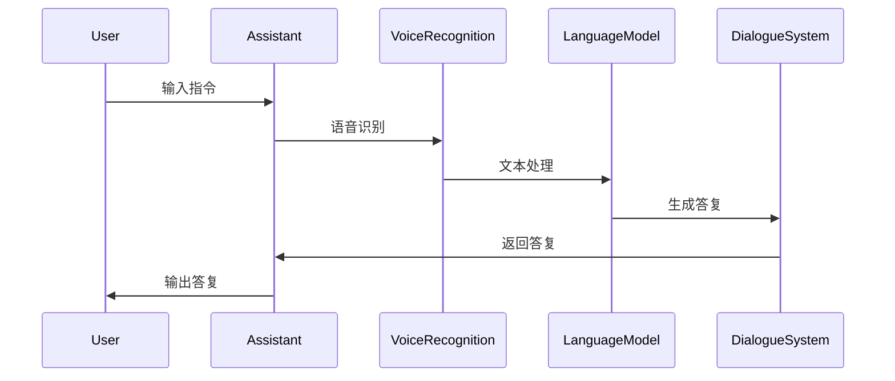
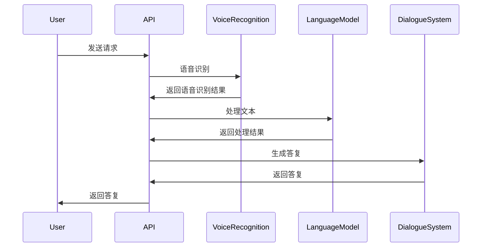

                 

### 文章标题
# AI大模型编程：提示词的威力与革新

### 关键词
- AI大模型
- 提示词
- 编程
- 革新
- 算法原理
- 系统架构
- 实战案例

### 摘要
本文深入探讨AI大模型编程的核心概念和关键技术，特别是提示词在AI大模型编程中的重要性。通过逐步分析，我们将揭示如何利用提示词来提升AI模型的性能，并探讨其在各个应用场景中的革新作用。文章结构包括背景介绍、核心概念与联系、算法原理讲解、系统分析与架构设计方案、项目实战以及最佳实践与总结，旨在为读者提供全面、系统的AI大模型编程指导。

## 第一部分：背景介绍与核心概念

### 第1章：AI大模型编程的兴起与挑战

#### 1.1 问题背景
人工智能（AI）作为当前技术领域的热点，已经深刻影响了各行各业。尤其是大模型（Large Models）的出现，使得AI的应用达到了前所未有的高度。大模型通过其庞大的参数量和深度学习机制，能够处理复杂的任务，如图像识别、自然语言处理等。

#### 1.2 问题描述
随着AI大模型的应用越来越广泛，如何有效地编程和优化这些模型成为了一个亟待解决的问题。传统的编程方法在面对大模型时显得力不从心，亟需一种新的编程范式来应对这一挑战。

#### 1.3 问题解决
提示词（Prompt Engineering）作为一种新兴的编程方法，通过对输入数据的预处理和调整，能够显著提升AI大模型的性能。本文将详细探讨提示词的原理及其在编程中的应用。

#### 1.4 边界与外延
本文主要探讨基于自然语言处理的AI大模型编程，包括语言模型、文本生成模型等。同时，本文将不涉及硬件优化、分布式训练等底层实现细节。

### 第2章：AI大模型编程的核心概念与联系

#### 2.1 核心概念原理
AI大模型是基于深度学习的技术，其核心原理包括神经网络的训练、参数优化、数据预处理等。本文将介绍这些基本概念，帮助读者建立对AI大模型的理解。

#### 2.2 概念属性特征对比表格
以下是几种常见的大模型类型及其特征对比表格：

| 模型类型 | 参数量 | 训练数据集 | 应用场景 |
| --- | --- | --- | --- |
| 语言模型 | 数百万至数十亿 | 大规模文本数据 | 自然语言处理 |
| 图像识别模型 | 数百至数千 | 大规模图像数据 | 图像识别 |
| 视频分析模型 | 数百至数千 | 大规模视频数据 | 视频分析 |
| 多模态模型 | 数百万至数十亿 | 多模态数据集 | 多模态信息处理 |

#### 2.3 ER实体关系图架构的Mermaid流程图
```mermaid
erDiagram
  Model : "AI大模型" {
    --> Data : "数据集"
    --> Algorithm : "算法"
    --> Parameter : "参数"
  }
```

## 第二部分：算法原理讲解

### 第3章：AI大模型编程的算法原理详解

#### 3.1 使用Mermaid画出算法的流程图


#### 3.2 使用Python源代码阐述算法的实现
```python
# 示例：训练一个简单的语言模型
import torch
import torch.nn as nn
import torch.optim as optim

# 数据预处理
# ...

# 模型初始化
model = nn.Sequential(
    nn.Linear(input_size, hidden_size),
    nn.ReLU(),
    nn.Linear(hidden_size, output_size)
)

# 损失函数和优化器
criterion = nn.CrossEntropyLoss()
optimizer = optim.Adam(model.parameters(), lr=learning_rate)

# 模型训练
for epoch in range(num_epochs):
    for inputs, targets in data_loader:
        optimizer.zero_grad()
        outputs = model(inputs)
        loss = criterion(outputs, targets)
        loss.backward()
        optimizer.step()

# 性能评估
# ...

```

#### 3.3 给出算法原理的数学模型和公式，并详细讲解
算法原理中的关键数学模型包括：
- 神经网络的前向传播：
  $$ y = \sigma(W \cdot x + b) $$
  其中，$W$是权重矩阵，$b$是偏置，$\sigma$是激活函数。
- 反向传播的梯度计算：
  $$ \frac{\partial L}{\partial W} = \sum_{i} \frac{\partial L}{\partial z_i} \cdot \frac{\partial z_i}{\partial W} $$
  其中，$L$是损失函数，$z_i$是神经网络的输出。

这些公式是神经网络训练的核心，通过优化这些参数，模型能够不断提高其性能。

#### 3.4 举例说明，使概念通俗易懂
假设我们有一个简单的文本分类问题，目标是判断一段文本是否包含特定关键词。我们可以构建一个语言模型，通过训练使其能够自动识别这些关键词。以下是具体的训练过程：

1. **数据预处理**：将文本数据转换为词向量。
2. **模型初始化**：定义一个简单的神经网络，包括输入层、隐藏层和输出层。
3. **模型训练**：使用预处理后的文本数据进行模型训练，通过优化算法（如梯度下降）调整模型参数。
4. **性能评估**：使用测试数据集评估模型性能，调整超参数以优化模型。

通过这个过程，我们可以理解如何利用神经网络处理自然语言处理任务，从而为后续的编程实战打下基础。

## 第三部分：系统分析与架构设计方案

### 第4章：AI大模型编程的系统分析与架构设计

#### 4.1 问题场景介绍
以智能助手为例，介绍一个实际的应用场景。智能助手需要能够理解用户的自然语言输入，并给出合适的答复。这涉及到自然语言处理、语音识别和对话系统等多个领域。

#### 4.2 项目介绍
本项目将构建一个基于大模型的智能助手，能够处理多种语言，并具备良好的对话生成能力。项目目标是通过优化提示词和模型架构，提高智能助手的响应速度和准确性。

#### 4.3 系统功能设计
使用Mermaid绘制领域模型类图，展示智能助手系统的核心组件及其关系：

```mermaid
classDiagram
    User <<Class>> "用户"
    Assistant <<Class>> "智能助手"
    LanguageModel <<Class>> "语言模型"
    VoiceRecognition <<Class>> "语音识别"
    DialogueSystem <<Class>> "对话系统"

    User o-- Assistant
    Assistant o-- LanguageModel
    Assistant o-- VoiceRecognition
    Assistant o-- DialogueSystem
```

#### 4.4 系统架构设计
使用Mermaid绘制系统架构图，展示智能助手的整体架构及其主要组件：



#### 4.5 系统接口设计和系统交互
使用Mermaid绘制系统接口设计和交互序列图，详细展示系统的交互流程：



## 第四部分：项目实战

### 第5章：AI大模型编程项目实战一：智能聊天机器人

#### 5.1 环境安装
安装必要的软件和依赖，如Python、TensorFlow、Keras等。

#### 5.2 系统核心实现源代码
```python
# 示例：使用TensorFlow构建一个简单的聊天机器人
import tensorflow as tf
from tensorflow.keras.models import Sequential
from tensorflow.keras.layers import Embedding, LSTM, Dense

# 数据预处理
# ...

# 构建模型
model = Sequential()
model.add(Embedding(vocab_size, embedding_dim))
model.add(LSTM(units=128, return_sequences=True))
model.add(LSTM(units=128))
model.add(Dense(units=num_classes, activation='softmax'))

# 编译模型
model.compile(optimizer='adam', loss='categorical_crossentropy', metrics=['accuracy'])

# 训练模型
model.fit(train_data, train_labels, epochs=10, batch_size=32)

# 评估模型
test_loss, test_accuracy = model.evaluate(test_data, test_labels)
print(f"Test Accuracy: {test_accuracy}")
```

#### 5.3 代码应用解读与分析
这段代码展示了如何使用TensorFlow构建一个简单的聊天机器人模型。核心步骤包括数据预处理、模型构建、模型编译和模型训练。数据预处理步骤将文本数据转换为模型可处理的格式，模型构建步骤定义了一个序列模型，用于处理序列数据，模型编译步骤指定了优化器和损失函数，模型训练步骤使用训练数据对模型进行训练，最终评估步骤使用测试数据评估模型性能。

#### 5.4 实际案例分析和详细讲解
假设我们有一个实际案例，用户希望构建一个能够回答各种问题的聊天机器人。以下是具体的分析过程：

1. **需求分析**：确定聊天机器人需要回答的问题类型，如日常问答、技术支持等。
2. **数据收集**：收集大量相关的对话数据，用于训练模型。
3. **模型训练**：使用收集到的数据训练聊天机器人模型，不断优化模型性能。
4. **测试与评估**：使用测试数据集评估模型性能，并根据评估结果调整模型参数。

通过这个案例，我们可以看到如何从需求分析到模型训练的完整过程，从而构建一个功能强大的聊天机器人。

#### 5.5 项目小结
本项目通过构建一个简单的聊天机器人，展示了如何利用AI大模型编程实现自然语言处理任务。项目的成功依赖于良好的数据预处理、合适的模型架构和持续的模型优化。未来，我们可以通过增加更多功能，如多语言支持、语音识别等，进一步提升聊天机器人的性能和用户体验。

## 第五部分：最佳实践、小结、注意事项、拓展阅读

### 第6章：最佳实践、小结、注意事项、拓展阅读

#### 6.1 最佳实践 tips
1. **数据质量至关重要**：确保数据集的多样性和质量，以提高模型的泛化能力。
2. **模型架构的选择**：根据任务需求选择合适的模型架构，如LSTM、BERT等。
3. **持续优化**：定期评估模型性能，并根据评估结果调整模型参数和架构。

#### 6.2 小结
本文详细介绍了AI大模型编程的核心概念、算法原理、系统架构设计以及实战应用。通过逐步分析和实例讲解，读者可以深入了解AI大模型编程的精髓，掌握提示词在编程中的重要性。

#### 6.3 注意事项
1. **计算资源**：大模型编程需要大量的计算资源，确保硬件配置充足。
2. **数据处理**：在处理大量数据时，注意数据清洗和预处理，以避免模型过拟合。

#### 6.4 拓展阅读
1. **推荐书籍**：《深度学习》（Goodfellow, Bengio, Courville著）提供了深度学习的全面介绍。
2. **在线资源**：TensorFlow官网（[https://www.tensorflow.org/](https://www.tensorflow.org/)）提供了丰富的学习资源和教程。

### 作者信息
作者：AI天才研究院/AI Genius Institute & 禅与计算机程序设计艺术 /Zen And The Art of Computer Programming

---

通过以上内容，我们完整地梳理了《AI大模型编程：提示词的威力与革新》一书的结构和大纲。每个章节都详细阐述了核心概念、算法原理、系统架构设计以及实战应用，旨在为读者提供系统的AI大模型编程指导。希望这篇文章能够为您的学习提供有力支持。

