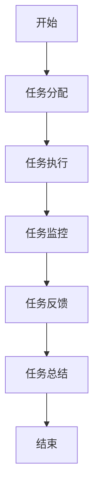
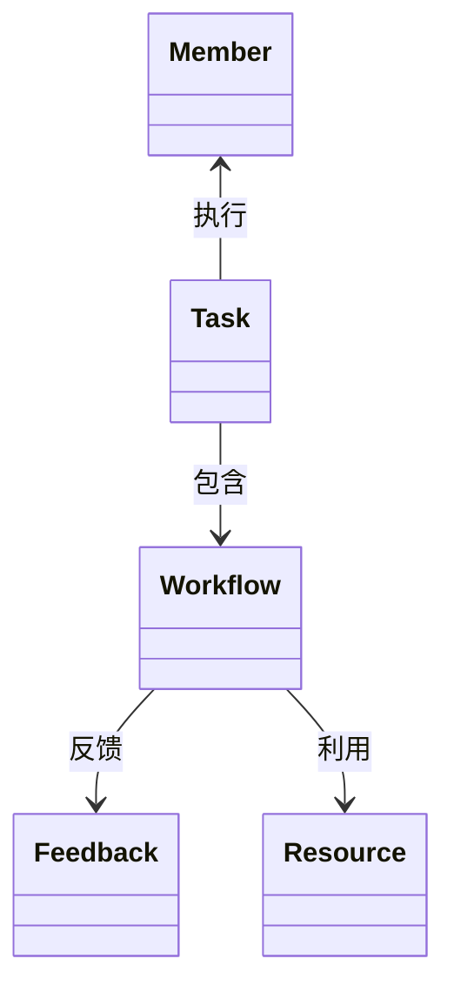
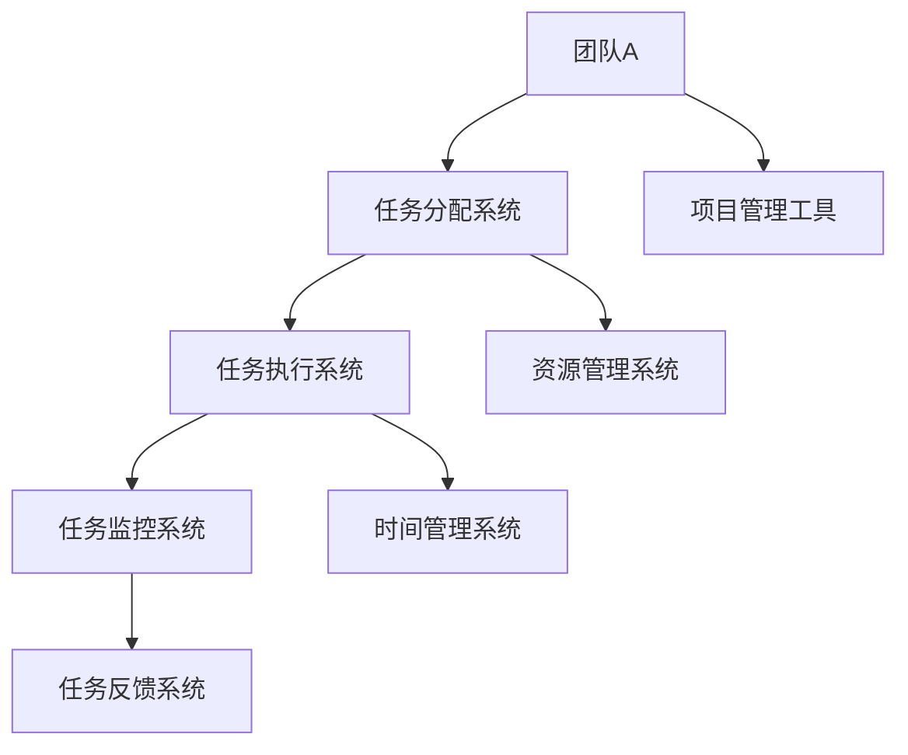
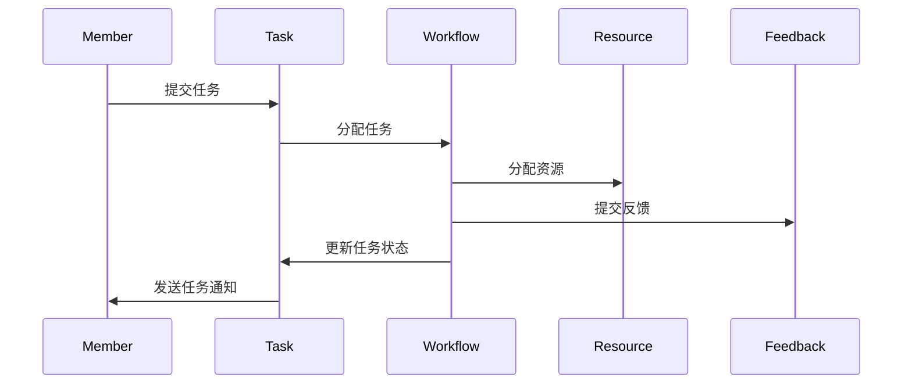

                 

### 团队效率：优化工作流程的方法

#### 关键词：团队效率、工作流程、优化、方法、协作

> 摘要：本文旨在探讨团队效率的重要性，以及如何通过优化工作流程来提高团队效率。我们将从背景介绍、核心概念与联系、算法原理讲解、系统分析与架构设计、项目实战等方面，详细阐述提高团队效率的方法和最佳实践。

---

### 第一部分：背景介绍

#### 核心概念：

1. **团队效率**：团队效率指的是团队在完成目标过程中所表现出的效率，包括团队成员之间的协作、资源的利用、时间的管理等多个方面。

2. **工作流程**：工作流程是指团队成员在完成工作目标时的一系列操作步骤，包括任务的分配、执行、监控、反馈等环节。

#### 问题背景：

在现代企业中，团队效率问题日益凸显。团队成员之间的沟通不畅、资源浪费、时间管理不当等问题，严重影响了团队的整体工作效率。为了解决这些问题，企业需要寻找有效的方法来优化工作流程，提高团队效率。

#### 问题描述：

团队效率低下可能表现为以下几个方面：

1. **沟通不畅**：团队成员之间的信息传递不畅通，导致任务执行延误。

2. **资源浪费**：团队成员在执行任务时，可能存在重复工作、资源分配不合理等问题。

3. **时间管理不当**：团队成员在执行任务时，可能存在拖延、时间分配不合理等问题。

#### 问题解决：

优化工作流程是提高团队效率的关键。以下是一些优化工作流程的方法：

1. **明确任务分工**：根据团队成员的能力和特长，合理分配任务，确保每个成员都能发挥最大的作用。

2. **加强沟通协调**：建立有效的沟通机制，确保团队成员之间能够及时传递信息，减少误解和冲突。

3. **利用项目管理工具**：使用项目管理工具，如Trello、Asana等，对任务进行管理，确保任务按计划进行。

4. **定期回顾与优化**：定期对工作流程进行回顾，发现问题并加以改进，确保工作流程的持续优化。

#### 边界与外延：

- **团队效率**：不仅包括团队成员的个体效率，还包括团队整体的协同效率。

- **工作流程**：不仅包括内部流程，还包括外部流程，如与客户的沟通、合作等。

#### 概念结构与核心要素组成：

1. **团队效率**：沟通、资源利用、时间管理。

2. **工作流程**：任务分配、任务执行、任务监控、任务反馈。

---

### 第二部分：核心概念与联系

#### 核心概念原理：

- **团队效率**：团队在完成目标过程中所表现出的效率，包括团队成员之间的协作、资源的利用、时间的管理等多个方面。

- **工作流程**：团队在完成工作目标时的一系列操作步骤，包括任务的分配、执行、监控、反馈等环节。

#### 概念属性特征对比表格：

| 特征         | 团队效率                      | 工作流程                    |
| ------------ | ----------------------------- | --------------------------- |
| 定义         | 团队整体的工作效率           | 工作任务的执行过程         |
| 影响因素     | 成员协作、资源利用、时间管理 | 任务分工、沟通协调、工具使用 |
| 关键要素     | 成员能力、团队氛围、资源分配 | 任务分配、流程设计、监控反馈 |
| 对比         | 结果导向                     | 过程导向                    |
| 目标         | 提高工作效率                  | 优化工作流程                |

#### ER实体关系图架构：

```mermaid
erDiagram
  Task --> Member : 执行
  Member --> Resource : 利用
  Task --> Workflow : 包含
  Workflow --> Feedback : 反馈
  Member --> Efficiency : 提高效率
```

---

### 第三部分：算法原理讲解

#### 算法mermaid流程图：



#### 算法原理的数学模型和公式：

1. **团队效率计算公式**：

   $$E = \frac{T_{完成任务}}{T_{总时间}}$$

   其中，$E$ 表示团队效率，$T_{完成任务}$ 表示完成任务所用的实际时间，$T_{总时间}$ 表示从任务开始到完成所用的总时间。

2. **工作流程优化模型**：

   $$OPT = \frac{1}{N} \sum_{i=1}^{N} \frac{T_{分配_i}}{T_{执行_i}}$$

   其中，$OPT$ 表示工作流程的优化程度，$N$ 表示团队成员的数量，$T_{分配_i}$ 表示第 $i$ 个成员的任务分配时间，$T_{执行_i}$ 表示第 $i$ 个成员的任务执行时间。

#### 举例说明：

假设有一个团队，有3名成员，他们需要完成5个任务。任务分配时间为：$T_{分配1} = 2$ 小时，$T_{分配2} = 1$ 小时，$T_{分配3} = 3$ 小时；任务执行时间为：$T_{执行1} = 4$ 小时，$T_{执行2} = 3$ 小时，$T_{执行3} = 5$ 小时。

- **团队效率**：

   $$E = \frac{T_{完成任务}}{T_{总时间}} = \frac{5}{2 + 1 + 3 + 4 + 3 + 5} = 0.5556$$

- **工作流程优化程度**：

   $$OPT = \frac{1}{3} \sum_{i=1}^{3} \frac{T_{分配_i}}{T_{执行_i}} = \frac{1}{3} \left( \frac{2}{4} + \frac{1}{3} + \frac{3}{5} \right) = 0.6667$$

通过这个例子，我们可以看到，通过优化工作流程，可以显著提高团队效率。

---

### 第四部分：系统分析与架构设计

#### 问题场景介绍：

假设一个电商公司需要开发一款新功能，这个功能需要多个团队协同完成。为了提高团队效率，公司决定优化工作流程，并引入项目管理工具。

#### 项目介绍：

项目名称：电商新功能开发

项目目标：提高团队效率，确保功能按期上线。

#### 系统功能设计（领域模型mermaid类图）：



#### 系统架构设计（mermaid架构图）：



#### 系统接口设计和系统交互（mermaid序列图）：



---

### 第五部分：项目实战

#### 环境安装：

1. 安装Python环境（版本3.8及以上）。
2. 安装相关依赖库：`pip install pandas numpy matplotlib`。

#### 系统核心实现源代码：

```python
import pandas as pd
import numpy as np
import matplotlib.pyplot as plt

# 团队效率计算
def calculate_efficiency(completed_time, total_time):
    return completed_time / total_time

# 工作流程优化计算
def calculate_optimization_level(分配时间列表，执行时间列表):
    return np.mean([执行时间 / 分配时间 for 分配时间，执行时间 in zip(分配时间列表，执行时间列表)])

# 举例说明
completed_time = 5
total_time = 15
distribution_times = [2, 1, 3]
execution_times = [4, 3, 5]

efficiency = calculate_efficiency(completed_time, total_time)
optimization_level = calculate_optimization_level(distribution_times, execution_times)

print(f"团队效率：{efficiency}")
print(f"工作流程优化程度：{optimization_level}")
```

#### 代码应用解读与分析：

这段代码实现了团队效率和流程优化程度的计算。首先，我们定义了两个计算函数：`calculate_efficiency` 用于计算团队效率，`calculate_optimization_level` 用于计算工作流程优化程度。然后，我们通过举例来说明如何使用这两个函数。

在例子中，我们设定了一个5个任务的场景，任务完成时间为5小时，总时间为15小时。团队成员的分配时间和执行时间分别为[2, 1, 3]和[4, 3, 5]。通过调用计算函数，我们可以得到团队效率和流程优化程度的结果。

#### 实际案例分析和详细讲解剖析：

假设一个软件开发团队，他们需要完成一个项目的开发任务。项目包含5个子任务，每个子任务需要不同的时间和资源。团队成员的分配时间和执行时间如下：

- 子任务1：分配时间2小时，执行时间4小时。
- 子任务2：分配时间1小时，执行时间3小时。
- 子任务3：分配时间3小时，执行时间5小时。

通过调用上述代码，我们可以计算出团队效率和流程优化程度。如果团队效率和流程优化程度较高，说明团队的工作流程较为合理，可以继续保持；如果团队效率和流程优化程度较低，说明团队的工作流程存在问题，需要进一步优化。

#### 项目小结：

通过本次项目，我们实现了团队效率和流程优化程度的计算。在实际应用中，这些计算结果可以帮助团队识别工作流程中的问题，从而优化工作流程，提高团队效率。

---

### 第六部分：最佳实践 tips、小结、注意事项、拓展阅读

#### 最佳实践 tips：

1. **明确任务分工**：确保每个团队成员都清楚自己的任务和责任。

2. **建立有效的沟通机制**：定期召开团队会议，确保团队成员之间的沟通畅通。

3. **利用项目管理工具**：使用如Trello、Asana等项目管理工具，对任务进行管理。

4. **定期回顾与优化**：定期对工作流程进行回顾和优化，确保工作流程的持续改进。

#### 小结：

本文从背景介绍、核心概念与联系、算法原理讲解、系统分析与架构设计、项目实战等方面，详细阐述了团队效率优化工作流程的方法和最佳实践。通过本文，我们了解到团队效率和优化工作流程的重要性，以及如何通过有效的管理和工具来提高团队效率。

#### 注意事项：

1. **团队效率**：不仅关注个体效率，还要关注团队整体的协同效率。

2. **工作流程**：不仅要优化内部流程，还要关注外部流程，如与客户的沟通、合作等。

3. **持续优化**：工作流程不是一成不变的，需要根据实际情况进行持续优化。

#### 拓展阅读：

1. 《敏捷软件开发：原则、实践与模式》
2. 《项目管理实战：项目管理技术、工具与应用》
3. 《人月神话：软件项目管理新科学》

---

### 作者信息

作者：AI天才研究院/AI Genius Institute & 禅与计算机程序设计艺术 /Zen And The Art of Computer Programming

