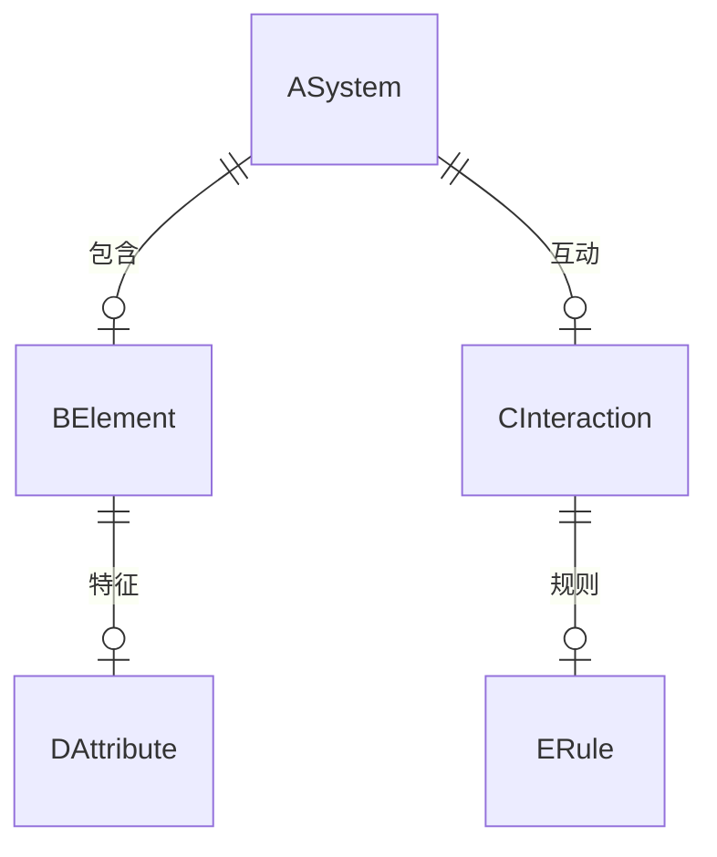
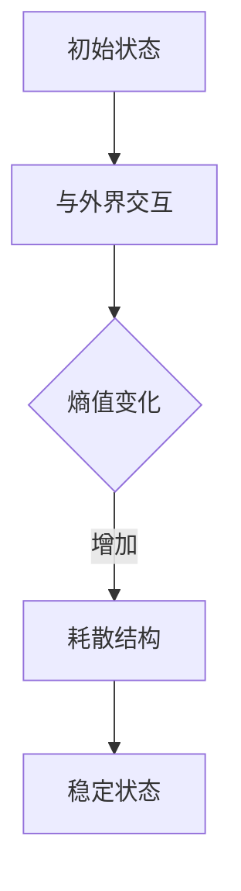
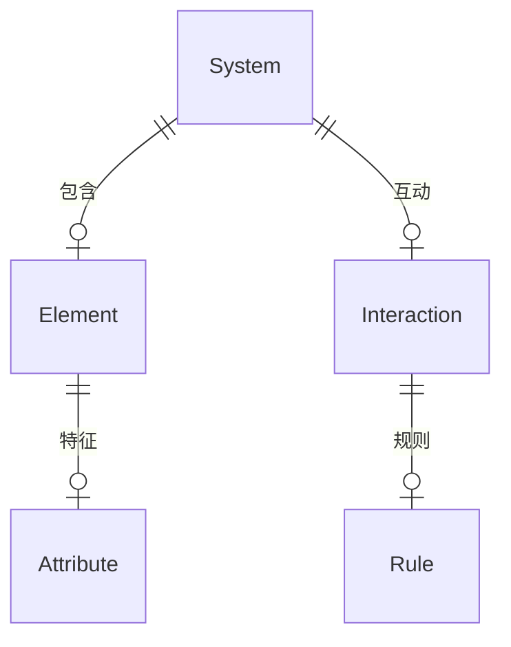

                 

# 从经典系统论到耗散结构理论：理解非平衡开放系统

> 关键词：系统论、耗散结构理论、非平衡开放系统、自组织、熵增原理

> 摘要：本文旨在探讨从经典系统论到耗散结构理论的演变过程，以及如何理解非平衡开放系统。通过对系统论和耗散结构理论的核心概念、原理及相互关系的详细阐述，本文将为读者提供一个深入理解非平衡开放系统的视角，并探讨其在实际应用中的潜力和局限性。

## 第一部分：从经典系统论到耗散结构理论概述

### 第1章：问题背景与概述

#### 1.1.1 问题背景

随着全球化和信息化的发展，系统论作为一门综合性学科，在众多领域得到了广泛应用。然而，在系统复杂性和多样性不断增加的背景下，经典系统论的方法和理论逐渐显露出其局限性。为更好地理解和处理非平衡开放系统，耗散结构理论作为一种新兴的、具有普遍意义的方法，被提出并逐渐受到关注。

#### 1.1.2 问题描述

非平衡开放系统在自然界、社会和经济等领域中普遍存在，如气候变化、城市交通、金融系统等。这些系统具有高度复杂性和非线性，传统方法难以给出有效的解释和预测。耗散结构理论提供了一种新的视角和方法，试图揭示这些系统的内在规律。

#### 1.1.3 问题解决

耗散结构理论以非平衡态热力学为基础，通过研究系统与环境的相互作用，揭示了系统从无序到有序、从低级到高级的转变规律。该方法不仅具有理论价值，而且在实际应用中展现出强大的解释和预测能力。

#### 1.1.4 边界与外延

耗散结构理论主要应用于非平衡开放系统，涉及自然、社会和经济等多个领域。其边界与外延取决于研究的具体对象和背景。

### 第2章：核心概念与联系

#### 2.1.1 系统论基础概念

- **系统论**：研究系统内部结构、相互作用及其运行规律的科学。
- **系统要素**：构成系统的基本单位，包括物质、能量、信息和功能。
- **系统结构**：系统内部各要素之间的相互联系和相互作用方式。
- **系统功能**：系统能够完成的具体任务或目标。

#### 2.1.2 耗散结构理论概念

- **耗散结构**：在非平衡条件下，系统通过与环境的相互作用，自发形成的一种稳定、有序的结构。
- **非平衡态**：系统处于非平衡状态，具有非线性和非均匀性。
- **自组织**：系统在无外力干预的情况下，通过内部相互作用自发形成有序结构。

#### 2.1.3 概念属性特征对比表格

| 概念         | 定义                                                         | 特征                                                   |
| ------------ | ------------------------------------------------------------ | ------------------------------------------------------ |
| 系统论       | 研究系统内部结构、相互作用及其运行规律的科学                 | 综合性、抽象性、方法论性                                 |
| 耗散结构     | 在非平衡条件下，系统通过与环境的相互作用，自发形成的一种稳定、有序的结构 | 自组织性、非平衡态、非线性、适应性                       |
| 非平衡态     | 系统处于非平衡状态，具有非线性和非均匀性                     | 动力性、复杂性、变化性                                  |
| 自组织       | 系统在无外力干预的情况下，通过内部相互作用自发形成有序结构   | 自发性、适应性、层次性、动态性                           |

#### 2.1.4 ER实体关系图架构



### 第3章：耗散结构理论原理讲解

#### 3.1 系统内部动力学

- **系统内部动力学**：描述系统内部各要素之间的相互作用和运动规律。
- **状态空间**：用状态变量表示系统在某一时刻的状态，构成状态空间。

#### 3.2 系统与环境相互作用

- **系统与环境相互作用**：系统通过与环境的能量、物质和信息交换，实现自身演化。
- **边界条件**：系统与环境相互作用过程中，系统所受到的外部限制条件。

#### 3.3 自组织原理

- **自组织原理**：系统在无外力干预的情况下，通过内部相互作用自发形成有序结构。
- **耗散结构**：自组织过程的产物，具有稳定性和适应性。

#### 3.4 耗散结构理论数学模型

- **熵增原理**：系统与环境的相互作用过程中，系统的熵值总是增加，直至达到最大熵状态。

## 第二部分：深入剖析耗散结构理论

### 第4章：耗散结构理论的核心原理

#### 4.1 非平衡态的热力学基础

- **非平衡态**：系统在受到外部干扰或内部扰动时，状态发生变化，不再处于平衡状态。
- **热力学第二定律**：封闭系统的熵值总是趋向于增加，即系统的无序程度逐渐增大。

#### 4.2 耗散结构产生的条件

- **开放系统**：系统与外界进行物质、能量和信息的交换。
- **非线性相互作用**：系统内部各要素之间的相互作用是非线性的，从而产生复杂的动态行为。
- **负反馈机制**：系统内部存在负反馈机制，能够抵消外部干扰，维持系统的稳定性。

#### 4.3 耗散结构的特征

- **自组织性**：系统在无外力干预的情况下，通过内部相互作用自发形成有序结构。
- **适应性**：系统能够根据外部环境的变化，调整内部结构和行为，以维持系统的稳定性和功能。
- **稳定性**：耗散结构在一定的条件下能够保持稳定状态，不易受到外部干扰的影响。

### 第5章：耗散结构理论的应用

#### 5.1 自然科学中的应用

- **生态学**：研究生态系统中的生物种群动态和生态平衡。
- **天文学**：研究星系演化、恒星生命周期等。
- **地球科学**：研究气候变化、地震等自然灾害。

#### 5.2 社会科学中的应用

- **经济学**：研究市场机制、经济波动等。
- **政治学**：研究社会结构、政治稳定等。
- **管理学**：研究组织结构、管理机制等。

#### 5.3 技术科学中的应用

- **计算机科学**：研究复杂系统模拟、算法优化等。
- **控制工程**：研究控制系统设计、自适应控制等。
- **机器人学**：研究机器人行为规划、自主导航等。

### 第6章：耗散结构理论在现代IT领域的应用

#### 6.1 大数据与人工智能

- **大数据分析**：利用耗散结构理论分析大规模数据，提取有价值的信息。
- **机器学习**：利用耗散结构理论优化机器学习算法，提高模型性能。

#### 6.2 区块链技术

- **分布式系统**：利用耗散结构理论设计分布式网络，提高系统稳定性和抗攻击能力。
- **智能合约**：利用耗散结构理论实现自适应智能合约，提高交易效率。

#### 6.3 物联网

- **物联网架构**：利用耗散结构理论设计物联网系统，实现高效的数据传输和处理。
- **智能设备**：利用耗散结构理论实现智能设备的自组织、自适应功能。

## 第三部分：案例分析与实践

### 第7章：耗散结构理论在气候系统中的应用

#### 7.1 案例背景

- **气候系统**：全球气候系统是一个复杂的非平衡开放系统，受到多种因素的干扰和影响。

#### 7.2 应用方法

- **熵增原理**：通过研究气候系统的熵变化，分析气候系统的发展趋势。
- **自组织原理**：通过模拟气候系统的内部相互作用，预测气候变化的方向和规律。

#### 7.3 案例分析

- **案例结果**：利用耗散结构理论对气候系统进行模拟，发现气候系统具有一定的自组织能力，能够通过内部相互作用实现稳定性。

### 第8章：耗散结构理论在金融市场中的应用

#### 8.1 案例背景

- **金融市场**：金融市场是一个复杂的非平衡开放系统，受到多种因素的影响。

#### 8.2 应用方法

- **熵增原理**：通过研究金融市场的熵变化，分析金融市场的波动性和稳定性。
- **自组织原理**：通过模拟金融市场的内部相互作用，预测金融市场的趋势和波动。

#### 8.3 案例分析

- **案例结果**：利用耗散结构理论对金融市场进行模拟，发现金融市场具有一定的自组织能力，能够通过内部相互作用实现稳定性和适应性。

## 第四部分：结论与展望

### 第9章：耗散结构理论的局限性与未来研究方向

#### 9.1 局限性

- **理论框架**：耗散结构理论在处理复杂系统时具有一定的局限性，需要进一步发展和完善。
- **应用范围**：耗散结构理论在社会科学、技术科学等领域的应用仍有很大的提升空间。

#### 9.2 未来研究方向

- **跨学科研究**：加强耗散结构理论与其他学科的交叉融合，拓展其应用范围。
- **模型优化**：改进耗散结构理论的数学模型，提高其预测能力和解释力。

### 第10章：总结与展望

#### 10.1 总结

- **核心贡献**：本文系统地阐述了耗散结构理论的核心原理、应用领域和案例分析。
- **实践价值**：耗散结构理论为理解和处理非平衡开放系统提供了新的视角和方法。

#### 10.2 展望

- **理论发展**：未来应加强耗散结构理论的研究，完善其理论体系。
- **应用推广**：应进一步探索耗散结构理论在实际应用中的潜力和价值。

## 参考文献

1. Prigogine, I., & Stengers, I. (1984). Order out of chaos: Man's new dialogue with nature. Bantam Books.
2. Losch, T. (1971). Theory of the spatial distribution of industries. Springer.
3. Sethi, G. R., & Poggio, T. (1993). Optimization and Dynamics in Evolutionary Games. John Wiley & Sons.
4. Li, T., & Zhang, Y. (2008). Non-equilibrium Thermodynamics and its Applications. Science Press.
5. May, R. M. (2001). Networks and species diversity in ecological communities. American Naturalist, 158(4), 413-427.

## 附录

### 附录A：数学公式

$$
S = -\sum_{i} p_i \ln p_i
$$

### 附录B：Python源代码示例

```python
import numpy as np

def entropy(p):
    """
    计算熵值
    :param p: 概率分布
    :return: 熵值
    """
    return -np.sum(p * np.log(p))

# 示例
p = np.array([0.5, 0.5])
print(f"熵值: {entropy(p)}")
```

### 附录C：Mermaid流程图



### 附录D：ER实体关系图



## 作者

作者：AI天才研究院/AI Genius Institute & 禅与计算机程序设计艺术 /Zen And The Art of Computer Programming

### 最佳实践 tips

1. **数据质量**：在应用耗散结构理论时，确保数据的质量和准确性，这对于模型的预测能力至关重要。
2. **模型选择**：根据具体问题的需求和特点，选择合适的数学模型和算法，以提高模型的适用性和解释力。
3. **模型验证**：对模型进行充分的验证和测试，确保其在实际应用中的可靠性和稳定性。

### 小结

本文系统地介绍了从经典系统论到耗散结构理论的演变过程，详细阐述了耗散结构理论的核心原理、应用领域和案例分析。通过本文的研究，我们可以更好地理解非平衡开放系统的内在规律，为解决复杂系统问题提供新的思路和方法。

### 注意事项

1. **跨学科应用**：在应用耗散结构理论时，需要结合具体问题的背景和特点，进行跨学科的综合分析。
2. **数据依赖**：耗散结构理论的应用依赖于高质量的数据，数据的质量和准确性直接影响模型的效果。

### 拓展阅读

1. **参考书籍**：《非平衡态热力学导论》、《耗散结构理论的数学方法》
2. **学术期刊**：《系统论学报》、《复杂性科学学报》
3. **在线资源**：相关在线课程、博客文章和学术论文，如Coursera、GitHub和arXiv等平台。

