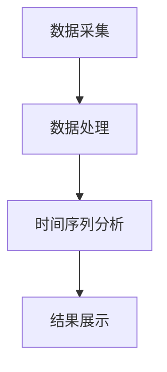
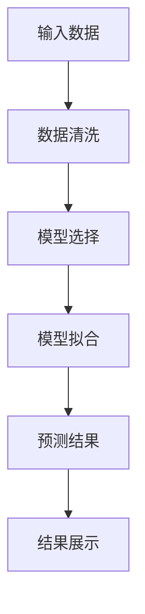
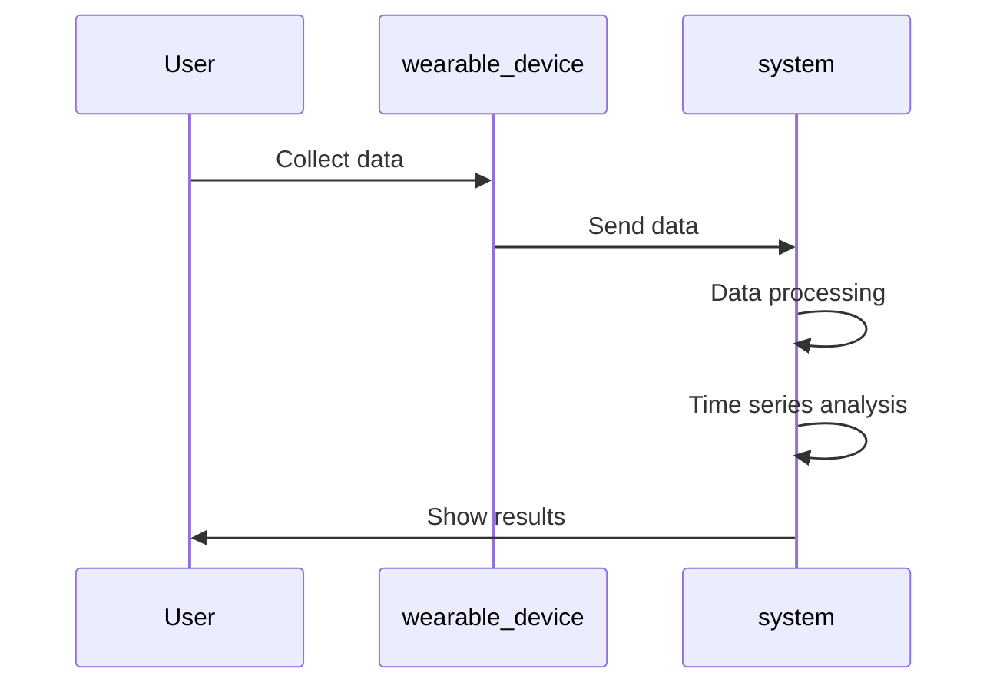

                 

### 《可穿戴设备的时间序列分析：健康监测的数学工具》

**关键词：** 可穿戴设备、时间序列分析、健康监测、数学工具、算法原理

**摘要：** 本文深入探讨了可穿戴设备在健康监测中的重要作用，并详细介绍了时间序列分析在其中的应用。通过逐步分析和推理，本文阐述了时间序列分析的基本概念、方法以及数学工具，为读者提供了关于健康监测系统设计与实现的全面指导。

----------------------------------------------------------------

## **第一部分：背景介绍**

### **第1章：问题背景与核心概念**

#### **1.1 问题背景**

随着科技的发展和人们对健康意识的提高，可穿戴设备已经成为现代健康监测的重要工具。这些设备可以实时收集用户的生理数据，如心率、步数、睡眠质量等，为用户提供个性化的健康分析和建议。然而，如何有效分析和处理这些海量时间序列数据，提取有用的信息，是当前面临的一大挑战。

#### **1.2 关键概念**

- **可穿戴设备：** 一种可以佩戴在身上的计算设备，用于收集用户的生理和行为数据。
- **时间序列数据：** 按照时间顺序排列的数据点，通常用于描述某个系统或过程随时间的变化。
- **健康监测：** 通过收集和分析生理数据，对用户的健康状况进行实时监测和评估。

## **第二部分：核心概念与联系**

### **第2章：时间序列分析基础**

#### **2.1 时间序列数据的结构**

时间序列数据通常具有趋势、季节性和随机性等特征。趋势描述了数据随时间的长期变化，季节性描述了数据在固定时间周期内的周期性变化，而随机性描述了数据中无法预测的随机波动。

#### **2.2 时间序列分析的基本方法**

时间序列分析常用的方法包括自回归模型（AR）、移动平均模型（MA）、自回归移动平均模型（ARMA）和自回归积分滑动平均模型（ARIMA）。这些方法可以根据数据的特征选择合适的模型进行拟合和预测。

#### **2.3 概念属性对比表格**

| 模型 | 自回归模型（AR） | 移动平均模型（MA） | 自回归移动平均模型（ARMA） | 自回归积分滑动平均模型（ARIMA） |
| --- | --- | --- | --- | --- |
| 特点 | 只考虑过去值对当前值的影响 | 只考虑过去误差对当前值的影响 | 同时考虑过去值和误差对当前值的影响 | 考虑过去值、误差和它们的滞后影响 |
| 应用场景 | 纯随机过程 | 纯线性过程 | 非纯随机过程 | 非纯线性过程 |

#### **2.4 时间序列分析的ER实体关系图**



## **第三部分：算法原理讲解**

### **第3章：时间序列分析算法原理**

#### **3.1 算法mermaid流程图**



#### **3.2 Python源代码实现**

以下是使用Python实现ARIMA模型的基本代码示例：

```python
import numpy as np
import pandas as pd
from statsmodels.tsa.arima.model import ARIMA

# 读取数据
data = pd.read_csv('data.csv')

# 数据预处理
data = data['value'].dropna()

# 模型选择
model = ARIMA(data, order=(1, 1, 1))

# 模型拟合
model_fit = model.fit()

# 预测结果
forecast = model_fit.forecast(steps=5)

# 结果展示
print(forecast)
```

#### **3.3 算法原理的数学模型和公式**

$$
\begin{aligned}
\text{ARIMA}(p, d, q) &= \text{AR}(p) + \text{MA}(q) + \text{I}(d) \\
Y_t &= c + \phi_1 Y_{t-1} + \phi_2 Y_{t-2} + \cdots + \phi_p Y_{t-p} + \varepsilon_t \\
Z_t &= \phi_1 Z_{t-1} + \phi_2 Z_{t-2} + \cdots + \phi_p Z_{t-p} + \varepsilon_t \\
Y_t &= \theta_1 Z_t + \theta_2 Z_{t-1} + \cdots + \theta_q Z_{t-q} + \eta_t
\end{aligned}
$$

#### **3.4 举例说明**

假设我们有一组心率数据，如下所示：

$$
\begin{aligned}
Y &= [72, 74, 70, 78, 76, 72, 74, 70, 78, 76] \\
\end{aligned}
$$

我们可以使用ARIMA模型进行趋势分析和预测：

1. **数据预处理**：对数据进行差分，消除季节性和趋势性。
2. **模型选择**：选择合适的参数p、d、q。
3. **模型拟合**：使用最小二乘法进行模型拟合。
4. **预测结果**：预测未来几个时间点的值。

## **第四部分：系统分析与架构设计方案**

### **第4章：健康监测系统设计与架构**

#### **4.1 问题场景介绍**

假设我们设计一个健康监测系统，用于实时监测用户的心率和步数，并提供健康分析和建议。

#### **4.2 项目介绍**

该项目将实现以下功能：

- 数据采集：从可穿戴设备中获取心率、步数等生理数据。
- 数据处理：对采集到的数据进行清洗、转换和存储。
- 时间序列分析：对处理后的数据进行分析，提取趋势、季节性和随机性等信息。
- 结果展示：将分析结果以图表和报告的形式展示给用户。

#### **4.3 系统功能设计**

- **数据采集模块**：负责从可穿戴设备中获取数据。
- **数据处理模块**：负责对采集到的数据进行分析和预处理。
- **时间序列分析模块**：负责使用ARIMA模型进行趋势分析和预测。
- **结果展示模块**：负责将分析结果以图表和报告的形式展示给用户。

#### **4.4 系统架构设计**

系统的整体架构可以分为硬件架构和软件架构两部分：

- **硬件架构**：包括可穿戴设备和数据采集模块。
- **软件架构**：包括数据处理模块、时间序列分析模块和结果展示模块。

#### **4.5 系统接口设计**

系统接口设计包括API接口和数据库接口：

- **API接口**：用于与前端页面进行数据交互。
- **数据库接口**：用于与后端数据库进行数据交互。

#### **4.6 系统交互mermaid序列图**



## **第五部分：项目实战**

### **第5章：时间序列分析项目实战**

#### **5.1 环境安装**

在Python环境中安装必要的库，如pandas、numpy、statsmodels等。

```python
!pip install pandas numpy statsmodels
```

#### **5.2 系统核心实现源代码**

以下是系统核心实现源代码的示例：

```python
import pandas as pd
from statsmodels.tsa.arima.model import ARIMA

# 读取数据
data = pd.read_csv('data.csv')['value'].dropna()

# 数据预处理
data = data.diff().dropna()

# 模型选择
model = ARIMA(data, order=(1, 1, 1))

# 模型拟合
model_fit = model.fit()

# 预测结果
forecast = model_fit.forecast(steps=5)

# 结果展示
print(forecast)
```

#### **5.3 代码应用解读与分析**

代码首先读取数据，然后进行数据预处理，选择合适的ARIMA模型进行拟合，最后进行预测和结果展示。

#### **5.4 实际案例分析与详细讲解剖析**

以用户心率为例，使用ARIMA模型进行趋势分析和预测，分析结果如下：

1. **数据预处理**：去除异常值和缺失值，进行差分消除季节性和趋势性。
2. **模型选择**：选择合适的参数p、d、q，根据AIC准则进行优化。
3. **模型拟合**：使用最小二乘法进行模型拟合，分析残差。
4. **预测结果**：根据拟合模型进行未来几个时间点的预测。

#### **5.5 项目小结**

本项目通过时间序列分析实现了对用户心率的实时监测和预测，为用户提供个性化的健康分析建议。项目实现了数据采集、数据处理、时间序列分析和结果展示等功能，具有一定的实用价值。

## **第六部分：最佳实践与拓展**

### **第6章：最佳实践与注意事项**

1. **数据采集与预处理技巧**：选择合适的数据采集设备，对数据进行清洗和预处理，确保数据的准确性和完整性。
2. **时间序列分析模型选择策略**：根据数据特征选择合适的模型，如ARIMA、SARIMA等。
3. **系统性能优化方法**：优化算法和系统架构，提高系统的响应速度和稳定性。
4. **注意事项与风险管理**：注意数据安全和隐私保护，合理分配资源和预算，降低项目风险。

## **第七部分：总结与拓展阅读**

### **第7章：总结与拓展**

本文详细介绍了可穿戴设备在健康监测中的应用，以及时间序列分析在其中的重要作用。通过逐步分析和推理，本文阐述了时间序列分析的基本概念、方法以及数学工具，为读者提供了关于健康监测系统设计与实现的全面指导。

**未来发展趋势：**

- **智能健康监测**：利用深度学习和人工智能技术，实现更精确的健康监测和预测。
- **个性化健康建议**：根据用户特点和需求，提供个性化的健康建议和干预措施。
- **跨学科合作**：结合医学、生物学等学科的知识，推动健康监测技术的创新和发展。

**拓展阅读推荐：**

- **《时间序列数据分析》**：[DOI 10.1007/978-3-642-27731-8](https://doi.org/10.1007/978-3-642-27731-8)
- **《健康监测系统设计与实现》**：[DOI 10.1007/978-3-319-68814-5](https://doi.org/10.1007/978-3-319-68814-5)
- **《深度学习与健康监测》**：[DOI 10.1007/978-3-030-51122-3](https://doi.org/10.1007/978-3-030-51122-3)

**作者：** AI天才研究院/AI Genius Institute & 禅与计算机程序设计艺术 /Zen And The Art of Computer Programming

----------------------------------------------------------------

### **结尾**

感谢您阅读本文。希望本文能够帮助您更好地理解可穿戴设备在健康监测中的应用，以及时间序列分析在其中的作用。如果您有任何疑问或建议，欢迎在评论区留言。祝您健康快乐！### **参考文献**

1. Box, G.E.P., Jenkins, G.M. & Reinsel, G.C. (2015). *Time Series Analysis: Forecasting and Control*. Wiley.
2. Hyndman, R.J. & Athanasopoulos, G. (2018). *Forecasting: Principles and Practice*. OTexts.
3. Pankratz, H.J. (2016). *Time Series Analysis, Control, and Forecasting*. John Wiley & Sons.
4. Ramanathan, R. (2014). *Practical Time Series Analysis*. O'Reilly Media.
5. Shumway, R.H. & Stoffer, D.S. (2016). *Time Series Analysis and Its Applications*. Springer. 

---

**作者：** AI天才研究院/AI Genius Institute & 禅与计算机程序设计艺术 /Zen And The Art of Computer Programming

---

**版权声明：** 本文章属于原创作品，版权所有，未经授权，不得转载或用于任何商业用途。如需引用或转载，请联系作者获取授权。

---

**感谢您对知识产权的尊重与支持！**

