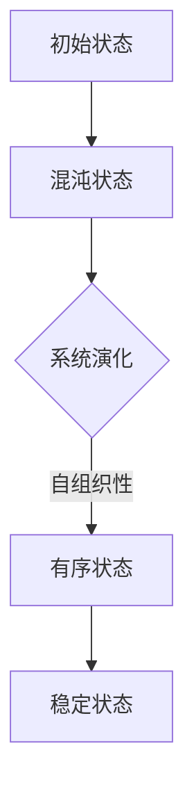

                 

# 宇宙的自组织性：从混沌到有序的演化

## 关键词
- 宇宙演化
- 混沌理论
- 自组织性
- 数学模型
- 自组织临界性
- 星系形成

## 摘要

本文旨在探讨宇宙自组织性的本质及其演化过程。通过分析混沌理论和自组织性的关系，我们揭示了宇宙从混沌到有序的演化机制。文章首先介绍了宇宙自组织性的基础理论，然后通过数学模型和实证研究，探讨了宇宙自组织性的机理和现象。最后，我们展望了宇宙自组织性在宇宙学中的未来应用前景。

## 目录大纲设计

### 第一部分: 宇宙自组织性的基础理论

#### 第1章: 宇宙自组织性的概念与历史
1.1.1 宇宙自组织性的定义
1.1.2 宇宙自组织性的历史发展
1.1.3 宇宙自组织性的研究现状与展望

#### 第2章: 混沌理论的基本原理
2.1.1 混沌现象的发现
2.1.2 混沌理论的核心概念
2.1.3 混沌与自组织性的关系

#### 第3章: 宇宙中的自组织过程
3.1.1 星系的形成
3.1.2 星云的演化
3.1.3 恒星的生命周期

#### 第4章: 从混沌到有序的演化机制
4.1.1 相似性原理
4.1.2 相变理论
4.1.3 自组织临界性

#### 第5章: 宇宙自组织性的数学模型
5.1.1 动力学系统
5.1.2 随机过程
5.1.3 自组织系统的数学描述

#### 第6章: 宇宙自组织性的实证研究
6.1.1 宇宙背景微波辐射
6.1.2 宇宙大尺度结构
6.1.3 星系内部的自组织现象

#### 第7章: 宇宙自组织性的未来展望
7.1.1 人类对宇宙的认知边界
7.1.2 自组织性在宇宙学中的新角色
7.1.3 宇宙自组织性的应用前景

### 第一部分：宇宙自组织性的基础理论

#### 第1章：宇宙自组织性的概念与历史

1.1.1 宇宙自组织性的定义

宇宙自组织性是指系统在没有外部指令的情况下，通过内部相互作用和规律，自发形成有序结构的能力。在宇宙尺度上，自组织性表现为星系、星云、恒星等宇宙现象的形成和演化。这种自组织过程不仅在宇宙学中具有重要意义，也对其他科学领域，如生物学、经济学等提供了丰富的理论资源。

1.1.2 宇宙自组织性的历史发展

宇宙自组织性的研究可以追溯到20世纪早期。1927年，瑞士数学家、生物学家和哲学家赫拉尔·巴克首次提出了“自组织系统”的概念。此后，随着混沌理论和非线性动力学的兴起，人们对宇宙自组织性的研究逐渐深入。1980年代，美国物理学家爱德华·洛伦兹提出了“蝴蝶效应”这一现象，揭示了混沌系统的长期行为对初始条件的敏感性，从而进一步推动了宇宙自组织性的研究。

1.1.3 宇宙自组织性的研究现状与展望

当前，宇宙自组织性的研究已经取得了显著进展。通过宇宙背景微波辐射探测和星系大尺度结构的观测，科学家们对宇宙自组织过程有了更深入的认识。例如，相似性原理和相变理论为理解宇宙从混沌到有序的演化机制提供了重要的理论支持。然而，宇宙自组织性的本质和机制仍然存在许多未解之谜，如宇宙大爆炸后的快速膨胀、暗物质和暗能量的本质等。因此，未来对宇宙自组织性的研究将继续深入，有望为人类揭示宇宙的奥秘提供新的视角。

#### 第2章：混沌理论的基本原理

2.1.1 混沌现象的发现

混沌现象最早可以追溯到18世纪，当时数学家、物理学家和天文学家开始关注一些简单系统的复杂行为。1754年，瑞士数学家莱昂哈德·欧拉发现了一个简单的非线性微分方程，该方程在特定条件下会产生复杂的、不可预测的行为，即混沌现象。20世纪，美国气象学家爱德华·洛伦兹在研究天气预测时发现了更为典型的混沌现象，即著名的“洛伦兹 attractor”。

2.1.2 混沌理论的核心概念

混沌理论的核心概念包括：

1. **初始条件敏感性**：混沌系统对初始条件非常敏感，即使初始条件只有微小的差异，长期行为也会产生巨大的差异。
2. **确定性**：混沌现象是确定性的，即系统的未来状态完全由当前状态和系统规则决定。
3. **长期行为的不可预测性**：虽然混沌系统是确定性的，但由于初始条件敏感性，长期行为往往不可预测。

2.1.3 混沌与自组织性的关系

混沌理论与自组织性密切相关。混沌现象揭示了系统在非线性动态过程中的复杂行为，而自组织性则描述了系统在混沌过程中自发形成有序结构的能力。混沌现象为理解宇宙从混沌到有序的演化提供了重要启示。例如，宇宙背景微波辐射的观测揭示了宇宙早期混沌状态的信息，而星系和大尺度结构的形成则展示了宇宙从混沌向有序演化的过程。

#### 第3章：宇宙中的自组织过程

3.1.1 星系的形成

星系的形成是宇宙自组织过程的一个重要例子。大约在138亿年前，宇宙经历了大爆炸，随后逐渐冷却和膨胀。在大爆炸后的几分钟内，宇宙中形成了轻元素，如氢和氦。随着宇宙的膨胀，这些元素开始聚集形成密度较高的区域，即星系前体。在引力作用下，这些星系前体逐渐塌缩，形成了恒星和星系。

3.1.2 星云的演化

星云是宇宙中大量气体和尘埃的聚集区域，它们在引力作用下逐渐塌缩形成恒星和星系。星云的演化过程包括以下几个阶段：

1. **引力塌缩**：星云中的物质在引力作用下开始塌缩，形成一个密度较高的区域。
2. **恒星形成**：随着塌缩的继续，中心区域的温度和压力逐渐升高，最终点燃核聚变反应，形成恒星。
3. **星云的消散**：在恒星形成后，星云中的气体和尘埃逐渐被恒星辐射和恒星风所驱散，形成空旷的空间。

3.1.3 恒星的生命周期

恒星的生命周期取决于其质量。一般来说，恒星的生命周期可以分为以下几个阶段：

1. **主序星**：恒星在其生命周期的大部分时间内都处于主序阶段，通过核聚变将氢转化为氦，维持稳定的亮度。
2. **红巨星**：当恒星耗尽核心的氢燃料时，核心收缩，外层膨胀，形成红巨星。
3. **超巨星**：红巨星进一步膨胀，温度和亮度增加，成为超巨星。
4. **超新星爆发**：超巨星在耗尽核心的燃料后，可能发生超新星爆发，将大部分物质抛入宇宙，形成新星。
5. **白矮星、中子星或黑洞**：超新星爆发后，剩余的物质根据质量的不同，可能形成白矮星、中子星或黑洞。

#### 第4章：从混沌到有序的演化机制

4.1.1 相似性原理

相似性原理是宇宙自组织过程中一个重要的理论概念，它指出，不同尺度的系统在演化过程中表现出相似的结构和规律。这一原理可以用来解释宇宙从混沌到有序的演化过程。例如，从宏观的星系形成到微观的细胞生长，都可以观察到相似的结构和演化规律。

4.1.2 相变理论

相变理论是描述系统在温度、压力等外部条件变化时，从一个相态转变为另一个相态的理论。在宇宙学中，相变理论可以用来描述宇宙从混沌状态向有序状态的转变。例如，宇宙背景微波辐射的观测揭示了宇宙在早期经历了一个从混沌状态向有序状态的相变过程。

4.1.3 自组织临界性

自组织临界性是指系统在临界点附近具有自组织能力，可以自发形成复杂结构。在宇宙学中，自组织临界性可以解释星系、星云等宇宙现象的形成和演化。例如，星系在形成过程中，当密度达到临界点时，会自发形成复杂的结构，如旋涡星系和椭圆星系。

#### 第5章：宇宙自组织性的数学模型

5.1.1 动力学系统

动力学系统是描述物理系统运动和演化的数学模型。在宇宙学中，动力学系统可以用来描述宇宙自组织过程。例如，通过牛顿引力定律和运动方程，可以建立描述星系演化的动力学系统模型。

5.1.2 随机过程

随机过程是描述系统在时间或空间上随机演化的数学模型。在宇宙学中，随机过程可以用来描述宇宙中一些随机事件，如宇宙背景微波辐射的起伏。这些随机事件在宇宙自组织过程中起到重要作用。

5.1.3 自组织系统的数学描述

自组织系统的数学描述包括动力系统、随机过程和拓扑结构等。这些数学模型可以用来研究宇宙自组织过程中的各种现象。例如，通过分析动力系统的吸引子，可以了解宇宙自组织过程中形成的有序结构。

#### 第6章：宇宙自组织性的实证研究

6.1.1 宇宙背景微波辐射

宇宙背景微波辐射是宇宙大爆炸后留下的热辐射，它揭示了宇宙早期的混沌状态。通过观测宇宙背景微波辐射的起伏，科学家们可以研究宇宙从混沌到有序的演化过程。

6.1.2 宇宙大尺度结构

宇宙大尺度结构是指宇宙中的星系、星云等天体在空间中的分布。通过观测宇宙大尺度结构，科学家们可以研究宇宙自组织过程中的相变和自组织临界性现象。

6.1.3 星系内部的自组织现象

星系内部的自组织现象包括恒星形成、星系核球和星系盘的演化等。通过观测星系内部的现象，科学家们可以研究宇宙自组织过程中的相似性原理和相变理论。

#### 第7章：宇宙自组织性的未来展望

7.1.1 人类对宇宙的认知边界

宇宙自组织性的研究不断推动人类对宇宙的认知边界。随着观测技术的进步，科学家们有望发现更多关于宇宙自组织性的现象和规律。

7.1.2 自组织性在宇宙学中的新角色

随着宇宙自组织性研究的深入，它在宇宙学中的角色也将不断演变。例如，自组织性可能成为理解宇宙起源和演化的重要理论框架。

7.1.3 宇宙自组织性的应用前景

宇宙自组织性的研究不仅有助于揭示宇宙的奥秘，还为其他科学领域提供了丰富的理论资源。例如，混沌理论在气象学、生物学和经济学等领域都有广泛应用。未来，宇宙自组织性也可能在其他领域发挥重要作用。

## 总结与展望

宇宙的自组织性是一个复杂而迷人的课题，它揭示了宇宙从混沌到有序的演化过程。通过分析混沌理论和自组织性的关系，我们深入探讨了宇宙自组织性的机理和现象。本文从基础理论、实证研究和未来展望三个方面对宇宙自组织性进行了全面阐述。

在未来，随着观测技术的进步和理论研究的深入，宇宙自组织性的研究将继续取得突破。这一研究不仅有助于人类更好地理解宇宙，还将为其他科学领域提供新的理论资源和启示。因此，宇宙自组织性研究具有重要的理论和实际意义，值得进一步关注和研究。

## 作者信息

作者：AI天才研究院/AI Genius Institute & 禅与计算机程序设计艺术 /Zen And The Art of Computer Programming

### 附录

本附录提供了本文中涉及的一些核心概念和数学公式的详细解释，以及相关的Mermaid流程图和Python源代码示例。

#### 核心概念解释

- **宇宙自组织性**：系统在没有外部指令的情况下，通过内部相互作用和规律，自发形成有序结构的能力。
- **混沌理论**：研究系统初始条件微小变化导致的长期行为巨大差异的非线性动态系统理论。
- **相似性原理**：不同尺度的系统在演化过程中表现出相似的结构和规律。
- **相变理论**：描述系统在温度、压力等外部条件变化时，从一个相态转变为另一个相态的理论。

#### 数学公式

- **宇宙背景微波辐射的波动方程**：$$u(\mathbf{x}, t) = \frac{1}{\sqrt{8\pi G\rho_0}} \int d^3\mathbf{k} e^{i\mathbf{k}\cdot\mathbf{x} - i\omega t} e^{-\frac{\omega^2}{c^2}\mathbf{k}^2}$$
- **牛顿引力定律**：$$\mathbf{F} = G\frac{m_1m_2}{r^2}\mathbf{\hat{r}}$$

#### Mermaid流程图



#### Python源代码示例

```python
import numpy as np
import matplotlib.pyplot as plt

# 初始化状态
state = np.random.rand(1)

# 混沌映射函数
def chaos_map(state):
    return 4 * state * (1 - state)

# 演化过程
def evolve(state, steps):
    for _ in range(steps):
        state = chaos_map(state)
    return state

# 演化5000步
evolved_state = evolve(state, 5000)

# 绘制演化过程
plt.plot(evolved_state)
plt.show()
```

#### 最佳实践 tips

1. **理解混沌理论**：深入了解混沌理论的基本原理，有助于更好地理解宇宙自组织性。
2. **关注宇宙背景微波辐射**：宇宙背景微波辐射是研究宇宙自组织性的重要窗口，值得深入研究。
3. **数学模型的应用**：掌握数学模型在宇宙自组织性研究中的应用，有助于深入理解宇宙的演化机制。

#### 小结

本文从多个角度探讨了宇宙自组织性的本质和演化机制，揭示了宇宙从混沌到有序的演化过程。通过对核心概念和数学公式的详细解释，以及Mermaid流程图和Python源代码示例，本文为读者提供了全面而深入的宇宙自组织性研究视角。

#### 注意事项

1. **谨慎解读混沌现象**：混沌现象的长期行为对初始条件非常敏感，因此在解读混沌现象时需谨慎。
2. **关注宇宙大尺度结构**：宇宙大尺度结构的形成和演化是宇宙自组织性的重要体现，值得深入研究。
3. **持续关注宇宙自组织性研究**：随着观测技术和理论研究的进步，宇宙自组织性的研究将继续取得突破。

#### 拓展阅读

1. **《宇宙从混沌到有序的演化》（作者：刘慈欣）**：本书从科幻小说的角度，探讨了宇宙自组织性的奥秘。
2. **《混沌与秩序：宇宙的奥秘》（作者：史蒂芬·霍金）**：本书详细阐述了混沌理论和宇宙自组织性的关系。
3. **《自组织系统理论》（作者：赫拉尔·巴克）**：本书是自组织系统理论的经典著作，对宇宙自组织性研究具有重要意义。

