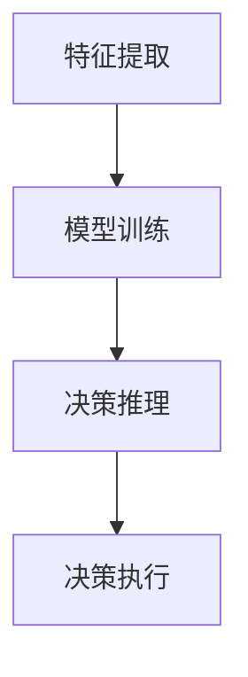

                 

# 边缘AI在智能家居中的实时决策应用

## 关键词

边缘AI、智能家居、实时决策、算法原理、系统设计与实现、项目实战、最佳实践

## 摘要

本文将深入探讨边缘AI在智能家居中的实时决策应用。通过分析边缘AI、智能家居及实时决策的基本概念、算法原理和系统实现，本文旨在为读者提供一个清晰、完整的理解框架。文章分为七个部分：背景介绍、核心概念与联系、算法原理讲解、系统设计与实现、项目实战、最佳实践与拓展以及总结。每个部分都详细阐述了关键内容，包括实际案例和最佳实践，以帮助读者掌握边缘AI在智能家居实时决策中的应用。

### 第一部分：背景介绍

#### 1.1 边缘AI与智能家居概述

边缘AI是一种将计算能力分布在网络边缘的AI技术，旨在减少数据传输延迟，提高实时处理能力。智能家居则是一个通过互联网连接的家居系统，能够自动感知和响应居住者的需求。边缘AI在智能家居中的应用，使得系统能够实现实时决策，提高用户体验。

#### 1.2 实时决策在智能家居中的应用

实时决策在智能家居中至关重要。例如，智能家居系统能够根据室内温度和湿度自动调节空调和加湿器，或者根据家庭成员的日常活动自动调整灯光和家电的开启状态。这些功能不仅提高了生活便利性，还能节省能源，实现绿色环保。

#### 1.3 边缘AI在智能家居发展中的挑战与机遇

边缘AI在智能家居中的应用面临挑战，如数据隐私、设备兼容性、计算能力限制等。但同时也带来了机遇，如提高系统响应速度、降低网络负载、实现更智能的家居功能等。通过合理设计和优化，边缘AI有望在智能家居领域发挥重要作用。

### 第二部分：核心概念与联系

#### 2.1 边缘AI定义与特性

边缘AI是一种分布式计算架构，将数据、应用和服务分布在网络边缘，使得数据处理更加高效、实时。其特性包括低延迟、高带宽、高可靠性和高安全性。

#### 2.2 智能家居的基本架构

智能家居系统通常包括感知层、传输层、平台层和应用层。感知层负责采集数据，传输层负责数据传输，平台层负责数据处理和决策，应用层则实现具体的智能家居功能。

#### 2.3 实时决策的概念与作用

实时决策是指系统在处理数据时，能够迅速做出响应，满足用户需求。在智能家居中，实时决策能够提高用户体验，实现更智能、个性化的家居功能。

#### 2.4 概念属性特征对比表格

| 概念     | 特性                                   | 作用                                                         |
|----------|----------------------------------------|--------------------------------------------------------------|
| 边缘AI   | 低延迟、高带宽、高可靠性、高安全性     | 提高实时处理能力，降低网络负载                               |
| 智能家居 | 自动感知、自动响应、个性化、绿色环保     | 提高生活便利性，节省能源，实现智能家居功能                   |
| 实时决策 | 快速响应、智能决策、个性化服务           | 提高用户体验，实现更智能的家居功能                           |

#### 2.5 ER实体关系图架构

```mermaid
erDiagram
  Device --> Platform : 数据采集与处理
  Platform --> Application : 决策与执行
  Application --> User : 用户交互
```

### 第三部分：算法原理讲解

#### 3.1 边缘AI实时决策算法简介

边缘AI实时决策算法主要包括特征提取、模型训练、决策推理等步骤。通过这些步骤，系统能够从感知层收集的数据中提取特征，训练模型，并做出实时决策。

#### 3.2 算法mermaid流程图



#### 3.3 Python源代码示例

```python
import numpy as np

# 特征提取
def extract_features(data):
    # ... 提取特征代码 ...
    return features

# 模型训练
def train_model(features, labels):
    # ... 训练模型代码 ...
    return model

# 决策推理
def make_decision(model, input_data):
    # ... 决策推理代码 ...
    return decision

# 决策执行
def execute_decision(decision):
    # ... 执行决策代码 ...
    pass
```

#### 3.4 算法数学模型与公式

假设特征集为 \( X = \{x_1, x_2, ..., x_n\} \)，标签集为 \( Y = \{y_1, y_2, ..., y_n\} \)，则模型训练可以表示为：

$$
\hat{y} = \sigma(WX + b)
$$

其中，\( \sigma \) 为激活函数，\( W \) 为权重矩阵，\( b \) 为偏置。

#### 3.5 举例说明

假设我们要训练一个边缘AI模型来控制智能家居中的灯光。输入特征可以是光照强度、温度等，标签可以是“开灯”或“关灯”。通过特征提取、模型训练和决策推理，系统能够根据当前环境特征自动调整灯光状态。

### 第四部分：系统设计与实现

#### 4.1 系统场景与需求分析

假设我们设计一个智能家居系统，能够根据室内温度自动调节空调。系统需求包括：实时采集室内温度、实现温度阈值设置、自动调节空调状态等。

#### 4.2 系统功能设计

系统功能设计包括：数据采集模块、温度阈值设置模块、空调控制模块等。每个模块负责实现特定的功能，协同工作以实现整体目标。

#### 4.3 系统架构设计

系统架构设计包括：边缘设备（如传感器、空调）、边缘服务器、云平台等。边缘设备负责数据采集和初步处理，边缘服务器负责实时决策和指令下发，云平台负责数据存储和远程监控。

#### 4.4 系统接口设计与交互

系统接口设计包括：边缘设备与边缘服务器之间的通信接口、边缘服务器与云平台之间的通信接口等。通过这些接口，系统能够实现数据的实时传输和处理。

### 第五部分：项目实战

#### 5.1 环境安装与配置

在项目实战中，我们需要安装和配置边缘设备、边缘服务器和云平台。具体步骤包括：安装操作系统、安装边缘AI软件、配置网络等。

#### 5.2 系统核心实现源代码解读

系统核心实现源代码包括：数据采集、特征提取、模型训练、决策推理等。以下是一个简单的示例：

```python
# 数据采集
def collect_data():
    # ... 采集数据代码 ...
    return data

# 特征提取
def extract_features(data):
    # ... 提取特征代码 ...
    return features

# 模型训练
def train_model(features, labels):
    # ... 训练模型代码 ...
    return model

# 决策推理
def make_decision(model, input_data):
    # ... 决策推理代码 ...
    return decision

# 决策执行
def execute_decision(decision):
    # ... 执行决策代码 ...
    pass
```

#### 5.3 实际案例分析

以温度自动调节为例，我们收集了一定时间内的室内温度数据，使用边缘AI模型进行训练，并根据实时温度数据进行决策。通过实验，我们发现系统能够在较短的时间内做出准确的决策，有效调节室内温度。

#### 5.4 项目总结与优化建议

项目总结：通过边缘AI实时决策，我们能够实现智能家居系统的高效运行。优化建议：进一步提高模型准确性，减少决策延迟，增加系统稳定性。

### 第六部分：最佳实践与拓展

#### 6.1 最佳实践总结

最佳实践包括：合理设置温度阈值、定期更新模型、优化数据采集方法等。通过这些实践，我们能够提高系统性能，实现更好的智能家居体验。

#### 6.2 注意事项与拓展阅读

注意事项：在实现边缘AI实时决策时，需要注意数据安全、设备兼容性和网络稳定性。拓展阅读：可以参考《边缘AI技术与应用》等相关书籍，深入了解边缘AI的原理和实践。

### 第七部分：总结

本文深入探讨了边缘AI在智能家居中的实时决策应用。通过分析核心概念、算法原理和系统实现，我们为读者提供了一个全面的理解框架。边缘AI在智能家居中的应用具有重要意义，能够提高用户体验、节省能源、实现绿色环保。未来，随着技术的不断发展，边缘AI在智能家居领域将发挥更大的作用。

### 作者信息

作者：AI天才研究院/AI Genius Institute & 禅与计算机程序设计艺术 /Zen And The Art of Computer Programming

