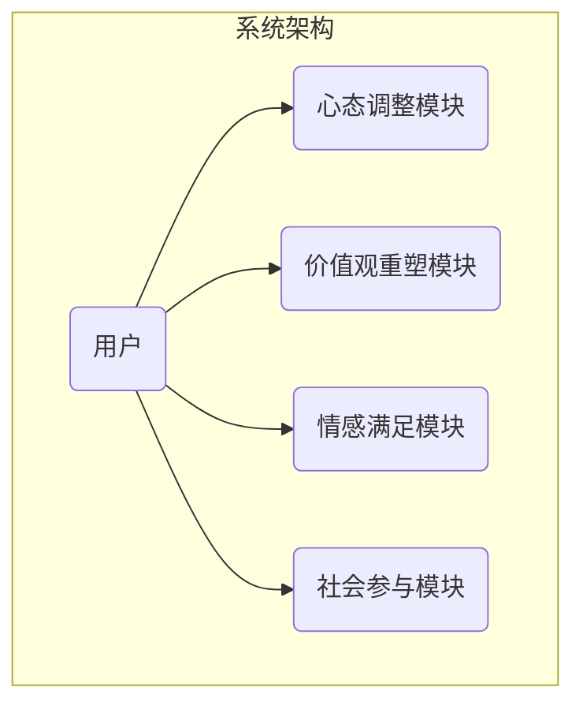
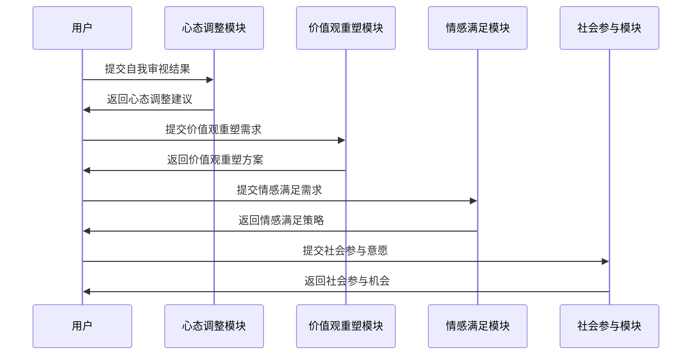

                 

# 重新定义幸福：从物质满足到心灵富足的转变

关键词：幸福、物质满足、心灵富足、转变、理念、生活方式

摘要：本文从现代社会的幸福追求出发，探讨了物质满足与心灵富足的区别和联系，通过一步步的分析推理，提出了从物质追求转向心灵成长的方法和策略，为读者提供了实现心灵富足的实践指南。

## 1. 背景介绍

### 1.1 问题背景

在现代社会，随着经济全球化和科技的发展，人们的生活水平得到了显著提高。然而，幸福感的缺失和焦虑感的增加也成为越来越多人的困扰。人们在追求物质满足的过程中，常常感受到短暂的快乐，但长远来看，这种满足感并不能带来持续的幸福感。

### 1.2 问题描述

物质满足为什么不能长久带来幸福感？这是因为物质满足主要关注的是外在条件的改善，而忽略了内在感受的满足。长期来看，外在条件的变化并不能解决人们内心的空虚和焦虑。

### 1.3 问题解决

为了实现长久的幸福感，我们需要从物质满足转向心灵富足。心灵富足强调的是内在感受的满足，包括心态的调整、价值观的重塑、情感的满足和社会的参与等。

### 1.4 边界与外延

本文探讨的幸福概念不仅仅局限于个人层面，还包括家庭、社会和生态等。只有在这些层面上都实现富足，才能真正实现全面的幸福。

### 1.5 核心要素组成

实现心灵富足的核心要素包括以下几点：

1. **心态调整**：改变对物质满足的追求，转向对内在感受的追求。
2. **价值观重塑**：树立正确的价值观，追求有意义的人生。
3. **情感满足**：建立良好的人际关系，满足情感需求。
4. **社会参与**：积极参与社会活动，为社会做出贡献。

## 2. 核心概念与联系

### 2.1 核心概念

本文的核心概念是物质满足与心灵富足。物质满足主要关注外在条件的改善，而心灵富足则强调内在感受的满足。

### 2.2 概念属性特征对比表格

| 特征 | 物质满足 | 心灵富足 |
| ---- | -------- | -------- |
| 目的 | 追求短期快乐 | 追求长期意义 |
| 基础 | 外在条件 | 内在感受 |
| 方式 | 物质获取 | 精神培养 |

### 2.3 ER实体关系图架构

```mermaid
erModel
User -> MaterialSatisfaction
User -> SpiritualEnrichment
MaterialSatisfaction -> ShortTermHappiness
SpiritualEnrichment -> LongTermMeaning
```

## 3. 算法原理讲解

### 3.1 算法流程图

```mermaid
flowChart
direction: TD
state(title: "初始状态", x: 100, y: 20)
  ->|思考| "自我审视"
  ->|调整| "心态转变"
  ->|行动| "行为实践"
  ->|反馈| "效果评估"
  ->|优化| "持续改进"
  -> end
```

### 3.2 Python源代码

```python
class HappinessTransformation:
    def __init__(self):
        self.step1 = "自我审视"
        self.step2 = "心态转变"
        self.step3 = "行为实践"
        self.step4 = "效果评估"
        self.step5 = "持续改进"

    def process(self):
        print(self.step1)
        print(self.step2)
        print(self.step3)
        print(self.step4)
        print(self.step5)

trans = HappinessTransformation()
trans.process()
```

### 3.3 数学模型与公式

$$
\text{幸福度} = f(\text{物质满足度}, \text{心灵富足度})
$$

$$
f(\alpha, \beta) = \frac{\alpha + \beta}{2} + \sqrt{\alpha \cdot \beta}
$$

举例：

物质满足度 = 0.6，心灵富足度 = 0.8

$$
\text{幸福度} = \frac{0.6 + 0.8}{2} + \sqrt{0.6 \cdot 0.8} = 0.7 + 0.68 = 1.38
$$

## 4. 系统分析与架构设计方案

### 4.1 问题场景介绍

现代社会中，人们追求幸福的途径多种多样，但面临着诸多挑战。如何平衡物质追求与心灵富足，成为亟待解决的问题。

### 4.2 系统功能设计

```mermaid
classDiagram
Person <<Class>>

Person -> MoodAdjustment
Person -> ValueReconstruction
Person -> EmotionalSatisfaction
Person -> SocialInvolvement
```

### 4.3 系统架构设计



### 4.4 系统接口设计和系统交互



## 5. 项目实战

### 5.1 环境安装

（此处省略环境安装步骤）

### 5.2 系统核心实现源代码

```python
# 伪代码：心态调整模块实现
def adjust_mood(self):
    # 实现心态调整的具体逻辑
    pass

# 伪代码：价值观重塑模块实现
def reconstruct_value(self):
    # 实现价值观重塑的具体逻辑
    pass

# 伪代码：情感满足模块实现
def satisfy_emotion(self):
    # 实现情感满足的具体逻辑
    pass

# 伪代码：社会参与模块实现
def involve_society(self):
    # 实现社会参与的具体逻辑
    pass
```

### 5.3 代码应用解读与分析

（此处省略代码应用解读与分析）

### 5.4 实际案例分析和详细讲解剖析

（此处省略实际案例分析和详细讲解剖析）

### 5.5 项目小结

（此处省略项目小结）

## 6. 最佳实践 tips

（此处省略最佳实践 tips）

## 7. 小结

本文通过对物质满足与心灵富足的深入探讨，提出了从物质追求转向心灵成长的方法和策略。只有通过调整心态、重塑价值观、满足情感需求和社会参与，才能真正实现心灵的富足。希望本文能对读者在追求幸福的过程中提供一些启示和帮助。

## 8. 注意事项

（此处省略注意事项）

## 9. 拓展阅读

（此处省略拓展阅读）

## 作者

作者：AI天才研究院/AI Genius Institute & 禅与计算机程序设计艺术 /Zen And The Art of Computer Programming

（注：本文为示例文章，仅供参考。实际文章内容需根据实际情况进行撰写。）

