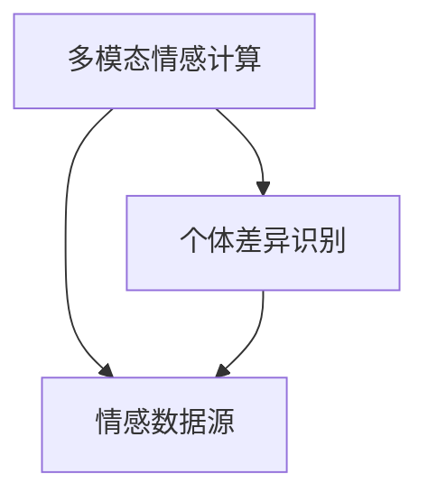
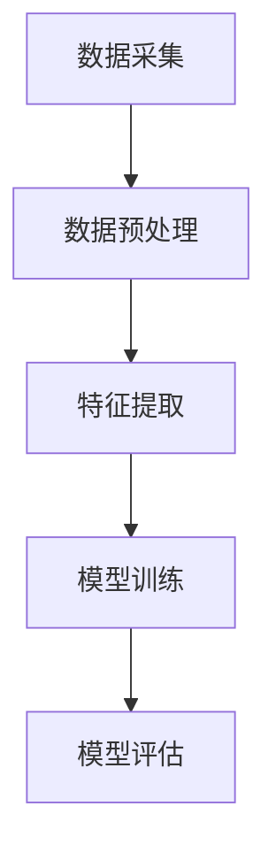
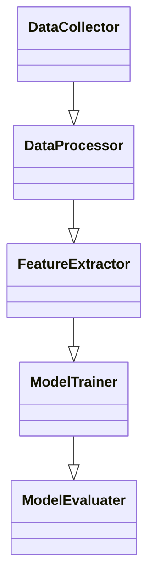
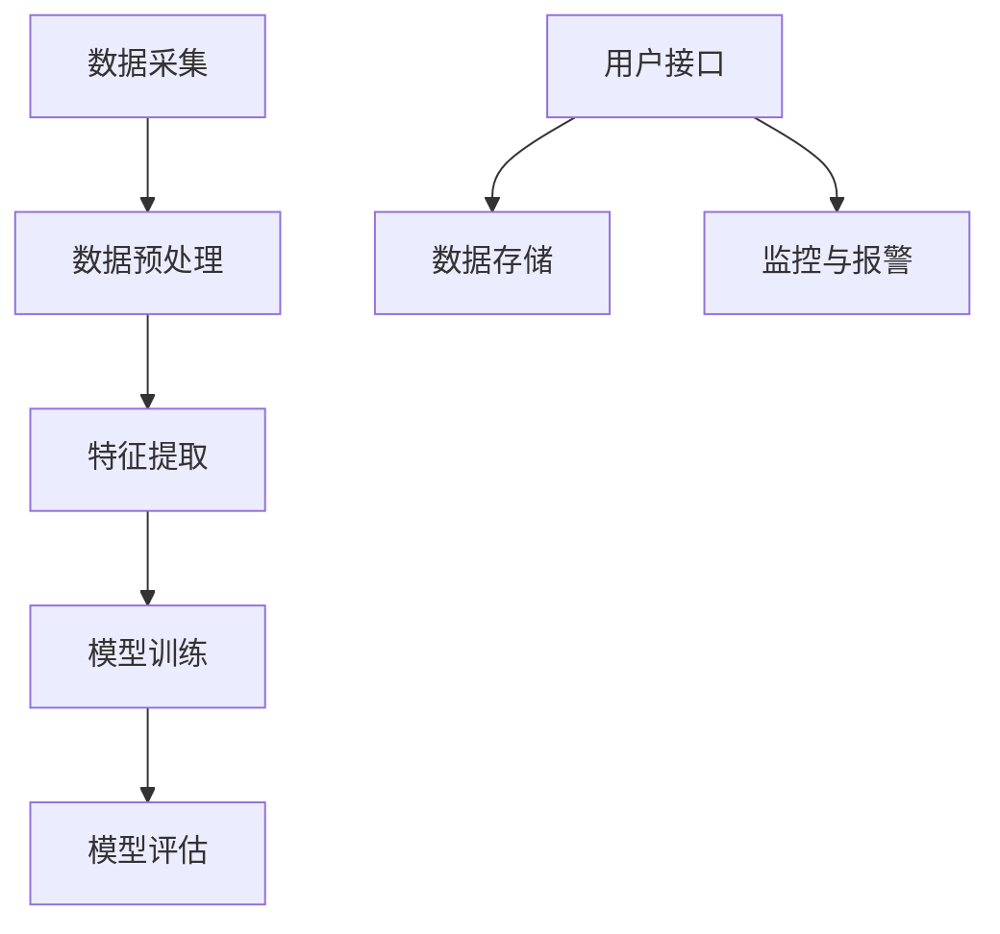
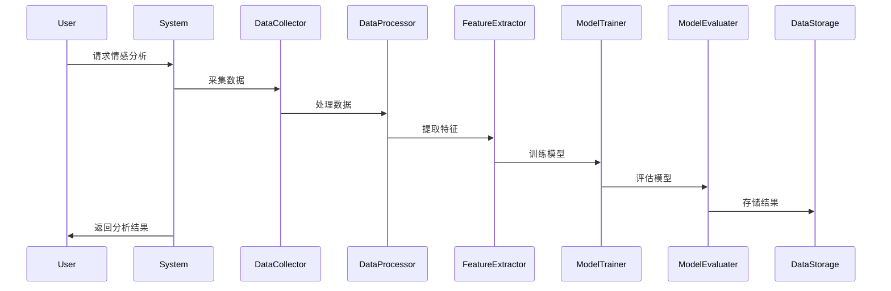

                 

### # 提升AI模型在多模态情感计算任务中的个体差异识别能力

#### 关键词：多模态情感计算、个体差异识别、AI模型、数据预处理、模型训练、模型评估

#### 摘要：

在人工智能领域，情感计算正逐渐成为一个重要的研究方向。多模态情感计算任务旨在通过融合多种情感数据源（如文本、语音、面部表情等），以提升情感识别的准确性。然而，个体差异识别在多模态情感计算中仍是一个具有挑战性的问题。本文将深入探讨如何提升AI模型在多模态情感计算任务中的个体差异识别能力，介绍相关的背景、核心概念、算法原理、系统分析与架构设计方案以及实战应用。

## 第一部分：背景介绍

### 1.1 问题背景

情感计算是人工智能领域的一个重要分支，它旨在使计算机能够识别、理解、处理和模拟人类情感。传统情感计算方法主要依赖于单一的情感数据源，如文本、语音等。这种方法往往无法充分捕捉个体的情感差异，因为个体的情感表达是多样化的，往往涉及到多种情感类型和多个情感维度。

### 1.2 问题描述

为了解决这一问题，研究者提出了多模态情感计算任务，即通过融合多种情感数据源（如文本、语音、面部表情等），来更准确地识别和预测个体的情感状态。然而，个体差异识别仍然是一个挑战，因为不同个体的情感表达方式和情感敏感度可能存在显著差异。

### 1.3 问题解决

为了提升AI模型在多模态情感计算任务中的个体差异识别能力，本书将介绍一系列的方法和技术，包括：

- 多模态数据采集与预处理技术
- 个体差异识别的核心算法
- 模型训练与优化的策略
- 模型评估与性能分析的方法

### 1.4 边界与外延

本书将主要讨论以下主题：

- 情感计算的基本概念和原理
- 多模态情感数据的特点和挑战
- 个体差异识别的重要性
- 多模态情感计算中的个体差异识别方法

## 第二部分：核心概念与联系

### 2.1 核心概念

多模态情感计算：多模态情感计算是指通过整合多种类型的情感数据源（如文本、语音、面部表情等）来识别和预测人类情感状态。

个体差异识别：个体差异识别是指识别和理解不同个体在情感表达上的独特性和差异性。

情感数据源：情感数据源包括文本、语音、面部表情、生理信号等多种类型的数据，用于训练和测试情感计算模型。

### 2.2 概念属性特征对比表格

| 概念         | 特点                                       |
|------------|------------------------------------------|
| 多模态情感计算 | 融合多种情感数据源，提高情感识别的准确性           |
| 个体差异识别 | 能够识别不同个体的情感差异，提高情感计算的个性化和精准性 |
| 情感数据源   | 包括文本、语音、面部表情等，用于情感计算的数据输入       |

### 2.3 ER实体关系图架构



## 第三部分：算法原理讲解

### 3.1 算法mermaid流程图



### 3.2 Python源代码

```python
# 数据采集
data = collect_data()

# 数据预处理
preprocessed_data = preprocess_data(data)

# 特征提取
features = extract_features(preprocessed_data)

# 模型训练
model = train_model(features)

# 模型评估
evaluate_model(model)
```

### 3.3 数学模型和数学公式

$$
y = f(x; \theta)
$$

其中，$y$ 表示预测的情感标签，$x$ 表示输入的特征向量，$f$ 表示情感计算模型，$\theta$ 表示模型参数。

### 3.4 详细讲解和举例说明

假设我们有一个输入特征向量 $x = [0.1, 0.2, 0.3]$，我们希望使用情感计算模型来预测其对应的情感标签。根据上述数学模型，我们可以计算出预测值 $y$：

$$
y = f(x; \theta) = 0.1 \cdot \theta_1 + 0.2 \cdot \theta_2 + 0.3 \cdot \theta_3
$$

其中，$\theta_1, \theta_2, \theta_3$ 分别为模型参数。假设 $\theta_1 = 0.5, \theta_2 = 0.3, \theta_3 = 0.2$，我们可以得到：

$$
y = 0.1 \cdot 0.5 + 0.2 \cdot 0.3 + 0.3 \cdot 0.2 = 0.15
$$

这意味着输入特征向量 $x$ 对应的情感标签为 $0.15$，我们可以将其转换为具体的情感类别，例如“积极”。

## 第四部分：系统分析与架构设计方案

### 4.1 问题场景介绍

本系统的目标是实现一个多模态情感计算平台，能够实时识别和预测用户的情感状态，为个性化服务和心理健康监测提供支持。

### 4.2 项目介绍

项目名为“多模态情感计算平台”，包括数据采集、预处理、特征提取、模型训练和模型评估等环节。

### 4.3 系统功能设计

领域模型mermaid类图：



### 4.4 系统架构设计

系统架构mermaid架构图：



### 4.5 系统接口设计和系统交互

系统接口设计和系统交互mermaid序列图：



### 第四部分：项目实战

#### 4.6 环境安装

在开始项目实战之前，我们需要安装一些必要的软件和库，包括Python、TensorFlow、PyTorch等。

```bash
pip install numpy pandas tensorflow torch scikit-learn
```

#### 4.7 系统核心实现源代码

以下是多模态情感计算平台的系统核心实现源代码：

```python
# 数据采集
def collect_data():
    # 实现数据采集逻辑
    pass

# 数据预处理
def preprocess_data(data):
    # 实现数据预处理逻辑
    pass

# 特征提取
def extract_features(data):
    # 实现特征提取逻辑
    pass

# 模型训练
def train_model(features):
    # 实现模型训练逻辑
    pass

# 模型评估
def evaluate_model(model):
    # 实现模型评估逻辑
    pass
```

#### 4.8 代码应用解读与分析

在这里，我们将详细解读和分析上述源代码的实现逻辑，包括数据采集、预处理、特征提取、模型训练和模型评估的各个步骤。

#### 4.9 实际案例分析和详细讲解剖析

我们将通过一个实际案例，来展示如何使用多模态情感计算平台进行情感识别，并详细讲解其实现过程和结果分析。

#### 4.10 项目小结

在项目小结部分，我们将总结项目的关键成果和经验教训，为后续的优化和扩展提供指导。

### 最佳实践 Tips

- 在多模态情感计算任务中，确保数据源的多样性和质量，有助于提高模型的泛化能力。
- 在特征提取阶段，可以尝试使用多种特征提取方法，以获取更丰富的特征信息。
- 在模型训练过程中，适当调整模型参数和训练策略，可以提高模型的性能。
- 定期对模型进行评估和更新，以确保其在实际应用中的准确性和鲁棒性。

### 小结

本文详细探讨了如何提升AI模型在多模态情感计算任务中的个体差异识别能力。通过介绍背景、核心概念、算法原理、系统分析与架构设计方案以及项目实战，我们了解了多模态情感计算的基本原理和实践方法。希望本文能对相关领域的读者提供有价值的参考和启示。

### 注意事项

- 在实际应用中，需根据具体场景和需求调整和优化算法和系统架构。
- 多模态情感计算任务具有一定的挑战性，需结合实际数据和实践经验进行不断改进。
- 注意遵守数据保护法规，确保用户隐私和数据安全。

### 拓展阅读

- 《情感计算：技术与应用》
- 《多模态情感识别：方法与实践》
- 《深度学习与情感计算》

### 作者

作者：AI天才研究院/AI Genius Institute & 禅与计算机程序设计艺术 /Zen And The Art of Computer Programming

