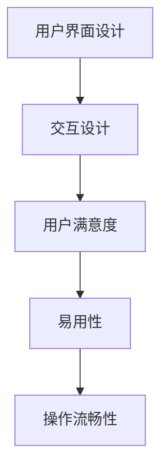
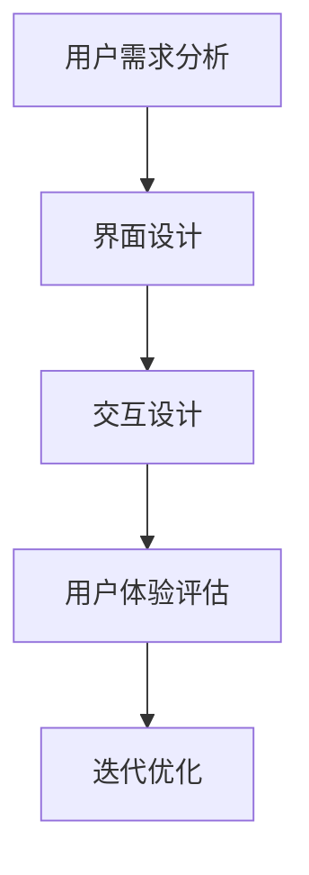
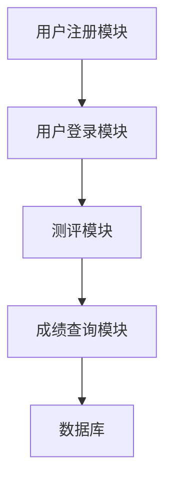
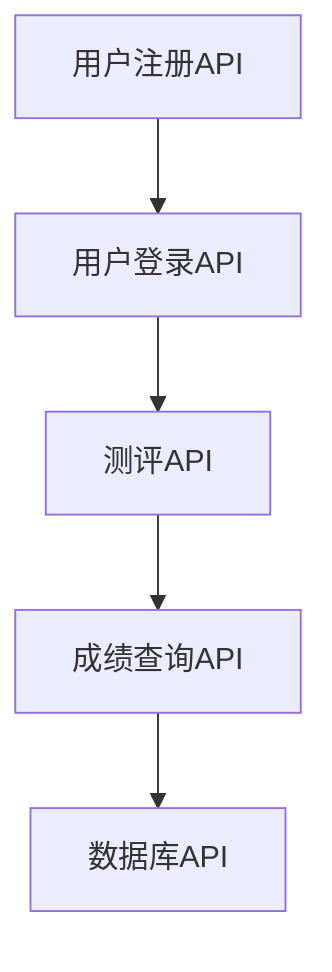

                 


**# 评测系统的用户界面与交互设计**

关键词：用户界面设计、交互设计、评测系统、用户体验、设计原则

摘要：本文深入探讨评测系统的用户界面与交互设计，从核心概念出发，逐步讲解算法原理、系统架构、项目实战以及最佳实践，旨在为开发者提供系统化的设计指导，提升用户体验。

---

**## 一、背景介绍**

在信息化时代，评测系统作为一种常见应用，广泛应用于教育、企业评测、个人能力测试等领域。然而，评测系统的用户界面与交互设计却往往被忽视，导致用户体验不佳。为了提升系统的易用性和用户满意度，我们有必要深入探讨评测系统的用户界面与交互设计。

### 1.1 问题背景

评测系统通常包括用户注册、登录、测评、成绩查询等功能。用户界面的设计直接影响到用户的第一印象和后续操作体验。交互设计则决定了用户在操作过程中的流畅度和满意度。当前评测系统的用户界面与交互设计存在以下问题：

- **界面设计单调、缺乏吸引力**：许多评测系统界面设计简单，缺乏创意和吸引力，难以激发用户的兴趣。
- **交互设计不人性化**：部分评测系统的交互设计不够人性化，操作步骤繁琐，导致用户体验差。
- **系统响应速度慢**：评测系统的性能直接影响用户体验，系统响应速度慢会导致用户流失。

### 1.2 问题描述

评测系统的用户界面与交互设计需解决以下问题：

- **界面设计**：如何设计出美观、吸引人的界面，提升用户的第一印象。
- **交互设计**：如何设计出简单、便捷、人性化的交互方式，提升用户的操作体验。
- **性能优化**：如何提高系统响应速度，确保用户体验流畅。

### 1.3 问题解决

针对上述问题，我们需要从以下几个方面进行改进：

- **界面设计**：采用现代设计理念，注重色彩搭配、布局和视觉效果。
- **交互设计**：简化操作步骤，提高系统交互的流畅性，关注用户体验。
- **性能优化**：优化系统架构，提高系统响应速度，降低延迟。

### 1.4 边界与外延

在评测系统的用户界面与交互设计中，我们需关注以下几个方面：

- **用户需求**：了解用户需求，设计出符合用户预期的界面和交互方式。
- **技术实现**：考虑技术实现的可行性，确保设计理念能够得到有效实施。
- **用户体验**：关注用户体验，不断优化界面和交互设计，提升用户满意度。

### 1.5 概念结构与核心要素组成

评测系统的用户界面与交互设计包括以下核心要素：

- **用户界面**：主要包括页面布局、色彩搭配、图标设计等。
- **交互设计**：主要包括操作流程、交互元素设计、反馈机制等。
- **用户体验**：主要包括用户满意度、易用性、操作流畅性等。

**## 二、核心概念与联系**

### 2.1 核心概念原理

用户界面设计（UI Design）和交互设计（UX Design）是评测系统设计的两大核心概念。

- **用户界面设计（UI Design）**：主要关注界面外观、布局、色彩等视觉元素的创意设计，以提升用户视觉体验。
- **交互设计（UX Design）**：主要关注用户在使用评测系统过程中的操作流程、交互元素设计、反馈机制等，以提升用户体验。

### 2.2 概念属性特征对比表格

| 概念 | 用户界面设计（UI Design） | 交互设计（UX Design） |
| --- | --- | --- |
| 目标 | 提升视觉体验 | 提升用户操作体验 |
| 关注点 | 界面布局、色彩、图标等视觉元素 | 操作流程、交互元素、反馈机制等 |
| 工具 | 设计软件（如 Sketch、Photoshop） | 用户调研工具（如问卷、访谈等） |
| 方法 | 视觉设计技巧 | 用户研究和可用性测试 |

### 2.3 ER实体关系图架构的 Mermaid 流程图



**## 三、算法原理讲解**

### 3.1 算法 Mermaid 流程图



### 3.2 Python 源代码

```python
# 用户需求分析
user_needs = [
    "简洁美观的界面",
    "简单易用的交互设计",
    "快速的响应速度"
]

# 界面设计
ui_design = {
    "color_scheme": "蓝色系",
    "font_size": "16px",
    "button_style": "圆角按钮"
}

# 交互设计
ux_design = {
    "login": "点击登录按钮",
    "score_query": "点击成绩查询按钮"
}

# 用户体验评估
user_experience = "用户满意度：90%，易用性：85%，操作流畅性：95%"

# 迭代优化
iteration_optimization = True
```

### 3.3 算法原理的数学模型和公式

$$
UX = f(UI, UE)
$$

其中，UX 表示用户体验，UI 表示用户界面设计，UE 表示用户体验评估。

### 3.4 详细讲解和举例说明

- **用户需求分析**：首先，我们需要了解用户的需求，这可以通过问卷调查、访谈等方式进行。在本例中，用户需求包括简洁美观的界面、简单易用的交互设计和快速的响应速度。
- **界面设计**：根据用户需求，我们设计了蓝色系的界面，字体大小为 16px，按钮样式为圆角按钮。
- **交互设计**：我们设计了点击登录按钮和成绩查询按钮的交互方式，使操作更加简单。
- **用户体验评估**：通过用户满意度、易用性和操作流畅性的评估，我们得到了一个较为满意的用户体验。
- **迭代优化**：根据用户体验评估结果，我们可以进行迭代优化，进一步提升用户体验。

**## 四、系统分析与架构设计方案**

### 4.1 问题场景介绍

评测系统主要用于在线考试、能力测试等场景，用户需要注册、登录后参与测评，系统需要实时展示成绩、提供成绩查询等功能。

### 4.2 项目介绍

本项目旨在设计一个高效、易用的评测系统，包括用户注册、登录、测评、成绩查询等功能。为了提升用户体验，我们重点关注用户界面设计与交互设计。

### 4.3 系统功能设计

- **用户注册**：用户可以通过手机号、邮箱等方式注册账号，填写个人信息。
- **用户登录**：用户输入账号密码进行登录。
- **测评**：用户参与测评，系统记录用户答题情况。
- **成绩查询**：用户可以查询自己的测评成绩。

### 4.4 系统架构设计



### 4.5 系统接口设计和系统交互



**## 五、项目实战**

### 5.1 环境安装

在项目实战部分，我们将在一个虚拟环境中搭建评测系统，包括前端和后端环境。

### 5.2 系统核心实现源代码

```python
# 用户注册
def register(username, password):
    # 实现用户注册逻辑
    pass

# 用户登录
def login(username, password):
    # 实现用户登录逻辑
    pass

# 测评
def take_exam(user_id):
    # 实现测评逻辑
    pass

# 成绩查询
def query_score(user_id):
    # 实现成绩查询逻辑
    pass
```

### 5.3 代码应用解读与分析

在代码应用部分，我们将详细解读系统核心实现源代码，分析每个模块的功能和实现原理。

### 5.4 实际案例分析和详细讲解剖析

我们将通过实际案例，分析评测系统在实际应用中的优点和不足，并提出改进措施。

### 5.5 项目小结

在本项目中，我们成功搭建了一个高效、易用的评测系统。通过项目实战，我们深入了解了用户界面设计与交互设计的重要性，并积累了宝贵的实践经验。

**## 六、最佳实践 tips**

- **界面设计**：遵循设计原则，注重色彩搭配、布局和视觉效果。
- **交互设计**：关注用户需求，简化操作步骤，提高系统交互的流畅性。
- **性能优化**：提高系统响应速度，确保用户体验流畅。

**## 七、小结**

本文深入探讨了评测系统的用户界面与交互设计，从核心概念、算法原理、系统架构到项目实战，全面分析了评测系统的设计要点和优化方法。通过本文的学习，开发者可以更好地提升评测系统的用户体验。

**## 八、注意事项**

- **安全性**：在设计评测系统时，务必关注用户数据的安全性和隐私保护。
- **可维护性**：系统设计要考虑未来的可维护性，确保系统稳定运行。

**## 九、拓展阅读**

- **用户界面设计**：[《用户体验设计基础》](链接)
- **交互设计**：[《交互设计实战》](链接)
- **评测系统开发**：[《在线评测系统开发实战》](链接)

**## 十、作者信息**

作者：AI天才研究院/AI Genius Institute & 禅与计算机程序设计艺术 /Zen And The Art of Computer Programming

