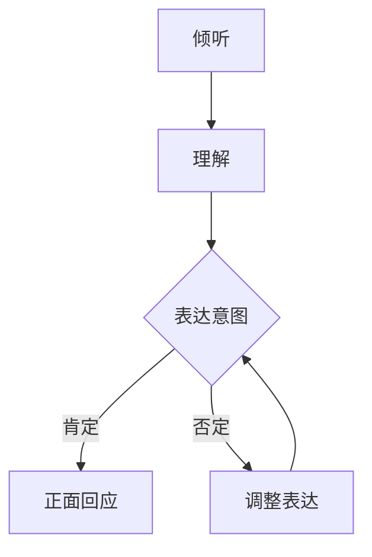
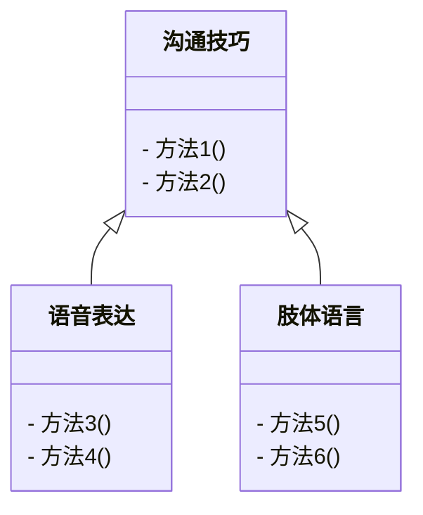

                 


### 引言

#### 第1章：问题背景与核心概念

1.1 问题背景
在当今社会，沟通已成为我们日常生活中不可或缺的一部分。无论是工作、学习还是社交，我们都必须与他人进行有效的沟通。然而，随着信息量的爆炸式增长，人们对于有效沟通的需求也越来越强烈。在这个背景下，“说”作为一种沟通技能，其重要性不言而喻。

1.2 问题描述
尽管“说”是一项基本技能，但很多人在学习过程中会遇到困难。例如，有些人可能不知道如何表达自己的想法，有些人可能在公共场合紧张到无法正常发言。此外，现代社会的快节奏使得人们往往没有时间或者机会去系统地学习“说”的技巧。因此，如何提高“说”的技能，成为一个亟待解决的问题。

1.3 问题解决
本文将提出一种新的观点：“说”是一门技术。通过将“说”视为一门技术，我们可以系统地学习和掌握这门技能，从而提高沟通效果。本文将围绕这一观点，详细阐述“说”技术的核心概念、原理、系统分析与架构设计，以及实战应用。

1.4 边界与外延
“说”技术并非一个孤立的概念，它与其他领域如心理学、语言学等有着密切的联系。同时，“说”技术也有其特定的应用场景，如商务谈判、演讲、教育等。因此，在学习和应用“说”技术时，我们需要明确其边界与外延。

1.5 概念结构与核心要素组成
“说”技术的概念结构由多个核心要素组成，包括沟通技巧、语音表达、肢体语言等。这些要素相互联系、相互作用，共同构成了“说”技术的完整体系。本文将详细分析这些要素，帮助读者理解“说”技术的本质。

### 第二部分：核心概念与原理

#### 第2章：核心概念与联系

2.1 核心概念原理
“说”技术的核心概念包括沟通技巧、语音表达、肢体语言等。沟通技巧指的是如何有效地传达信息，包括倾听、表达、提问等；语音表达则涉及音调、节奏、语气等；肢体语言则包括面部表情、身体姿态、手势等。这些概念共同构成了“说”技术的基本框架。

2.2 概念属性特征对比表格
以下是“说”技术中几个核心概念的属性特征对比表格：

| 概念      | 属性特征                    |
| --------- | -------------------------- |
| 沟通技巧  | 倾听、表达、提问等          |
| 语音表达  | 音调、节奏、语气等          |
| 肢体语言  | 面部表情、身体姿态、手势等 |

通过对比表格，我们可以更清晰地理解各个概念的本质和作用。

2.3 ER实体关系图架构
以下是一个ER实体关系图，展示了“说”技术中的主要实体及其关系：

```mermaid
erDiagram
  沟通技巧 ||--|{ 语音表达 }
  沟通技巧 ||--|{ 肢体语言 }
  语音表达 ||--|{ 面部表情 }
  语音表达 ||--|{ 身体姿态 }
  语音表达 ||--|{ 手势 }
```

通过ER图，我们可以直观地看到“说”技术中各个概念之间的关系，以及它们如何相互作用。

### 第三部分：算法原理讲解

#### 第3章：算法原理详解

3.1 算法mermaid流程图
以下是一个mermaid流程图，展示了“说”技术的基本流程：



通过这个流程图，我们可以了解到“说”技术的核心步骤和逻辑关系。

3.2 Python源代码讲解
以下是一个Python源代码示例，用于实现“说”技术中的某个环节：

```python
def express_intention(intention):
    if intention == "positive":
        return "正面回应"
    elif intention == "negative":
        return "调整表达"
    else:
        return "无法理解意图"
```

通过代码讲解，我们可以深入理解“说”技术的具体实现过程。

3.3 数学模型与公式
“说”技术中的数学模型和公式主要用于分析沟通效果和优化沟通策略。以下是一个简单的数学模型示例：

$$
E = f(P, R, S)
$$

其中，$E$表示沟通效果，$P$表示语音表达，$R$表示肢体语言，$S$表示沟通情境。

3.4 举例说明
假设在一个商务谈判中，我们希望表达积极的意图。根据上述数学模型，我们可以优化语音表达和肢体语言，以提高沟通效果。

例如，我们可以使用较高的音调和清晰的语音表达，同时配合积极的面部表情和开放的身体姿态。这样，我们就可以更有效地传达积极的意图。

### 第四部分：系统分析与架构设计

#### 第4章：系统功能设计

4.1 问题场景介绍
商务谈判是一个典型的应用场景，它要求谈判者具备出色的“说”技术。在谈判中，谈判者需要表达自己的观点，同时理解对方的意图，并作出相应的回应。因此，如何设计和实现一个有效的“说”技术系统，成为一个关键问题。

4.2 系统功能设计（领域模型mermaid类图）
以下是一个领域模型类图，展示了“说”技术系统的功能模块：



通过类图，我们可以清晰地看到系统的功能模块及其关系。

### 第五部分：项目实战

#### 第6章：环境安装与配置

6.1 环境安装
为了实践“说”技术，我们需要搭建一个合适的实验环境。首先，我们需要安装Python和相关的开发工具。具体步骤如下：

1. 下载并安装Python，可以选择Python 3.x版本。
2. 安装Python的pip工具，用于安装和管理Python包。
3. 使用pip安装mermaid渲染器，用于生成mermaid图形。

6.2 系统核心实现源代码
以下是“说”技术系统的一个核心实现源代码示例：

```python
# 沟通技巧模块
class CommunicationSkills:
    def express_intention(self, intention):
        if intention == "positive":
            return "正面回应"
        elif intention == "negative":
            return "调整表达"
        else:
            return "无法理解意图"

# 语音表达模块
class VocalExpression:
    def express_verbally(self, content):
        print(content)

# 肢体语言模块
class PhysicalExpression:
    def express_physically(self, action):
        print(action)
```

#### 第7章：代码应用解读与分析

7.1 代码应用解读
在这个示例中，我们定义了三个模块：沟通技巧、语音表达和肢体语言。沟通技巧模块用于处理意图的表达，语音表达模块用于口头表达，肢体语言模块用于身体动作的表达。

7.2 实际案例分析与详细讲解
以下是一个实际案例，展示了如何使用这个系统：

```python
# 创建沟通技巧对象
skills = CommunicationSkills()

# 表达积极意图
print(skills.express_intention("positive"))

# 创建语音表达对象
vocal = VocalExpression()

# 进行口头表达
vocal.express_verbally("我很满意这个协议。")

# 创建肢体语言对象
physical = PhysicalExpression()

# 进行身体动作表达
physical.express_physically("微笑")
```

在这个案例中，我们首先创建了一个沟通技巧对象，并调用其`express_intention`方法表达了一个积极的意图。然后，我们创建了一个语音表达对象和一个肢体语言对象，分别调用它们的`express_verbally`和`express_physically`方法进行口头和身体动作的表达。

#### 第8章：项目小结

8.1 最佳实践 tips
1. 在实际应用中，应根据具体情境选择合适的“说”技术。
2. 练习是提高“说”技能的关键，多进行模拟练习和实际操作。
3. 注意观察他人的沟通方式，从中学习并吸取经验。

8.2 小结与注意事项
本文介绍了“说”技术的基本概念、原理、系统分析与架构设计，并通过实际案例展示了其应用。在实际应用中，我们需要灵活运用这些技术，以提高沟通效果。

8.3 拓展阅读
1. 《有效沟通技巧》
2. 《商务谈判技巧》
3. 《肢体语言解析》

### 第六部分：总结与展望

#### 第9章：总结与展望

9.1 总结
本文提出了一种新的观点：“说”是一门技术。通过系统地学习和实践，我们可以提高“说”的技能，从而提高沟通效果。本文详细阐述了“说”技术的核心概念、原理、系统分析与架构设计，以及实战应用。

9.2 展望未来发展趋势
随着人工智能技术的发展，未来的“说”技术可能会更加智能化和个性化。例如，通过分析语音和肢体语言，智能系统可以更准确地理解用户的意图，并提供相应的建议和反馈。此外，随着虚拟现实技术的进步，人们可能会在虚拟环境中进行更加逼真的沟通，这也为“说”技术的未来发展提供了广阔的空间。让我们拭目以待，期待未来“说”技术带来的变革。

