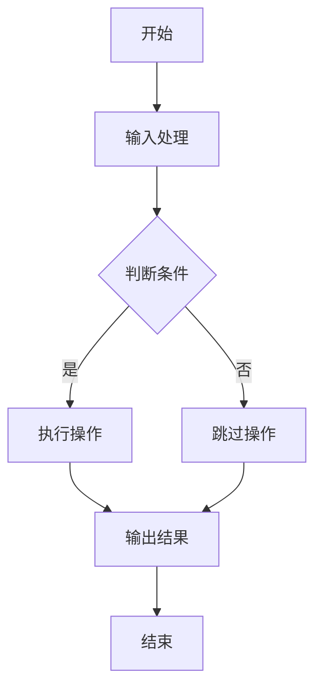
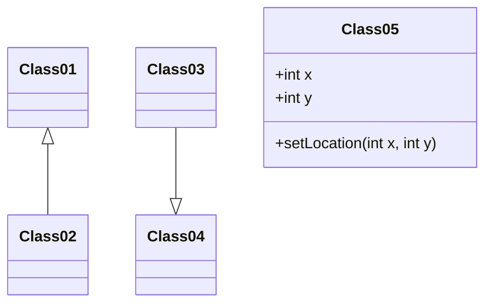
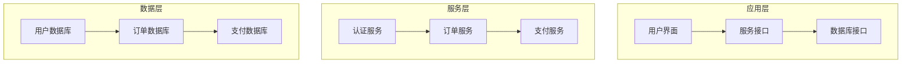
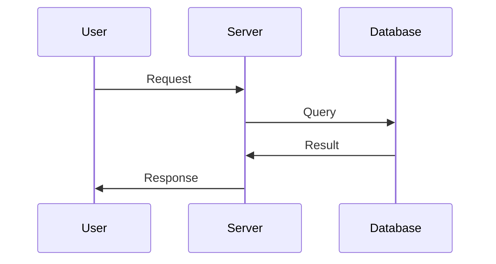

                 

### 高质量代码积累好口碑

> 关键词：代码质量、口碑、实践、优化、编码规范、代码评审、持续集成、持续部署

> 摘要：本文从代码质量与口碑的关系出发，深入探讨了如何编写高质量代码并积累良好的口碑。通过详细的分析和案例讲解，提供了从编写高效代码、优化技巧到代码风格与规范，再到代码评审、持续集成与部署的全方位指导，旨在帮助开发者提升代码质量，树立良好的个人品牌。

## 引言

在信息技术飞速发展的今天，软件工程师的职责已经不仅仅局限于编写代码，更重要的是要编写高质量的代码，并在团队中树立良好的口碑。高质量的代码不仅能够提高软件的性能和可维护性，还能够显著提升开发效率，减少后期维护成本。而良好的口碑则能够为开发者带来更多的职业发展机会，成为其职业生涯中的重要资产。本文将围绕这两个核心概念，详细探讨如何通过编写高质量代码来积累口碑。

### 第1章：代码质量与口碑基础

#### 1.1 背景介绍

在开始深入讨论之前，我们需要明确什么是代码质量以及口碑。代码质量指的是代码的可靠性、可读性、可维护性和效率。口碑则是在同行和社会中的评价和声誉。高质量的代码往往能够得到良好的口碑，反之亦然。

- **问题背景**：随着软件系统变得越来越复杂，编写和维护高质量代码的难度也在不断增加。开发者在追求速度和功能的同时，往往忽视了代码质量。
- **问题描述**：许多团队和公司面临代码质量低下的问题，导致项目延期、维护成本高昂、用户体验差等问题。
- **问题解决**：通过提升代码质量，可以减少bug数量，提高系统稳定性，降低维护成本，从而获得良好的口碑。
- **边界与外延**：代码质量不仅仅包括代码本身的正确性，还包括设计、架构、测试等多个方面。口碑也不仅仅限于团队内部，还包括外部社区和用户。

#### 1.2 核心概念与联系

为了更好地理解代码质量和口碑之间的关系，我们需要深入探讨几个核心概念：

- **核心概念原理**：包括代码可读性、可维护性、性能、测试覆盖率等。
- **概念属性特征对比表格**：列出不同概念的关键属性，并进行对比分析。
- **ER实体关系图架构**：展示代码质量与口碑之间的关系，帮助理解各个概念之间的关联。

### 第2章：编写高效代码

#### 2.1 算法原理讲解

编写高效代码的第一步是理解算法原理。以下是算法原理讲解的详细步骤：

- **算法流程图**：使用Mermaid工具绘制算法流程图，直观展示算法的执行流程。
  
  ```mermaid
  graph TD
  A[开始] --> B[输入处理]
  B --> C{判断条件}
  C -->|是| D[执行操作]
  C -->|否| E[跳过操作]
  D --> F[输出结果]
  E --> F
  F --> G[结束]
  ```

- **Python源代码实现**：通过具体的Python代码实现算法，展示其工作原理。

  ```python
  def efficient_algorithm(input_data):
      # 算法实现
      if condition(input_data):
          perform_action(input_data)
      else:
          skip_action(input_data)
      return result
  ```

- **数学模型和公式详细讲解**：使用LaTeX格式编写数学模型和公式，进行详细讲解。

  $$ f(x) = \sum_{i=1}^{n} w_i \cdot x_i $$

- **举例说明**：通过具体的例子来说明算法的执行过程和效果。

  ```python
  input_data = [1, 2, 3, 4, 5]
  result = efficient_algorithm(input_data)
  print("算法输出结果：", result)
  ```

### 第3章：代码优化技巧

#### 3.1 系统分析与架构设计方案

在编写高效代码的基础上，我们需要进一步探讨代码优化的技巧。以下是一个系统分析与架构设计方案的详细讲解：

- **问题场景介绍**：介绍具体的问题场景，明确优化目标和需求。
- **项目介绍**：简要介绍项目的背景和目标。
- **系统功能设计**：使用Mermaid绘制领域模型类图，展示系统的主要功能模块。

  ```mermaid
  classDiagram
  Class01 <|-- Class02
  Class03 --|> Class04
  Class05 : +int x
  Class05 : +int y
  Class05 : +setLocation(int x, int y)
  ```

- **系统架构设计**：使用Mermaid绘制系统架构图，展示系统的整体结构。

  ```mermaid
  graph TB
  subgraph 应用层
  A[用户界面] --> B[服务接口]
  B --> C[数据库接口]
  end
  subgraph 服务层
  D[认证服务] --> E[订单服务]
  E --> F[支付服务]
  end
  subgraph 数据层
  G[用户数据库] --> H[订单数据库]
  H --> I[支付数据库]
  end
  ```

- **系统接口设计和系统交互**：使用Mermaid绘制系统接口设计和交互序列图。

  ```mermaid
  sequenceDiagram
  User ->> Server: Request
  Server ->> Database: Query
  Database ->> Server: Result
  Server ->> User: Response
  ```

### 第4章：代码风格与规范

#### 4.1 代码风格的重要性

代码风格是代码质量的重要组成部分，良好的代码风格能够提高代码的可读性和可维护性。以下是代码风格重要性的详细讨论：

- **代码风格对口碑的影响**：良好的代码风格能够提升团队协作效率，降低维护成本，从而提高个人的口碑。
- **常见代码风格问题**：讨论常见的代码风格问题，如命名不规范、代码冗余、代码可读性差等。

#### 4.2 编码规范与最佳实践

为了确保代码风格的一致性和可维护性，我们需要遵循编码规范和最佳实践。以下是编码规范和最佳实践的详细讲解：

- **编码规范介绍**：介绍常见的编码规范，如PEP 8、Google Java Style Guide等。
- **最佳实践tips**：提供具体的编码最佳实践，如代码注释、代码分割、代码复用等。

### 第5章：代码评审与反馈

#### 5.1 代码评审的作用

代码评审是确保代码质量的重要手段。以下是代码评审作用的详细讨论：

- **代码评审的重要性**：代码评审能够发现代码中的潜在问题，提高代码质量，降低bug数量。
- **代码评审流程**：介绍代码评审的基本流程，包括代码提交、代码审查、反馈与改进等。

#### 5.2 代码反馈与改进

代码评审后的反馈与改进是提升代码质量的关键环节。以下是代码反馈与改进的详细讲解：

- **反馈机制**：建立有效的反馈机制，确保代码审查的反馈能够及时传达给开发者。
- **改进策略**：提供具体的改进策略，如代码重构、优化算法、改进设计等。

### 第6章：持续集成与持续部署

#### 6.1 持续集成（CI）概述

持续集成是确保代码质量的重要手段。以下是持续集成概述的详细讲解：

- **持续集成的概念**：介绍持续集成的概念和好处，如快速发现集成问题、降低集成成本等。
- **持续集成的好处**：讨论持续集成带来的好处，如提高代码质量、降低开发风险等。

#### 6.2 持续部署（CD）实践

持续部署是实现自动化交付的关键。以下是持续部署实践的详细讲解：

- **持续部署的概念**：介绍持续部署的概念和流程，如自动化测试、自动化部署等。
- **持续部署的流程**：讨论持续部署的流程，包括代码集成、测试、部署等。

### 第7章：代码质量与口碑积累

#### 7.1 口碑积累的重要性

良好的口碑是开发者职业生涯中的重要资产。以下是口碑积累重要性的详细讨论：

- **口碑对职业发展的影响**：良好的口碑能够为开发者带来更多的职业机会和发展空间。
- **口碑积累的方法**：提供具体的口碑积累方法，如参与开源项目、撰写技术博客等。

#### 7.2 持续提升代码质量

持续提升代码质量是积累口碑的关键。以下是持续提升代码质量的详细讲解：

- **如何持续提升代码质量**：提供具体的提升方法，如定期代码审查、学习新技术等。
- **避免常见陷阱**：讨论常见的代码质量陷阱，如过度优化、忽略测试等。

## 结论

编写高质量代码并积累良好的口碑是每个软件工程师的目标。通过本文的详细分析和案例讲解，我们了解了如何从编写高效代码、优化技巧、代码风格与规范，到代码评审、持续集成与部署，全方位提升代码质量。希望本文能够为您的职业发展提供有价值的指导。

### 作者信息

作者：AI天才研究院/AI Genius Institute & 禅与计算机程序设计艺术 /Zen And The Art of Computer Programming

---

**附录：完整Mermaid和LaTeX代码示例**

以下是文中使用到的Mermaid和LaTeX代码示例：

**Mermaid算法流程图：**



**Mermaid领域模型类图：**



**Mermaid系统架构图：**



**Mermaid系统交互序列图：**



**LaTeX数学公式：**

```latex
$$
f(x) = \sum_{i=1}^{n} w_i \cdot x_i
$$
```

```latex
$
1+1=2
$
```

---

通过本文的学习，您将能够更好地理解和应用Mermaid和LaTeX工具，为您的技术博客和文档编写增添专业性和视觉吸引力。希望您能在实践中不断积累和提升，为IT社区贡献更多高质量的技术内容。祝您在编写高质量代码的道路上取得更加辉煌的成就！

