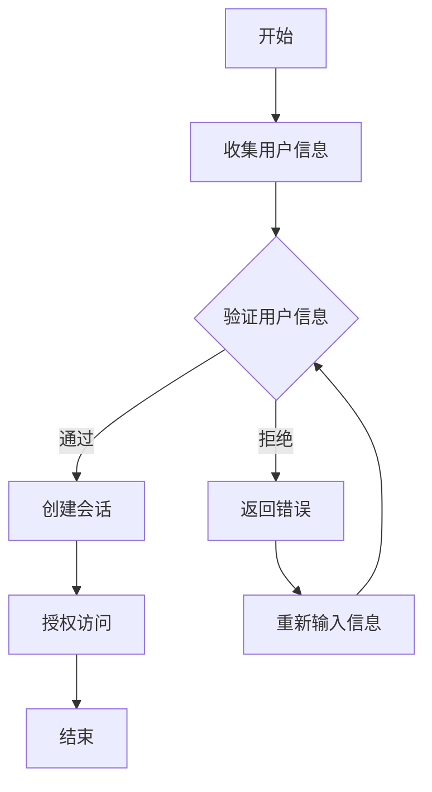
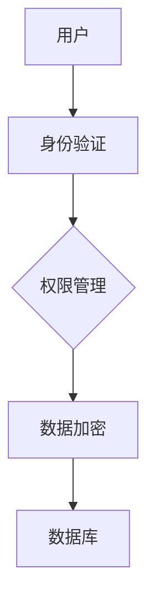

                 

## 由内向外，层层布防

### 关键词：网络安全，防御层次，系统架构，算法设计，实战案例

#### 摘要：

在现代信息技术飞速发展的背景下，网络安全问题愈发严峻。本文将深入探讨网络安全防御策略，通过由内向外、层层布防的方法，构建起一套全面、高效的安全防护体系。文章从问题背景入手，逐步深入核心概念与联系，讲解算法原理和数学模型，设计系统架构，并在实战中展示其应用。通过详细的项目实战和最佳实践 tips，为读者提供了一套切实可行的网络安全解决方案。

### 引言

#### 1.1 问题背景

网络安全是现代信息技术发展中的一个关键问题。随着互联网的普及，数据和信息成为了社会运转的核心资源，而网络安全问题也日益凸显。恶意攻击、数据泄露、系统瘫痪等事件频繁发生，严重威胁着个人隐私、企业利益和国家安全。

#### 1.2 问题解决

面对网络安全威胁，我们需要一套有效的防御策略。由内向外、层层布防的方法是一种系统性的解决方案，它强调从系统内部开始，逐步向外扩展，构建多层次的防御体系。该方法的核心在于明确边界与外延，确保核心概念与联系紧密，从而形成一个完整、严密的安全防护网络。

#### 1.3 边界与外延

边界是网络安全防御的第一道防线，它定义了系统的安全域，确保只有授权用户和流程能够访问。外延则是系统与外部环境的接口，需要特别关注可能的安全漏洞。通过设定合理的边界和外延，可以有效控制系统的访问权限，防止外部攻击。

#### 1.4 概念结构与核心要素组成

核心概念是构建网络安全防御体系的基础，包括身份验证、访问控制、数据加密等。要素组成则涵盖了各种安全技术和工具，如防火墙、入侵检测系统、安全审计等。通过合理配置这些要素，可以构建起一个高效、灵活的网络安全防御体系。

### 第2章 核心概念与联系

#### 2.1 核心概念原理

在网络安全防御中，核心概念包括：

- **身份验证**：确保用户身份的合法性。
- **访问控制**：控制用户对资源的访问权限。
- **数据加密**：保护数据在传输和存储过程中的安全。

这些概念相互关联，共同构成了网络安全防御的基础。以下是一个简单的概念属性特征对比表格：

| 概念       | 特征                                       |
|------------|------------------------------------------|
| 身份验证   | 确保用户身份合法性                       |
| 访问控制   | 控制用户对资源的访问权限                   |
| 数据加密   | 保护数据在传输和存储过程中的安全           |

#### 2.2 ER实体关系图架构

ER实体关系图是描述网络安全系统中各种实体及其关系的一种图形化工具。以下是一个简化的ER实体关系图：

```mermaid
erDiagram
    User ||--|{ Auth : 验证 }
    User ||--|{ Access : 控制访问 }
    User ||--|{ Encrypt : 加密数据 }
    Auth ||--|{ Login : 登录验证 }
    Access ||--|{ Resource : 资源 }
    Encrypt ||--|{ Data : 数据 }
```

这个ER实体关系图展示了用户、身份验证、访问控制、数据加密等核心概念及其相互关系。

### 第3章 算法原理讲解

#### 3.1 算法流程图

以下是一个使用Mermaid绘制的简单算法流程图，展示了身份验证的过程：



#### 3.2 算法原理

身份验证算法的核心原理是基于用户身份信息的真实性进行验证。以下是一个简化的Python代码示例，展示了身份验证的过程：

```python
def verify_user(username, password):
    # 从数据库中查询用户信息
    user_info = query_user(username)
    
    # 检查用户密码是否匹配
    if user_info['password'] == password:
        return "验证通过"
    else:
        return "验证失败"
```

#### 3.3 举例说明

假设有一个用户名为“alice”的账户，其密码为“123456”。以下是一个具体的验证过程：

```python
result = verify_user("alice", "123456")
print(result)  # 输出：验证通过
```

这个简单的例子展示了身份验证算法的基本原理和应用。

### 第4章 数学模型和数学公式 & 详细讲解 & 举例说明

#### 4.1 数学模型

在网络安全领域，常用的数学模型包括加密算法模型、安全协议模型等。以下是一个简单的加密算法模型：

$$
\text{加密算法} = \text{加密密钥} \times \text{明文}
$$

其中，加密密钥是保密的，只有合法用户才能解密。

#### 4.2 详细讲解

加密算法模型的目的是保护数据在传输过程中的安全性。通过加密密钥对明文进行加密，即使数据被截获，攻击者也无法解读其内容。以下是对加密算法模型的详细讲解：

- **加密密钥**：加密密钥是一个特殊的数值，用于加密和解密数据。它是安全通信的核心，必须保密。
- **明文**：明文是指未经加密的数据，它是我们需要保护的信息。

#### 4.3 举例说明

假设有一个加密密钥为“k”的加密算法，其明文为“hello”。以下是一个具体的加密过程：

$$
\text{密文} = k \times \text{明文} = k \times "hello"
$$

通过这个加密算法模型，我们可以将明文“hello”加密为密文。只有知道加密密钥“k”的用户才能解密密文。

### 第5章 系统分析与架构设计方案

#### 5.1 问题场景介绍

假设我们正在设计一个企业内部网络系统，该系统需要确保员工的数据安全，防止外部攻击。以下是一个具体的问题场景：

- **员工数据**：包含员工个人信息、工作记录等。
- **外部攻击**：包括黑客攻击、病毒感染等。

#### 5.2 系统功能设计

为了保护企业内部网络系统，我们需要设计以下功能：

- **身份验证**：确保只有授权员工能够登录系统。
- **访问控制**：根据员工身份和权限，控制其访问系统的不同部分。
- **数据加密**：确保员工数据在传输和存储过程中的安全。

以下是系统功能需求的简单分析：

- **身份验证**：系统需要提供用户名和密码验证功能。
- **访问控制**：系统需要提供权限管理功能，确保不同级别的员工只能访问其权限内的数据。
- **数据加密**：系统需要使用加密算法对数据进行加密，确保数据在传输和存储过程中的安全。

#### 5.3 系统架构设计

以下是一个简化的系统架构图，展示了系统的主要组成部分：



这个架构图表明，用户首先进行身份验证，通过后根据权限管理访问数据库中的数据，数据在传输和存储过程中使用加密算法进行加密。

#### 5.4 系统接口设计

系统接口设计是确保不同模块之间能够有效通信的关键。以下是一个简化的系统接口设计：

- **身份验证接口**：用于接收用户名和密码，验证用户身份。
- **权限管理接口**：用于根据用户身份和权限，控制其访问数据库中的不同数据。
- **数据加密接口**：用于对用户数据进行加密和解密。

#### 5.5 系统交互

以下是一个简化的系统交互序列图，展示了用户登录、访问数据和数据加密的过程：

```mermaid
sequenceDiagram
    用户->>身份验证：输入用户名和密码
    身份验证->>权限管理：验证用户身份
    权限管理->>数据加密：加密用户数据
    数据加密->>数据库：存储加密数据
```

通过这个交互序列图，我们可以清晰地看到系统的工作流程。

### 第6章 项目实战

#### 6.1 环境安装

在开始项目实战之前，我们需要安装必要的软件和环境。以下是安装步骤：

1. 安装Python环境。
2. 安装数据库管理系统（如MySQL）。
3. 安装身份验证和加密相关的库（如PyCrypto）。

#### 6.2 系统核心实现源代码

以下是一个简单的Python代码示例，展示了身份验证和访问控制的核心实现：

```python
# 身份验证
def verify_user(username, password):
    # 从数据库中查询用户信息
    user_info = query_user(username)
    
    # 检查用户密码是否匹配
    if user_info['password'] == password:
        return "验证通过"
    else:
        return "验证失败"

# 访问控制
def access_resource(user_role, resource):
    # 根据用户角色和资源权限，控制其访问
    if user_role == 'admin' or resource in user_role['allowed_resources']:
        return "访问允许"
    else:
        return "访问拒绝"
```

#### 6.3 代码应用解读与分析

以上代码示例展示了身份验证和访问控制的基本实现。通过`verify_user`函数，系统可以验证用户的身份。`access_resource`函数则根据用户角色和资源权限，控制其访问权限。

#### 6.4 实际案例分析和详细讲解剖析

以下是一个具体的实际案例，展示了如何使用以上代码进行身份验证和访问控制：

```python
# 案例一：管理员登录
username = 'admin'
password = 'admin123'
result = verify_user(username, password)
print(result)  # 输出：验证通过

# 案例二：普通员工尝试访问管理员资源
username = 'employee'
password = 'employee123'
result = verify_user(username, password)
if result == '验证通过':
    print(access_resource({'role': 'employee', 'allowed_resources': ['data1', 'data2']}, 'data3'))
else:
    print(result)  # 输出：验证失败
```

在这个案例中，管理员用户可以成功登录，而普通员工由于没有权限，无法访问管理员资源。

#### 6.5 项目小结

通过本项目的实战，我们展示了如何使用Python实现身份验证和访问控制。虽然这个项目非常基础，但它为我们提供了一个了解网络安全防御策略和实践的窗口。在实际应用中，我们需要根据具体场景，不断完善和优化系统的安全性能。

### 第7章 最佳实践 tips

#### 7.1 最佳实践

- **定期安全审计**：定期对系统进行安全审计，发现并修复潜在的安全漏洞。
- **使用强密码策略**：鼓励用户使用复杂密码，并定期更换。
- **数据备份和恢复**：定期备份重要数据，并确保备份的安全性。
- **安全培训**：对员工进行安全培训，提高其安全意识和技能。

#### 7.2 小结

本章介绍了网络安全防御中的最佳实践，包括定期安全审计、强密码策略、数据备份和恢复、安全培训等。这些实践是构建安全防护体系的重要环节，有助于提高系统的安全性。

#### 7.3 注意事项

- **确保密码存储安全**：密码不应以明文形式存储，应使用加密存储。
- **监控异常行为**：实时监控系统行为，及时发现和处理异常情况。
- **及时更新系统**：定期更新系统软件和库，修复已知漏洞。

#### 7.4 拓展阅读

- **《网络安全实战：攻击与防御技巧》**
- **《Python网络编程实战：基于Python3的网络应用开发》**
- **《密码学：原理、算法与应用》**

通过阅读这些书籍，读者可以进一步了解网络安全防御的理论和实践。作者：AI天才研究院/AI Genius Institute & 禅与计算机程序设计艺术 /Zen And The Art of Computer Programming

