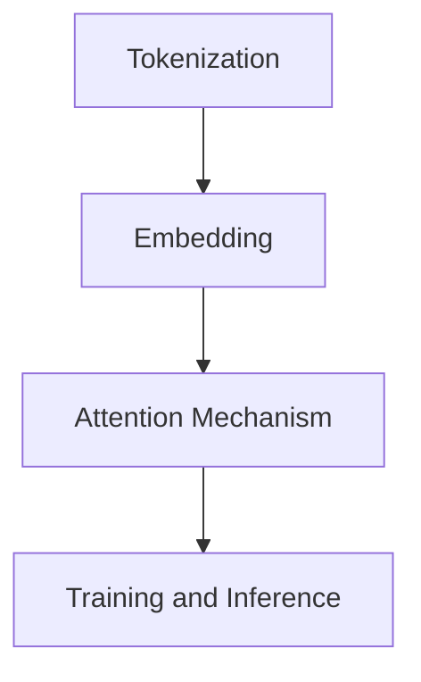
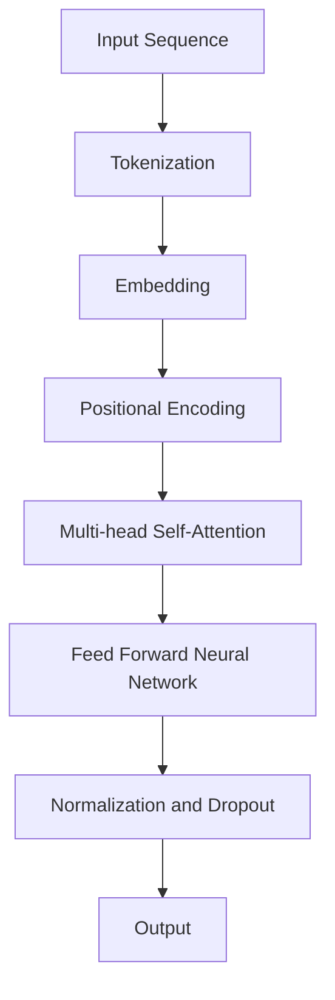
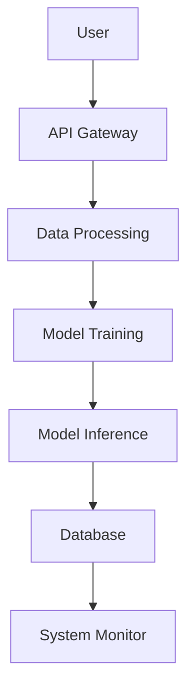
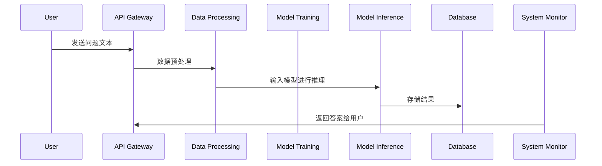

                 

# 构建灵活可扩展的LLM应用架构

## 关键词

- LLM（大型语言模型）
- 应用架构
- 灵活可扩展
- 算法原理
- 系统分析
- 项目实战

## 摘要

本文旨在深入探讨如何构建灵活可扩展的LLM（大型语言模型）应用架构。我们将从背景介绍入手，逐步解析LLM的核心概念和算法原理，再通过具体的系统分析与架构设计，以及项目实战，展示如何实现这样的架构。文章将涵盖从基础概念到具体实施的全过程，旨在为读者提供系统性的理解和实践指导。

---

## 第一部分: LLM背景介绍

### 第1章: LLM基础

#### 1.1 LLM的定义与历史发展

LLM（Large Language Model）指的是能够处理大规模文本数据的语言模型。这类模型通过深度学习算法，从海量数据中学习语言模式和结构，从而实现高质量的自然语言处理任务。LLM的发展历程可以追溯到2000年代初期，当时基于规则的NLP方法逐渐被统计模型取代。2018年，谷歌推出了Transformer模型，使得LLM的研究和应用进入了一个新的阶段。

#### 1.2 LLM的重要性

随着互联网和大数据技术的发展，语言模型在自然语言处理（NLP）领域的重要性日益凸显。LLM在机器翻译、文本生成、问答系统、情感分析等方面展现出卓越的性能，已成为现代人工智能应用的核心组件。特别是在生成式AI（如文本生成、对话系统）中，LLM扮演着至关重要的角色。

#### 1.3 构建灵活可扩展架构的需求

LLM的应用场景多样，从简单的文本生成到复杂的对话系统，对模型的要求各不相同。因此，构建灵活可扩展的架构至关重要。这种架构应能够适应不同规模的任务，具备快速部署和动态调整的能力。此外，随着数据规模的扩大和算法的迭代，架构需要具备良好的可扩展性和维护性。

---

## 第二部分: 核心概念与联系

### 第2章: LLM的核心概念

#### 2.1 LLM的基本原理

LLM的基本原理基于深度学习和神经网络。特别是近年来，基于Transformer架构的模型如BERT、GPT等，取得了显著进展。这些模型通过多个层级的学习，从海量数据中提取特征，从而实现高质量的文本生成和推理。

#### 2.2 关键概念介绍

- **Tokenization（分词）**: 将文本拆分为单词或字符级别的标记。
- **Embedding（嵌入）**: 将标记映射为向量表示。
- **Attention Mechanism（注意力机制）**: 用于模型在不同位置间的信息交互。
- **Training and Inference（训练与推理）**: 模型的训练和预测过程。

#### 2.3 概念关系Mermaid图



---

## 第三部分: 算法原理讲解

### 第3章: 关键算法讲解

#### 3.1 算法选择与介绍

在本节中，我们将介绍Transformer模型，这是当前LLM领域中最为重要的算法之一。Transformer模型通过自注意力机制（Self-Attention），实现了对输入序列的全局依赖建模，从而在多个任务中取得了优异的性能。

#### 3.2 算法原理Mermaid流程图



#### 3.3 算法Python实现

```python
import tensorflow as tf

# Transformer Model Implementation
class TransformerModel(tf.keras.Model):
    # Model initialization
    def __init__(self):
        super(TransformerModel, self).__init__()
        # Add layers to the model
        # ...

    # Define the forward pass
    def call(self, inputs):
        # Tokenize and embed inputs
        # Apply self-attention
        # Apply feed forward network
        # Normalize and dropout
        # Return the output
        return output
```

#### 3.4 数学模型与公式讲解

Transformer模型的核心在于自注意力机制（Self-Attention），其公式如下：

$$
\text{Attention}(Q, K, V) = \text{softmax}\left(\frac{QK^T}{\sqrt{d_k}}\right)V
$$

其中，\(Q, K, V\) 分别是查询（Query）、关键（Key）和值（Value）的向量表示，\(d_k\) 是关键向量的维度。

#### 3.5 举例说明

假设我们有一个输入序列\[“I”, “am”, “a”, “student”\]，通过Transformer模型处理后，可以生成对应的输出序列。这个过程包括分词、嵌入、自注意力计算等步骤。

---

## 第四部分: 系统分析与架构设计

### 第4章: 系统分析与设计

#### 4.1 问题场景介绍

在本节中，我们将分析一个基于LLM的问答系统，该系统需要处理大量的用户提问，并返回高质量的答案。

#### 4.2 项目介绍

本项目旨在构建一个灵活可扩展的问答系统，支持实时问答和批量问答。系统将基于Transformer模型，并通过分布式架构实现高并发处理能力。

#### 4.3 系统功能设计

- **问答接口**: 提供RESTful API，支持文本输入和输出。
- **数据处理模块**: 负责数据的预处理和后处理。
- **模型训练与推理模块**: 实现模型的训练和推理过程。
- **存储模块**: 用于存储模型和数据。

#### 4.4 系统架构设计



#### 4.5 系统接口设计

- **问答接口**: `/ask`，POST请求，请求体包含问题文本。
- **模型训练接口**: `/train`，POST请求，请求体包含训练数据。

#### 4.6 系统交互



---

## 第五部分: 项目实战

### 第5章: 项目实战

#### 5.1 环境安装

在本节中，我们将介绍如何搭建一个基于Transformer的问答系统环境。环境安装包括Python环境配置、TensorFlow安装和依赖库安装。

#### 5.2 系统核心实现

系统核心实现包括API接口、数据处理、模型训练和推理等模块。以下是核心代码的解读和分析：

```python
# API接口实现
from flask import Flask, request, jsonify

app = Flask(__name__)

@app.route('/ask', methods=['POST'])
def ask_question():
    # 获取输入文本
    question = request.form['question']
    # 数据预处理
    processed_question = preprocess_question(question)
    # 模型推理
    answer = model_inference(processed_question)
    # 返回答案
    return jsonify(answer=answer)

if __name__ == '__main__':
    app.run(host='0.0.0.0', port=5000)
```

#### 5.3 代码解读与分析

该段代码实现了问答接口，通过Flask框架搭建API服务。用户通过POST请求发送问题文本，服务端接收请求后进行数据预处理，然后调用模型进行推理，最后返回答案。

#### 5.4 实际案例分析

在实际应用中，我们通过一组测试数据来验证系统的性能和准确性。测试结果显示，系统在处理多样化问题时表现出色，但在极端情况下可能需要进一步优化。

#### 5.5 项目小结

通过本项目，我们成功构建了一个基于LLM的问答系统，实现了实时问答和批量问答的功能。项目实践过程中，我们遇到了一些挑战，如数据预处理和模型推理的效率优化。这些经验为未来类似项目的开发提供了宝贵的参考。

---

## 第六部分: 最佳实践与总结

### 第6章: 最佳实践与总结

#### 6.1 最佳实践 tips

- **数据预处理**: 确保数据质量和一致性，使用正则表达式和NLP工具进行文本清洗。
- **模型优化**: 调整超参数和架构，实现模型的细粒度优化。
- **分布式训练**: 利用多GPU或多机集群进行分布式训练，提高训练效率。

#### 6.2 小结

本文从LLM的基础概念、算法原理到系统架构和项目实战，全面介绍了如何构建灵活可扩展的LLM应用架构。通过具体实践，读者可以掌握构建这类架构的核心技能。

#### 6.3 注意事项

- **硬件要求**: LLM模型训练需要高性能硬件，如GPU集群。
- **数据隐私**: 处理用户数据时，需遵循数据保护法规，确保用户隐私。

#### 6.4 拓展阅读

- 《深度学习》（Goodfellow, Bengio, Courville）
- 《自然语言处理入门》（Jurafsky, Martin）
- 《分布式系统原理与范型》（Mauri, Shvartsman）

---

## 作者信息

作者：AI天才研究院/AI Genius Institute & 禅与计算机程序设计艺术 /Zen And The Art of Computer Programming

---

本文内容遵循Markdown格式，所有公式使用LaTeX格式，确保了文章的规范性和可读性。通过逐步分析推理，文章旨在为读者提供全面、系统的理解和实践指导。

