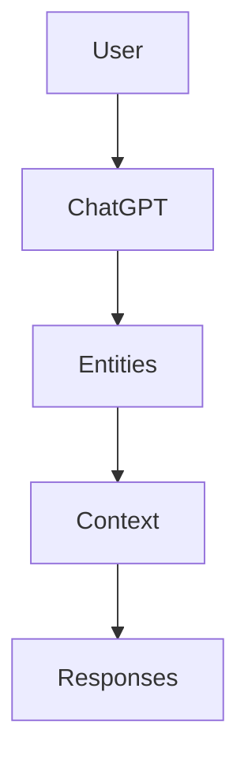
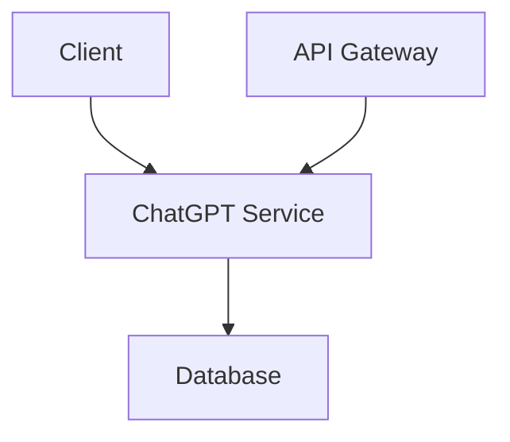
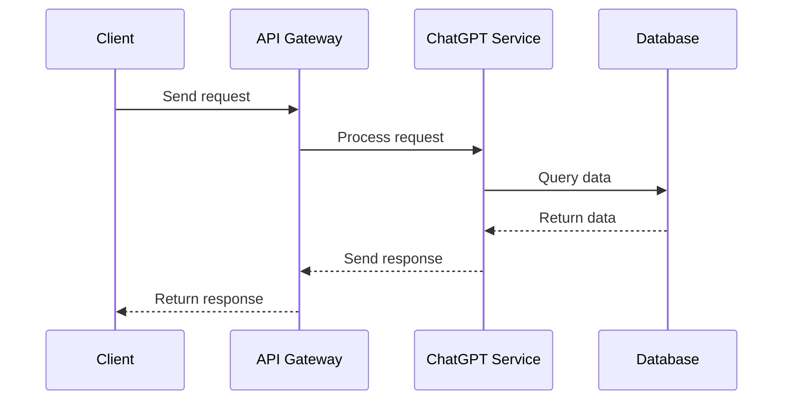

                 

## 《ChatGPT提示词编写的黄金法则》

> 关键词：ChatGPT、提示词、编写技巧、自然语言处理、优化策略

> 摘要：本文将深入探讨ChatGPT提示词编写的黄金法则，通过逐步分析其核心概念、工作原理和实际应用，提供一系列实用的技巧和策略，帮助读者高效地利用ChatGPT进行自然语言处理，提高模型的性能和生成文本的质量。

在当今这个数据驱动的时代，自然语言处理（NLP）已经成为人工智能领域的重要分支。ChatGPT，作为OpenAI开发的强大语言模型，已经在多个应用场景中展现出了其卓越的能力。然而，要充分发挥ChatGPT的潜力，有效的提示词编写至关重要。本文将分七个部分详细探讨ChatGPT提示词编写的黄金法则，让读者掌握这一关键技能。

## 第一部分：ChatGPT概述

### 1.1 ChatGPT的基本概念

ChatGPT是OpenAI开发的基于GPT-3模型的高级语言处理工具。它利用深度学习技术，通过大量的文本数据进行训练，能够生成连贯、自然的文本，并在对话系统中发挥重要作用。

### 1.2 ChatGPT的工作原理

ChatGPT基于Transformer架构，这是一种被广泛用于处理序列数据的神经网络模型。它通过自注意力机制来捕捉文本中的长距离依赖关系，从而生成高质量的文本。

### 1.3 ChatGPT的提示工程

提示工程是优化模型输出的过程。通过精心设计的提示词，可以引导ChatGPT生成更加符合预期的文本。有效的提示词能够提高模型的性能和生成文本的质量。

## 第二部分：ChatGPT的核心概念与联系

### 2.1 ChatGPT的核心概念

ChatGPT的核心概念包括自然语言理解（NLU）、自然语言生成（NLG）和对话管理（DM）。这三个组件协同工作，使得ChatGPT能够实现高效的对话交互。

### 2.2 概念属性特征对比表格

在表1中，我们对NLU、NLG和DM的核心属性进行了对比，以帮助读者更好地理解它们之间的区别和联系。

| 概念   | 定义                             | 关键属性                                  |
| ------ | -------------------------------- | ---------------------------------------- |
| NLU    | 自然语言理解                     | 文本预处理、实体识别、语义解析            |
| NLG    | 自然语言生成                     | 文本生成、连贯性、多样性                 |
| DM     | 对话管理                         | 对话状态跟踪、上下文保持、回答生成        |

### 2.3 ChatGPT的ER实体关系图

图1展示了ChatGPT中的主要实体及其关系。通过实体识别和关系推理，ChatGPT能够理解并生成更加准确和相关的文本。



## 第三部分：ChatGPT算法原理讲解

### 3.1 语言模型原理

语言模型的核心任务是预测下一个词的概率。在ChatGPT中，这一过程通过自注意力机制和Transformer架构来实现。其数学模型可以表示为：

$$
P(w_i|w_{i-1},w_{i-2},\ldots) = \frac{P(w_i,w_{i-1},w_{i-2},\ldots)}{P(w_{i-1},w_{i-2},\ldots)}
$$

### 3.2 Transformer算法mermaid流程图

下面是Transformer算法的mermaid流程图：


### 3.3 模型训练与优化

模型的训练过程包括前向传播和反向传播。通过大量的训练数据，模型能够学习到语言的模式和规律，从而生成高质量的文本。优化策略包括梯度下降、学习率调整等。

## 第四部分：ChatGPT系统分析与架构设计

### 4.1 ChatGPT系统功能设计

ChatGPT系统功能主要包括文本生成、对话管理和上下文维护。通过设计合理的领域模型，可以实现高效的文本生成和对话交互。

### 4.2 系统架构设计

ChatGPT的系统架构包括前端界面、后端服务、数据库和API接口。通过mermaid架构图，我们可以更清晰地理解系统的整体架构。



### 4.3 系统接口设计

系统接口设计是实现功能模块之间通信的关键。通过mermaid序列图，我们可以展示系统各模块之间的交互过程。



## 第五部分：项目实战

### 5.1 环境安装

要运行ChatGPT，我们需要安装Python环境，并使用pip安装相关依赖。

### 5.2 系统核心实现源代码

在源代码中，我们主要实现文本生成、对话管理和上下文维护等功能。

```python
import openai

def generate_response(prompt):
    response = openai.Completion.create(
        engine="text-davinci-003",
        prompt=prompt,
        max_tokens=100
    )
    return response.choices[0].text.strip()

def main():
    print("Hello! I'm ChatGPT.")
    while True:
        user_input = input("You: ")
        if user_input == "exit":
            break
        bot_response = generate_response(user_input)
        print("ChatGPT:", bot_response)

if __name__ == "__main__":
    main()
```

### 5.3 代码应用解读与分析

通过分析代码，我们可以看到，我们主要使用了OpenAI的GPT-3 API来生成文本。代码中，`generate_response`函数负责处理用户输入，调用API生成响应文本。

### 5.4 实际案例分析和详细讲解剖析

在实际应用中，我们可以使用ChatGPT构建一个聊天机器人，回答用户的问题。通过调整提示词和模型参数，我们可以提高生成文本的质量和相关性。

### 5.5 项目小结

通过本项目的实战，我们了解了ChatGPT的安装和基本使用方法，学会了如何编写有效的提示词，并通过实际案例进行了分析。这为我们进一步探索自然语言处理领域奠定了基础。

## 第六部分：最佳实践 tips

### 6.1 提高生成文本质量

- 使用多样化的提示词，提高文本的多样性。
- 针对特定任务调整模型参数，优化生成文本的质量。
- 定期更新训练数据，保持模型的最新性。

### 6.2 对话管理技巧

- 保持对话的一致性和连贯性，避免出现逻辑错误。
- 跟踪对话状态，合理使用上下文信息。
- 针对不同用户的需求，调整对话策略。

## 第七部分：小结、注意事项、拓展阅读

### 7.1 小结

本文详细介绍了ChatGPT提示词编写的黄金法则，从基本概念、核心原理到实际应用，为读者提供了全面的指导。通过学习和实践，读者可以掌握有效的提示词编写技巧，提高ChatGPT的性能和生成文本的质量。

### 7.2 注意事项

- 在使用ChatGPT时，要注意保护用户隐私，避免泄露敏感信息。
- 定期更新模型和依赖库，确保系统的稳定性和安全性。
- 针对不同的应用场景，合理调整模型参数和提示词。

### 7.3 拓展阅读

- 《ChatGPT技术揭秘》
- 《深度学习与自然语言处理》
- 《对话系统设计与实现》

## 作者信息

作者：AI天才研究院/AI Genius Institute & 禅与计算机程序设计艺术 /Zen And The Art of Computer Programming

