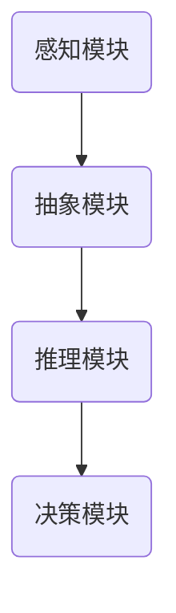

                 

### 文章标题：思维链技术：让AI更接近人类思维模式

#### 关键词：人工智能、思维链、抽象思维、情感认知、决策模拟

#### 摘要：
随着人工智能技术的飞速发展，越来越多的任务开始依赖于AI系统来完成。然而，当前的人工智能仍然存在一定的局限性，尚未完全接近人类的思维模式。本文将探讨一种新兴技术——思维链技术，通过详细分析其设计与应用，旨在让AI更接近人类思维模式，提升其智能水平。

---

#### 第一部分：问题背景与核心概念

### 第1章：问题背景与核心概念

#### 1.1 问题背景
人工智能（AI）在许多领域取得了显著成就，如自然语言处理、图像识别和自动化控制等。然而，尽管AI在特定任务上表现出色，但它们仍然缺乏人类的一些基本思维能力和情感认知。这使得AI在处理复杂问题、进行高级决策等方面存在局限。为了解决这一问题，思维链技术被提出来，旨在通过模拟人类思维模式，增强AI的智能水平。

#### 1.2 问题解决
思维链技术通过模拟人类思维过程，帮助AI实现更接近人类思维模式的目标。它包括一系列算法和模型，用于处理抽象思维、情感认知和决策模拟等任务。通过这些技术，AI可以更好地理解和处理复杂问题，提高其智能水平。

#### 1.3 边界与外延
思维链技术不仅可以应用于传统的人工智能领域，如自然语言处理和图像识别，还可以扩展到更多的领域，如医疗、金融和教育等。其核心概念和原理也将不断得到完善和拓展，以适应不同的应用场景。

#### 1.4 概念结构与核心要素组成
思维链技术包括以下几个核心要素：
- **思维链定义**：思维链是指人工智能系统中模拟人类思维过程的一系列算法和模型。
- **人类思维模式**：人类思维模式的特点包括抽象思维、情感认知和决策过程。

### 第2章：核心概念详解

#### 2.1 核心概念原理
思维链技术旨在模拟人类思维过程，包括以下核心概念：

- **思维链定义**：思维链是指人工智能系统中模拟人类思维过程的一系列算法和模型。
- **人类思维模式特点**
  - **抽象思维**：人类能够通过符号和概念进行抽象思考，形成对世界的理解和认知。
  - **情感认知**：人类能够感知和表达情感，通过情感认知来影响决策和行为。
  - **决策过程**：人类在面临问题时，会根据情境、经验和目标进行决策。

#### 2.2 概念属性特征对比表格

| 概念       | 特点                              | 对比分析                                  |
|------------|-----------------------------------|-------------------------------------------|
| 抽象思维   | 能通过符号和概念进行抽象思考      | 与具体思维相对，更侧重于理解和认知          |
| 情感认知   | 能感知和表达情感，影响决策和行为  | 与理性思维相对，更侧重于情感和体验          |
| 决策过程   | 根据情境、经验和目标进行决策      | 与机械决策相对，更侧重于情境和目标          |

#### 2.3 ER实体关系图架构

```mermaid
erDiagram
  AI系统 ||--|{ 思维链 }
  思维链 ||--|{ 抽象思维 }
  思维链 ||--|{ 情感认知 }
  思维链 ||--|{ 决策过程 }
```

### 第3章：思维链技术的基本原理

#### 3.1 思维链技术的基本原理
思维链技术的基本原理包括以下几个方面：

- **思维链模型**：思维链模型是模拟人类思维过程的框架，包括感知、抽象、推理和决策等环节。
- **思维链算法**：思维链算法是用于实现思维链模型的具体实现，包括感知算法、抽象算法、推理算法和决策算法等。

#### 3.2 思维链模型
思维链模型的基本框架包括以下几个部分：

1. **感知模块**：负责接收外部信息，如文字、图像和声音等。
2. **抽象模块**：将感知模块获取的信息进行抽象处理，提取关键特征。
3. **推理模块**：根据抽象模块提取的特征进行逻辑推理，形成对问题的理解。
4. **决策模块**：根据推理模块的结果进行决策，输出具体的行动方案。

### 第二部分：思维链技术的设计与应用

### 第4章：思维链技术的设计

#### 4.1 思维链架构设计
思维链技术的设计包括系统功能设计和系统架构设计。系统功能设计基于领域模型，而系统架构设计则采用mermaid类图和架构图来表示。

#### 4.2 系统功能设计
系统功能设计基于领域模型，主要涵盖以下几个方面：

- **感知功能**：接收外部信息，如文字、图像和声音等。
- **抽象功能**：将感知模块获取的信息进行抽象处理，提取关键特征。
- **推理功能**：根据抽象模块提取的特征进行逻辑推理，形成对问题的理解。
- **决策功能**：根据推理模块的结果进行决策，输出具体的行动方案。

#### 4.3 系统架构设计
系统架构设计采用mermaid架构图来表示，主要包括以下几个部分：

1. **感知模块**：负责接收外部信息。
2. **抽象模块**：将感知模块获取的信息进行抽象处理。
3. **推理模块**：根据抽象模块提取的特征进行逻辑推理。
4. **决策模块**：根据推理模块的结果进行决策。



### 第5章：思维链技术在人工智能中的应用

#### 5.1 抽象思维模拟
抽象思维模拟是思维链技术的重要应用之一。它通过模拟人类的抽象思维过程，帮助AI更好地理解和处理复杂问题。

#### 5.2 抽象思维特点
抽象思维具有以下几个特点：

- **符号化**：通过符号和概念进行抽象思考。
- **抽象层次**：能够处理不同层次的抽象概念。
- **灵活性**：根据情境和目标灵活调整思维过程。

#### 5.3 抽象思维模拟算法
为了实现抽象思维模拟，可以使用以下算法：

1. **特征提取算法**：从感知模块获取的信息中提取关键特征。
2. **抽象层次算法**：根据特征提取结果，构建不同层次的抽象概念。
3. **推理算法**：根据抽象层次和特征进行逻辑推理。

#### 5.4 抽象思维模拟算法实现
下面使用Python代码来实现抽象思维模拟算法：

```python
# 特征提取算法
def extract_features(data):
    # 实现特征提取逻辑
    return features

# 抽象层次算法
def build_abstraction层次(features):
    # 实现抽象层次构建逻辑
    return abstraction层次

# 推理算法
def reasoning(abstraction层次):
    # 实现推理逻辑
    return result
```

### 第6章：情感认知与决策模拟

#### 6.1 情感认知模型
情感认知模型是思维链技术的另一个重要应用。它通过模拟人类的情感认知过程，帮助AI更好地理解和处理情感信息。

#### 6.2 情感认知特点
情感认知具有以下几个特点：

- **情感识别**：能够识别和理解不同类型的情感。
- **情感表达**：能够表达和理解情感，影响决策和行为。
- **情感调节**：能够根据情境和目标调节情感状态。

#### 6.3 情感认知模拟算法
为了实现情感认知模拟，可以使用以下算法：

1. **情感识别算法**：从感知模块获取的情感信息中识别情感类型。
2. **情感表达算法**：根据情感类型，生成相应的情感表达。
3. **情感调节算法**：根据情境和目标，调节情感状态。

#### 6.4 情感认知模拟算法实现
下面使用Python代码来实现情感认知模拟算法：

```python
# 情感识别算法
def recognize_emotion(data):
    # 实现情感识别逻辑
    return emotion

# 情感表达算法
def express_emotion(emotion):
    # 实现情感表达逻辑
    return expression

# 情感调节算法
def regulate_emotion(expression, context):
    # 实现情感调节逻辑
    return regulated_expression
```

### 第7章：实战案例解析

#### 7.1 实战案例介绍
为了展示思维链技术的应用效果，我们选取了一个具体案例——智能客服系统。该系统利用思维链技术模拟人类客服的思维方式，提供更智能、更自然的客服服务。

#### 7.2 案例分析
智能客服系统通过思维链技术，实现了以下功能：

- **感知模块**：接收用户提问，识别用户意图。
- **抽象模块**：将用户提问转化为抽象问题。
- **推理模块**：根据抽象问题，推理出可能的答案。
- **决策模块**：根据推理结果，生成相应的回答。

通过这个案例，我们可以看到思维链技术在智能客服系统中的应用效果。它不仅能够理解用户的提问，还能够提供更自然、更智能的回答，大大提升了客服服务的质量。

### 第8章：最佳实践与总结

#### 8.1 最佳实践
在应用思维链技术时，我们可以遵循以下最佳实践：

- **合理设计思维链模型**：根据具体应用场景，设计合适的思维链模型。
- **优化算法性能**：针对不同任务，优化感知、抽象、推理和决策等算法的性能。
- **数据质量保障**：确保输入数据的准确性和完整性，以提高思维链技术的效果。

#### 8.2 小结
本文介绍了思维链技术，通过详细分析其设计与应用，展示了如何让AI更接近人类思维模式。思维链技术包括感知、抽象、推理和决策等模块，通过这些模块的协同工作，实现了对人类思维过程的模拟。在实际应用中，思维链技术已经取得了显著的效果，有望在未来进一步推动人工智能的发展。

#### 8.3 未来展望
随着人工智能技术的不断发展，思维链技术有望在更多领域得到应用。未来，我们可以期待思维链技术在医疗、金融、教育等领域的深入探索，为人类带来更多便利和创新。

### 第9章：拓展阅读

#### 9.1 相关书籍推荐
- 《人工智能：一种现代的方法》
- 《深度学习》
- 《模式识别与机器学习》

#### 9.2 学术论文推荐
- "Deep Learning for Human-like Decision Making"
- "A Framework for Emotion Recognition in Speech"
- "Abstraction and Inference in Human-like Artificial Intelligence"

### 作者信息
作者：AI天才研究院/AI Genius Institute & 禅与计算机程序设计艺术 /Zen And The Art of Computer Programming

