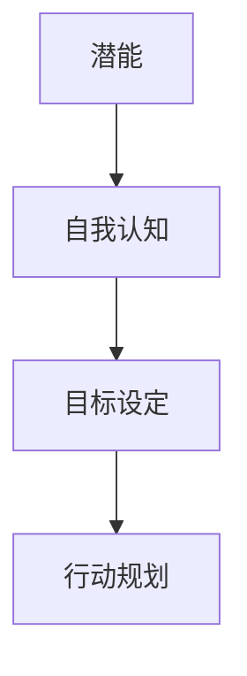
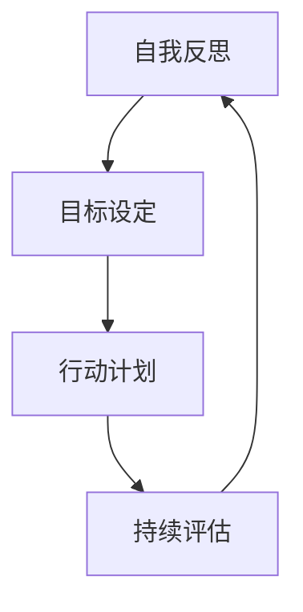
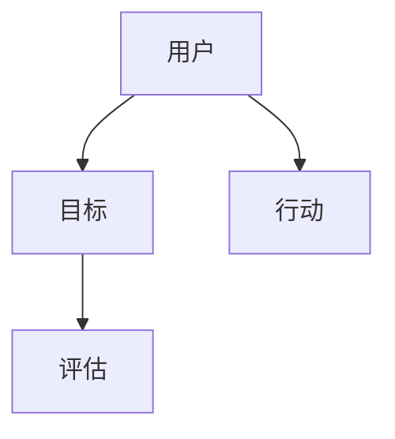
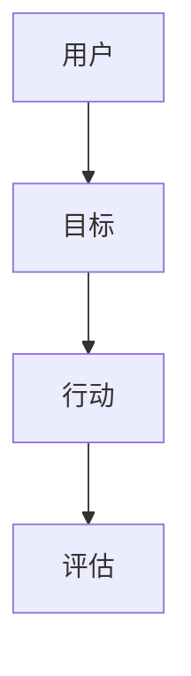
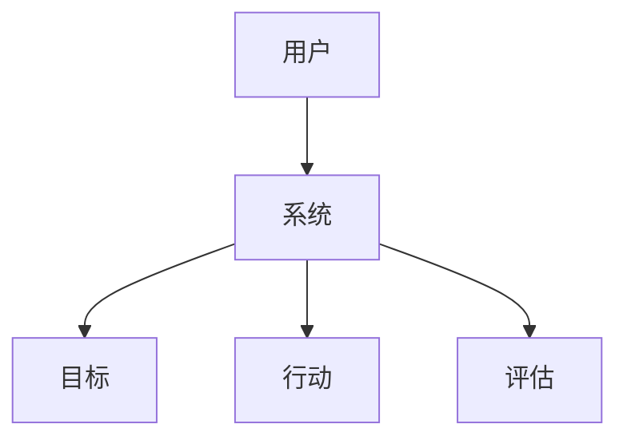

                 

# 《释放内在潜能：自我实现的实践指南》

> 关键词：自我实现、潜能、实践、指南

> 摘要：本文旨在探讨如何通过自我实现的实践指南，释放内在潜能，实现个人成长与职业发展。文章将分为引言、核心概念与联系、算法原理讲解、数学模型与公式讲解、系统分析与架构设计方案、项目实战、最佳实践与小结等部分，提供全面、系统的指导。

## 引言与背景

自我实现是一个古老而现代的话题，源自亚里士多德的名言：“人类是理性的动物，其本质在于追求幸福。”在现代社会，自我实现被视为个体心理成长与职业发展的关键。然而，如何实现自我实现，如何释放内在潜能，仍然是一个挑战。

本文将以《释放内在潜能：自我实现的实践指南》为线索，逐步剖析自我实现的核心概念、算法原理、数学模型，并通过系统分析与架构设计方案，提供实用的项目实战和最佳实践指南。

### 核心概念与联系

#### 潜能

潜能是指个体内在的、尚未完全开发的能力。在心理学中，潜能被视为个体心理成长的基石。潜能不仅包括智力、情感、意志等方面，还包括个体的身体潜能和社交潜能。

#### 自我认知

自我认知是指个体对自身特点、能力和价值观的认知。自我认知是自我实现的前提，只有深入了解自己，才能找到适合自己的发展路径。

#### 目标设定与行动规划

目标设定是指明确个体希望实现的目标。行动规划是指为实现目标制定具体的计划。目标设定与行动规划是自我实现的重要步骤，有助于将内在潜能转化为实际成果。

#### 核心概念关系图

（此处使用 Mermaid 画出核心概念关系图）



### 算法原理讲解

#### 心理学理论在自我实现中的应用

心理学理论为我们提供了理解自我实现的理论基础。例如，马斯洛的需求层次理论指出，个体的需求分为生理、安全、社交、尊重和自我实现五个层次。要实现自我，首先要满足低层次的需求，然后逐步提升到高层次的需求。

#### 哲学思考在自我实现中的作用

哲学思考有助于我们理解自我实现的意义和价值。例如，尼采的“超人”概念强调个体超越传统的道德观念，追求自我实现。

#### 自我实现的方法论

方法论是指实现自我实现的具体方法和策略。例如，克拉克的“四步法”包括：自我反思、目标设定、行动计划和持续评估。

#### 使用 mermaid 画流程图

（此处使用 mermaid 画出自我实现的流程图）



#### 使用 Python 源代码解释

```python
# 自我实现的 Python 源代码

# 自我反思
def self_reflection():
    print("我目前的状态是什么？")

# 目标设定
def goal_setting():
    print("我想要实现什么目标？")

# 行动计划
def action_plan():
    print("我如何实现目标？")

# 持续评估
def continuous_evaluation():
    print("我的目标实现得如何？")

# 主函数
def main():
    self_reflection()
    goal_setting()
    action_plan()
    continuous_evaluation()

# 调用主函数
main()
```

### 数学模型与公式讲解

#### 关键数学模型介绍

在自我实现过程中，关键数学模型包括：线性规划、决策树、神经网络等。

#### 使用 LaTeX 格式展示公式

$$
f(x) = \frac{1}{1+e^{-x}}
$$

#### 举例说明

假设一个个体想要实现职业发展，可以使用线性规划模型来设定目标。目标函数可以表示为：

$$
\max Z = c^T x
$$

其中，$c$ 是目标函数的系数向量，$x$ 是决策变量向量。

### 系统分析与架构设计方案

#### 问题场景介绍

假设我们要设计一个自我实现系统，帮助用户实现个人成长和职业发展。

#### 系统功能设计

（此处使用 Mermaid 画出领域模型类图）



#### 系统架构设计

（此处使用 Mermaid 画出系统架构图）



#### 系统接口设计与交互

（此处使用 Mermaid 画出系统接口设计和交互）



### 项目实战

#### 环境安装与准备

（此处描述环境安装与准备步骤）

#### 系统核心实现

（此处提供系统核心实现的源代码）

#### 代码应用解读与分析

（此处对代码进行解读和分析）

#### 实际案例分析和详细讲解剖析

（此处提供一个实际案例，并进行详细讲解）

#### 项目小结

（此处对项目进行小结）

### 最佳实践与小结

（此处提供最佳实践、小结、注意事项、拓展阅读等内容）

## 作者

作者：AI天才研究院/AI Genius Institute & 禅与计算机程序设计艺术 /Zen And The Art of Computer Programming

