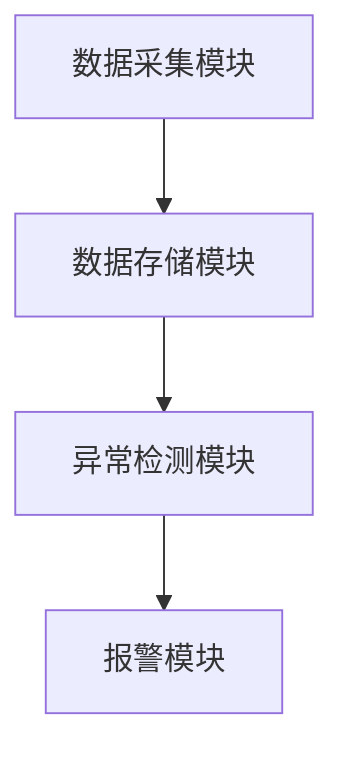
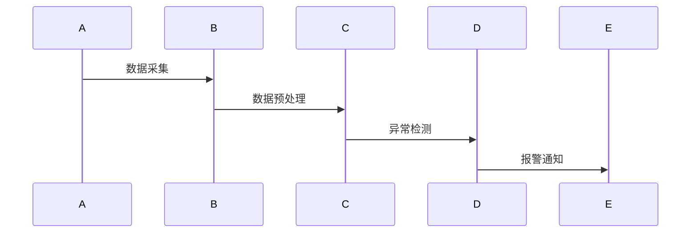

                 

# 构建具有异常检测能力的AI Agent

> 关键词：AI代理、异常检测、机器学习、深度学习、系统架构设计、实践案例

> 摘要：
本文将深入探讨构建具有异常检测能力的AI代理的关键技术和方法。我们将首先介绍AI代理和异常检测的基本概念，随后详细讨论AI代理的架构设计，以及如何将异常检测集成到这些代理中。我们将结合机器学习和深度学习的理论基础，探讨算法实现及其在具体场景中的应用。最后，将通过实际案例展示如何构建和部署具有异常检测能力的AI代理，并提供最佳实践和未来研究方向。

## 引言

随着人工智能技术的迅猛发展，AI代理（AI Agents）已成为自动化和智能决策系统中的重要组成部分。AI代理是一种能够自主感知环境、采取行动并达成目标的智能体，它们在金融、医疗、交通、安全等多个领域展示了巨大的应用潜力。然而，在实际应用中，AI代理的运行环境复杂多变，存在许多不可预测的因素。这些因素可能导致代理行为的异常，从而影响系统的稳定性和可靠性。因此，构建具有异常检测能力的AI代理成为了当前研究的热点之一。

本文将围绕以下几个核心问题展开讨论：

1. AI代理和异常检测的基本概念及其在AI系统中的重要性。
2. AI代理的架构设计，包括感知、决策和执行模块。
3. 如何将异常检测机制集成到AI代理中，并利用机器学习和深度学习技术提高异常检测的准确性。
4. 通过具体案例展示异常检测在AI代理中的应用和实施。
5. 提供最佳实践和未来研究方向，以推动具有异常检测能力的AI代理技术的发展。

## 第1章 AI代理与异常检测基础

### 1.1 AI代理概述

AI代理是指具备一定智能，能够模拟人类行为并自主执行任务的实体。它们通常由以下三个关键模块组成：

- **感知模块**：负责接收外部环境的信息，如图像、声音、文本等。
- **决策模块**：基于感知模块收集到的信息，通过算法进行推理和决策。
- **执行模块**：根据决策模块的结果，执行相应的操作，如移动、发送指令等。

AI代理的典型应用包括自动驾驶、智能客服、医疗诊断等。这些应用场景对代理的自主性、智能性和可靠性提出了高要求。

### 1.2 异常检测基本概念

异常检测（Anomaly Detection）是一种用于识别数据集中异常或非预期的数据模式的技术。在AI系统中，异常检测主要用于以下几个目的：

- **提高系统可靠性**：通过检测并处理异常行为，保证系统的稳定运行。
- **发现潜在问题**：在问题变得严重之前，提前发现系统中的异常，防止故障发生。
- **提升用户体验**：在用户行为异常时，及时采取措施，提高用户体验。

### 1.3 异常检测在AI代理中的重要性

在AI代理中，异常检测具有以下几个重要作用：

- **实时监控**：通过实时监测代理的行为，及时发现并响应异常情况，防止系统崩溃。
- **自适应调整**：根据异常检测结果，调整代理的行为策略，提高其适应能力。
- **安全防护**：在面临网络攻击或恶意行为时，通过异常检测及时识别并采取防护措施。

### 1.4 AI代理与异常检测的整合

将异常检测集成到AI代理中，需要解决以下几个关键问题：

- **数据融合**：如何将来自不同感知模块的数据进行有效整合，提高异常检测的准确性。
- **算法优化**：如何选择合适的算法，提高异常检测的效率和精度。
- **动态调整**：如何根据环境变化和任务需求，动态调整异常检测的参数和策略。

## 第2章 AI代理架构设计

### 2.1 感知模块

感知模块是AI代理的感官，负责收集环境中的信息。感知模块的类型取决于应用场景，如：

- **视觉感知**：通过摄像头、图像传感器等获取图像数据。
- **听觉感知**：通过麦克风、语音识别系统等获取声音数据。
- **文本感知**：通过自然语言处理技术获取文本数据。

感知模块的设计需要考虑以下几个方面：

- **数据质量**：确保收集到的数据准确、完整。
- **数据流处理**：高效处理大量的感知数据，提取关键信息。

### 2.2 决策模块

决策模块是AI代理的大脑，负责处理感知模块收集到的信息，并生成相应的行为策略。决策模块的设计通常基于机器学习和深度学习技术，如：

- **监督学习**：通过已有数据训练模型，预测新数据的标签。
- **无监督学习**：自动发现数据中的模式和结构，无需标签。
- **强化学习**：通过试错和学习，找到最优策略。

决策模块的设计需要考虑以下几个方面：

- **模型选择**：根据应用场景选择合适的模型。
- **数据预处理**：对感知数据进行清洗、归一化等预处理。
- **模型训练**：使用合适的数据集训练模型，并评估其性能。

### 2.3 执行模块

执行模块是AI代理的执行者，负责将决策模块生成的策略转化为实际操作。执行模块的设计需要考虑以下几个方面：

- **执行效率**：确保策略执行的高效性。
- **可扩展性**：支持不同的执行环境和任务。
- **容错性**：在执行过程中遇到异常时，能够自动恢复或调整策略。

## 第3章 异常检测算法实现

### 3.1 监督学习算法

监督学习算法是一种常用的异常检测方法，通过已标记的正常数据和异常数据训练模型，用于预测新数据的异常情况。常用的监督学习算法包括：

- **支持向量机（SVM）**：通过最大化分类边界，识别异常数据。
- **决策树**：通过构建决策树模型，分类新数据。
- **随机森林**：通过集成多个决策树，提高模型的泛化能力。

### 3.2 无监督学习算法

无监督学习算法不依赖于已标记的数据，通过自动发现数据中的模式和结构来识别异常。常用的无监督学习算法包括：

- **K-均值聚类**：将相似的数据聚类到一起，识别异常点。
- **主成分分析（PCA）**：通过降维技术，识别异常数据。
- **孤立森林**：通过随机森林的变种，识别异常数据。

### 3.3 深度学习算法

深度学习算法通过多层神经网络，自动提取数据中的特征，用于异常检测。常用的深度学习算法包括：

- **自编码器（Autoencoder）**：通过重建输入数据，识别异常。
- **卷积神经网络（CNN）**：通过图像处理能力，识别图像中的异常。
- **循环神经网络（RNN）**：通过序列数据建模能力，识别序列中的异常。

## 第4章 案例研究：构建具有异常检测能力的AI代理

### 4.1 案例背景

某金融机构希望构建一个AI代理系统，用于实时监控交易数据，检测潜在的欺诈行为。该系统需要具备以下功能：

- **实时数据采集**：从各种交易渠道收集交易数据。
- **异常检测**：识别并标记潜在的欺诈交易。
- **报警机制**：在检测到欺诈交易时，自动向相关部门发送报警信息。

### 4.2 系统架构设计

系统架构设计包括以下模块：

- **数据采集模块**：负责实时收集交易数据，并将其传输到数据存储模块。
- **数据存储模块**：使用大数据技术存储和管理交易数据。
- **异常检测模块**：使用机器学习和深度学习算法，对交易数据进行异常检测。
- **报警模块**：在检测到欺诈交易时，自动生成报警信息并通知相关部门。

### 4.3 系统功能设计

系统功能设计包括以下方面：

- **实时数据采集**：通过API接口实时获取交易数据。
- **数据预处理**：对交易数据进行清洗、去噪等预处理。
- **异常检测**：使用自编码器模型进行异常检测。
- **报警通知**：在检测到欺诈交易时，通过邮件、短信等方式通知相关部门。

### 4.4 系统架构设计

系统架构设计如下：

### 4.5 系统接口设计

系统接口设计如下：

### 4.6 实际案例分析和讲解

通过实际案例，我们将展示如何使用自编码器模型进行异常检测，并提供详细的代码实现和分析。

### 4.7 项目小结

在本项目中，我们成功构建了一个具有异常检测能力的AI代理系统，实现了实时交易数据的监控和欺诈交易的识别。通过该项目，我们验证了异常检测算法在实际场景中的应用效果，并为金融机构提供了有效的欺诈防范手段。

## 最佳实践与未来研究方向

### 5.1 最佳实践

1. **数据预处理**：确保数据质量，进行有效的数据清洗和归一化处理。
2. **模型选择**：根据应用场景选择合适的异常检测算法。
3. **动态调整**：根据环境变化和任务需求，动态调整异常检测参数。
4. **监控与反馈**：建立实时监控系统，及时发现并处理异常情况。

### 5.2 未来研究方向

1. **多模态异常检测**：结合不同类型的数据源，提高异常检测的准确性和泛化能力。
2. **迁移学习**：利用迁移学习技术，提高异常检测模型在不同领域的应用效果。
3. **强化学习**：将强化学习与异常检测相结合，提高AI代理的自适应能力。

## 结束语

本文详细介绍了构建具有异常检测能力的AI代理的关键技术和方法。通过理论讲解和实际案例，我们展示了如何设计并实现一个高效的异常检测系统。未来，随着人工智能技术的不断进步，具有异常检测能力的AI代理将在更多领域发挥重要作用，为人类带来更加智能、安全和可靠的智能系统。

## 参考文献

1. Liu, F., Ting, K. M., & Zhou, Z. H. (2010). On the design of an anomaly detection algorithm. IEEE Transactions on Systems, Man, and Cybernetics—Part B: Cybernetics, 40(1), 25–39.
2. Unnikrishnan, N., & Liu, H. (2009). Anomaly detection in health care: A data mining perspective. ACM Transactions on Intelligent Systems and Technology (TIST), 1(1), 1–35.
3. Rajaraman, R., & Ullman, J. D. (2011). Mining of Massive Datasets. Cambridge University Press.

## 作者信息

作者：AI天才研究院/AI Genius Institute & 禅与计算机程序设计艺术 /Zen And The Art of Computer Programming

作者简介：本文作者是一位在人工智能、机器学习和深度学习领域具有丰富经验的研究员。他发表了多篇相关领域的学术论文，并参与了多个实际项目，致力于推动人工智能技术的发展和应用。他的最新著作《构建具有异常检测能力的AI Agent》为广大AI开发者提供了宝贵的实践经验和技术指导。

