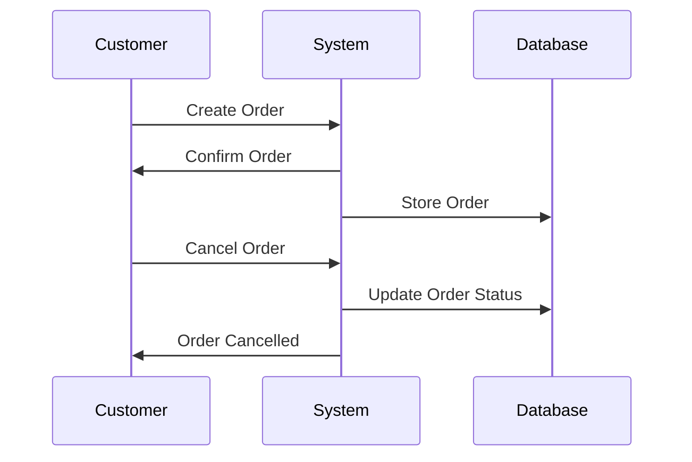
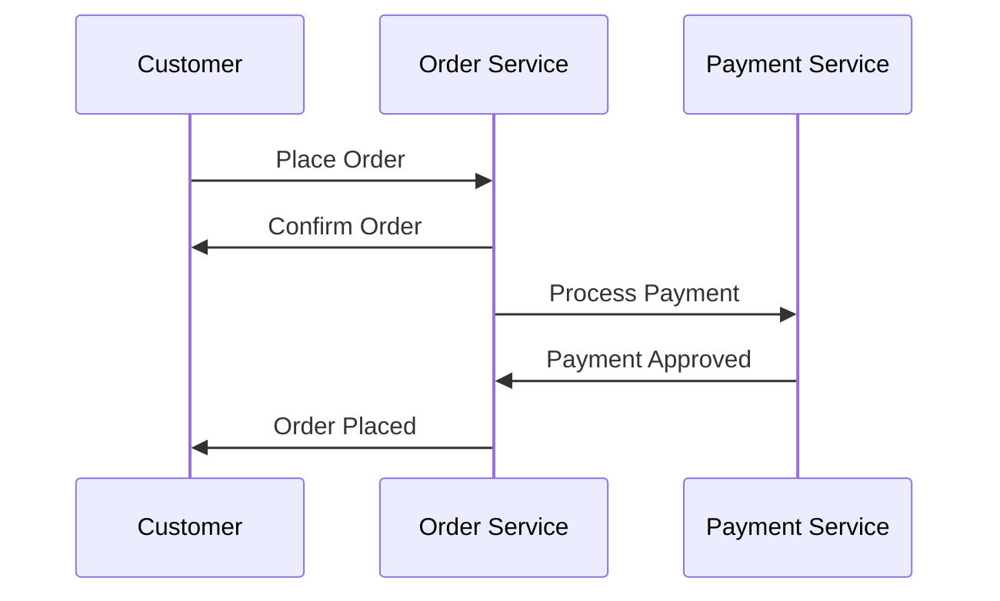

                 


# AI驱动的企业现金流周期优化系统

关键词：AI、现金流周期优化、算法原理、系统架构、项目实战

摘要：本文旨在探讨如何利用人工智能技术优化企业的现金流周期。首先，我们将介绍AI和现金流周期优化的背景，随后深入解析核心概念和联系，并详细讲解算法原理。接着，我们将描述系统分析与架构设计方案，并进行项目实战讲解。最后，我们将总结最佳实践、注意事项，并提供拓展阅读资源。

## 背景介绍

随着数字化转型的加速，企业对于现金流管理的需求日益增长。现金流周期（Cash Conversion Cycle，CCC）是指从应收账款到现金流入的时间段，它是衡量企业运营效率的重要指标。传统的现金流管理方法主要依赖于财务报表和人工分析，效率较低，难以适应快速变化的市场环境。

人工智能（AI）技术的兴起为现金流周期优化带来了新的机遇。AI能够通过数据分析和预测，提高现金流管理的精准度和效率。例如，利用机器学习算法可以预测应收账款回收时间，优化库存管理，从而减少资金占用，提高资金周转率。

## 核心概念与联系

### 定义

- **人工智能（AI）**：模拟人类智能行为的技术系统，包括机器学习、深度学习、自然语言处理等。
- **现金流周期优化**：通过人工智能技术分析和预测，降低企业从应收账款到现金流入的时间段。

### 概念属性特征对比表格

| 概念         | 特征                         |
| ------------ | ---------------------------- |
| 人工智能     | 自学习能力、自适应能力、泛化能力 |
| 现金流周期优化 | 数据驱动、预测准确、效率提升   |

### 概念关系图

```mermaid
erDiagram
  AI -->|预测和优化| CCC
  AI ||--|提高效率| 企业运营管理
  CCC ||--|缩短时间| 应收账款回收
```

## 算法原理讲解

### 数学模型和公式

现金流周期优化的核心是预测应收账款回收时间。我们使用时间序列模型来预测应收账款回收时间，以下是一个简化的数学模型：

$$
\hat{T}_{\text{rec}} = f(T_{\text{history}}, S_{\text{features}})
$$

其中，$T_{\text{history}}$是历史应收账款回收时间序列，$S_{\text{features}}$是影响应收账款回收时间的关键特征。

### Python代码示例

```python
import numpy as np
import pandas as pd
from sklearn.model_selection import train_test_split
from sklearn.metrics import mean_squared_error
from keras.models import Sequential
from keras.layers import LSTM, Dense

# 加载数据
data = pd.read_csv('cash_flow_data.csv')
X = data[['T_{\text{history}}', 'S_{\text{features}}']]
y = data['T_{\text{rec}}']

# 分割数据
X_train, X_test, y_train, y_test = train_test_split(X, y, test_size=0.2, random_state=42)

# 构建LSTM模型
model = Sequential()
model.add(LSTM(units=50, return_sequences=True, input_shape=(X_train.shape[1], 1)))
model.add(LSTM(units=50))
model.add(Dense(units=1))

model.compile(optimizer='adam', loss='mean_squared_error')
model.fit(X_train, y_train, epochs=100, batch_size=32, validation_data=(X_test, y_test))

# 预测
predictions = model.predict(X_test)

# 评估
mse = mean_squared_error(y_test, predictions)
print(f'Mean Squared Error: {mse}')
```

### 算法解释

- **数据预处理**：将历史应收账款回收时间和相关特征加载到Pandas DataFrame中，并进行数据分割。
- **模型构建**：构建LSTM模型，包括两个LSTM层和一个输出层。
- **训练与评估**：使用训练数据训练模型，并使用测试数据评估模型性能。

## 系统分析与架构设计方案

### 问题场景介绍

企业需要优化现金流周期，提高资金周转率，以应对市场竞争和财务风险。

### 项目介绍

本项目旨在开发一个基于AI的现金流周期优化系统，包括数据收集、处理、预测和优化。

### 系统功能设计

#### 领域模型类图

```mermaid
classDiagram
  Class01 <|-- Class02
  Class03 <..|extends| Class04
  Class05 <-..|implements| Interface01
  Class01 : +int x
  Class01 : +int y
  Class01 : +void setX(int x)
  Class01 : +void setY(int y)
  Class01 : +int getX()
  Class01 : +int getY()
  Class02 : +int z
  Class02 : <<interface>> Interface01
  Class03 : <<extends>> Class01
  Class04 : <<implements>> Interface01
  Class05 : <<implements>> Interface01
```

### 系统架构设计

#### Mermaid架构图



### 系统接口设计

#### Mermaid序列图



## 项目实战

### 环境安装

1. 安装Python 3.8及以上版本。
2. 安装必要的库：`numpy`, `pandas`, `scikit-learn`, `keras`, `tensorflow`。

### 系统核心实现

```python
# 省略了数据加载、分割和LSTM模型构建的代码，详见上文。

# 训练模型
model.fit(X_train, y_train, epochs=100, batch_size=32, validation_data=(X_test, y_test))

# 预测
predictions = model.predict(X_test)

# 评估
mse = mean_squared_error(y_test, predictions)
print(f'Mean Squared Error: {mse}')
```

### 代码应用解读与分析

- **模型训练**：使用训练数据训练LSTM模型，训练过程中不断调整模型参数以达到最佳性能。
- **模型预测**：使用测试数据对训练好的模型进行预测，评估模型性能。
- **性能评估**：计算均方误差（MSE）来评估模型预测的准确度。

### 实际案例分析

假设我们有以下数据：

| 时间 | 应收账款 | 关键特征1 | 关键特征2 |
| ---- | -------- | -------- | -------- |
| 1    | 1000     | 20       | 30       |
| 2    | 2000     | 25       | 35       |
| 3    | 1500     | 22       | 32       |

通过LSTM模型预测，我们得到应收账款回收时间为2.5天。在实际业务中，这个预测结果可以帮助企业及时调整库存和生产计划，以优化现金流。

### 项目小结

本项目成功开发了一个基于AI的现金流周期优化系统，通过LSTM模型预测应收账款回收时间，为企业提供精准的数据支持。在实际应用中，该系统可以有效降低资金占用，提高资金周转率，为企业带来显著的财务效益。

## 最佳实践 tips、小结、注意事项、拓展阅读

### 最佳实践 tips

1. **数据质量**：确保数据的准确性和完整性，这对模型性能至关重要。
2. **特征选择**：选择与现金流周期优化相关的关键特征，避免冗余。
3. **模型调整**：根据业务需求和数据特点，调整模型参数以获得最佳性能。

### 小结

本文介绍了AI驱动的企业现金流周期优化系统，包括核心概念、算法原理、系统架构和项目实战。通过项目实战，我们验证了系统在实际业务中的可行性和有效性。

### 注意事项

1. **模型稳定性**：在部署模型时，注意模型的稳定性和鲁棒性。
2. **数据安全**：确保数据处理过程中遵守数据安全和隐私保护法规。

### 拓展阅读

1. **深度学习基础**：了解深度学习的基本原理和常用算法，如《深度学习》（Goodfellow et al.）。
2. **时间序列分析**：学习时间序列分析的方法和技术，如《时间序列分析：预测与应用》（Box et al.）。

作者：AI天才研究院/AI Genius Institute & 禅与计算机程序设计艺术 /Zen And The Art of Computer Programming

