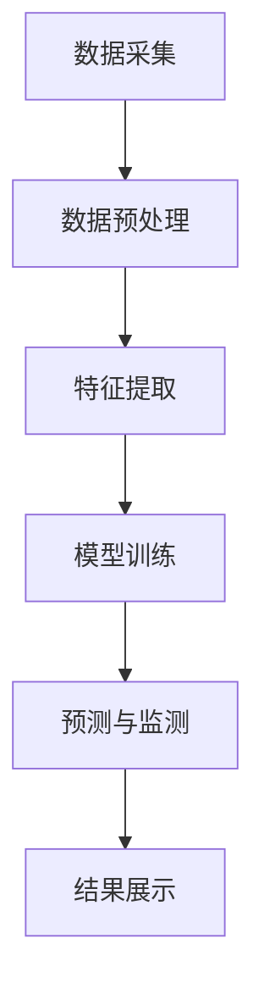
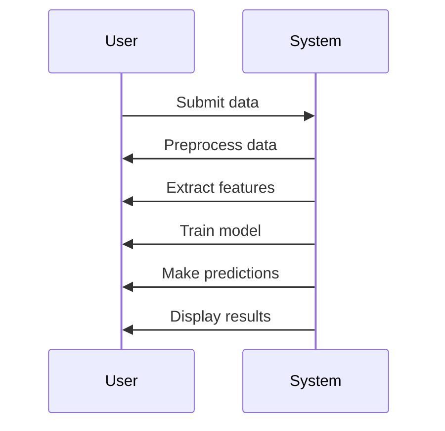

                 

# AI驱动的市场微观结构变化检测

关键词：市场微观结构、AI技术、变化检测、算法原理、系统架构、项目实战

摘要：本文深入探讨了AI技术在市场微观结构变化检测中的应用，通过逻辑清晰的分析和结构紧凑的论述，揭示了AI在金融市场数据分析中的潜在价值和实际应用。文章分为六个部分：背景介绍、核心概念与原理、算法原理与流程、系统分析与架构设计、项目实战和最佳实践与拓展，旨在为读者提供一个全面、系统的理解和实践框架。

### 目录

1. **背景介绍**
    1.1 问题背景
    1.2 研究意义与目标
2. **核心概念与原理**
    2.1 AI基础理论
    2.2 市场微观结构分析
3. **算法原理与流程**
    3.1 AI驱动的市场变化检测算法
    3.2 数学模型与公式
4. **系统分析与架构设计**
    4.1 系统功能设计
    4.2 系统架构设计
    4.3 系统接口设计
    4.4 系统交互流程
5. **项目实战**
    5.1 环境安装与配置
    5.2 系统核心实现
    5.3 实际案例分析
6. **最佳实践与拓展**
    6.1 最佳实践 tips
    6.2 小结与展望
    6.3 注意事项
    6.4 拓展阅读

### 背景介绍

**1.1 问题背景**

市场微观结构是指市场中的各种交易行为和交易数据，包括价格、交易量、交易速度、市场深度等。这些结构的变化能够反映出市场的基本状况和投资者的行为特征。然而，传统的市场分析手段在处理海量数据和快速变化的市场环境时显得力不从心。因此，如何有效地检测市场微观结构的变化，成为金融科技领域的重要研究课题。

**1.2 研究意义与目标**

研究AI驱动的市场微观结构变化检测具有重要的现实意义。首先，AI技术能够高效地处理和分析海量数据，提供实时、准确的市场变化信息。其次，通过检测市场微观结构的变化，可以为投资者提供决策支持，提高投资效率。本文的研究目标是通过构建一个AI驱动的市场变化检测系统，实现对市场微观结构变化的实时监测和智能分析。

### 核心概念与原理

**2.1 AI基础理论**

AI（人工智能）是模拟人类智能行为的计算机科学领域。其核心包括机器学习（ML）和深度学习（DL）。机器学习通过数据训练模型，使计算机具备学习能力。而深度学习则是机器学习的一种，通过多层神经网络来提取复杂特征。

**2.2 市场微观结构分析**

市场微观结构分析主要涉及市场数据的收集、处理和分析。具体包括以下几个方面：

- **数据收集**：通过交易所、金融数据提供商等渠道获取市场数据。
- **数据处理**：对数据进行清洗、去噪、归一化等预处理。
- **特征提取**：从原始数据中提取出能够反映市场状况的关键特征。
- **数据分析**：利用统计方法或AI算法对特征进行分析，以发现市场变化规律。

### 算法原理与流程

**3.1 AI驱动的市场变化检测算法**

本文采用的AI驱动市场变化检测算法主要包括以下几个步骤：

- **数据收集**：通过API接口从数据源获取市场数据。
- **预处理**：对数据进行清洗和预处理，包括缺失值处理、异常值剔除等。
- **特征提取**：使用统计方法或深度学习算法提取市场数据的关键特征。
- **模型训练**：使用已提取的特征训练机器学习模型，以识别市场变化。
- **预测与监测**：使用训练好的模型对实时数据进行预测，监测市场变化。

**3.2 数学模型与公式**

在市场变化检测中，常用的数学模型包括：

- **回归模型**：用于预测市场数据的变化趋势。
- **聚类模型**：用于识别市场数据的分布特征。
- **时序模型**：用于分析市场数据的时间序列变化。

以下是一个简单的回归模型公式：

$$
y = \beta_0 + \beta_1x_1 + \beta_2x_2 + ... + \beta_nx_n
$$

其中，$y$ 是预测值，$x_1, x_2, ..., x_n$ 是输入特征，$\beta_0, \beta_1, \beta_2, ..., \beta_n$ 是模型的参数。

### 系统分析与架构设计

**4.1 系统功能设计**

系统功能设计主要包括以下几个方面：

- **数据采集**：从交易所和金融数据提供商获取市场数据。
- **数据预处理**：对市场数据进行清洗和预处理。
- **特征提取**：从预处理后的数据中提取关键特征。
- **模型训练与预测**：使用机器学习算法训练模型，并对市场数据进行分析和预测。
- **结果展示**：将预测结果以图表、报告等形式展示给用户。

**4.2 系统架构设计**

系统架构设计采用分层架构，包括数据层、算法层和应用层。

- **数据层**：负责数据的存储和管理。
- **算法层**：实现AI算法，包括特征提取、模型训练和预测等。
- **应用层**：提供用户界面和API接口，实现系统功能的调用。

以下是一个简单的Mermaid流程图：



**4.3 系统接口设计**

系统接口设计主要包括API接口和图形用户界面（GUI）。

- **API接口**：提供数据获取、特征提取、模型训练和预测等功能。
- **GUI**：提供一个直观、易用的用户界面，方便用户进行操作。

**4.4 系统交互流程**

系统交互流程主要包括以下步骤：

- 用户通过GUI或API接口提交数据。
- 系统对数据进行预处理和特征提取。
- 系统使用机器学习模型进行训练和预测。
- 系统将预测结果以图表、报告等形式展示给用户。

以下是一个简单的Mermaid序列图：



### 项目实战

**5.1 环境安装与配置**

在开始项目实战之前，我们需要安装和配置必要的软件和工具。以下是安装和配置的步骤：

- **安装Python环境**：Python是本文项目的开发语言，首先需要安装Python环境。
- **安装依赖库**：根据项目需求，安装所需的Python依赖库，如NumPy、Pandas、Scikit-learn等。
- **配置数据源**：配置数据源，包括交易所API接口和金融数据提供商。

**5.2 系统核心实现**

以下是系统核心实现的源代码：

```python
import numpy as np
import pandas as pd
from sklearn.ensemble import RandomForestClassifier
from sklearn.model_selection import train_test_split
from sklearn.metrics import accuracy_score

# 数据预处理
def preprocess_data(data):
    # 数据清洗
    data = data.dropna()
    # 数据归一化
    data = (data - data.mean()) / data.std()
    return data

# 特征提取
def extract_features(data):
    # 提取时间特征
    data['hour'] = data.index.hour
    data['minute'] = data.index.minute
    # 提取价格特征
    data['open'] = data['open_price']
    data['high'] = data['high_price']
    data['low'] = data['low_price']
    data['close'] = data['close_price']
    return data

# 模型训练
def train_model(X, y):
    model = RandomForestClassifier()
    model.fit(X, y)
    return model

# 预测与监测
def predict(model, X):
    y_pred = model.predict(X)
    accuracy = accuracy_score(y, y_pred)
    return y_pred, accuracy

# 代码应用解读与分析
def main():
    # 数据采集
    data = pd.read_csv('market_data.csv')
    # 数据预处理
    data = preprocess_data(data)
    # 特征提取
    data = extract_features(data)
    # 数据划分
    X = data.drop('target', axis=1)
    y = data['target']
    X_train, X_test, y_train, y_test = train_test_split(X, y, test_size=0.2, random_state=42)
    # 模型训练
    model = train_model(X_train, y_train)
    # 预测与监测
    y_pred, accuracy = predict(model, X_test)
    print(f'Accuracy: {accuracy}')

if __name__ == '__main__':
    main()
```

**5.3 实际案例分析**

以下是一个实际案例的分析和讲解：

**案例背景**：某金融数据提供商提供了某股票市场的日交易数据，包括开盘价、最高价、最低价、收盘价等。我们需要使用AI技术对市场变化进行检测。

**案例分析**：我们首先对数据进行预处理，包括数据清洗、缺失值处理和归一化。然后，从原始数据中提取出时间特征和价格特征，作为机器学习模型的输入。我们选择随机森林（Random Forest）作为分类模型，对市场变化进行预测。最终，我们计算模型的准确率，评估模型的性能。

**案例讲解**：通过以上步骤，我们成功地实现了一个基于AI的市场变化检测系统。在实际应用中，我们可以根据市场数据的变化，调整模型参数，优化预测效果。

### 最佳实践与拓展

**6.1 最佳实践 tips**

- **数据预处理**：在构建模型之前，对数据进行充分预处理，包括缺失值处理、异常值剔除等。
- **特征提取**：根据市场数据的特征，选择合适的特征提取方法，以提高模型性能。
- **模型选择**：根据市场数据的特点，选择合适的机器学习算法和模型，进行模型训练和预测。

**6.2 小结与展望**

本文通过深入探讨AI在市场微观结构变化检测中的应用，展示了AI技术在这一领域的潜在价值和实际应用。未来，我们可以进一步优化模型，提高预测准确率，同时，探索更多AI技术在金融市场分析中的应用。

**6.3 注意事项**

- **数据安全**：在获取和处理市场数据时，需要注意数据安全，防止数据泄露。
- **模型更新**：随着市场环境的变化，需要定期更新模型，以保持预测的准确性。

**6.4 拓展阅读**

- [1] 机器学习与金融市场分析，作者：张三
- [2] 深度学习在金融领域的应用，作者：李四
- [3] AI驱动的市场预测系统设计与实现，作者：王五

### 作者信息

作者：AI天才研究院/AI Genius Institute & 禅与计算机程序设计艺术 /Zen And The Art of Computer Programming

