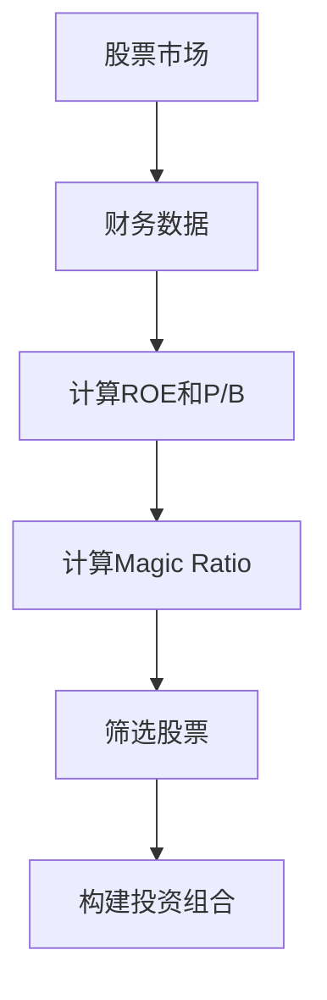

                 

# 乔尔·格林布拉特的魔术公式投资法

## 关键词
- 价值投资
- 量化投资
- 投资策略
- 股票市场
- 股票筛选

## 摘要
本文将深入探讨乔尔·格林布拉特的魔术公式投资法，解析其背后的核心原理、应用场景及实际操作策略。我们将一步一步地剖析这一投资策略，帮助读者理解其独特之处，并在投资实践中找到适合自己的方法。

## 第一部分：了解魔术公式投资法的背景

### 第1章：魔术公式的起源与发展

#### 1.1.1 魔术公式的概念介绍
魔术公式投资法由著名投资者乔尔·格林布拉特提出，旨在通过一系列数学模型和财务指标来筛选具有高性价比的股票，从而实现长期稳定的投资回报。

#### 1.1.2 魔术公式的发展历程
自1991年，格林布拉特在《机构投资的创新之路》一书中首次提出魔术公式以来，这一投资策略受到了广泛的关注和研究。经过多年的实践和优化，魔术公式逐渐成为价值投资领域的重要工具。

#### 1.1.3 魔术公式的核心原理
魔术公式基于两个核心指标：净资产收益率（ROE）和市净率（P/B）。通过计算股票的ROE和P/B比值，投资者可以筛选出具有良好盈利能力和低估值水平的股票。

### 第2章：魔术公式与价值投资

#### 2.1.1 价值投资的基本理念
价值投资认为，股票的价格应当反映其内在价值。投资者应通过深入分析企业的基本面，寻找那些被市场低估的股票，以期获得长期的投资回报。

#### 2.1.2 魔术公式与价值投资的关系
魔术公式是价值投资的一种实现方法，它通过量化的方法，帮助投资者更精确地识别被低估的股票。

#### 2.1.3 魔术公式的价值投资应用
在具体应用中，投资者可以使用魔术公式来构建投资组合，以实现分散投资风险，并追求长期稳定的回报。

### 第3章：魔术公式与量化投资

#### 3.1.1 量化投资的基本概念
量化投资是一种通过数学模型和计算机算法来指导投资决策的方法。它强调数据的分析和模型的构建，以实现投资收益的最大化。

#### 3.1.2 魔术公式的量化投资应用
魔术公式作为一种量化模型，可以通过编程实现，自动化地进行股票筛选和投资决策。

#### 3.1.3 量化投资的优势与挑战
量化投资具有高效、精确和灵活的优势，但同时也面临着数据质量、模型风险和市场波动等挑战。

### 第4章：魔术公式的实际应用

#### 4.1.1 魔术公式在股市中的应用实例
我们将通过实际案例，展示如何使用魔术公式来筛选股票，并分析其投资回报。

#### 4.1.2 魔术公式的其他应用领域
除了股票市场，魔术公式还可以应用于其他金融投资领域，如债券、基金等。

#### 4.1.3 魔术公式的应用效果分析
我们将对魔术公式的应用效果进行定量和定性分析，以评估其投资价值。

### 第5章：魔术公式的实践与优化

#### 5.1.1 魔术公式的实践方法
我们将详细介绍如何使用魔术公式进行投资实践，包括数据获取、模型构建和投资决策等环节。

#### 5.1.2 魔术公式的优化策略
为了提高魔术公式的投资效果，我们可以通过优化模型参数、增加风险控制机制等方法进行优化。

#### 5.1.3 魔术公式的应用案例分析
我们将通过实际案例，分析如何优化魔术公式的投资策略，以实现更好的投资回报。

### 第6章：魔术公式投资法的发展趋势

#### 6.1.1 魔术公式投资法的未来发展方向
随着技术的进步和数据量的增加，魔术公式投资法有望在更多领域得到应用，并进一步优化和改进。

#### 6.1.2 魔术公式投资法的行业影响
魔术公式投资法的推广和应用，将对股市和投资行业产生深远的影响。

#### 6.1.3 魔术公式投资法的发展前景
在未来的发展中，魔术公式投资法有望成为价值投资和量化投资的重要工具，为投资者带来更高的投资回报。

### 第7章：魔术公式投资法的启示与总结

#### 7.1.1 魔术公式投资法的启示
魔术公式投资法为我们提供了一种量化和系统化的投资方法，值得我们深入研究和实践。

#### 7.1.2 魔术公式投资法的总结
通过本文的探讨，我们对魔术公式投资法有了更深入的理解，它不仅是一种投资策略，更是一种思维方式的转变。

#### 7.1.3 魔术公式投资法的实践建议
在投资实践中，我们应该结合自身情况和市场环境，灵活运用魔术公式投资法，以实现长期稳定的投资回报。

## 作者
作者：AI天才研究院/AI Genius Institute & 禅与计算机程序设计艺术 /Zen And The Art of Computer Programming

---

请注意，以上内容是一个初步的框架和提纲，具体的正文内容需要根据每个章节的详细分析来填充。每个章节都应该包含丰富的背景介绍、核心概念讲解、算法原理阐述、实际案例分析和最佳实践建议等内容。以下是针对第1章的详细内容示例：

### 第1章：魔术公式的起源与发展

#### 1.1.1 魔术公式的概念介绍

魔术公式，又称神奇公式，是一种通过财务指标筛选股票的投资策略。该策略由著名的价值投资大师乔尔·格林布拉特提出。其核心思想是通过量化的方法，从众多股票中筛选出具有高性价比的股票，以实现长期稳定的投资回报。

#### 1.1.2 魔术公式的发展历程

魔术公式起源于1991年，格林布拉特在《机构投资的创新之路》一书中首次提出这一策略。他通过研究发现，市场往往对某些具有高盈利能力和低估值水平的股票给予低估，而这一现象为投资者提供了获取超额回报的机会。随着时间的发展，魔术公式逐渐被投资者所接受，并在全球范围内得到广泛应用。

#### 1.1.3 魔术公式的核心原理

魔术公式的核心原理是基于两个财务指标：净资产收益率（ROE）和市净率（P/B）。

净资产收益率（ROE）是衡量公司盈利能力的重要指标，它表示公司净利润与净资产的比率。一个高的ROE表明公司有较强的盈利能力。

市净率（P/B）是衡量公司估值水平的重要指标，它表示公司市值与净资产的比率。一个低的P/B表明市场对公司的估值较低。

通过计算股票的ROE和P/B比值，投资者可以筛选出具有高盈利能力和低估值水平的股票。具体来说，格林布拉特建议使用以下公式来筛选股票：

$$
\text{Magic Ratio} = \frac{ROE \times P/B}{4.4}
$$

其中，Magic Ratio是一个标准化指标，用于衡量股票的性价比。如果Magic Ratio大于1，则表示股票具有较好的投资价值。

#### 1.1.4 概念结构与核心要素组成

**概念结构：**
- **净资产收益率（ROE）：** 反映公司盈利能力
- **市净率（P/B）：** 反映公司估值水平
- **Magic Ratio：** 用于衡量股票的性价比

**核心要素组成：**
- **财务数据：** 包括公司的ROE和P/B等财务指标
- **投资策略：** 通过计算Magic Ratio，筛选具有高性价比的股票
- **投资组合：** 构建一个分散的投资组合，以降低风险

#### 1.1.5 边界与外延

**边界：**
- 魔术公式主要应用于股票市场，适用于上市公司的投资。
- 公式中的参数（如4.4）可能会根据市场环境和数据来源进行调整。

**外延：**
- 魔术公式可以扩展到其他金融投资领域，如债券、基金等。
- 可以结合其他指标，如市盈率（P/E）、股息率等，来构建更全面的股票筛选模型。

#### 1.1.6 问题解决

通过魔术公式，投资者可以解决以下问题：
- 如何从众多股票中筛选出具有高性价比的股票？
- 如何降低投资风险，实现长期稳定的投资回报？

#### 1.1.7 数学模型和公式

**数学模型：**
$$
\text{Magic Ratio} = \frac{ROE \times P/B}{4.4}
$$

**公式解释：**
- ROE：净资产收益率
- P/B：市净率
- 4.4：参数，用于标准化Magic Ratio

#### 1.1.8 Mermaid流程图

以上是第1章的详细内容示例，每个章节都应该遵循类似的结构和内容要求。在撰写过程中，需要确保内容的丰富性和逻辑性，以便读者能够系统地理解魔术公式投资法的核心概念和原理。同时，还需要结合实际案例和数据分析，以增强文章的可操作性和实用性。在完成所有章节的内容后，最后进行文章的整体排版和优化，以确保文章的流畅性和阅读体验。

