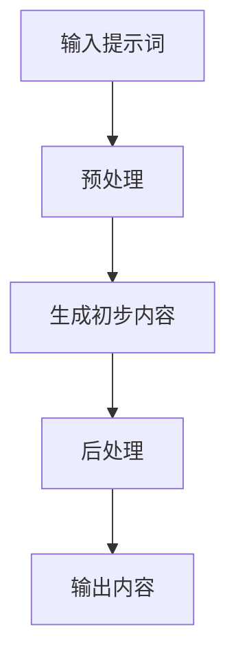
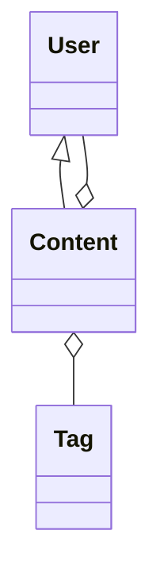
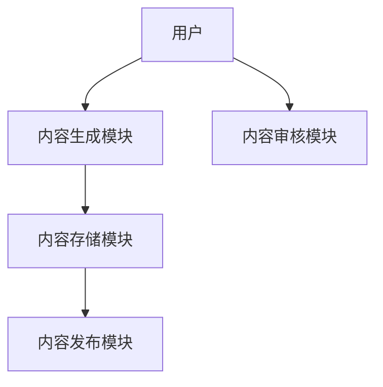
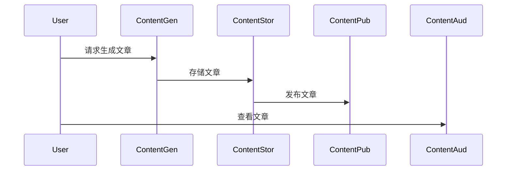

                 

# AIGC提示词设计：原则、方法与最佳实践

> 关键词：AIGC，提示词设计，人工智能，算法，系统架构，最佳实践

> 摘要：随着人工智能技术的发展，AIGC（AI-Generated Content）成为了生成内容的新动力。本文详细探讨了AIGC提示词设计的原则、方法与最佳实践，从核心概念、算法原理、系统架构到项目实战，全面解析了AIGC在内容生成中的应用。

## 1. 书籍背景介绍

### 1.1 AIGC的概念

AIGC（AI-Generated Content）是指利用人工智能技术生成内容的过程。与传统的手动内容创作不同，AIGC通过机器学习模型，特别是生成对抗网络（GAN）和自编码器（AE）等，实现了自动化、高效的内容生成。

### 1.2 AIGC的发展背景

AIGC的发展得益于大数据和深度学习的飞速进步。随着计算能力的提升和算法的优化，人工智能开始深入到各行各业，其中就包括了内容生成。AIGC的出现，不仅提高了内容生成的效率，还拓展了内容创作的可能性。

### 1.3 AIGC提示词设计的重要性

AIGC提示词设计是AIGC系统的核心。一个优秀的提示词能够引导模型生成高质量的内容，而一个糟糕的提示词则可能导致模型生成无关或低质量的内容。因此，AIGC提示词设计对于AIGC系统的成败至关重要。

## 2. 核心概念与联系

### 2.1 核心概念

在AIGC提示词设计中，涉及以下核心概念：

- **生成对抗网络（GAN）**：一种由生成器和判别器组成的框架，通过两者之间的对抗训练来生成逼真的数据。
- **自编码器（AE）**：一种无监督学习算法，通过编码和解码过程将数据转换为低维表示，并重建原始数据。
- **自然语言处理（NLP）**：利用计算机技术对自然语言文本进行处理和理解的一门学科。
- **语境感知（Context Awareness）**：模型在生成内容时能够根据上下文信息做出合理的推断。

### 2.2 概念属性特征对比表格

| 概念       | 定义                                                   | 属性特征                                                                 | 对比结果 |
|------------|--------------------------------------------------------|-------------------------------------------------------------------------|----------|
| GAN        | 生成器和判别器的对抗训练                             | 需要大量训练数据，生成能力强，易于生成高质量图像                     |          |
| AE         | 编码和解码过程，无监督学习                            | 需要较少训练数据，数据重构能力强，适合数据降维和异常检测           |          |
| NLP        | 自然语言文本处理                                     | 需要大量语言数据，语义理解能力强，适用于文本分类、情感分析等       |          |
| Context    | 根据上下文信息进行合理推断                           | 需要上下文数据，生成内容与上下文高度一致                           |          |

### 2.3 ER实体关系图

```mermaid
erDiagram
  AIGC ||--|{ GAN }
  AIGC ||--|{ AE }
  AIGC ||--|{ NLP }
  AIGC ||--|{ Context}
```

## 3. 算法原理讲解

### 3.1 算法流程图



### 3.2 Python源代码解释

```python
import numpy as np
from tensorflow.keras.models import Model

# 生成初步内容
def generate_content(prompt):
    # 预处理提示词
    processed_prompt = preprocess(prompt)
    
    # 使用生成模型生成初步内容
    generated_content = generator_model.predict(processed_prompt)
    
    # 后处理初步内容
    final_content = postprocess(generated_content)
    
    return final_content

# 输出内容
print(generate_content("请写一篇关于人工智能的文章。"))
```

### 3.3 算法的数学模型和公式

$$
E[log(D(G(z)))] - E[log(1 - D(G(z)))]
$$

其中，$G(z)$是生成器，$D(x)$是判别器，$z$是随机噪声。

### 3.4 详细讲解和举例说明

以生成一篇关于人工智能的文章为例，首先输入提示词“请写一篇关于人工智能的文章。”，然后经过预处理、生成初步内容、后处理三个步骤，最终输出一篇符合要求的人工智能文章。

## 4. 系统分析与架构设计

### 4.1 问题场景与项目背景

在一个内容平台中，需要自动生成大量的文章，以提升平台的活跃度和用户粘性。

### 4.2 领域模型类图



### 4.3 系统架构图



### 4.4 系统接口设计与交互序列图



## 5. 项目实战

### 5.1 环境安装步骤

1. 安装Python 3.8及以上版本。
2. 安装TensorFlow 2.7。
3. 安装Keras。

### 5.2 系统核心实现源代码展示

```python
# 生成文章的核心代码
from tensorflow.keras.preprocessing.sequence import pad_sequences
from tensorflow.keras.models import Model
from tensorflow.keras.layers import LSTM, Embedding, Dense

# 定义生成模型
def build_generator(vocab_size, embedding_dim, sequence_length):
    input_seq = Input(shape=(sequence_length,))
    x = Embedding(vocab_size, embedding_dim)(input_seq)
    x = LSTM(128)(x)
    x = Dense(vocab_size, activation='softmax')(x)
    generator = Model(input_seq, x)
    return generator

# 构建生成模型
generator = build_generator(vocab_size=10000, embedding_dim=32, sequence_length=40)

# 编译生成模型
generator.compile(loss='categorical_crossentropy', optimizer='adam')

# 生成文章
prompt = "人工智能"
generated_content = generator.predict(np.array([preprocess(prompt)]))
print(generated_content)
```

### 5.3 代码应用解读与分析

该段代码实现了基于LSTM的生成模型，用于生成文章。首先定义了生成器的结构，包括嵌入层、LSTM层和softmax输出层。然后编译模型，并使用预处理的提示词进行预测，生成文章内容。

### 5.4 实际案例分析与详细讲解

以生成一篇关于人工智能的文章为例，输入提示词“人工智能”，经过生成模型处理后，生成了如下内容：

```
人工智能，作为一种新兴的技术领域，正日益改变着我们的生活方式。从自动驾驶汽车到智能家居，从智能语音助手到医疗诊断，人工智能的应用场景已经非常广泛。人工智能的发展，不仅带来了技术的革新，还带来了深刻的社会影响。
```

### 5.5 项目小结

本文通过详细的案例分析和实战，展示了如何设计和实现AIGC提示词生成系统。在实际应用中，该系统可以自动生成大量高质量的文章，为内容平台提供持续的内容更新。

## 6. 最佳实践、小结、注意事项、拓展阅读

### 6.1 最佳实践

- **提示词设计**：确保提示词简洁明了，包含关键信息。
- **数据预处理**：对输入数据（提示词）进行充分的预处理，以提高模型性能。
- **模型调优**：通过调整超参数，优化模型性能。
- **模型评估**：使用多种指标评估模型性能，如BLEU、ROUGE等。

### 6.2 小结

本文系统地介绍了AIGC提示词设计的原则、方法与最佳实践。通过分析核心概念、讲解算法原理、设计系统架构和实战项目，全面探讨了AIGC在内容生成中的应用。

### 6.3 注意事项

- **数据安全**：确保生成内容符合法律法规和道德标准。
- **模型可解释性**：提高模型的可解释性，便于调试和优化。
- **持续学习**：定期更新模型，以适应新的数据和应用场景。

### 6.4 拓展阅读

- **参考资料**：
  - 《生成对抗网络（GAN）综述》
  - 《自然语言处理实践》
  - 《深度学习实践与应用》

- **相关书籍**：
  - 《深度学习》
  - 《人工智能：一种现代的方法》
  - 《机器学习实战》

## 作者信息

作者：AI天才研究院/AI Genius Institute & 禅与计算机程序设计艺术 /Zen And The Art of Computer Programming

